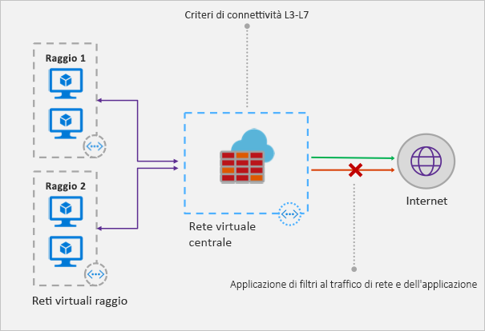

# Informazioni sul firewall di Azure

Firewall di Azure è un servizio di sicurezza di rete gestito basato sul cloud che consente di proteggere le risorse della rete virtuale di Azure. È un firewall con stato completo come servizio con disponibilità elevata incorporata e scalabilità del cloud senza restrizioni. 

È possibile creare, applicare e registrare criteri di connettività di applicazione e di rete in modo centralizzato tra le sottoscrizioni e le reti virtuali. Firewall di Azure usa un indirizzo IP pubblico statico per le risorse della rete virtuale consentendo ai firewall esterni di identificare il traffico proveniente dalla rete virtuale.  Il servizio è completamente integrato con Monitoraggio di Azure per la registrazione e l'analisi.

## Funzionalità

Il Firewall di Azure offre le funzionalità seguenti:

### Disponibilità elevata predefinita
La disponibilità elevata è integrata, quindi non sono necessari servizi di bilanciamento del carico aggiuntivi e non è necessario eseguire altre configurazioni.

### Scalabilità del cloud senza restrizioni 
È possibile aumentare le prestazioni di Firewall di Azure a seconda delle esigenze in modo da soddisfare i mutevoli flussi del traffico di rete senza dover stabilire un budget per i periodi di traffico più intenso.

### Regole di filtro del nome di dominio completo dell'applicazione

È possibile limitare il traffico HTTP/S in uscita a un elenco specifico di nomi di dominio completo (FQDN), inclusi i caratteri jolly. Questa funzionalità non richiede la terminazione SSL.

### Regole di filtro per il traffico di rete

È possibile creare in modo centralizzato regole di filtro di rete per *consentire* o *negare* il traffico in base all'indirizzo IP di origine e di destinazione, alla porta e al protocollo. Firewall di Azure è un servizio con stato completo, quindi in grado di distinguere i pacchetti validi per diversi tipi di connessioni. Le regole vengono applicate e registrate in più sottoscrizioni e reti virtuali.

### Tag FQDN

I tag FQDN rendono più semplice consentire il traffico di rete noto del servizio di Azure attraverso il firewall. Ad esempio, si supponga di voler consentire il traffico di rete di Windows Update attraverso il firewall. Creare una regola di applicazione e includere il tag di Windows Update. A questo punto il traffico di rete da Windows Update può attraversare il firewall.

### Supporto SNAT in uscita

Tutti gli indirizzi IP del traffico di rete virtuale in uscita vengono convertiti nell'indirizzo IP pubblico di Firewall di Azure (Source Network Address Translation). È possibile identificare e consentire il traffico proveniente dalla rete virtuale a destinazioni Internet remote.

### Supporto DNAT in ingresso

Il traffico di rete in ingresso all'indirizzo IP pubblico del firewall viene convertito (Destination Network Address Translation) e filtrato per gli indirizzi IP nelle reti virtuali. 

### Registrazione di Monitoraggio di Azure

Tutti gli eventi vengono integrati con Monitoraggio di Azure, che consente di archiviare i log in un account di archiviazione, trasmettere gli eventi a Hub eventi o inviarli a Log Analytics.

## Problemi noti

Il Firewall di Azure presenta i problemi noti seguenti:

|Problema  |Descrizione  |Mitigazione  |
|---------|---------|---------|
|Conflitto con la funzionalità JIT (Just-in-Time) del Centro sicurezza di Azure|Se per accedere a una macchina virtuale che si trova in una subnet con una route definita dall'utente che punta a Firewall di Azure come gateway predefinito viene usata la funzionalità JIT del Centro sicurezza di Azure, questa non funziona. Ciò è dovuto al routing asimmetrico, ovvero un pacchetto viene ricevuto tramite l'indirizzo IP della macchina virtuale (accesso aperto da JIT), ma il percorso di ritorno è tramite il firewall, che elimina il pacchetto perché nel firewall non è stata stabilita alcuna sessione.|Per risolvere questo problema, posizionare le macchine virtuali JIT in una subnet separata che non contenga una route definita dall'utente al firewall.|
|Il peering globale con hub e spoke non è supportato|Uso del modello hub e spoke, in cui l'hub e il firewall vengono distribuiti in un'unica area di Azure, con gli spoke in un'altra area di Azure. Le connessioni all'hub tramite il peering reti virtuali globale non è supportato.|Si tratta di un comportamento previsto da progettazione. Per altre informazioni, vedere [Sottoscrizione di Azure e limiti, quote e vincoli dei servizi](../azure-subscription-service-limits.md#azure-firewall-limits).|
Le regole di filtro di rete per i protocolli non TCP/UDP (ad esempio ICMP) non funzionano per il traffico associato a Internet|Le regole di filtro di rete per i protocolli non TCP/UDP non funzionano con SNAT per l'indirizzo IP pubblico. I protocolli non TCP/UDP sono supportati tra le subnet spoke e le reti virtuali.|Firewall di Azure usa Load Balancer Standard, [che attualmente non supporta SNAT per i protocolli IP](https://docs.microsoft.com/azure/load-balancer/load-balancer-standard-overview#limitations). Sono in fase di studio opzioni per supportare questo scenario in una versione futura.|
|Supporto di PowerShell e CLI mancante per ICMP|Azure PowerShell e CLI non supportano ICMP come protocollo valido nelle regole di rete.|È comunque possibile usare ICMP come protocollo tramite il portale e l'API REST. A breve ICMP sarà aggiunto anche in PowerShell e CLI.|
|I tag FQDN richiedono l'impostazione di protocol:port|Le regole di applicazione con tag FQDN richiedono la definizione port:protocol.|È possibile usare **https** come valore port:protocol. A breve questo campo sarà reso facoltativo quando vengono usati i tag FQDN.|
|Lo spostamento di un firewall in un altro gruppo di risorse o sottoscrizione non è supportato.|Lo spostamento di un firewall in un altro gruppo di risorse o sottoscrizione non è supportato.|Il supporto di questa funzionalità è previsto per il futuro. Per spostare un firewall in un altro gruppo di risorse o sottoscrizione, è necessario eliminare l'istanza corrente e ricrearla nel nuovo gruppo di risorse o sottoscrizione.|

## Passaggi successivi

- [Esercitazione: Distribuire e configurare Firewall di Azure tramite il portale di Azure](tutorial-firewall-deploy-portal.md)
- [Distribuire Firewall di Azure con un modello](deploy-template.md)
- [Creare un ambiente di test di Firewall di Azure](scripts/sample-create-firewall-test.md)

