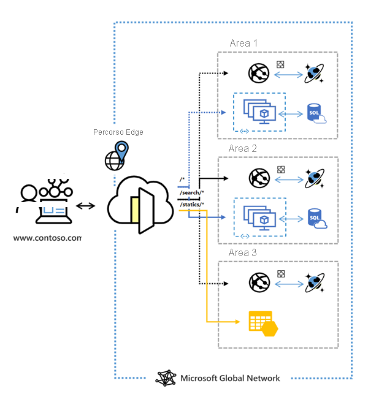

# Che cos'è il servizio Frontdoor di Azure?

Frontdoor di Azure è un punto di ingresso globale e scalabile che usa la rete perimetrale globale Microsoft per creare applicazioni Web veloci, sicure e ampiamente scalabili. Con Frontdoor è possibile trasformare il consumer globale e le applicazioni aziendali in applicazioni moderne, solide, personalizzate e dalle alte prestazioni con contenuti che raggiungono un pubblico globale tramite Azure.

  

Frontdoor funziona a livello 7 (livello HTTP / HTTPS) usando il protocollo anycast con TCP diviso e la rete globale di Microsoft per migliorare la connettività globale. In base al metodo di instradamento, è possibile garantire che Frontdoor instradi le richieste dei client al back-end dell'applicazione più veloce e disponibile. Il backend di un'applicazione può essere qualsiasi servizio internet ospitato all'interno o all'esterno di Azure. Frontdoor offre diversi [metodi di routing del traffico](front-door-routing-methods.md) e [opzioni di monitoraggio dello stato del back-end](front-door-health-probes.md) per soddisfare diverse esigenze delle applicazioni e scenari di failover automatico. Simile a [Gestione traffico](../traffic-manager/traffic-manager-overview.md), Frontdoor è resiliente agli errori, compreso gli errori di un'intera area di Azure.

>[!NOTE]
> Azure offre una suite di soluzioni di bilanciamento del carico completamente gestite per tutti gli scenari. 
> * Se si sta cercando di eseguire il routing globale basato su DNS e **non** si hanno i requisiti per la terminazione del protocollo TLS (Transport Layer Security) ("offload SSL"), per la richiesta per HTTP/HTTPS o per l'elaborazione a livello di applicazione, vedere [Gestione traffico](../traffic-manager/traffic-manager-overview.md). 
> * Se si vuole bilanciare il carico tra i server in un'area a livello di applicazione, vedere [Gateway applicazione](../application-gateway/overview.md).
> * Per eseguire il bilanciamento del carico a livello di rete, vedere [Load Balancer](../load-balancer/load-balancer-overview.md). 
> 
> Gli scenari end-to-end potrebbero trarre vantaggio dalla combinazione di queste soluzioni in base alle esigenze.
> Per un confronto tra le opzioni di bilanciamento del carico di Azure, vedere [Panoramica delle opzioni di bilanciamento del carico in Azure](/azure/architecture/guide/technology-choices/load-balancing-overview).

## Perché usare Frontdoor di Azure?

Con Frontdoor di Azure è possibile compilare, gestire e aumentare il numero di istanze per le applicazioni Web dinamiche e il contenuto statico. Frontdoor consente di definire, gestire e monitorare il routing globale del traffico Web ottimizzando le prestazioni e l'affidabilità degli utenti finali di alto livello attraverso un failover globale rapido.

Funzionalità principali incluse con Frontdoor:

* Prestazioni delle applicazioni accelerate mediante il **[protocollo anycast](front-door-routing-architecture.md#splittcp)** basato su **[TCP diviso](front-door-routing-architecture.md#anycast)** .

* Monitoraggio intelligente del **[probe di integrità](front-door-health-probes.md)** per le risorse back-end.

*  Routing **[basato su percorso URL](front-door-route-matching.md)** per le richieste.

* Consente l'hosting di più siti Web per un'infrastruttura di applicazione efficiente. 

* **[Affinità di sessioni](front-door-routing-methods.md#affinity)** basate su cookie.

* **[Offload SSL](front-door-custom-domain-https.md)** e gestione dei certificati.

* Definire un **[dominio personalizzato](front-door-custom-domain.md)** . 

* Sicurezza dell'applicazione con **[Web Application Firewall (WAF)](../web-application-firewall/overview.md)** integrato.

* Reindirizzamento del traffico da HTTP a HTTPS con **[reindirizzamento URL](front-door-url-redirect.md)** .

* Percorso di trasferimento personalizzato con **[riscrittura URL](front-door-url-rewrite.md)** .

* Supporto nativo di connettività IPv6 end-to-end e **[protocollo HTTP/2](front-door-http2.md)** .

## Prezzi

Per informazioni sui prezzi, vedere [Prezzi di Frontdoor](https://azure.microsoft.com/pricing/details/frontdoor/). Vedere il [contratto di servizio di Frontdoor di Azure](https://azure.microsoft.com/en-us/support/legal/sla/frontdoor/v1_0/).

## Novità

Sottoscrivere il feed RSS e visualizzare gli aggiornamenti più recenti delle funzionalità Frontdoor di Azure nella pagina [Aggiornamenti di Azure](https://azure.microsoft.com/updates/?category=networking&query=Azure%20Front%20Door).

## Passaggi successivi

- Informazioni su come [creare una Frontdoor](quickstart-create-front-door.md).
- Informazioni sul [funzionamento di Frontdoor](front-door-routing-architecture.md).