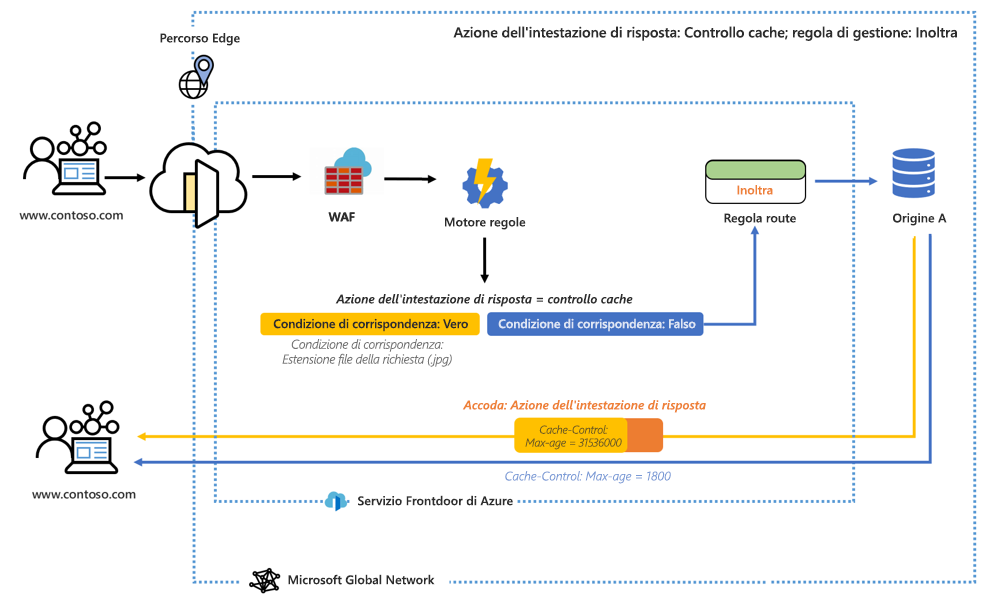
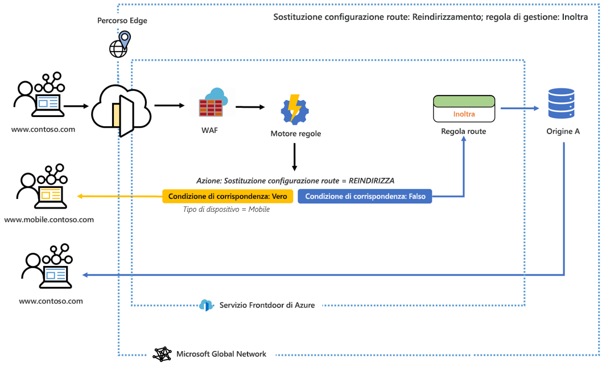

# Che cos'è il motore regole per Frontdoor di Azure? 

Il motore regole consente di personalizzare il modo in cui vengono gestite le richieste HTTP al perimetro e fornisce un comportamento più controllato delle applicazioni Web. Il motore regole per Frontdoor di Azure dispone di diverse funzionalità chiave, tra cui:

* Imporre HTTPS per assicurarsi che tutti gli utenti finali interagiscano con il contenuto tramite una connessione sicura.
* Implementare le intestazioni di sicurezza per evitare vulnerabilità basate sul browser come HTTP Strict-Transport-Security (HSTS), X-XSS-Protection, Content-Security-Policy, X-Frame-Options e intestazioni Access-Control-Allow-Origin per gli scenari CORS (Condivisione di risorse tra le origini). Gli attributi basati sulla sicurezza possono anche essere definiti con i cookie.
* Instradare le richieste alle versioni desktop o per dispositivi mobili dell'applicazione in base ai modelli nel contenuto delle intestazioni della richiesta, dei cookie o delle stringhe di query.
* Usare le funzionalità di reindirizzamento per restituire i codici di reindirizzamento 301, 302, 307 e 308 al client per indirizzarli a nuovi nomi host, percorsi o protocolli.
- Modificare dinamicamente la configurazione della memorizzazione nella cache della route in base alle richieste in ingresso.
- Eseguire la riscrittura del percorso URL della richiesta e inoltrare la richiesta al back-end appropriato nel pool back-end configurato.

## Architecture 

Il motore regole gestisce le richieste al perimetro. Quando una richiesta raggiunge l'endpoint Frontdoor, viene prima eseguito WAF, seguito dalla configurazione del motore regole associata al front-end/dominio. Quando viene eseguita una configurazione del motore regole, significa che la regola di routing padre è già una corrispondenza. Per consentire l'esecuzione di tutte le azioni in ogni regola, è necessario che tutte le condizioni di corrispondenza all'interno di una regola siano soddisfatte. Se una richiesta non corrisponde a nessuna delle condizioni della configurazione del motore regole, viene eseguita la regola di routing predefinita. 

Nel diagramma seguente, ad esempio, un motore regole viene configurato per aggiungere un'intestazione della risposta. Se la condizione di corrispondenza viene soddisfatta, l'intestazione modifica la validità massima del controllo della cache. 

In un altro esempio si può notare che il motore regole è configurato per l'invio di un utente a una versione per dispositivi mobili del sito se la condizione di corrispondenza, ovvero il tipo di dispositivo, è vera. 

In entrambi questi esempi, quando nessuna delle condizioni di corrispondenza viene soddisfatta, viene eseguita la regola di route specificata. 

## Terminologia 

Con il motore regole di Frontdoor di Azure, è possibile creare una combinazione di configurazioni, ognuna composta da un set di regole. Di seguito viene illustrata la terminologia utile durante la configurazione del motore regole. 

- *Configurazione del motore regole*: un set di regole applicate a una singola regola di route. Ogni configurazione può contenere un massimo di 25 regole. È possibile creare fino a 10 configurazioni. 
- *Regola del motore regole*: una regola composta da un massimo di 10 condizioni di corrispondenza e 5 azioni.
- *Condizione di corrispondenza*: esistono diverse condizioni di corrispondenza che è possibile utilizzare per analizzare le risposte in ingresso. Una regola può contenere fino a 10 condizioni di corrispondenza. Le condizioni di corrispondenza vengono valutate con un operatore **AND**. L'elenco completo delle condizioni di corrispondenza è disponibile [qui](front-door-rules-engine-match-conditions.md). 
- *Azione*: le azioni stabiliscono cosa succede alle richieste in ingresso. Le azioni delle intestazioni di richieste/risposte, l'inoltro, i reindirizzamenti e le riscritture sono già disponibili. Una regola può contenere fino a cinque azioni, ma solo una sostituzione delle configurazioni della route.  L'elenco completo di azioni è disponibile [qui](front-door-rules-engine-actions.md).

## Passaggi successivi

- Informazioni su come configurare la prima [configurazione del motore regole](front-door-tutorial-rules-engine.md). 
- Informazioni su come [creare una Frontdoor](quickstart-create-front-door.md).
- Informazioni sul [funzionamento di Frontdoor](front-door-routing-architecture.md).
