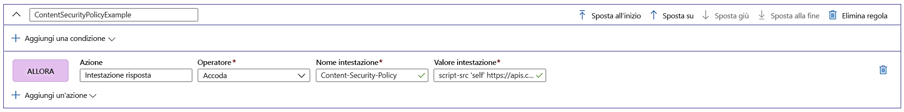

# Esercitazione: Aggiungere intestazioni di sicurezza con il motore regole

Questa esercitazione illustra come implementare le intestazioni di sicurezza per evitare vulnerabilità basate sul browser come HTTP Strict-Transport-Security (HSTS), X-XSS-Protection, Content-Security-Policy o X-Frame-Options. Gli attributi basati sulla sicurezza possono anche essere definiti con i cookie.

L'esempio seguente illustra come aggiungere un'intestazione Content-Security-Policy a tutte le richieste in ingresso che corrispondono al percorso definito nella route a cui è associata la configurazione del motore regole. In questo caso, nell'applicazione è consentita l'esecuzione di script solo dal sito attendibile **https://apiphany.portal.azure-api.net** .

In questa esercitazione verranno illustrate le procedure per:
> [!div class="checklist"]
> - Configurare un criterio di sicurezza del contenuto all'interno del motore di regole.

## Prerequisiti

* Prima di poter completare i passaggi di questa esercitazione, è necessario creare una frontdoor. Per altre informazioni, vedere [Avvio rapido: Creare una frontdoor](quickstart-create-front-door.md).
* Se è la prima volta che si usa la funzionalità del motore di regole, vedere [Configurare un motore di regole](front-door-tutorial-rules-engine.md).

## Aggiungere un'intestazione Content-Security-Policy nel portale di Azure

1. Fare clic su **Aggiungi** per aggiungere una nuova regola. Specificare un nome per la regola e quindi fare clic su **Aggiungi un'azione** > **Intestazione della risposta**.

1. Impostare l'operatore **Accoda** per aggiungere questa intestazione come risposta a tutte le richieste in ingresso a questa route.

1. Aggiungere il nome dell'intestazione: **Content-Security-Policy** e definire i valori che verranno accettati da questa intestazione. Per questo scenario, si sceglierà *"script-src 'self' https://apiphany.portal.azure-api.net."*

1. Dopo aver aggiunto tutte le regole desiderate alla configurazione, non dimenticare di passare alla route preferita e associare la configurazione del motore regole alla regola di route. Questo passaggio è obbligatorio per il funzionamento della regola. 

> [!NOTE]
> In questo scenario non sono state aggiunte [condizioni di corrispondenza](front-door-rules-engine-match-conditions.md) alla regola. Questa regola verrà applicata a tutte le richieste in ingresso che corrispondono al percorso definito nella regola di route. Per applicarla solo a un sottoinsieme di queste richieste, aggiungere le **condizioni di corrispondenza** specifiche alla regola.

## Pulire le risorse

Nei passaggi precedenti sono state configurate le intestazioni di sicurezza con il motore di regole. Se la regola non serve più, è possibile rimuoverla facendo clic su Elimina regola.

:::image type="content" source="./media/front-door-rules-engine/rules-engine-delete-rule.png" alt-text="Eliminare la regola":::

## Passaggi successivi

Per informazioni su come configurare un Web application firewall per Frontdoor, continuare con l'esercitazione successiva.

> [!div class="nextstepaction"]
> [Web Application Firewall e Frontdoor](front-door-waf.md)
