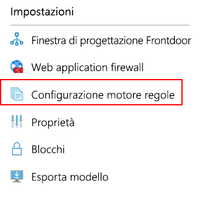
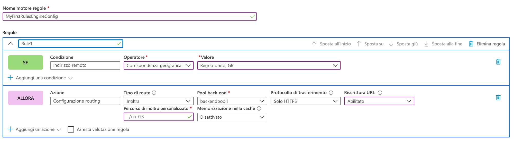
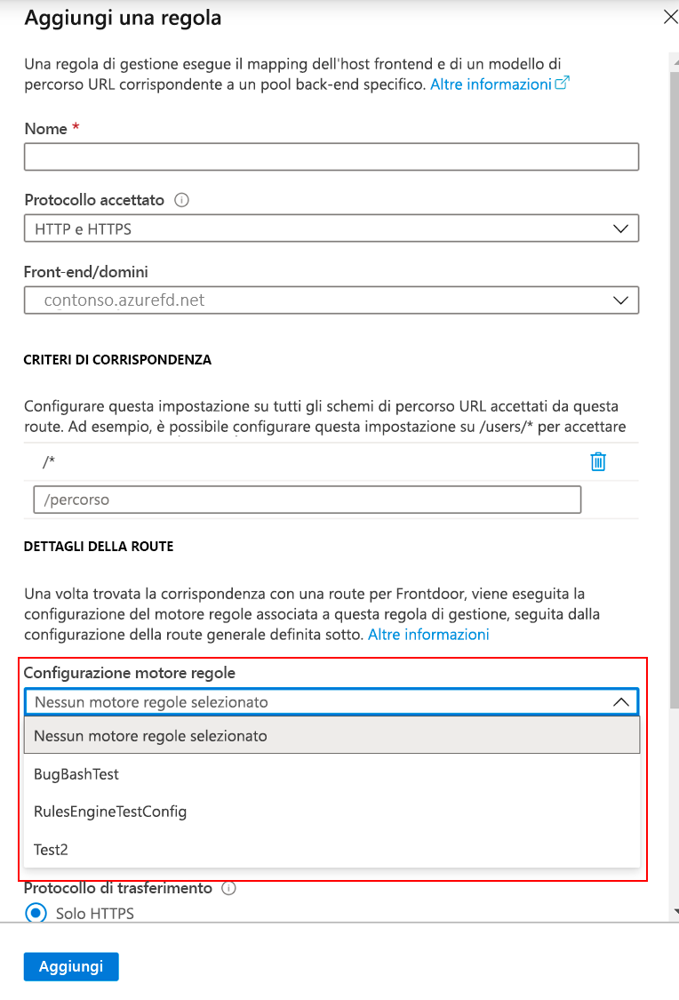

# <a name="tutorial-configure-your-rules-engine"></a>Esercitazione: Configurare il motore regole

Questa esercitazione illustra come creare una configurazione del motore di regole e la prima regola nel portale di Azure e nell'interfaccia della riga di comando. 

In questa esercitazione verranno illustrate le procedure per:
> [!div class="checklist"]
> - Configurare il motore di regole con il portale.
> - Configurare il motore di regole con l'interfaccia della riga di comando di Azure

## <a name="prerequisites"></a>Prerequisiti

* Prima di poter completare i passaggi di questa esercitazione, è necessario creare una frontdoor. Per altre informazioni, vedere [Avvio rapido: Creare una frontdoor](quickstart-create-front-door.md).

## <a name="configure-rules-engine-in-azure-portal"></a>Configurare il motore regole nel portale di Azure
1. All'interno della risorsa frontdoor passare a **Impostazioni** e selezionare **Configurazione motore regole**. Fare clic su **Aggiungi**, assegnare un nome alla configurazione e iniziare a creare la prima configurazione del motore regole.

    

1. Fare clic su **Aggiungi regola** per creare la prima regola. Quindi, fare su **Aggiungi condizione** o **Aggiungi azione** per definire la regola.
    
    > [!NOTE]
    >- Per eliminare una condizione o un'azione dalla regola, usare il Cestino sul lato destro della condizione o dell'azione specifica.
    > - Per creare una regola che si applica a tutto il traffico in ingresso, non specificare alcuna condizione.
    > - Per interrompere la valutazione delle regole una volta soddisfatta la prima condizione di corrispondenza, selezionare **Arresta valutazione delle regole rimanenti**. Se questa opzione è selezionata e tutte le condizioni di corrispondenza di una regola specifica sono soddisfatte, le altre regole nella configurazione non verranno eseguite.  

     

1. Determinare la priorità delle regole all'interno della configurazione usano i pulsanti Sposta su, Sposta giù e Sposta all'inizio. La priorità è in ordine crescente, ovvero la regola elencata per prima è quella più importante.

1. Dopo aver creato una o più regole, premere **Salva**. Questa azione crea la configurazione del motore regole.

1. Dopo aver creato una o più configurazioni del motore regole, associarne una a una regola di route. Mentre una singola configurazione può essere applicata a molte regole di route, una regola di route può contenere una sola configurazione del motore regole. Per creare l'associazione, passare a **Progettazione frontdoor** > **Route rules** (Regole di route). Selezionare la regola di route a cui aggiungere la configurazione del motore regole, passare a **Dettagli route** > **Configurazione motore regole** e selezionare la configurazione da associare.

    


## <a name="configure-rules-engine-in-azure-cli"></a>Configurare il motore regole nell'interfaccia della riga di comando di Azure

1. Se non è già stato fatto, installare l'[interfaccia della riga di comando di Azure](/cli/azure/install-azure-cli?preserve-view=true&view=azure-cli-latest). Aggiungere l'estensione "front-door":- az extension add --name front-door. Quindi, accedere e passare alla sottoscrizione con az account set --subscription <name_or_Id>.

1. Per iniziare, creare un motore regole. Questo esempio illustra una regola con un'azione basata su intestazione e una condizione di corrispondenza. 

    ```azurecli-interactive
    az network front-door rules-engine rule create -f {front_door} -g {resource_group} --rules-engine-name {rules_engine} --name {rule1} --priority 1 --action-type RequestHeader --header-action Overwrite --header-name Rewrite --header-value True --match-variable RequestFilenameExtension --operator Contains --match-values jpg png --transforms Lowercase
    ```

1. Elencare tutte le regole. 

    ```azurecli-interactive
    az network front-door rules-engine rule list -f {front_door} -g {rg} --name {rules_engine}
    ```

1. Aggiungere un'azione di sostituzione della route di inoltro. 

    ```azurecli-interactive
    az network front-door rules-engine rule action add -f {front_door} -g {rg} --rules-engine-name {rules_engine} --name {rule1} --action-type ForwardRouteOverride --backend-pool {backend_pool_name} --caching Disabled
    ```

1. Elencare tutte le azioni in una regola. 

    ```azurecli-interactive
    az network front-door rules-engine rule action list -f {front_door} -g {rg} -r {rules_engine} --name {rule1}
    ```

1. Collegare una configurazione del motore regole a una regola di routing.  

    ```azurecli-interactive
    az network front-door routing-rule update -g {rg} -f {front_door} -n {routing_rule_name} --rules-engine {rules_engine}
    ```

1. Scollegare il motore regole. 

    ```azurecli-interactive
    az network front-door routing-rule update -g {rg} -f {front_door} -n {routing_rule_name} --remove rulesEngine # case sensitive word ‘rulesEngine’
    ```

Per altre informazioni, vedere l'elenco completo di comandi del motore regole di Frontdoor di Azure disponibile [qui](/cli/azure/ext/front-door/network/front-door/rules-engine?preserve-view=true&view=azure-cli-latest).   

## <a name="clean-up-resources"></a>Pulire le risorse

Nei passaggi precedenti è stata definita la configurazione del motore di regole ed è stata associata alle regole di routing. Se non si vuole più che la configurazione del motore di regole sia associata a Frontdoor, è possibile rimuoverla eseguendo questa procedura:

1. Disassociare le regole di routing dalla configurazione del motore di regole facendo clic sui tre puntini accanto al nome del motore.

    :::image type="content" source="./media/front-door-rules-engine/front-door-rule-engine-routing-association.png" alt-text="Associare le regole di routing":::

1. Deselezionare tutte le regole di routing a cui è associata questa configurazione del motore di regole e fare clic su Salva.

    :::image type="content" source="./media/front-door-rules-engine/front-door-routing-rule-association.png" alt-text="Associare le regole di routing":::

1. A questo punto è possibile eliminare la configurazione del motore di da Frontdoor.

    :::image type="content" source="./media/front-door-rules-engine/front-door-delete-rule-engine-configuration.png" alt-text="Associare le regole di routing":::

## <a name="next-steps"></a>Passaggi successivi

In questa esercitazione sono state illustrate le procedure per:

* Creare una configurazione del motore di regole
* Associare la configurazione alle regole di routing di Frontdoor.

Per informazioni su come aggiungere intestazioni di sicurezza con il motore di regole, continuare con l'esercitazione successiva.

> [!div class="nextstepaction"]
> [Intestazioni di sicurezza con il motore di regole](front-door-security-headers.md)