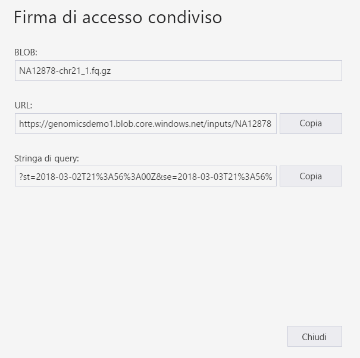
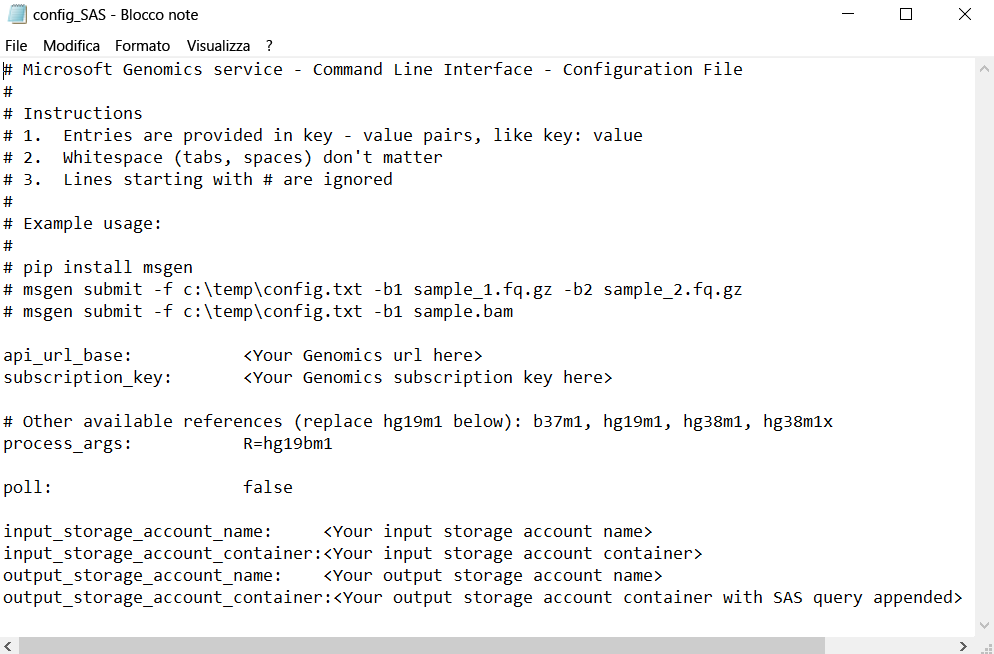

# <a name="submit-a-workflow-to-microsoft-genomics-using-a-sas-instead-of-a-storage-account-key"></a>Inviare un flusso di lavoro a Genomica di Microsoft usando una firma di accesso condiviso invece di una chiave dell'account di archiviazione 

Questo articolo illustra come inviare un flusso di lavoro al servizio Microsoft Genomics usando un file txt contenente [condiviso (SAS) delle firme di accesso](https://docs.microsoft.com/azure/storage/common/storage-dotnet-shared-access-signature-part-1) invece delle chiavi di account di archiviazione. Questa funzionalità può essere utile se per motivi di sicurezza si preferisce non rendere visibile la chiave dell'account di archiviazione nel file config.txt. 

In questo articolo si presuppone che sia già stato installato ed eseguito il client `msgen` e che si abbia familiarità con l'uso di Archiviazione di Azure. Se è già stato inviato un flusso di lavoro usando i dati di esempio forniti, si è pronti per procedere con questo articolo. 

## <a name="what-is-a-sas"></a>Informazioni sulla firma di accesso condiviso
Una [firma di accesso condiviso (SAS)](https://docs.microsoft.com/azure/storage/common/storage-dotnet-shared-access-signature-part-1) fornisce accesso delegato alle risorse nell'account di archiviazione. Con una firma di accesso condiviso è possibile concedere l'accesso alle risorse nell'account di archiviazione senza condividere le chiavi dell'account. Questo è il punto chiave associato all'uso delle firme di accesso condiviso nelle applicazioni: una firma di accesso condiviso rappresenta un metodo sicuro per condividere le risorse di archiviazione senza compromettere le chiavi dell'account.

La firma di accesso condiviso che viene inviata a Genomica di Microsoft deve essere una [firma di accesso condiviso del servizio](https://docs.microsoft.com/rest/api/storageservices/Constructing-a-Service-SAS) che delega l'accesso solo al BLOB o al contenitore in cui sono archiviati i file di input e output. 

L'URI per un token di firma di accesso condiviso a livello di servizio è composto dall'URI della risorsa per cui la firma di accesso condiviso delega l'accesso, seguito dal token di firma di accesso condiviso. Il token di firma di accesso condiviso è la stringa di query che include tutte le informazioni necessarie per autenticare la firma di accesso condiviso, oltre a specificare la risorsa, le autorizzazioni disponibili per l'accesso, l'intervallo di tempo in cui la firma è valida, l'indirizzo o l'intervallo di indirizzi IP supportati come origine delle richieste, il protocollo supportato per l'esecuzione di una richiesta, un identificatore di criteri di accesso facoltativo associato alla richiesta e la firma stessa. 

## <a name="sas-needed-for-submitting-a-workflow-to-the-microsoft-genomics-service"></a>Firma di accesso condiviso necessaria per inviare un flusso di lavoro al servizio Genomica di Microsoft
Per ogni flusso di lavoro inviato al servizio Genomica di Microsoft sono necessari due o più token di firma di accesso condiviso, uno per ogni file di input e uno per il contenitore di output.

La firma di accesso condiviso per i file di input deve avere le proprietà seguenti:
1.  Ambito (account, contenitore o BLOB): BLOB
2.  Scadenza: 48 ore da adesso
3.  Autorizzazioni: lettura

La firma di accesso condiviso per il contenitore di output deve avere le proprietà seguenti:
1.  Ambito (account, contenitore o BLOB): contenitore
2.  Scadenza: 48 ore da adesso
3.  Autorizzazioni: lettura, scrittura, eliminazione


## <a name="create-a-sas-for-the-input-files-and-the-output-container"></a>Creare una firma di accesso condiviso per i file di input e il contenitore di output
Esistono due modi per creare un token di firma di accesso condiviso, ovvero tramite Azure Storage Explorer o a livello di codice.  Usando il codice è possibile creare manualmente la firma di accesso condiviso oppure usare Azure Storage SDK nel linguaggio preferito.


### <a name="set-up-create-a-sas-using-azure-storage-explorer"></a>Configurazione: Creare una firma di accesso condiviso con Azure Storage Explorer

[Azure Storage Explorer](https://azure.microsoft.com/features/storage-explorer/) è uno strumento che consente di gestire le risorse presenti in Archiviazione di Azure.  Altre informazioni sull'uso di Azure Storage Explorer sono disponibili [qui](https://docs.microsoft.com/azure/vs-azure-tools-storage-manage-with-storage-explorer).

La firma di accesso condiviso per i file di input deve avere come ambito lo specifico file di input (BLOB). Per creare una firma di accesso condiviso, seguire [questa procedura](https://docs.microsoft.com/azure/storage/blobs/storage-quickstart-blobs-storage-explorer). Dopo aver creato la firma di accesso condiviso, vengono forniti l'URL completo con la stringa di query e la stringa di query stessa ed è possibile copiarli dalla schermata.

 


### <a name="set-up-create-a-sas-programmatically"></a>Configurazione: Creare una firma di accesso condiviso a livello di codice

Per creare una firma di accesso condiviso con Azure Storage SDK, vedere la documentazione esistente per diversi linguaggi, tra cui [.NET](https://docs.microsoft.com/azure/storage/common/storage-dotnet-shared-access-signature-part-1), [Python](https://docs.microsoft.com/azure/storage/blobs/storage-python-how-to-use-blob-storage) e [Node.js](https://docs.microsoft.com/azure/storage/blobs/storage-nodejs-how-to-use-blob-storage). 

Per creare una firma di accesso condiviso senza un SDK, è possibile costruire direttamente la stringa di query della firma di accesso condiviso, con tutte le informazioni necessarie per autenticare la firma stessa. Questi [istruzioni](https://docs.microsoft.com/rest/api/storageservices/constructing-a-service-sas) descrivono nei dettagli i componenti della stringa di query della firma di accesso condiviso e come costruire la stringa. La firma di accesso condiviso necessaria viene creata tramite la generazione di un codice HMAC con le informazioni di autenticazione del BLOB/contenitore, come illustrato in queste [istruzioni](https://docs.microsoft.com/rest/api/storageservices/service-sas-examples).


## <a name="add-the-sas-to-the-configtxt-file"></a>Aggiungere la firma di accesso condiviso al file config.txt
Per eseguire un flusso di lavoro tramite il servizio Genomica di Microsoft usando una stringa di query della firma di accesso condiviso, modificare il file config.txt per rimuovere le chiavi. Aggiungere quindi la stringa di query della firma di accesso condiviso (che inizia con `?`) al nome del contenitore di output, come illustrato. 



Usare il client Python di Genomica di Microsoft per inviare il flusso di lavoro con il comando seguente, aggiungendo la stringa di query della firma di accesso condiviso corrispondente a ogni nome di BLOB di input:

```python
msgen submit -f [full path to your config file] -b1 [name of your first paired end read file, SAS query string appended] -b2 [name of your second paired end read file, SAS query string appended]
```

### <a name="if-adding-the-input-file-names-to-the-configtxt-file"></a>Se si aggiungono i nomi dei file di input al file config.txt
In alternativa è possibile aggiungere i nomi di file di letture di estremità abbinate direttamente al file config.txt, con i token di query della firma di accesso condiviso aggiunti come mostrato:


In questo caso, usare il client Python di Genomica di Microsoft per inviare il flusso di lavoro con il comando seguente, omettendo i comandi `-b1` e `-b2`:

```python
msgen submit -f [full path to your config file] 
```

## <a name="next-steps"></a>Passaggi successivi
In questo articolo sono stati usati token di firma di accesso condiviso invece delle chiavi dell'account per inviare un flusso di lavoro al servizio Genomica di Microsoft tramite il client `msgen` Python. Per altre informazioni sull'invio di flussi di lavoro e su altri comandi che possono essere usati con il servizio Genomica di Microsoft, vedere le [Domande frequenti](frequently-asked-questions-genomics.md). 
