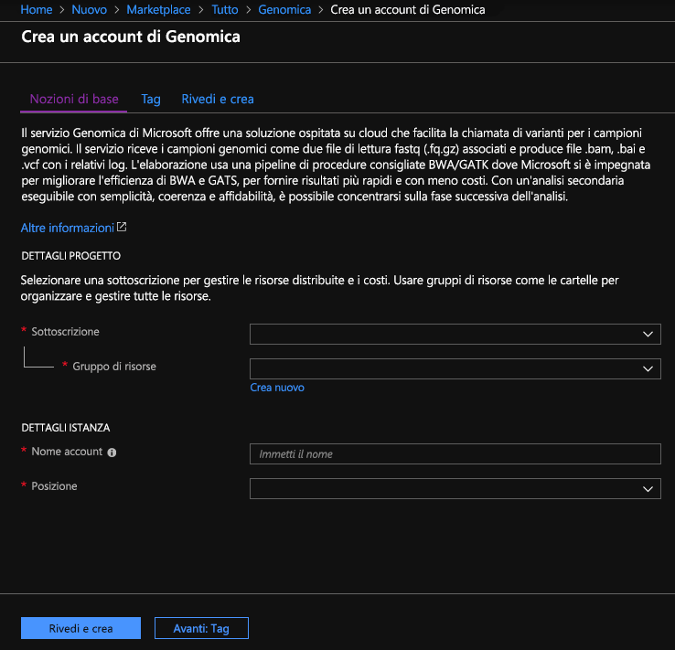
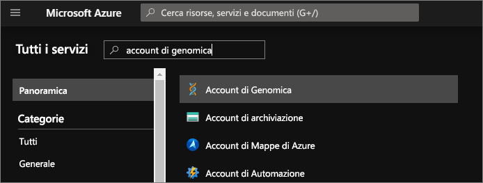

# <a name="quickstart-run-a-workflow-through-the-microsoft-genomics-service"></a>Guida introduttiva: Eseguire un flusso di lavoro tramite il servizio Genomica di Microsoft

Genomica di Microsoft è un servizio scalabile e sicuro per l'analisi secondaria che consente di elaborare rapidamente un genoma, a partire dalle letture non elaborate e per la produzione di letture allineate e chiamate delle varianti. Per iniziare sono sufficienti pochi passaggi: 
1.  Configurazione: creare un account di Genomica di Microsoft tramite il portale di Azure e installare il client Python per Genomica di Microsoft nell'ambiente locale. 
2.  Caricamento di dati di input: creare un account di archiviazione di Microsoft Azure tramite il portale di Azure e caricare i file di input. I file di input devono essere letture di estremità abbinate (file fastq o bam).
3.  Esecuzione: usare l'interfaccia della riga di comando di Genomica di Microsoft per eseguire flussi di lavoro tramite il servizio Genomica di Microsoft. 

Per altre informazioni su Genomica di Microsoft, vedere [Informazioni su Genomica di Microsoft](overview-what-is-genomics.md)

## <a name="set-up-create-a-microsoft-genomics-account-in-the-azure-portal"></a>Configurazione: creare un account di Genomica di Microsoft nel portale di Azure

Per creare un account di Genomica di Microsoft, passare al [portale di Azure](https://portal.azure.com/#create/Microsoft.Genomics). Se non si ha ancora una sottoscrizione di Azure, crearne una prima di creare un account di Genomica di Microsoft. 




Configurare l'account di Genomica con le informazioni seguenti, come mostrato nell'immagine precedente. 

 |**Impostazione**          |  **Valore consigliato**  | **Descrizione campo** |
 |:-------------       |:-------------         |:----------            |
 |Nome account         | MyGenomicsAccount     |Scegliere un identificatore dell'account univoco. Per informazioni sui nomi validi, vedere [Convenzioni di denominazione](https://docs.microsoft.com/en-us/azure/architecture/best-practices/naming-conventions) |
 |Sottoscrizione         | Nome della sottoscrizione utente|Unità di fatturazione per i servizi di Azure. Per informazioni dettagliate sulla sottoscrizione, vedere [Sottoscrizioni](https://account.azure.com/Subscriptions) |      
 |Gruppo di risorse       | MyResourceGroup       |  I gruppi di risorse consentono di raggruppare più risorse di Azure (account di archiviazione, account di Genomica e così via) in un singolo gruppo per semplificare la gestione. Per altre informazioni, vedere [Gruppi di risorse] (https://docs.microsoft.com/it-it/azure/azure-resource-manager/resource-group-overview#resource-groups). Per informazioni sui nomi di gruppi di risorse validi, vedere [Convenzioni di denominazione](https://docs.microsoft.com/en-us/azure/architecture/best-practices/naming-conventions) |
 |Percorso                   | Stati Uniti occidentali 2                    |    Il servizio è disponibile nelle aree Stati Uniti occidentali 2, Europa occidentale e Asia sud-orientale |


È possibile fare clic su Notifiche sulla barra dei menu per monitorare il processo di distribuzione.


## <a name="set-up-install-the-microsoft-genomics-python-client"></a>Configurazione: installare il client Python per Genomica di Microsoft

È necessario che gli utenti installino Python e il client Python per Genomica di Microsoft nel proprio ambiente locale. 

### <a name="install-python"></a>Installare Python

Il client Python per Genomica di Microsoft è compatibile con Python 2.7. È consigliabile usare la versione 2.7.12 o successiva. La versione suggerita è 2.7.14. Il download è disponibile [qui](https://www.python.org/downloads/). 


### <a name="install-the-microsoft-genomics-client"></a>Installare il client di Genomica di Microsoft

Usare pip di Python per installare il client `msgen` per Genomica di Microsoft. Le istruzioni seguenti presuppongono che Python sia già disponibile nel percorso di sistema. In caso di problemi dovuti al mancato riconoscimento dell'installazione tramite pip, è necessario aggiungere Python e la sottocartella degli script al percorso di sistema.


```
pip install --upgrade --no-deps msgen
pip install msgen
```


Se non si vuole installare `msgen` come file binario a livello di sistema e modificare i pacchetti Python a livello di sistema, usare il flag `–-user` con `pip`.
Se si usa l'installazione basata su pacchetti o il file setup.py, vengono installati tutti i pacchetti necessari. In caso contrario, i pacchetti necessari per msgen sono 

 * [Azure-storage](https://pypi.python.org/pypi/azure-storage). 
 * [Requests](https://pypi.python.org/pypi/requests). 


È possibile installare questi pacchetti usando `pip`, `easy_install` o tramite procedure `setup.py` standard. 


### <a name="test-the-microsoft-genomics-client"></a>Eseguire test del client di Genomica di Microsoft
Per eseguire test del client di Genomica di Microsoft, scaricare il file di configurazione dall'account di Genomica. Passare all'account di Genomica facendo clic su **Altri servizi** in basso a sinistra, applicando filtri e selezionando gli account di Genomica.





Selezionare l'account di Genomica appena creato, passare a **Chiavi di accesso** e scaricare il file di configurazione.


Verificare il funzionamento del client Python per Genomica di Microsoft con il comando seguente


```
msgen list -f “<full path where you saved the config file>”
```

## <a name="create-a-microsoft-azure-storage-account"></a>Creare un account di archiviazione di Microsoft Azure 
Il servizio Genomica di Microsoft prevede l'archiviazione di input come BLOB in blocchi in un account di archiviazione di Azure. I file di output vengono inoltre scritti come BLOB in blocchi in un contenitore specificato dall'utente in un account di archiviazione di Azure. I file di input e di output possono trovarsi in account di archiviazione diversi.
Se i dati sono già disponibili in un account di archiviazione di Azure, è necessario solo assicurarsi che si trovino nella stessa posizione dell'account di Genomica. In caso contrario, verranno applicati addebiti per il traffico in uscita in caso di esecuzione del servizio Genomica. Se non si ha un account di archiviazione di Microsoft Azure, è necessario crearne uno e caricare i dati. Altre informazioni sugli account di archiviazione di Azure sono disponibili [qui](https://docs.microsoft.com/en-us/azure/storage/common/storage-create-storage-account), incluse informazioni sull'account di archiviazione specifico e sui servizi forniti. Per creare un account di archiviazione di Microsoft Azure, passare al [portale di Azure](https://portal.azure.com/#create/Microsoft.StorageAccount-ARM ).  


Configurare l'account di archiviazione con le informazioni seguenti, come mostrato nell'immagine precedente. Usare la maggior parte delle opzioni standard per un account di archiviazione, specificando solo che l'account è un account di archiviazione BLOB, non per utilizzo generico. Un archivio BLOB può risultare da 2 a 5 volte più veloce per download e caricamenti. 


 |**Impostazione**          |  **Valore consigliato**  | **Descrizione campo** |
 |:-------------------------       |:-------------         |:----------            |
 |Nome         | MyStorageAccount     |Scegliere un identificatore dell'account univoco. Per informazioni sui nomi validi, vedere [Convenzioni di denominazione](https://docs.microsoft.com/en-us/azure/architecture/best-practices/naming-conventions) |
 |Modello di distribuzione         | Gestione risorse| Resource Manager è il modello di distribuzione consigliato. Per altre informazioni, vedere [Informazioni sulla distribuzione Resource Manager](https://docs.microsoft.com/azure/azure-resource-manager/resource-manager-deployment-model) |      
 |Tipo di account       | Archiviazione BLOB       |  Un archivio BLOB può risultare da 2 a 5 volte più veloce rispetto all'utilizzo generico per download e caricamenti. |
 |Prestazioni                  | Standard                   | Il livello predefinito è Standard. Per informazioni dettagliate sugli account di archiviazione Standard e Premium, vedere [Introduzione ad Archiviazione di Microsoft Azure](https://docs.microsoft.com/azure/storage/common/storage-introduction)    |
 |Replica                  | Archiviazione con ridondanza locale                  | L'archiviazione con ridondanza locale replica i dati entro il data center nell'area in cui è stato creato l'account di archiviazione. Per altre informazioni, vedere [Replica di Archiviazione di Azure](https://docs.microsoft.com/azure/storage/common/storage-redundancy)    |
 |Trasferimento sicuro obbligatorio                  | Disabled                 | L'impostazione predefinita è disabilitata. Per altre informazioni sulla sicurezza del trasferimento dei dati, vedere [Richiedere il trasferimento sicuro](https://docs.microsoft.com/azure/storage/common/storage-require-secure-transfer)    |
 |Livello di accesso                  | Accesso frequente                   | Il livello di accesso frequente indica un accesso più frequente agli oggetti nell'account di archiviazione.    |
 |Sottoscrizione         | Sottoscrizione di Azure |Per informazioni dettagliate sulle sottoscrizioni, vedere [Sottoscrizioni](https://account.azure.com/Subscriptions) |      
 |Gruppo di risorse       | MyResourceGroup       |  È possibile selezionare lo stesso gruppo di risorse dell'account di Genomica. Per informazioni sui nomi di gruppi di risorse validi, vedere [Convenzioni di denominazione](https://docs.microsoft.com/en-us/azure/architecture/best-practices/naming-conventions) |
 |Percorso                  | Stati Uniti occidentali 2                  | Usare la stessa località specificata per l'account di Genomica per ridurre gli addebiti relativi al traffico in uscita e per ridurre la latenza. Il servizio Genomica è disponibile nelle aree Stati Uniti occidentali, Stati Uniti occidentali 2, Europa occidentale e Asia sud-orientale    |
 |Reti virtuali                | Disabled                   | L'impostazione predefinita è disabilitata. Per altre informazioni, vedere [Reti virtuali di Azure](https://docs.microsoft.com/azure/storage/common/storage-network-security)    |


Fare quindi clic su Crea per creare l'account di archiviazione. Analogamente alla creazione dell'account di Genomica, è possibile fare clic su Notifiche sulla barra dei menu superiore per monitorare il processo di distribuzione. 


## <a name="upload-input-data-to-your-storage-account"></a>Caricare i dati di input nell'account di archiviazione

Il servizio Genomica di Microsoft prevede letture di estremità abbinate come file di input. È possibile scegliere di caricare dati personalizzati o esplorare l'uso di dati di esempio disponibili pubblicamente. Se si vogliono usare i dati di esempio disponibili pubblicamente, tali dati sono ospitati qui:


[https://msgensampledata.blob.core.windows.net/small/chr21_1.fq.gz](https://msgensampledata.blob.core.windows.net/small/chr21_1.fq.gz)
[https://msgensampledata.blob.core.windows.net/small/chr21_2.fq.gz](https://msgensampledata.blob.core.windows.net/small/chr21_2.fq.gz)


Nell'account di archiviazione è necessario creare un contenitore BLOB per i dati di input e un secondo contenitore BLOB per i dati di output.  Caricare i dati di input nel contenitore BLOB di input. È possibile usare diversi strumenti per questa procedura, tra cui [Microsoft Azure Storage Explorer](https://azure.microsoft.com/features/storage-explorer/), [blobporter](https://github.com/Azure/blobporter) o [AzCopy](https://docs.microsoft.com/azure/storage/common/storage-use-azcopy?toc=%2fazure%2fstorage%2fblobs%2ftoc.json). 


## <a name="run-a-workflow-through-the-microsoft-genomics-service-using-the-python-client"></a>Eseguire un flusso di lavoro tramite il servizio Genomica di Microsoft con il client Python 

Per eseguire un flusso di lavoro tramite il servizio Genomica di Microsoft, modificare il file config.txt per specificare il contenitore di archiviazione di input e di output per i dati.
Aprire il file config.txt scaricato dall'account di Genomica. Le sezioni da specificare corrispondono alla chiave di sottoscrizione e ai sei elementi nella parte inferiore, al nome dell'account di archiviazione, alla chiave e al nome del contenitore per input e output. Queste informazioni sono disponibili nella sezione **Chiavi di accesso** del portale per l'account di archiviazione o direttamente da Azure Storage Explorer.  


### <a name="submit-your-workflow-to-the-microsoft-genomics-service-the-microsoft-genomics-client"></a>Inviare il flusso di lavoro al servizio Genomica di Microsoft tramite il client di Genomica di Microsoft

Usare il client Python di Genomica di Microsoft per inviare il flusso di lavoro con il comando seguente:


```python
msgen submit -f [full path to your config file] -b1 [name of your first paired end read] -b2 [name of your second paired end read]
```


È possibile visualizzare lo stato dei flussi di lavoro usando il comando seguente: 
```python
msgen list -f c:\temp\config.txt 
```


Al termine del flusso di lavoro, è possibile visualizzare i file di output nell'account di archiviazione di Azure nel contenitore di output configurato. 


## <a name="next-steps"></a>Passaggi successivi
In questo articolo sono stati caricati dati di input di esempio in Archiviazione di Azure ed è stato inviato un flusso di lavoro al servizio Genomica di Microsoft tramite il client `msgen` Python. Per altre informazioni su altri tipi di file di input che possono essere usati con il servizio Genomica di Microsoft, vedere le pagine seguenti: [paired FASTQ](quickstart-input-pair-FASTQ.md) (FASTQ abbinato)  | [BAM](quickstart-input-BAM.md) | [Multiple FASTQ or BAM](quickstart-input-multiple.md) (Più FASTQ o BAM) 