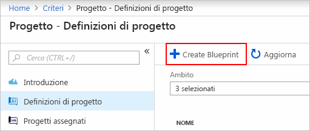
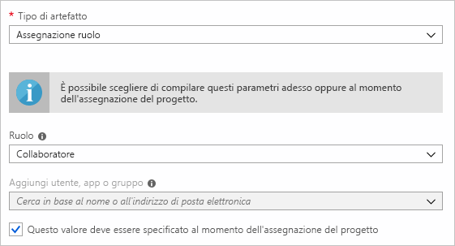
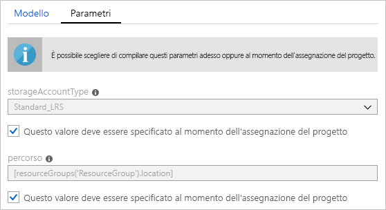
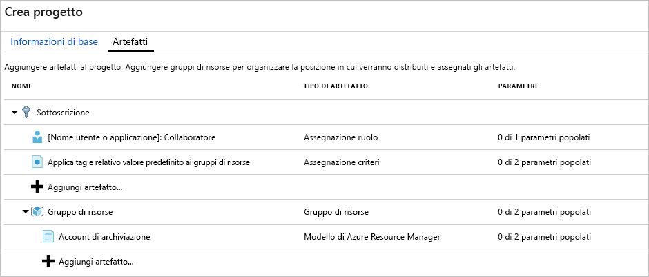
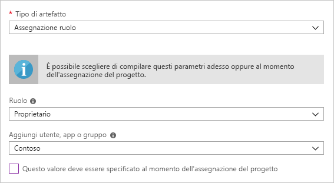
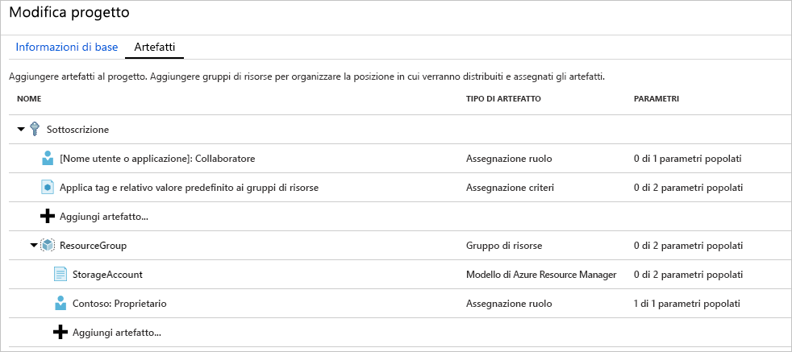
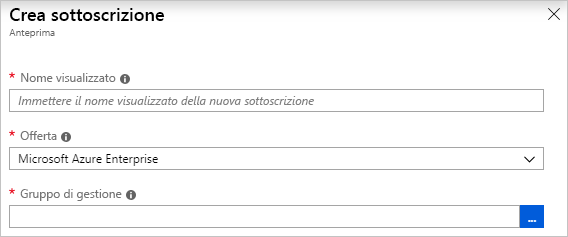
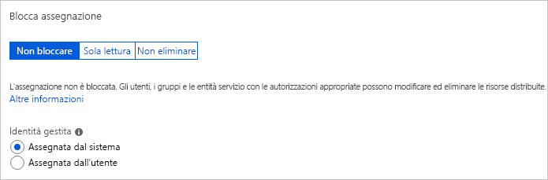
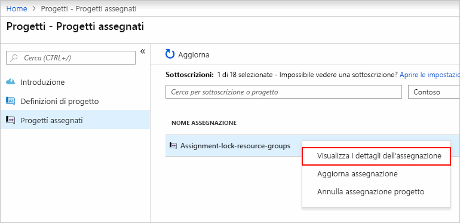

# <a name="quickstart-define-and-assign-a-blueprint-in-the-portal"></a>Guida introduttiva: Definire e assegnare un progetto nel portale

Quando si impara a creare e assegnare progetti è possibile definire modelli comuni per sviluppare configurazioni riutilizzabili e rapidamente distribuibili in base a modelli di Azure Resource Manager, criteri, sicurezza e altro ancora. In questa esercitazione viene descritto come usare Azure Blueprints per eseguire alcune della attività comuni di creazione, pubblicazione e assegnazione di un progetto all'interno dell'organizzazione. Queste attività includono:

> [!div class="checklist"]
> - Creare un nuovo progetto e aggiungere diversi elementi supportati
> - Apportare modifiche a un progetto esistente ancora in fase di **bozza**
> - Contrassegnare un progetto come pronto per l'assegnazione con stato **Pubblicato**
> - Assegnare un progetto a una sottoscrizione esistente
> - Controllare lo stato e l'avanzamento di un progetto assegnato
> - Rimuovere un progetto assegnato a una sottoscrizione

Se non si ha una sottoscrizione di Azure, creare un [account gratuito](https://azure.microsoft.com/free) prima di iniziare.

## <a name="create-a-blueprint"></a>Creare un progetto

Il primo passaggio nella definizione di un modello standard per la conformità è la creazione di un progetto dalle risorse disponibili. In questo esempio verrà creato un nuovo progetto denominato **MyBlueprint** per configurare le assegnazioni di ruolo e di criteri per la sottoscrizione. Verrà quindi aggiunto un nuovo gruppo di risorse e creato un modello di Resource Manager e un'assegnazione di ruolo nel nuovo gruppo di risorse.

1. Selezionare **Tutti i servizi** nel riquadro a sinistra. Cercare e selezionare **Progetti**.

1. Selezionare **Definizioni di progetto** nella pagina a sinistra e quindi il pulsante **+ Crea progetto** nella parte superiore della pagina.

   Selezionare **Crea** nella pagina **Attività iniziali** per passare direttamente alla creazione di un progetto.

   

1. Indicare un **Nome progetto**, ad esempio **MyBlueprint**. Usare fino a 48 lettere e numeri, senza spazi o caratteri speciali. Per il momento, lasciare vuota la **Descrizione del progetto**.

1. Nella casella **Località della definizione** selezionare i puntini di sospensione a destra, selezionare il [gruppo di gestione](../management-groups/overview.md) o la sottoscrizione in cui si vuole salvare il progetto e scegliere **Seleziona**.

1. Verificare che le informazioni siano corrette. I campi **Nome progetto** e **Località della definizione** non potranno essere modificati successivamente. Selezionare quindi **Avanti: Artefatti** nella parte inferiore della pagina o nella scheda **Artefatti** nella parte superiore della pagina.

1. Aggiungere un'assegnazione di ruolo al livello di sottoscrizione:

   1. Selezionare la riga **+ Aggiungi artefatto** sotto la voce **Sottoscrizione**. Si aprirà la finestra **Aggiungi artefatto** sul lato destro del browser.

   1. Selezionare **Assegnazione ruolo** per **Tipo di artefatto**.

   1. In **Ruolo** selezionare **Collaboratore**. Per la casella **Aggiungi utente, app o gruppo** lasciare la casella di controllo che indica un parametro dinamico.

   1. Selezionare **Aggiungi** per aggiungere questo artefatto al progetto.

   

   > [!NOTE]
   > La maggior parte degli artefatti supporta parametri. Un parametro cui è assegnato un valore durante la creazione del progetto è un *parametro statico*. Se il parametro viene assegnato durante l'assegnazione del progetto, si tratta di un *parametro dinamico*. Per altre informazioni, vedere [Blueprint parameters](./concepts/parameters.md) (Parametri per i progetti).

1. Aggiungere un'assegnazione di criteri al livello di sottoscrizione:

   1. Selezionare **+ Aggiungi artefatto** sotto l'artefatto dell'assegnazione di ruolo.

   1. Selezionare **Assegnazione criteri** per **Tipo di artefatto**.

   1. Modificare **Tipo** in **Predefinito**. In **Ricerca** immettere **tag**.

   1. Fare clic al di fuori di **Cerca** per applicare il filtro. Selezionare **Accorda tag e relativo valore predefinito ai gruppi di risorse**.

   1. Selezionare **Aggiungi** per aggiungere questo artefatto al progetto.

1. Selezionare la riga dell'assegnazione di criteri **Accorda tag e relativo valore predefinito ai gruppi di risorse**.

1. Viene visualizzata la finestra per fornire i parametri per l'artefatto come parte della definizione del progetto, in cui è possibile impostare i parametri per tutte le assegnazioni (parametri statici) in base a questo progetto anziché durante l'assegnazione (parametri dinamici). Dal momento che ai fini di questo esempio vengono usati parametri dinamici durante l'assegnazione del progetto, lasciare le impostazioni predefinite e selezionare **Annulla**.

1. Aggiungere un gruppo di risorse al livello di sottoscrizione:

   1. Selezionare la riga **+ Aggiungi artefatto** sotto la voce **Sottoscrizione**.

   1. Selezionare **Gruppo di risorse** per **Tipo di artefatto**.

   1. Lasciare vuote le caselle **Nome visualizzato dell'artefatto**, **Nome gruppo di risorse** e **Località**, ma assicurarsi che sia selezionata la casella di controllo per ogni proprietà di parametro in modo che i parametri siano parametri dinamici.

   1. Selezionare **Aggiungi** per aggiungere questo artefatto al progetto.

1. Aggiungere un modello nel gruppo di risorse:

   1. Selezionare la riga **+ Aggiungi artefatto** sotto la voce **Gruppo di risorse**.

   1. Selezionare **Modello di Azure Resource Manager** per **Tipo di artefatto**, impostare **Nome visualizzato dell'artefatto** su **Account di archiviazione** e lasciare vuoto il campo **Descrizione**.

   1. Nella scheda **Modello** nella casella dell'editor incollare il modello di Resource Manager seguente.
      Dopo aver incollato il modello, selezionare la scheda **Parametri** e notare che i parametri del modello **storageAccountType** e **location** sono stati rilevati. Ogni parametro è stato rilevato e popolato automaticamente, ma configurato come parametro dinamico.

      > [!IMPORTANT]
      > Se si importa il modello, assicurarsi che il file sia solo JSON e non includa codice HTML. Quando si fa riferimento a un URL in GitHub, assicurarsi di aver selezionato **RAW** per ottenere il file JSON puro e non quello che include HTML per la visualizzazione in GitHub. Se il modello importato non è un file JSON puro, si verificherà un errore.

      ```json
      {
          "$schema": "https://schema.management.azure.com/schemas/2015-01-01/deploymentTemplate.json#",
          "contentVersion": "1.0.0.0",
          "parameters": {
              "storageAccountType": {
                  "type": "string",
                  "defaultValue": "Standard_LRS",
                  "allowedValues": [
                      "Standard_LRS",
                      "Standard_GRS",
                      "Standard_ZRS",
                      "Premium_LRS"
                  ],
                  "metadata": {
                      "description": "Storage Account type"
                  }
              },
              "location": {
                  "type": "string",
                  "defaultValue": "[resourceGroup().location]",
                  "metadata": {
                      "description": "Location for all resources."
                  }
              }
          },
          "variables": {
              "storageAccountName": "[concat('store', uniquestring(resourceGroup().id))]"
          },
          "resources": [{
              "type": "Microsoft.Storage/storageAccounts",
              "name": "[variables('storageAccountName')]",
              "location": "[parameters('location')]",
              "apiVersion": "2018-07-01",
              "sku": {
                  "name": "[parameters('storageAccountType')]"
              },
              "kind": "StorageV2",
              "properties": {}
          }],
          "outputs": {
              "storageAccountName": {
                  "type": "string",
                  "value": "[variables('storageAccountName')]"
              }
          }
      }
      ```

   1. Deselezionare la casella di controllo **storageAccountType** e osservare come l'elenco a discesa contenga ora solo i valori inclusi nel modello di Resource Manager in **allowedValues**. Selezionare la casella per reimpostarla su un parametro dinamico.

   1. Selezionare **Aggiungi** per aggiungere questo artefatto al progetto.

   

1. Il progetto completo sarà simile al seguente. Notare che ogni elemento ha **_x_ parametri popolati su _y_** nella colonna **Parametri**. I parametri dinamici vengono impostati durante ogni assegnazione del progetto.

   

1. Ora che sono stati aggiunti tutti gli elementi pianificati, selezionare **Salva bozza** nella parte inferiore della pagina.

## <a name="edit-a-blueprint"></a>Modificare un progetto

In [Creare un progetto](#create-a-blueprint) non è stata fornita alcuna descrizione né è stata aggiunta l'assegnazione di ruolo al nuovo gruppo di risorse. Questi due problemi possono essere corretti eseguendo le operazioni seguenti:

1. Selezionare **Definizioni di progetto** nella pagina a sinistra.

1. Nell'elenco di progetti fare clic con il pulsante destro del mouse su quello creato in precedenza e scegliere **Modifica progetto**.

1. In **Descrizione del progetto** fornire alcune informazioni sul progetto e sugli elementi che lo costituiscono. In questo caso, immettere una descrizione simile a quella che segue: **Questo progetto imposta criteri di tag e un'assegnazione di ruolo nella sottoscrizione, crea un gruppo di risorse e distribuisce al suo interno un modello di risorsa e un'assegnazione di ruolo**.

1. Selezionare **Avanti: Artefatti** nella parte inferiore della pagina o nella scheda **Artefatti** nella parte superiore della pagina.

1. Aggiungere un'assegnazione di ruolo nel gruppo di risorse:

   1. Selezionare la riga **+ Aggiungi artefatto** direttamente sotto la voce **Gruppo di risorse**.

   1. Selezionare **Assegnazione ruolo** per **Tipo di artefatto**.

   1. In **Ruolo** selezionare **Proprietario** e deselezionare la casella di controllo **Aggiungi utente, app o gruppo**.

   1. Cercare e selezionare un utente, un'app o un gruppo da aggiungere. Questo elemento usa un parametro statico con la stessa impostazione in ogni assegnazione di questo progetto.

   e. Selezionare **Aggiungi** per aggiungere questo artefatto al progetto.

   

1. Il progetto completo sarà simile al seguente. Si noti che l'assegnazione di ruolo appena aggiunta indica **1 parametro popolato su 1**. Questo significa che si tratta di un parametro statico.

   

1. Selezionare **Salva bozza** ora che il progetto è stato aggiornato.

## <a name="publish-a-blueprint"></a>Pubblicare un progetto

Ora che tutti gli elementi pianificati sono stati aggiunti al progetto, è possibile pubblicare il progetto.
La pubblicazione rende disponibile il progetto per l'assegnazione a una sottoscrizione.

1. Selezionare **Definizioni di progetto** nella pagina a sinistra.

1. Nell'elenco di progetti fare clic con il pulsante destro del mouse su quello creato in precedenza e scegliere **Pubblica progetto**.

1. Nel riquadro visualizzato impostare il campo **Versione** (lettere, numeri e trattini con una lunghezza massima di 20 caratteri), ad esempio **v1**. Facoltativamente, immettere del testo in **Modifica le note**, ad esempio **Prima pubblicazione**.

1. Selezionare **Pubblica** nella parte inferiore della pagina.

## <a name="assign-a-blueprint"></a>Assegnare un progetto

Una volta pubblicato, un progetto può essere assegnato a una sottoscrizione. Assegnare il progetto creato a una delle sottoscrizioni nella gerarchia dei gruppi di gestione. Se il progetto viene salvato in una sottoscrizione, può essere assegnato solo a tale sottoscrizione.

1. Selezionare **Definizioni di progetto** nella pagina a sinistra.

1. Nell'elenco di progetti fare clic con il pulsante destro del mouse su quello creato in precedenza (oppure fare clic sui puntini di sospensione) e scegliere **Assegna progetto**.

1. Nell'elenco a discesa **Sottoscrizione** della pagina **Assegna progetto** selezionare una o più sottoscrizioni in cui si vuole distribuire il progetto.

   Se sono disponibili offerte Enterprise supportate da [Fatturazione di Azure](../../billing/index.md), viene attivato un collegamento **Crea nuovo** sotto la casella **Sottoscrizione**. A tale scopo, seguire questa procedura:

   1. Selezionare il collegamento **Crea nuovo** per creare una nuova sottoscrizione invece di selezionarne una esistente.

   1. Specificare un **nome visualizzato** per la nuova sottoscrizione.

   1. Selezionare l'**offerta** disponibile nell'elenco a discesa.

   1. Usare i puntini di sospensione per selezionare il [gruppo di gestione](../management-groups/index.md) di cui la sottoscrizione sarà un elemento figlio.

   1. Selezionare **Crea** nella parte inferiore della pagina.

   

   > [!IMPORTANT]
   > La nuova sottoscrizione viene creata subito dopo aver selezionato **Crea**.

   > [!NOTE]
   > Viene creata un'assegnazione per ogni sottoscrizione selezionata, permettendo successive modifiche a un'assegnazione a una sottoscrizione singola senza forzare modifiche nelle altre sottoscrizioni selezionate.

1. In **Nome dell'assegnazione** specificare un nome univoco per l'assegnazione.

1. In **Località** selezionare un'area per la creazione dell'identità gestita e dell'oggetto di distribuzione della sottoscrizione. Azure Blueprint usa questa identità gestita per distribuire tutti gli elementi nel progetto assegnato. Per altre informazioni, vedere l'articolo relativo alle [identità gestite per le risorse di Azure](../../active-directory/managed-identities-azure-resources/overview.md).

1. Lasciare l'elenco a discesa **Versione della definizione di progetto** per **Versioni pubblicate** impostato sulla voce **v1**. L'impostazione predefinita corrisponde alla versione pubblicata più recente.

1. Per **Blocca assegnazione**, lasciare il valore predefinito **Non bloccare**. Per altre informazioni, vedere l'articolo sul [blocco risorse di Azure Blueprints](./concepts/resource-locking.md).

   

1. In **Identità gestita** lasciare invariata l'impostazione predefinita **Assegnata dal sistema**.

1. Per l'assegnazione di ruolo a livello di sottoscrizione **[gruppo di utenti o nome applicazione]: Collaboratore**, cercare e selezionare un utente, un'app o un gruppo.

1. Per l'assegnazione di criteri a livello di sottoscrizione, impostare **Nome tag** su **Centro di costo** e **Valore del tag** su **ContosoIT**.

1. Per **Gruppo di risorse** specificare il nome **Account di archiviazione** in **Nome** e selezionare **Stati Uniti orientali 2** nell'elenco a discesa **Località**.

   > [!NOTE]
   > A ogni artefatto aggiunto nel gruppo di risorse durante la definizione del progetto viene applicato un rientro per allinearlo al gruppo di risorse o a un oggetto con cui verrà distribuito.
   > Gli artefatti che non accettano parametri o per cui non devono essere definiti parametri in fase di assegnazione vengono elencati solo per fornire informazioni contestuali.

1. Nel modello di Azure Resource Manager **Account di archiviazione** selezionare **Standard_GRS** per il parametro **storageAccountType**.

1. Leggere la casella informativa nella parte inferiore della pagina e quindi selezionare **Assegna**.

## <a name="track-deployment-of-a-blueprint"></a>Monitorare la distribuzione di un progetto

Quando un progetto è stato assegnato a una o più sottoscrizioni, vengono eseguite due operazioni:

- Il progetto viene aggiunto alla pagina **Progetti assegnati** per ogni sottoscrizione.
- Viene avviato il processo di distribuzione di tutti gli elementi definiti in base al progetto.

Ora che il progetto è stato assegnato a una sottoscrizione, verificare lo stato di avanzamento della distribuzione:

1. Selezionare **Progetti assegnati** nella pagina a sinistra.

1. Nell'elenco di progetti fare clic con il pulsante destro del mouse su quello assegnato in precedenza e scegliere **Visualizza i dettagli dell'assegnazione**.

   

1. Nella pagina **Assegnazione progetto** verificare che tutti gli artefatti siano stati distribuiti correttamente e che non si siano verificati errori durante la distribuzione. In caso di errori, vedere [Troubleshooting blueprints](./troubleshoot/general.md) (Risoluzione dei problemi dei progetti) per istruzioni su come determinare gli eventuali problemi.

## <a name="unassign-a-blueprint"></a>Annullare l'assegnazione di un progetto

Rimuovere un'assegnazione di progetto da una sottoscrizione se non è più necessaria. Il progetto potrebbe essere stato sostituito da un progetto più recente con modelli, progettazioni e criteri aggiornati. Quando un progetto viene rimosso, gli elementi assegnati nell'ambito del progetto vengono mantenuti. Per rimuovere l'assegnazione di un progetto, completare questi passaggi:

1. Selezionare **Progetti assegnati** nella pagina a sinistra.

1. Nell'elenco dei progetti, selezionare il progetto di cui si vuole annullare l'assegnazione. Selezionare quindi il pulsante **Annulla assegnazione progetto** nella parte superiore della pagina.

1. Leggere il messaggio di conferma e quindi selezionare **OK**.

## <a name="delete-a-blueprint"></a>Eliminare un progetto

1. Selezionare **Definizioni di progetto** nella pagina a sinistra.

1. Fare clic con il pulsante destro del mouse sul progetto che si vuole eliminare e scegliere **Elimina progetto**. Quindi, selezionare **Sì** nella finestra di dialogo di conferma.

> [!NOTE]
> L'eliminazione di un progetto in questo modo comporta l'eliminazione anche di tutte le versioni pubblicate del progetto selezionato.
> Per eliminare una singola versione, aprire il progetto, selezionare la scheda **Versioni pubblicate**, selezionare la versione che si vuole eliminare e quindi fare clic su **Elimina questa versione**. Inoltre, non è possibile eliminare un progetto iniziale fino a quando non sono state eliminate tutte le assegnazioni progetto di tale definizione di progetto.

## <a name="next-steps"></a>Passaggi successivi

- Informazioni sul [ciclo di vita del progetto](./concepts/lifecycle.md).
- Informazioni su come usare [parametri statici e dinamici](./concepts/parameters.md).
- Informazioni su come personalizzare l'[ordine di sequenziazione del progetto](./concepts/sequencing-order.md).
- Informazioni su come usare in modo ottimale il [blocco delle risorse del progetto](./concepts/resource-locking.md).
- Informazioni su come [aggiornare assegnazioni esistenti](./how-to/update-existing-assignments.md).
- Risolvere i problemi durante l'assegnazione di un progetto con la [risoluzione generale dei problemi](./troubleshoot/general.md).