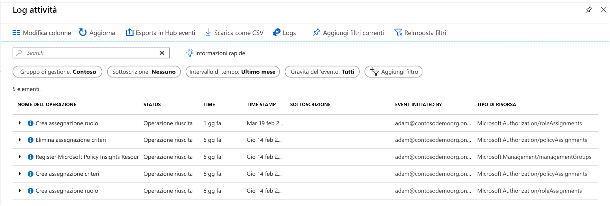

# <a name="manage-your-resources-with-management-groups"></a>Gestire le risorse con i gruppi di gestione

Se l'organizzazione dispone di molte sottoscrizioni, potrebbe essere necessario gestire in modo efficace l'accesso, i criteri e la conformità per tali sottoscrizioni. I gruppi di gestione di Azure forniscono un livello di ambito oltre le sottoscrizioni. Le sottoscrizioni sono organizzate in contenitori chiamati "gruppi di gestione" a cui vengono applicate le condizioni di governance. Tutte le sottoscrizioni all'interno di un gruppo di gestione ereditano automaticamente le condizioni applicate al gruppo di gestione.

I gruppi di gestione offrono gestione di livello aziendale su larga scala, indipendentemente dal tipo di sottoscrizioni che si posseggono.  Per altre informazioni sui gruppi di gestione, vedere [Organizzare le risorse con i gruppi di gestione di Azure](overview.md).

[!INCLUDE [GDPR-related guidance](../../../includes/gdpr-intro-sentence.md)]

[!INCLUDE [az-powershell-update](../../../includes/updated-for-az.md)]

## <a name="change-the-name-of-a-management-group"></a>Modificare il nome di un gruppo di gestione

È possibile modificare il nome del gruppo di gestione tramite il portale, PowerShell o l'interfaccia della riga di comando di Azure.

### <a name="change-the-name-in-the-portal"></a>Modificare il nome nel portale

1. Accedere al [portale di Azure](https://portal.azure.com).

1. Selezionare **Tutti i servizi** > **Gruppi di gestione**.

1. Selezionare il gruppo di gestione da rinominare.

1. Selezionare l'opzione **Rinomina gruppo** nella parte superiore della pagina.

   

1. All'apertura del menu, immettere il nuovo nome che si vuole visualizzare.

   

1. Selezionare **Salva**.

### <a name="change-the-name-in-powershell"></a>Modificare il nome in PowerShell

Per aggiornare il nome visualizzato, usare **Update-AzManagementGroup**. Ad esempio, per modificare una gestione gruppi visualizzati nome da"Contoso" a "Gruppo Contoso", si esegue il comando seguente:

```azurepowershell-interactive
Update-AzManagementGroup -GroupName 'ContosoIt' -DisplayName 'Contoso Group'
```

### <a name="change-the-name-in-azure-cli"></a>Modificare il nome nell'interfaccia della riga di comando di Azure

Per l'interfaccia della riga di comando di Azure usare il comando di aggiornamento.

```azurecli-interactive
az account management-group update --name 'Contoso' --display-name 'Contoso Group'
```

## <a name="delete-a-management-group"></a>Eliminare un gruppo di gestione

Per eliminare un gruppo di gestione è necessario che siano soddisfatti i requisiti seguenti:

1. Nel gruppo di gestione non esistono gruppi di gestione o sottoscrizioni figlio.

   - Per spostare una sottoscrizione da un gruppo di gestione, vedere [Spostare sottoscrizioni in un altro gruppo di gestione](#move-subscriptions-in-the-hierarchy).

   - Per spostare un gruppo di gestione in un altro gruppo di gestione, vedere [Spostare gruppi di gestione nella gerarchia](#move-management-groups-in-the-hierarchy).

1. Si dispone delle autorizzazioni di scrittura sul gruppo di gestione ("Proprietario", "Collaboratore" o "Collaboratore del gruppo di gestione"). Per controllare le proprie autorizzazioni, selezionare il gruppo di gestione e quindi selezionare **IAM**. Per altre informazioni sui ruoli Controllo degli accessi in base al ruolo, vedere [Gestire accessi e autorizzazioni con il controllo degli accessi in base al ruolo](../../role-based-access-control/overview.md).  

### <a name="delete-in-the-portal"></a>Eseguire l'eliminazione nel portale

1. Accedere al [portale di Azure](https://portal.azure.com).

1. Selezionare **Tutti i servizi** > **Gruppi di gestione**.

1. Selezionare il gruppo di gestione da eliminare.

1. Selezionare **Elimina**

    > [!TIP]
    > Se l'icona è disabilitata, posizionando il cursore del mouse sull'icona viene visualizzato il motivo.

   

1. Si aprirà una finestra con la richiesta di confermare l'eliminazione del gruppo di gestione.

   

1. Selezionare **Sì**.

### <a name="delete-in-powershell"></a>Eseguire l'eliminazione in PowerShell

Usare la **Remove-AzManagementGroup** comando all'interno di PowerShell per eliminare i gruppi di gestione.

```azurepowershell-interactive
Remove-AzManagementGroup -GroupName 'Contoso'
```

### <a name="delete-in-azure-cli"></a>Eseguire l'eliminazione nell'interfaccia della riga di comando di Azure

Nell'interfaccia della riga di comando di Azure usare il comando az account management-group delete.

```azurecli-interactive
az account management-group delete --name 'Contoso'
```

## <a name="view-management-groups"></a>Visualizzare i gruppi di gestione

È possibile visualizzare tutti i gruppi di gestione su cui si ha un ruolo Controllo degli accessi in base al ruolo, diretto o ereditato.  

### <a name="view-in-the-portal"></a>Visualizzare nel portale

1. Accedere al [portale di Azure](https://portal.azure.com).

1. Selezionare **Tutti i servizi** > **Gruppi di gestione**.

1. Verrà caricata la pagina di gerarchia gruppo di gestione. Questa pagina è in cui è possibile esplorare tutti i gruppi di gestione e sottoscrizioni, è possibile utilizzare. Quando si seleziona il nome del gruppo si scende di un livello nella gerarchia. Le funzioni di spostamento sono le stesse di Esplora file.

1. Per visualizzare i dettagli del gruppo di gestione, selezionare il collegamento **(dettagli)** accanto al titolo del gruppo di gestione. Se questo collegamento non è disponibile, non si hanno le autorizzazioni per visualizzare il gruppo di gestione.

   

### <a name="view-in-powershell"></a>Visualizzare in PowerShell

Il comando Get-AzManagementGroup per recuperare tutti i gruppi.  Visualizzare [Az.Resources](/powershell/module/az.resources/Get-AzManagementGroup) moduli per l'elenco completo di gestione di gruppo i comandi di Powershell GET.  

```azurepowershell-interactive
Get-AzManagementGroup
```

Per ottenere le informazioni su un singolo gruppo di gestione, usare il parametro - GroupName

```azurepowershell-interactive
Get-AzManagementGroup -GroupName 'Contoso'
```

Per restituire tutti i livelli della gerarchia di sotto di esso e un gruppo di gestione specifico, usare **, espandere** e **-Recurse** parametri.  

```azurepowershell-interactive
PS C:\> $response = Get-AzManagementGroup -GroupName TestGroupParent -Expand -Recurse
PS C:\> $response

Id                : /providers/Microsoft.Management/managementGroups/TestGroupParent
Type              : /providers/Microsoft.Management/managementGroups
Name              : TestGroupParent
TenantId          : 00000000-0000-0000-0000-000000000000
DisplayName       : TestGroupParent
UpdatedTime       : 2/1/2018 11:15:46 AM
UpdatedBy         : 00000000-0000-0000-0000-000000000000
ParentId          : /providers/Microsoft.Management/managementGroups/00000000-0000-0000-0000-000000000000
ParentName        : 00000000-0000-0000-0000-000000000000
ParentDisplayName : 00000000-0000-0000-0000-000000000000
Children          : {TestGroup1DisplayName, TestGroup2DisplayName}

PS C:\> $response.Children[0]

Type        : /managementGroup
Id          : /providers/Microsoft.Management/managementGroups/TestGroup1
Name        : TestGroup1
DisplayName : TestGroup1DisplayName
Children    : {TestRecurseChild}

PS C:\> $response.Children[0].Children[0]

Type        : /managementGroup
Id          : /providers/Microsoft.Management/managementGroups/TestRecurseChild
Name        : TestRecurseChild
DisplayName : TestRecurseChild
Children    :
```

### <a name="view-in-azure-cli"></a>Visualizzare nell'interfaccia della riga di comando di Azure

Per recuperare tutti i gruppi, usare il comando list.  

```azurecli-interactive
az account management-group list
```

Per ottenere le informazioni su un singolo gruppo di gestione, usare il comando show

```azurecli-interactive
az account management-group show --name 'Contoso'
```

Per restituire tutti i livelli della gerarchia di sotto di esso e un gruppo di gestione specifico, usare **, espandere** e **-Recurse** parametri.

```azurecli-interactive
az account management-group show --name 'Contoso' -e -r
```

## <a name="move-subscriptions-in-the-hierarchy"></a>Spostare sottoscrizioni nella gerarchia

Uno dei motivi per creare un gruppo di gestione è l'accorpamento delle sottoscrizioni. Solo i gruppi di gestione e le sottoscrizioni possono essere resi elementi figlio di un altro gruppo di gestione. Una sottoscrizione che viene spostata in un gruppo di gestione eredita tutti i criteri e le autorizzazioni di accesso utente dal gruppo di gestione padre.

Per spostare la sottoscrizione, tutte le autorizzazioni RBAC seguenti dovranno essere true:

- Ruolo "Proprietario" sulla sottoscrizione figlio.
- Ruolo "Proprietario", "Collaboratore" o "Collaboratore del gruppo di gestione" in group.* di gestione padre di destinazione
- Ruolo "Proprietario", "Collaboratore" o "Collaboratore del gruppo di gestione" in group.* di gestione padre esistente

*: A meno che la destinazione o il gruppo di gestione padre esistente sia il gruppo di gestione radice. Poiché il gruppo di gestione radice è il valore predefinito di destinazione spot per tutti i nuovi gruppi di gestione e sottoscrizioni, gli utenti non debbano autorizzazioni su di essa per spostare un elemento.

Per controllare quali autorizzazioni sono disponibili nel portale di Azure, seleziona la gestione di gruppo e quindi selezionare **IAM**. Per altre informazioni sui ruoli Controllo degli accessi in base al ruolo, vedere [Gestire accessi e autorizzazioni con il controllo degli accessi in base al ruolo](../../role-based-access-control/overview.md).

### <a name="move-subscriptions-in-the-portal"></a>Spostare sottoscrizioni nel portale

#### <a name="add-an-existing-subscription-to-a-management-group"></a>Aggiungere una sottoscrizione esistente a un gruppo di gestione

1. Accedere al [portale di Azure](https://portal.azure.com).

1. Selezionare **Tutti i servizi** > **Gruppi di gestione**.

1. Selezionare il gruppo di gestione che dovrà fungere da elemento padre.

1. Nella parte superiore della pagina selezionare **Aggiungi sottoscrizione**.

1. Selezionare nell'elenco la sottoscrizione con l'ID corretto.

   

1. Selezionare "Salva".

#### <a name="remove-a-subscription-from-a-management-group"></a>Rimuovere una sottoscrizione da un gruppo di gestione

1. Accedere al [portale di Azure](https://portal.azure.com).

1. Selezionare **Tutti i servizi** > **Gruppi di gestione**.

1. Selezionare il gruppo di gestione che attualmente funge da elemento padre.  

1. Selezionare i puntini di sospensione in fondo alla riga della sottoscrizione che si vuole spostare.

   

1. Selezionare **Sposta**.

1. Nel menu visualizzato selezionare il **Gruppo di gestione padre**.

   

1. Selezionare **Salva**.

### <a name="move-subscriptions-in-powershell"></a>Spostare sottoscrizioni in PowerShell

Per spostare una sottoscrizione in PowerShell, utilizzare il comando New-AzManagementGroupSubscription.  

```azurepowershell-interactive
New-AzManagementGroupSubscription -GroupName 'Contoso' -SubscriptionId '12345678-1234-1234-1234-123456789012'
```

Per rimuovere il collegamento tra e sottoscrizione e gruppo di gestione di usare il comando Remove-AzManagementGroupSubscription.

```azurepowershell-interactive
Remove-AzManagementGroupSubscription -GroupName 'Contoso' -SubscriptionId '12345678-1234-1234-1234-123456789012'
```

### <a name="move-subscriptions-in-azure-cli"></a>Spostare sottoscrizioni nell'interfaccia della riga di comando di Azure

Per spostare una sottoscrizione nell'interfaccia della riga di comando, usare il comando add.

```azurecli-interactive
az account management-group subscription add --name 'Contoso' --subscription '12345678-1234-1234-1234-123456789012'
```

Per rimuovere la sottoscrizione dal gruppo di gestione, usare il comando remove.  

```azurecli-interactive
az account management-group subscription remove --name 'Contoso' --subscription '12345678-1234-1234-1234-123456789012'
```

## <a name="move-management-groups-in-the-hierarchy"></a>Spostare gruppi di gestione nella gerarchia  

Quando si sposta un gruppo di gestione padre, la gerarchia in tale gruppo si sposta con essa.

### <a name="move-management-groups-in-the-portal"></a>Spostare gruppi di gestione nel portale

1. Accedere al [portale di Azure](https://portal.azure.com).

1. Selezionare **Tutti i servizi** > **Gruppi di gestione**.

1. Selezionare il gruppo di gestione che dovrà fungere da elemento padre.

1. Nella parte superiore della pagina selezionare **Aggiungi gruppo di gestione**.

1. Nel menu visualizzato, selezionare se usare un gruppo di gestione nuovo o esistente.

   - Selezionando la prima opzione verrà creato un nuovo gruppo di gestione.
   - Selezionando la seconda, verrà visualizzato un elenco a discesa di tutti i gruppi di gestione a cui è possibile spostare questo gruppo di gestione.  

   

1. Selezionare **Salva**.

### <a name="move-management-groups-in-powershell"></a>Spostare gruppi di gestione in PowerShell

Usare il comando Update-AzManagementGroup in PowerShell per spostare un gruppo di gestione in un gruppo diverso.

```azurepowershell-interactive
Update-AzManagementGroup -GroupName 'Contoso' -ParentId '/providers/Microsoft.Management/managementGroups/ContosoIT'
```  

### <a name="move-management-groups-in-azure-cli"></a>Spostare gruppi di gestione nell'interfaccia della riga di comando di Azure

Usare il comando update per spostare un gruppo di gestione con l'interfaccia della riga di comando di Azure.

```azurecli-interactive
az account management-group update --name 'Contoso' --parent-id '/providers/Microsoft.Management/managementGroups/ContosoIT'
```

## <a name="audit-management-groups-using-activity-logs"></a>Controllare i gruppi di gestione con i log attività

I gruppi di gestione sono supportati all'interno del [log attività di Azure](../../azure-monitor/platform/activity-logs-overview.md). È possibile eseguire query di tutti gli eventi che si verificano in un gruppo di gestione nella stessa posizione centrale di altre risorse di Azure.  È ad esempio possibile vedere tutte le modifiche delle assegnazioni di ruoli o di criteri apportate a uno specifico gruppo di gestione.



Quando si esegue una query sui gruppi di gestione all'esterno del portale di Azure, l'ambito di destinazione per tali gruppi sarà simile a **"/providers/Microsoft.Management/managementGroups/{yourMgID}"**.

## <a name="referencing-management-groups-from-other-resource-providers"></a>Riferimento a gruppi di gestione da altri provider di risorse

Quando si fa riferimento a gruppi di gestione dalle azioni di altro Provider di risorse, usare il seguente percorso dell'ambito. Questo percorso viene utilizzato quando si usa PowerShell, CLI di Azure e le API REST.  

>"/providers/Microsoft.Management/managementGroups/{yourMgID}"

Un esempio dell'uso di questo percorso è quando si assegna una nuova assegnazione ruolo a un gruppo di gestione di PowerShell

```azurepowershell-interactive
New-AzRoleAssignment -Scope "/providers/Microsoft.Management/managementGroups/Contoso"
```

Il percorso dell'ambito stesso viene utilizzato durante il recupero di una definizione di criteri in un gruppo di gestione.

```http
GET https://management.azure.com/providers/Microsoft.Management/managementgroups/MyManagementGroup/providers/Microsoft.Authorization/policyDefinitions/ResourceNaming?api-version=2018-05-01
```

## <a name="next-steps"></a>Passaggi successivi

Per altre informazioni sui gruppi di gestione, vedere:

- [Creare gruppi di gestione per organizzare le risorse di Azure](create.md)
- [Come modificare, eliminare o gestire i gruppi di gestione](manage.md)
- [Esaminare i gruppi di gestione nel modulo di risorse di Azure PowerShell](/powershell/module/az.resources#resources)
- [Esaminare i gruppi di gestione nell'API REST](/rest/api/resources/managementgroups)
- [Esaminare i gruppi di gestione nell'infrastruttura CLI di Azure](/cli/azure/account/management-group)