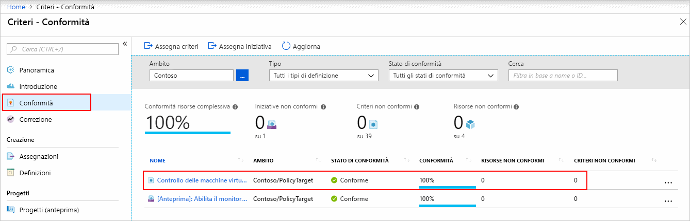
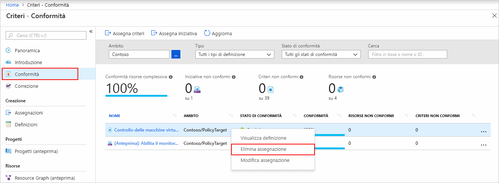

# Creare un'assegnazione di criteri per identificare le risorse non conformi tramite un modello di Resource Manager

Il primo passaggio per comprendere la conformità in Azure consiste nell'identificare lo stato delle risorse.
Questa guida introduttiva illustra il processo di creazione di un'assegnazione di criteri per identificare le macchine virtuali che non usano dischi gestiti.

Alla fine di questo processo, verranno identificate le macchine virtuali che non usano dischi gestiti e che sono quindi *non conformi* all'assegnazione di criteri.

Se non si ha una sottoscrizione di Azure, creare un account [gratuito](https://azure.microsoft.com/free/) prima di iniziare.

## Creare un'assegnazione di criteri

In questo argomento di avvio rapido si crea un'assegnazione di criteri e si assegna una definizione di criteri predefinita denominata *Controlla macchine virtuali che non usano dischi gestiti*. Per un elenco parziale di tutti i criteri predefiniti disponibili, vedere [Esempi di criteri](./samples/index.md).

Esistono diversi modi per creare assegnazioni di criteri. In questo argomento di avvio rapido si usa un [modello di avvio rapido](https://azure.microsoft.com/resources/templates/101-azurepolicy-assign-builtinpolicy-resourcegroup/).
Di seguito è riportata una copia del modello:

[!code-json[policy-assignment](~/quickstart-templates/101-azurepolicy-assign-builtinpolicy-resourcegroup/azuredeploy.json)]

> [!NOTE]
> Il servizio Criteri di Azure è gratuito.  Per altre informazioni, vedere [Panoramica di Criteri di Azure](./overview.md).

1. Fare clic sull'immagine seguente per accedere al portale di Azure e aprire il modello:

   

1. Selezionare o immettere i valori seguenti:

   | NOME | Valore |
   |------|-------|
   | Sottoscrizione | Selezionare la sottoscrizione di Azure. |
   | Gruppo di risorse | Selezionare **Crea nuovo**, specificare un nome e quindi fare clic su **OK**. Nello screenshot il nome del gruppo di risorse è *mypolicyquickstart<Date in MMDD>rg*. |
   | Località | Scegliere un'area, Ad esempio **Stati Uniti centrali**. |
   | Nome assegnazione criteri | Specificare un nome per l'assegnazione di criteri. È anche possibile usare il nome visualizzato della definizione dei criteri, ad esempio **Controlla macchine virtuali che non usano dischi gestiti**. |
   | Nome gruppo di risorse | Specificare il nome di un gruppo di risorse a cui si vogliono assegnare i criteri. In questo argomento di avvio rapido usare il valore predefinito **[resourceGroup().name]**. **[resourceGroup()](../../azure-resource-manager/resource-group-template-functions-resource.md#resourcegroup)** è una funzione di modello che recupera il gruppo di risorse. |
   | ID definizione criteri | Specificare **/providers/Microsoft.Authorization/policyDefinitions/0a914e76-4921-4c19-b460-a2d36003525a**. |
   | Accetto le condizioni riportate sopra | (selezionare) |

1. Selezionare **Acquisto**.

Alcune risorse aggiuntive:

- Per altri modelli di esempio, vedere [Modelli di avvio rapido di Azure](https://azure.microsoft.com/resources/templates/?resourceType=Microsoft.Authorization&pageNumber=1&sort=Popular).
- Per informazioni di riferimento sul modello, vedere [Informazioni di riferimento sui modelli di Azure](/azure/templates/microsoft.authorization/allversions).
- Per informazioni su come sviluppare modelli di Resource Manager, vedere [Documentazione di Resource Manager in Azure](/azure/azure-resource-manager/).
- Per informazioni sulla distribuzione a livello di sottoscrizione, vedere [Creare gruppi di risorse e risorse a livello di sottoscrizione](../../azure-resource-manager/deploy-to-subscription.md).

## Identificare le risorse non conformi

Selezionare **Assegnazioni** a sinistra nella pagina. Individuare l'assegnazione dei criteri **Audit VMs that do not use managed disks** (Controllare le macchine virtuali che non usano Managed Disks) creata.

Le eventuali risorse esistenti non conformi a questa nuova assegnazione verranno visualizzate nella scheda **Non-compliant resources** (Risorse non conformi).

Per altre informazioni, vedere [Funzionamento della conformità](./how-to/get-compliance-data.md#how-compliance-works).

## Pulire le risorse

Per rimuovere l'assegnazione creata, eseguire la procedura seguente:

1. Selezionare **Conformità** (o **Assegnazioni**) a sinistra della pagina Criteri di Azure e individuare l'assegnazione dei criteri **Audit VMs that do not use managed disks** (Controllare le macchine virtuali che non usano Managed Disks) creata.

1. Fare clic con il pulsante destro del mouse sull'assegnazione di criteri **Controlla macchine virtuali che non usano dischi gestiti** e scegliere **Elimina assegnazione**.

   

## Passaggi successivi

In questo argomento di avvio rapido è stata assegnata una definizione di criteri predefinita a un ambito ed è stato valutato il relativo report di conformità. La definizione dei criteri garantisce che tutte le risorse nell'ambito siano conformi e identifica quelle che non lo sono.

Per altre informazioni sull'assegnazione di criteri per convalidare la conformità delle nuove risorse, continuare con l'esercitazione seguente:

> [!div class="nextstepaction"]
> [Creazione e gestione dei criteri](./tutorials/create-and-manage.md)