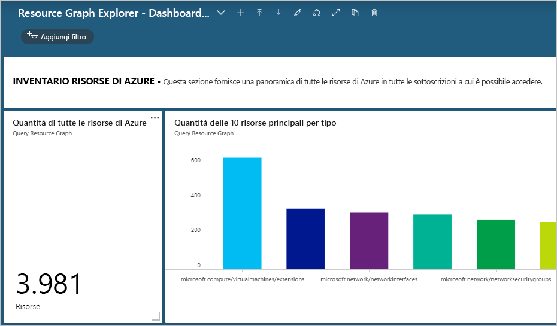
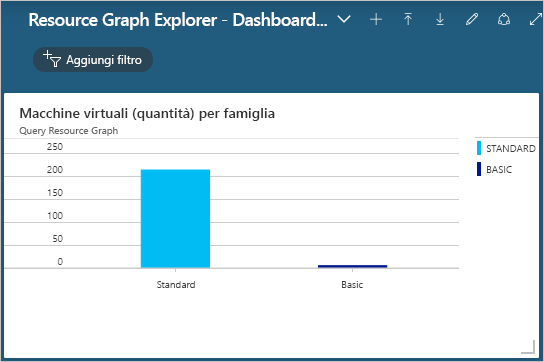

# <a name="quickstart-run-your-first-resource-graph-query-using-azure-resource-graph-explorer"></a>Guida introduttiva: Eseguire la prima query di Resource Graph con Azure Resource Graph Explorer

Le funzionalità di Azure Resource Graph sono disponibili direttamente nel portale di Azure tramite Azure Resource Graph Explorer. Resource Graph Explorer fornisce informazioni visualizzabili sulle proprietà e i tipi di risorse di Azure Resource Manager su cui è possibile eseguire una query. Resource Graph Explorer fornisce inoltre un'interfaccia pulita per l'uso di più query, la valutazione dei risultati e anche la conversione dei risultati di alcune query in un grafico che può essere aggiunto a un dashboard di Azure.

Completando questo argomento di avvio rapido, si eseguirà la prima query di Resource Graph tramite il portale di Azure e Resource Graph Explorer e si aggiungeranno i risultati a un dashboard.

Se non si ha una sottoscrizione di Azure, creare un account [gratuito](https://azure.microsoft.com/free/) prima di iniziare.

## <a name="run-your-first-resource-graph-query"></a>Eseguire la prima query di Resource Graph

Aprire il [portale di Azure](https://portal.azure.com) per trovare e usare Resource Graph Explorer attenendosi alla procedura seguente per eseguire la prima query di Resource Graph:

1. Selezionare **Tutti i servizi** nel riquadro a sinistra. Cercare e selezionare **Resource Graph Explorer**.

1. Nella sezione **Query 1** della finestra immettere la query `Resources | project name, type | limit 5` e selezionare **Esegui query**.

   > [!NOTE]
   > Poiché questo esempio di query non prevede un modificatore del tipo di ordinamento, ad esempio `order by`, se si esegue questa query più volte, è probabile che venga restituito un set di risorse diverso per ogni richiesta.

1. Esaminare i risultati della query nella scheda **Risultati**. Selezionare la scheda **Messaggi** per visualizzare i dettagli relativi alla query, tra cui il numero di risultati e la durata. Gli eventuali errori vengono visualizzati in questa scheda.

1. Aggiornare la query applicando `order by` alla proprietà **Name**: `Resources | project name, type | limit 5 | order by name asc`. Quindi, selezionare **Esegui query**.

   > [!NOTE]
   > Come nella prima query, se si esegue questa query più volte, è probabile che venga restituito un set di risorse diverso per ogni richiesta. L'ordine dei comandi della query è importante. In questo esempio `order by` segue `limit`. In questo modo i risultati della query verranno prima limitati e poi ordinati.

1. Aggiornare la query applicando prima `order by` alla proprietà **Name** e quindi `limit` ai primi cinque risultati: `Resources | project name, type | order by name asc | limit 5`. Quindi, selezionare **Esegui query**.

Quando la query finale viene eseguita più volte, presupponendo che non vengano apportate modifiche all'ambiente, i risultati restituiti saranno coerenti e, come previsto, ordinati in base alla proprietà **Name**, ma ancora limitati ai primi cinque risultati.

### <a name="schema-browser"></a>Browser dello schema

Il browser dello schema si trova nel riquadro sinistro di Resource Graph Explorer. Questo elenco di risorse mostra tutti i _tipi di risorsa_ di Azure supportati da Azure Resource Graph e che esistono in un tenant a cui si ha accesso. Espandendo un tipo di risorsa o le sottoproprietà vengono visualizzate le proprietà figlio che è possibile usare per creare una query di Resource Graph.

Selezionando il tipo di risorsa, nella casella della query viene inserita la stringa `where type =="<resource type>"`. Selezionando una delle proprietà figlio, nella casella della query viene aggiunta la stringa `where <propertyName> == "INSERT_VALUE_HERE"`.
Il browser dello schema è un ottimo modo per individuare le proprietà da usare nelle query. Assicurarsi di sostituire la stringa _INSERT\_VALUE\_HERE_ con il proprio valore e modificare la query con condizioni, operatori e funzioni per ottenere i risultati previsti.

## <a name="create-a-chart-from-the-resource-graph-query"></a>Creare un grafico dalla query di Resource Graph

Dopo aver eseguito l'ultima query illustrata sopra, se si seleziona la scheda **Grafici** viene visualizzato il messaggio "Il set di risultati non è compatibile con una visualizzazione grafico a torta". Le query che elencano risultati non possono essere convertite in grafico, a differenza di quelle che forniscono il numero di risorse. Usando la [query di esempio riportata in Contare le macchine virtuali per tipo di sistema operativo](./samples/starter.md#count-virtual-machines-by-os-type), creare una visualizzazione dalla query di Resource Graph.

1. Nella sezione **Query 1** della finestra immettere la query seguente e selezionare **Esegui query**.

   ```kusto
   Resources
   | where type =~ 'Microsoft.Compute/virtualMachines'
   | summarize count() by tostring(properties.storageProfile.osDisk.osType)
   ```

1. Selezionare la scheda **Risultati** e notare che la risposta per questa query fornisce conteggi.

1. Selezionare la scheda **Grafici**. In questo caso, la query genera visualizzazioni. Per _Selezionare un tipo di grafico_, cambiare il tipo in _Grafico a barre_ o _Grafico ad anello_ per sperimentare con le opzioni di visualizzazione disponibili.

## <a name="pin-the-query-visualization-to-a-dashboard"></a>Aggiungere la visualizzazione della query a un dashboard

Per i risultati di una query che è possibile visualizzare, la visualizzazione dei dati può essere aggiunta in uno dei dashboard. Dopo aver eseguito la query precedente,procedere come segue:

1. Selezionare **Salva** e specificare il nome "VM by OS Type". Quindi selezionare **Salva** nella parte inferiore del riquadro destro.

1. Selezionare **Esegui query** per rieseguire la query dopo averla salvata.

1. Nella scheda **Grafici** selezionare una visualizzazione dei dati. Quindi selezionare **Aggiungi al dashboard**.

1. Selezionare la notifica del portale visualizzata oppure selezionare **Dashboard** nel riquadro sinistro.

La query è ora disponibile nel dashboard con il titolo del riquadro corrispondente al nome della query. Se la query non è stata salvata quando è stata aggiunta, viene invece denominata 'Query 1'.

La query e la visualizzazione dei dati risultanti vengono eseguite e aggiornate ogni volta che il dashboard viene caricato, fornendo informazioni dettagliate dinamiche e in tempo reale all'ambiente Azure direttamente nel flusso di lavoro.

> [!NOTE]
> Anche le query che generano un elenco possono essere aggiunte al dashboard. La funzionalità non è limitata alle visualizzazioni di dati delle query.

## <a name="import-example-resource-graph-explorer-dashboards"></a>Importare i dashboard di Resource Graph Explorer di esempio

Per trovare esempi di query di Resource Graph e informazioni su come usare Resource Graph Explorer per ottimizzare il flusso di lavoro del portale di Azure, provare questi dashboard di esempio.

- [Resource Graph Explorer - Dashboard di esempio n. 1](https://github.com/Azure-Samples/Governance/blob/master/src/resource-graph/portal-dashboards/sample-1/resourcegraphexplorer-sample-1.json)

  [](./media/arge-sample1-large.png#lightbox)

- [Resource Graph Explorer - Dashboard di esempio n. 2](https://github.com/Azure-Samples/Governance/blob/master/src/resource-graph/portal-dashboards/sample-2/resourcegraphexplorer-sample-2.json)

  [](./media/arge-sample2-large.png#lightbox)

> [!NOTE]
> I conteggi e i grafici negli screenshot di dashboard di esempio precedenti variano a seconda dell'ambiente di Azure.

1. Selezionare e scaricare il dashboard di esempio che si vuole valutare.

1. Nel riquadro sinistro del portale di Azure selezionare **Dashboard**.

1. Selezionare **Carica**, quindi individuare e selezionare il file del dashboard di esempio scaricato. Quindi selezionare **Apri**.

Il dashboard importato viene visualizzato automaticamente. Poiché ora è disponibile nel portale di Azure, è possibile esplorarlo e apportare le modifiche necessarie oppure creare nuovi dashboard dall'esempio da condividere con i team. Per altre informazioni sull'uso dei dashboard, vedere [Creare e condividere dashboard nel portale di Azure](../../azure-portal/azure-portal-dashboards.md).

## <a name="clean-up-resources"></a>Pulire le risorse

Per rimuovere i dashboard di Resource Graph di esempio all'ambiente del portale di Azure, è possibile procedere come segue:

1. Selezionare **Dashboard** nel riquadro sinistro.

1. Nell'elenco a discesa Dashboard selezionare il dashboard di Resource Graph di esempio da eliminare.

1. Scegliere **Elimina** dal menu Dashboard nella parte superiore del dashboard e fare clic su **OK** per confermare.

## <a name="next-steps"></a>Passaggi successivi

- Ottenere altre informazioni sul [linguaggio di query](./concepts/query-language.md)
- Informazioni su come [esplorare le risorse](./concepts/explore-resources.md)
- Eseguire la prima query con l'[interfaccia della riga di comando di Azure](first-query-azurecli.md)
- Vedere esempi di [query di base](./samples/starter.md)
- Vedere esempi di [query avanzate](./samples/advanced.md)
- Commenti e suggerimenti su [UserVoice](https://feedback.azure.com/forums/915958-azure-governance)