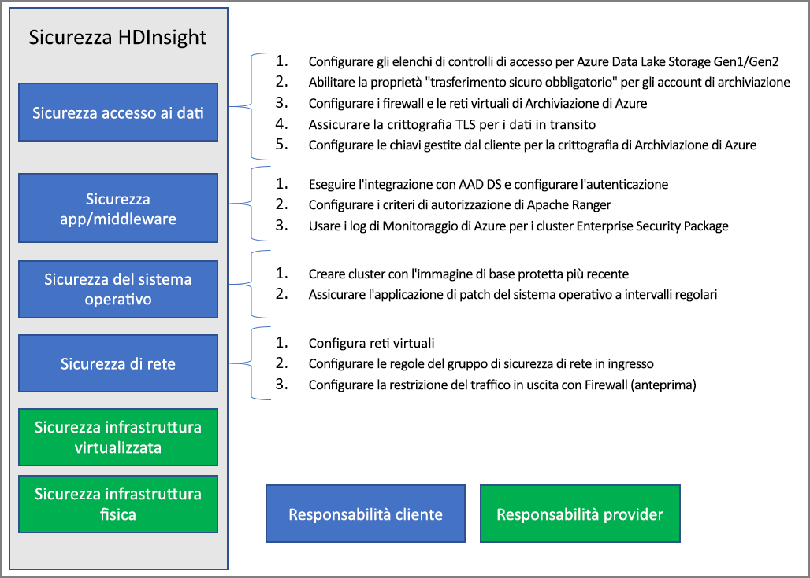

# Panoramica della sicurezza aziendale in Azure HDInsight

Azure HDInsight offre diversi metodi per soddisfare le esigenze dell'organizzazione in termini di sicurezza. La maggior parte di queste soluzioni non è attivata per impostazione predefinita. Grazie a questa flessibilità è possibile scegliere le funzionalità di sicurezza più appropriate per le proprie esigenze e di evitare di pagare per funzionalità non desiderate. In questo modo, però, spetta all'utente assicurarsi che siano abilitate le soluzioni corrette per la configurazione e l'ambiente.

Questo articolo esamina le soluzioni di sicurezza dividendole in base ai quattro pilastri di sicurezza tradizionali, ovvero protezione perimetrale, autenticazione, autorizzazione e crittografia.

Questo articolo introduce anche il pacchetto **Enterprise Security Package di Azure HDInsight**, che supporta l'autenticazione basata su Active Directory, il supporto multiutente e il controllo degli accessi in base al ruolo per i cluster HDInsight.

## Pilastri della sicurezza aziendale

Un modo per esaminare la sicurezza aziendale consiste nel dividere le soluzioni di sicurezza in quattro gruppi principali in base al tipo di controllo. Questi gruppi, denominati pilastri della sicurezza, sono i seguenti: protezione perimetrale, autenticazione, autorizzazione e crittografia.

### Protezione perimetrale

Per la protezione perimetrale in HDInsight si usano le [reti virtuali](../hdinsight-plan-virtual-network-deployment.md). Un amministratore aziendale può creare un cluster all'interno di una rete virtuale e usare gruppi di sicurezza di rete per limitare l'accesso alla rete virtuale. Solo gli indirizzi IP consentiti nelle regole in ingresso dei gruppi di sicurezza di rete potranno comunicare con il cluster HDInsight. Questa configurazione offre sicurezza perimetrale.

Tutti i cluster distribuiti in una rete virtuale includeranno anche un endpoint privato che viene risolto in un indirizzo IP privato all'interno della rete virtuale per l'accesso HTTP privato ai gateway del cluster.

### Authentication

Il pacchetto [Enterprise Security Package](apache-domain-joined-architecture.md) di HDInsight supporta l'autenticazione basata su Active Directory, il supporto multiutente e il controllo degli accessi in base al ruolo. Per l'integrazione di Active Directory si usa [Azure Active Directory Domain Services](../../active-directory-domain-services/overview.md). Con queste funzionalità è possibile creare un cluster HDInsight aggiunto a un dominio gestito di Active Directory. È quindi possibile configurare un elenco di dipendenti dell'azienda autorizzati a eseguire l'autenticazione e accedere al cluster.

Con questa configurazione, i dipendenti dell'azienda possono accedere ai nodi del cluster usando le credenziali del dominio. Possono usare le credenziali del dominio anche per eseguire l'autenticazione con altri endpoint approvati, ad esempio visualizzazioni di Apache Ambari, ODBC, JDBC, PowerShell e API REST per l'interazione con il cluster. 

### Authorization

Una procedura consigliata seguita dalla maggior parte delle aziende è assicurarsi di limitare l'accesso a tutte le risorse aziendali da parte dei dipendenti. In modo analogo, l'amministratore può definire i criteri di controllo degli accessi in base al ruolo per le risorse del cluster. Questa operazione è disponibile solo nei cluster ESP.

L'amministratore di Hadoop può configurare il controllo degli accessi in base al ruolo per proteggere Apache [Hive](apache-domain-joined-run-hive.md), [HBase](apache-domain-joined-run-hbase.md) e [Kafka](apache-domain-joined-run-kafka.md) usando questi plug-in Apache Ranger. La configurazione dei criteri del controllo degli accessi in base al ruolo consente di associare le autorizzazioni a un ruolo nell'organizzazione. Con questo livello di astrazione risulta ancor più semplice assicurarsi che le persone dispongano solo delle autorizzazioni necessarie per svolgere le proprie responsabilità lavorative. Ranger consente anche di controllare l'accesso ai dati da parte dei dipendenti e qualsiasi modifica apportata ai criteri di controllo di accesso.

Ad esempio, l'amministratore può configurare [Apache Ranger](https://ranger.apache.org/) per impostare criteri di controllo degli accessi per Hive. Questa funzionalità garantisce il filtro a livello di riga e di colonna (maschera dati) e filtra i dati sensibili impedendo l'accesso a utenti non autorizzati.

### Controllo

Controllare tutti gli accessi per le risorse del cluster e i dati, è necessario per tenere traccia dell'accesso non autorizzato o non intenzionale delle risorse. È importante tanto quanto proteggere le risorse del cluster HDInsight da utenti non autorizzati e garantire la sicurezza dei dati.

L'amministratore può visualizzare e segnalare tutti gli accessi ai dati e alle risorse del cluster HDInsight. L'amministratore può anche visualizzare e segnalare tutte le modifiche ai criteri di controllo degli accessi creati negli endpoint supportati da Apache Ranger. 

Per accedere ai log di controllo di Apache Ranger e Ambari e ai log di accesso di ssh, [abilitare Monitoraggio di Azure](../hdinsight-hadoop-oms-log-analytics-tutorial.md) e visualizzare i record di controllo correlati.

### Crittografia

La protezione dei dati è importante per rispettare i requisiti di sicurezza e conformità dell'organizzazione. Oltre a limitare l'accesso ai dati da parte di dipendenti non autorizzati, è necessario crittografarli.

Entrambi gli archivi di dati per i cluster HDInsight, Archiviazione BLOB di Azure e Azure Data Lake Storage Gen1 e Gen2, supportano la [crittografia dei dati](../../storage/common/storage-service-encryption.md) inattivi trasparente lato server. La protezione dei cluster HDInsight sarà perfettamente compatibile con questa funzionalità di crittografia lato server dei dati inattivi.

## Modello di responsabilità condivisa

Nell'immagine seguente sono riepilogate le principali aree di sicurezza del sistema e le soluzioni di sicurezza disponibili in ognuna di essi. Vengono inoltre indicate le aree di sicurezza di responsabilità dei clienti e quelle di HDInsight come provider di servizi.

La tabella seguente include i collegamenti alle risorse per ogni tipo di soluzione di sicurezza.

| Area di sicurezza | Soluzioni disponibili | Parte responsabile |
|---|---|---|
| Sicurezza dall'accesso ai dati | Configurare [elenchi di controllo di accesso (ACL)](../../storage/blobs/data-lake-storage-access-control.md) per Azure Data Lake Storage Gen1 e Gen2  | Customer |
|  | Abilitare la proprietà [Trasferimento sicuro obbligatorio](../../storage/common/storage-require-secure-transfer.md) negli account di archiviazione. | Customer |
|  | Configurare le reti virtuali e i [firewall di Archiviazione di Azure](../../storage/common/storage-network-security.md) | Customer |
|  | Assicurarsi che la [crittografia TLS](../../storage/common/storage-security-tls.md) sia abilitata per i dati in transito. | Customer |
|  | Configurare le [chiavi gestite dal cliente](../../storage/common/storage-encryption-keys-portal.md) per la crittografia di Archiviazione di Azure | Customer |
| Sicurezza delle applicazioni e del middleware | Eseguire l'integrazione con Azure AD Domain Services e [configurare l'autenticazione](apache-domain-joined-configure-using-azure-adds.md) | Customer |
|  | Configurare i criteri di [autorizzazione di Apache Ranger](apache-domain-joined-run-hive.md) | Customer |
|  | Usare i [log di Monitoraggio di Azure](../hdinsight-hadoop-oms-log-analytics-tutorial.md) | Customer |
| Sicurezza del sistema operativo | Creare cluster con l'immagine di base protetta più recente | Customer |
|  | Assicurarsi di eseguire regolarmente l'[applicazione di patch del sistema operativo](../hdinsight-os-patching.md) | Customer |
| Sicurezza di rete | Configurare una [rete virtuale](../hdinsight-plan-virtual-network-deployment.md) |
|  | Configurare [regole in ingresso dei gruppi di sicurezza di rete](../hdinsight-plan-virtual-network-deployment.md#networktraffic) | Customer |
|  | Configurare la [restrizione del traffico in uscita](../hdinsight-restrict-outbound-traffic.md) con Firewall (anteprima) | Customer |
| Infrastruttura virtualizzata | N/D | HDInsight (provider di servizi cloud) |
| Sicurezza dell'infrastruttura fisica | N/D | HDInsight (provider di servizi cloud) |

## Passaggi successivi

* [Pianificare i cluster HDInsight con ESP](apache-domain-joined-architecture.md)
* [Configurare i cluster HDInsight con ESP](apache-domain-joined-configure.md)
* [Gestire i cluster HDInsight con ESP](apache-domain-joined-manage.md)
