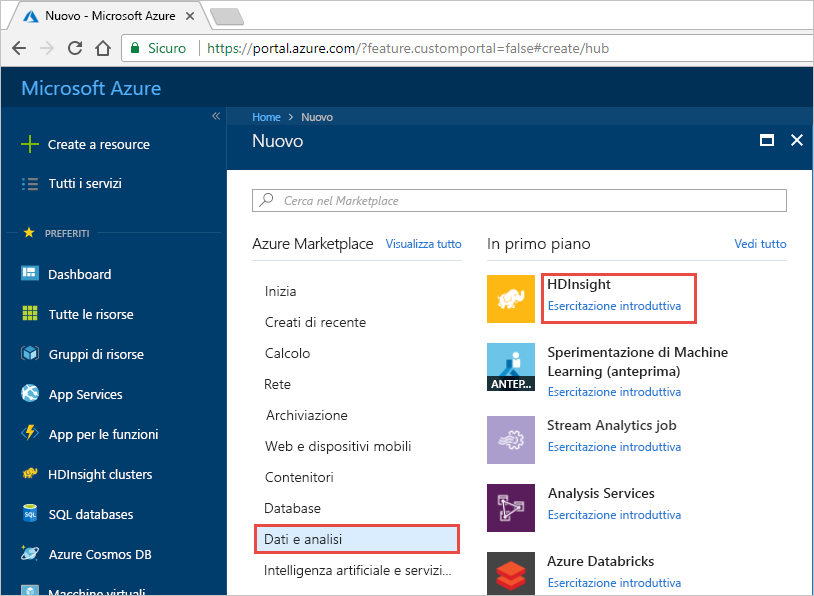
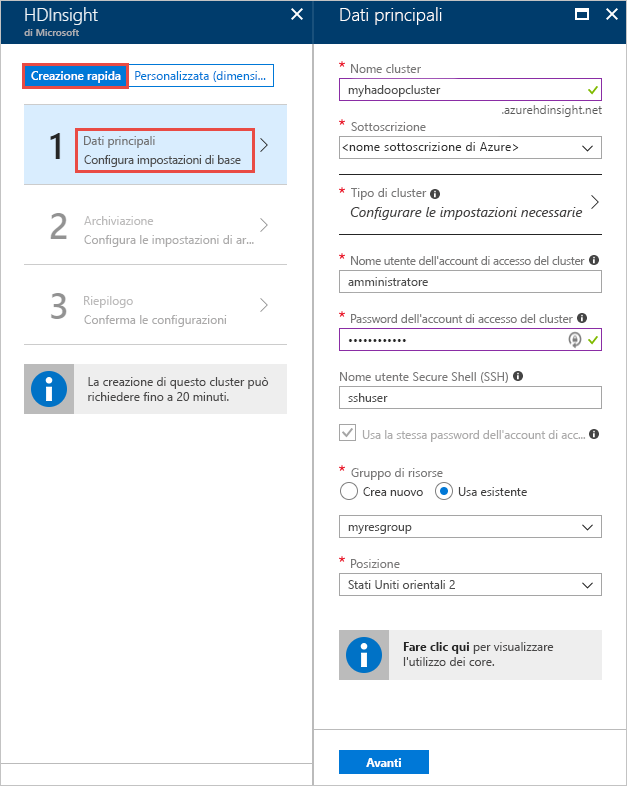
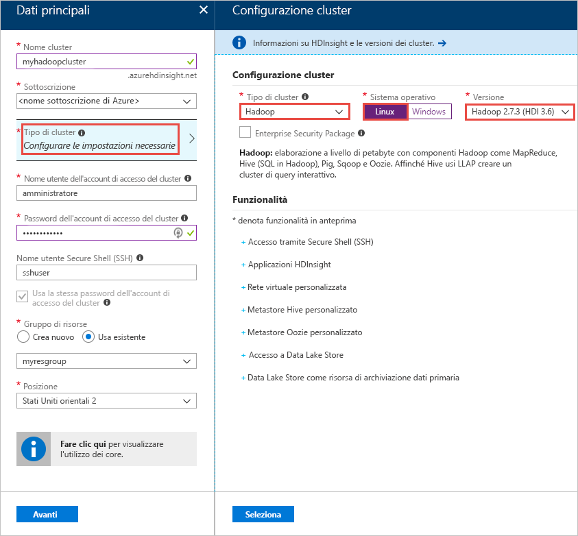
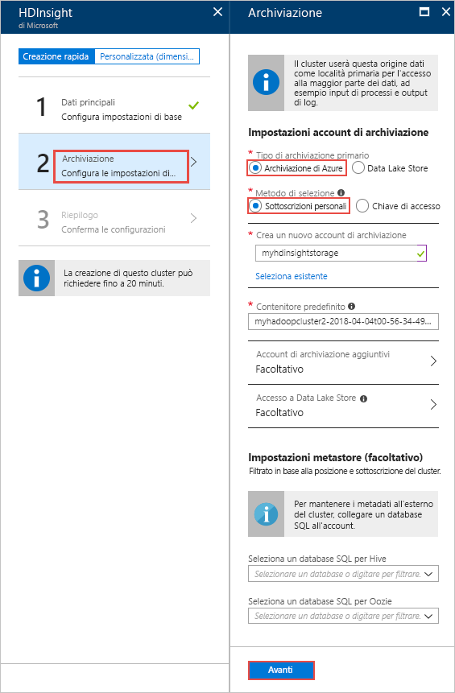
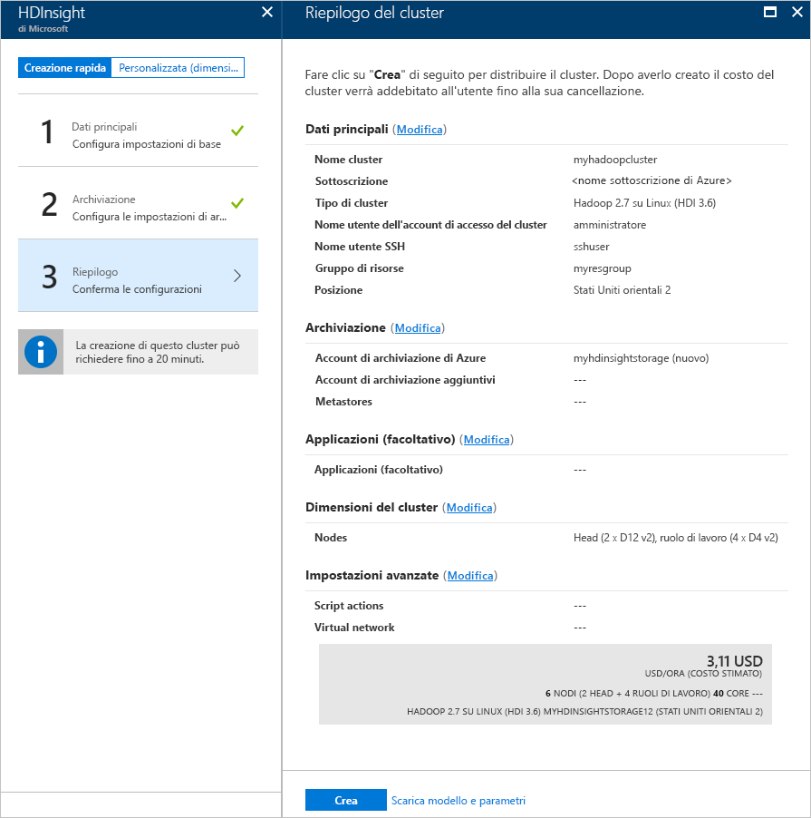
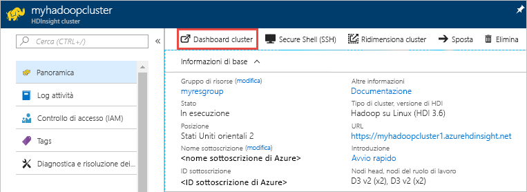

# Guida di avvio rapido: Iniziare a usare Hadoop e Hive in Azure HDInsight mediante il portale di Azure

Questo articolo illustra come creare cluster [Hadoop](http://hadoop.apache.org/) in HDInsight mediante il portale di Azure e quindi eseguire processi Hive in HDInsight. La maggior parte dei processi Hadoop è costituita da processi batch. Viene creato un cluster, si eseguono alcuni processi e quindi si elimina il cluster. In questo articolo vengono eseguite tutte e tre le attività.

In questa guida di avvio rapido si userà il portale di Azure per creare un cluster Hadoop in HDInsight. È possibile creare un cluster usando il [modello di Azure Resource Manager](apache-hadoop-linux-tutorial-get-started.md).

HDInsight attualmente viene fornito con [sette diversi tipi di cluster](./apache-hadoop-introduction.md#cluster-types-in-hdinsight). Ogni tipo di cluster supporta un set diverso di componenti. Tutti i tipi di cluster supportano Hive. Per un elenco dei componenti supportati in HDInsight, vedere [Novità delle versioni cluster di Hadoop incluse in HDInsight](../hdinsight-component-versioning.md)  

Se non si ha una sottoscrizione di Azure, [creare un account gratuito](https://azure.microsoft.com/free/) prima di iniziare.

## Creare un cluster Hadoop

In questa sezione viene creato un cluster Hadoop in HDInsight usando il portale di Azure. 

1. Accedere al [portale di Azure](https://portal.azure.com).

1. Nel portale di Azure selezionare **Creare una risorsa** > **Dati e analisi** > **HDInsight**. 

    

2. Sotto **HDInsight** > **Creazione rapida** > **Nozioni di base**, fornire i valori indicati nella schermata seguente:

    

    Immettere o selezionare i valori seguenti:
    
    |Proprietà  |DESCRIZIONE  |
    |---------|---------|
    |**Nome cluster**     | Immettere un nome per il cluster Hadoop. Poiché tutti i cluster in HDInsight condividono lo stesso spazio dei nomi DNS, è necessario che questo nome sia univoco. Il nome può includere al massimo 59 caratteri, tra cui lettere, numeri e trattini. Si noti che il primo e l'ultimo carattere del nome non possono essere trattini. |
    |**Sottoscrizione**     |  Selezionare la sottoscrizione di Azure. |
    |**Tipo di cluster**     | Ignora per ora. I valori saranno inseriti nel passaggio successivo di questa procedura.|
    |**Nome utente e password di accesso del cluster**     | Il nome di accesso predefinito è **admin**. La password deve avere una lunghezza minima di 10 caratteri e deve contenere almeno una cifra, una lettera maiuscola, una lettera minuscola e un carattere non alfanumerico, ad eccezione di ' " ` \). Assicurarsi di **non fornire** password comuni, ad esempio "Pass@word1".|
    |**Nome utente SSH** | Il nome utente predefinito è **sshuser**.  È possibile fornire un altro nome come nome utente SSH. |
    | **Usare la stessa password dell'account di accesso del cluster** | Selezionare questa casella di controllo se si vuole usare per l'utente SSH la stessa password fornita per l'utente di accesso del cluster.|
    |**Gruppo di risorse**     | Creare un gruppo di risorse o selezionarne uno esistente.  Un gruppo di risorse è un contenitore di componenti di Azure.  In questo caso, il gruppo di risorse contiene il cluster HDInsight e l'account di Archiviazione di Azure dipendente. |
    |**Posizione**     | Selezionare una posizione di Azure in cui si vuole creare il cluster.  Scegliere una località vicina all'utente per ottenere prestazioni migliori. |
        
3. Selezionare **Tipo di cluster** e quindi inserire i valori indicati nella schermata seguente:

    

    Selezionare i valori seguenti.
    
    |Proprietà  |DESCRIZIONE  |
    |---------|---------|
    |**Tipo di cluster**     | Selezionare **Hadoop** |
    |**Sistema operativo**     |  Selezionare la sottoscrizione di Azure. |
    |**Versione**     | Selezionare **Hadoop 2.7.3 (HDI 3.6)**|

    Fare clic su **Seleziona** e quindi fare clic su **Avanti**.

4. Nella scheda **Archiviazione** inserire i valori indicati nella schermata seguente:

    

    Selezionare i valori seguenti.
    
    |Proprietà  |DESCRIZIONE  |
    |---------|---------|
    |**Tipo di archiviazione primario**     | Per questo articolo selezionare **Archiviazione di Azure** per BLOB del servizio di archiviazione di Azure come account di archiviazione predefinito. Si può anche usare Azure Data Lake Store come risorsa di archiviazione predefinita. |
    |**Metodo di selezione**     |  Per questo articolo selezionare **Sottoscrizioni personali** per usare un account di archiviazione dalla sottoscrizione di Azure. Per usare un account di archiviazione di altre sottoscrizioni, selezionare **Chiave di accesso** e quindi specificare la chiave di accesso per quell'account. |
    |**Creare un nuovo account di archiviazione**     | Fornire un nome per l'account di archiviazione.|

    Accettare tutti gli altri valori predefiniti e quindi selezionare **Avanti**.

5. Nella scheda **Riepilogo** verificare i valori selezionati nei passaggi precedenti.

    
      
4. Selezionare **Create**. Verrà visualizzato un nuovo riquadro denominato **Invio della distribuzione per HDInsight** nel dashboard del portale. La creazione di un cluster richiede circa 20 minuti.

    

4. Dopo la creazione del cluster, compare la pagina di panoramica cluster nel portale di Azure.
   
        
    
    Ogni cluster ha una dipendenza da un [account di archiviazione di Azure](../hdinsight-hadoop-use-blob-storage.md) o da un [account Azure Data Lake](../hdinsight-hadoop-use-data-lake-store.md). Viene indicato come account di archiviazione predefinito. Il cluster HDInsight e l'account di archiviazione predefinito devono avere un percorso condiviso nella stessa area di Azure. L'eliminazione dei cluster non comporta l'eliminazione dell'account di archiviazione.

    > [!NOTE]
    > Per altri metodi di creazione di cluster e per informazioni sulle proprietà usate in questa esercitazione, vedere [Creare cluster HDInsight](../hdinsight-hadoop-provision-linux-clusters.md).       
    > 
    >

## Eseguire query Hive

[Apache Hive](hdinsight-use-hive.md) è il componente più diffuso usato in HDInsight. Esistono diversi modi per eseguire processi Hive in HDInsight. In questa esercitazione si usa la visualizzazione Hive di Ambari dal portale. Per altri metodi di esecuzione di processi Hive, vedere [Usare Hive in HDInsight](hdinsight-use-hive.md).

1. Per aprire Ambari, nello screenshot precedente selezionare **Dashboard cluster**.  È inoltre possibile passare a **https://&lt;NomeCluster>.azurehdinsight.net**, dove &lt;NomeCluster> è il cluster creato nella sezione precedente.

    

2. Immettere il nome utente e la password Hadoop specificati durante la creazione del cluster. Il nome utente predefinito è **admin**.

3. Aprire la **visualizzazione Hive** come illustrato nella schermata seguente:
   
    

4. Nella scheda **QUERY** incollare le istruzioni HiveQL seguenti nel foglio di lavoro:
   
        SHOW TABLES;

    
   
   > [!NOTE]
   > Il punto e virgola è obbligatorio per Hive.       
   > 
   > 

5. Scegliere **Execute**(Esegui). Viene visualizzata una scheda **RESULTS** (RISULTATI) sotto la scheda **QUERY** e vengono visualizzate informazioni sul processo. 
   
    Al termine dell'elaborazione della query, nella scheda **QUERY** vengono visualizzati i risultati dell'operazione. Verrà visualizzata una tabella denominata **hivesampletable**. Questa tabella Hive di esempio è disponibile in tutti i cluster HDInsight.
   
    

6. Ripetere i passaggi 4 e 5 per eseguire questa query:
   
        SELECT * FROM hivesampletable;
   
7. È anche possibile salvare i risultati della query. Selezionare il pulsante del menu a destra e specificare se si vuole scaricare i risultati come file CSV o archiviarli nell'account di archiviazione associato al cluster.

    

Dopo aver completato un processo Hive, è possibile [esportare i risultati in un database SQL di Azure o in un database di SQL Server](apache-hadoop-use-sqoop-mac-linux.md). È anche possibile [visualizzare i risultati in Excel](apache-hadoop-connect-excel-power-query.md). Per altre informazioni sull'uso di Hive in HDInsight, vedere [Usare Hive e HiveQL con Hadoop in HDInsight per analizzare un file Apache log4j di esempio](hdinsight-use-hive.md).

## Risolvere problemi

Se si verificano problemi di creazione dei cluster HDInsight, vedere i [requisiti dei controlli di accesso](../hdinsight-administer-use-portal-linux.md#create-clusters).

## Pulire le risorse
Al termine dell'esercitazione, è consigliabile eliminare il cluster. Con HDInsight, i dati vengono archiviati in Archiviazione di Azure ed è possibile eliminare tranquillamente un cluster quando non viene usato. Vengono addebitati i costi anche per i cluster HDInsight che non sono in uso. Poiché i costi per il cluster sono decisamente superiori a quelli per l'archiviazione, economicamente ha senso eliminare i cluster quando non vengono usati. 

> [!NOTE]
> Se si procede *subito* con l'esercitazione successiva per imparare come eseguire le operazioni ETL mediante Hadoop in HDInsight, è possibile mantenere il cluster in esecuzione, poiché nell'esercitazione è necessario creare nuovamente un cluster Hadoop. Se invece non si prevede di passare subito all'esercitazione successiva, è necessario eliminare il cluster ora.
> 
>  

**Per eliminare il cluster e/o l'account di archiviazione predefinito**

1. Tornare alla scheda del browser in cui è visualizzato il portale di Azure. Occorre visualizzare la pagina di panoramica del cluster. Se si vuole solo eliminare il cluster ma conservare l'account di archiviazione predefinito, scegliere **Elimina**.

    

2. Se si intende eliminare il cluster, nonché l'account di archiviazione predefinito, selezionare il nome del gruppo di risorse (evidenziato nello screenshot precedente) per aprire la pagina di gruppo di risorse.

3. Selezionare **Elimina gruppo di risorse** per eliminare il gruppo di risorse che contiene il cluster e l'account di archiviazione predefinito. Si noti che l'eliminazione del gruppo di risorse comporta l'eliminazione dell'account di archiviazione. Se si vuole mantenere l'account di archiviazione, scegliere di eliminare solo il cluster.

## Passaggi successivi
In questa esercitazione si è appreso come creare un cluster HDInsight basato su Linux usando un modello di Resource Manager e come eseguire query Hive di base. Passare all'articolo successivo per informazioni su come eseguire un'operazione di estrazione, trasformazione e caricamento (ETL) usando Hadoop in HDInsight.

> [!div class="nextstepaction"]
>[Estrarre, trasformare e caricare dati Apache Hive in HDInsight ](../hdinsight-analyze-flight-delay-data-linux.md)

Se si è pronti per iniziare a usare i dati, ma sono necessarie altre informazioni sulle modalità di archiviazione dei dati in HDInsight o sulle procedure di importazione dei dati in HDInsight, vedere gli articoli seguenti:

* Per informazioni sul modo in cui HDInsight usa Archiviazione di Azure, vedere [Usare Archiviazione di Azure con HDInsight](../hdinsight-hadoop-use-blob-storage.md).
* Per informazioni su come caricare i dati in HDInsight, vedere [Caricare dati in HDInsight](../hdinsight-upload-data.md).

Per altre informazioni sull'analisi dei dati con HDInsight, vedere gli articoli seguenti:

* Per altre informazioni sull'uso di Hive con HDInsight, incluse le procedure per eseguire query Hive da Visual Studio, vedere [Usare Hive con HDInsight](hdinsight-use-hive.md).
* Per informazioni su Pig, un linguaggio usato per la trasformazione dei dati, vedere [Usare Pig con HDInsight](hdinsight-use-pig.md).
* Per altre informazioni su MapReduce, un framework software che consente di scrivere programmi per l'elaborazione dei dati in Hadoop, vedere [Usare MapReduce con HDInsight](hdinsight-use-mapreduce.md).
* Per altre informazioni sull'uso di HDInsight Tools per Visual Studio per analizzare i dati in HDInsight, vedere [Introduzione all'uso di Hadoop Tools per Visual Studio per HDInsight](apache-hadoop-visual-studio-tools-get-started.md).

Per altre informazioni sulla creazione o la gestione di un cluster HDInsight, vedere gli articoli seguenti:

* Per altre informazioni sulla gestione di cluster HDInsight basati su Linux, vedere [Gestire i cluster HDInsight tramite Ambari](../hdinsight-hadoop-manage-ambari.md).
* Per altre informazioni sulle opzioni che è possibile selezionare durante la creazione di un cluster HDInsight, vedere [Creare cluster Hadoop basati su Linux in HDInsight](../hdinsight-hadoop-provision-linux-clusters.md).

[1]: ../HDInsight/apache-hadoop-visual-studio-tools-get-started.md

[hdinsight-provision]: hdinsight-provision-linux-clusters.md
[hdinsight-upload-data]: hdinsight-upload-data.md
[hdinsight-use-hive]: hdinsight-use-hive.md
[hdinsight-use-pig]: hdinsight-use-pig.md

