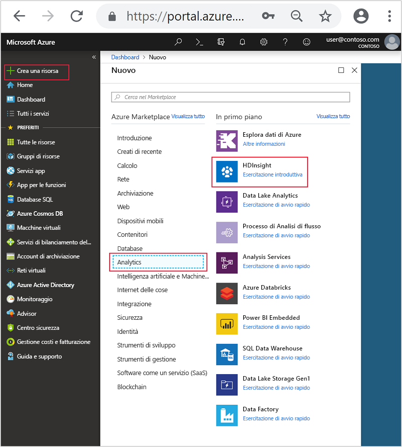
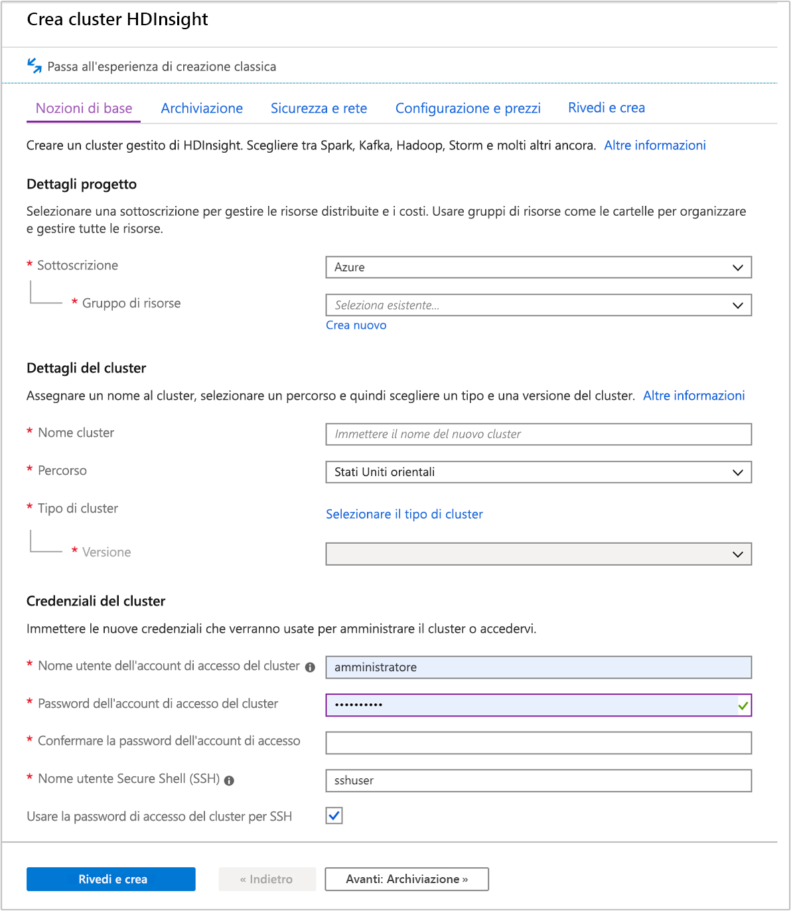
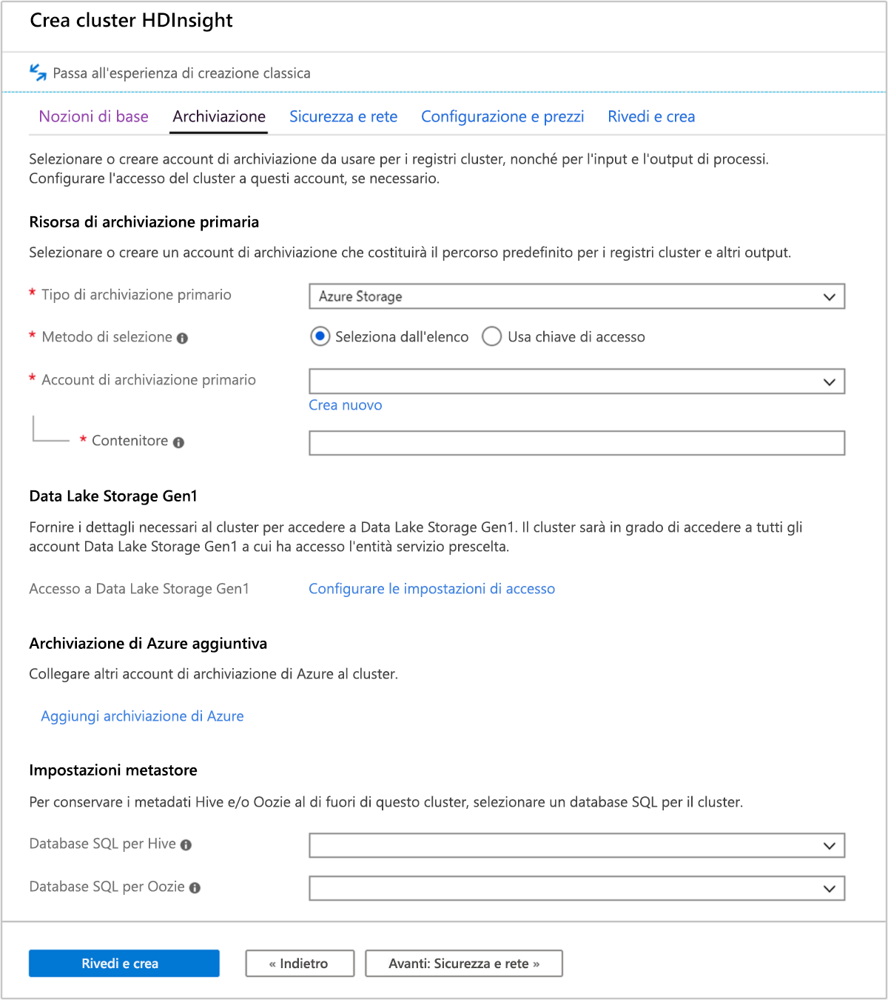
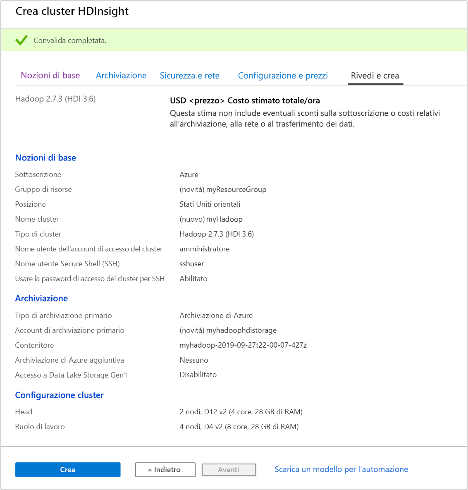
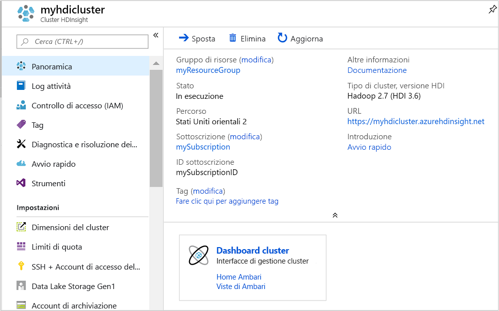
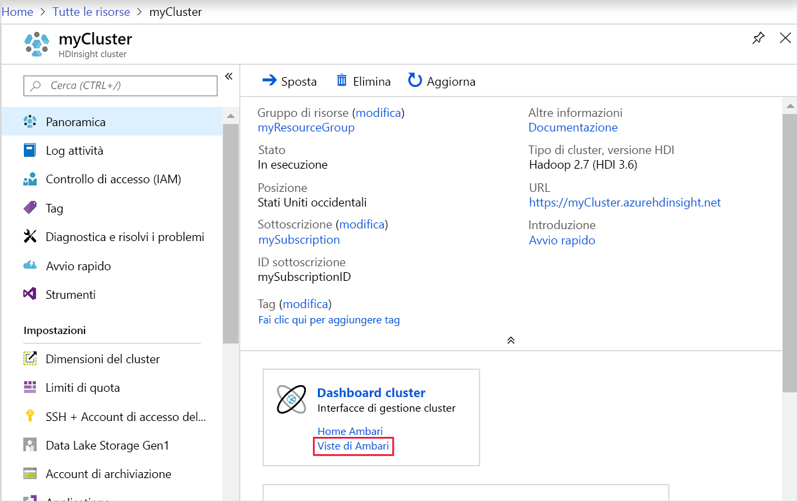
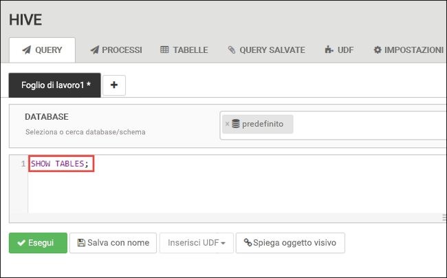
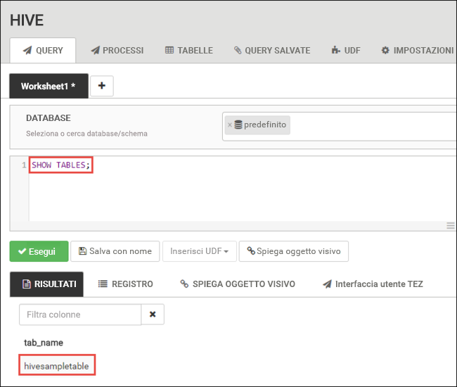
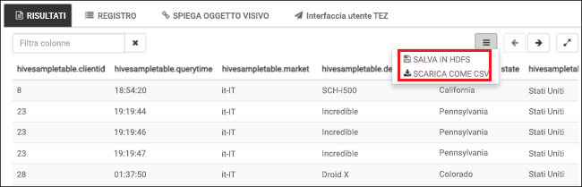
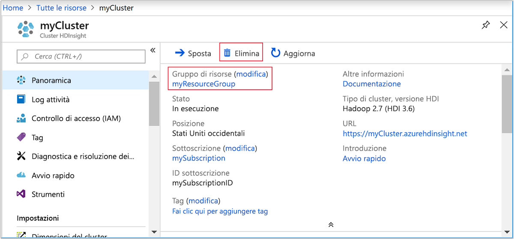

# <a name="quickstart-create-apache-hadoop-cluster-in-azure-hdinsight-using-azure-portal"></a>Guida introduttiva: Creare cluster Apache Hadoop in Azure HDInsight usando il portale di Azure

Questo articolo illustra come creare cluster [Apache Hadoop](https://hadoop.apache.org/) in HDInsight con il portale di Azure e quindi eseguire processi Apache Hive in HDInsight. La maggior parte dei processi Hadoop è costituita da processi batch. Viene creato un cluster, si eseguono alcuni processi e quindi si elimina il cluster. In questo articolo vengono eseguite tutte e tre le attività.

In questa guida di avvio rapido si userà il portale di Azure per creare un cluster Hadoop in HDInsight. È possibile creare un cluster usando il [modello di Azure Resource Manager](apache-hadoop-linux-tutorial-get-started.md).

HDInsight attualmente viene fornito con [sette diversi tipi di cluster](../hdinsight-overview.md#cluster-types-in-hdinsight). Ogni tipo di cluster supporta un set diverso di componenti. Tutti i tipi di cluster supportano Hive. Per un elenco dei componenti supportati in HDInsight, vedere [Novità delle versioni cluster di Apache Hadoop incluse in HDInsight](../hdinsight-component-versioning.md)  

Se non si ha una sottoscrizione di Azure, [creare un account gratuito](https://azure.microsoft.com/free/) prima di iniziare.

## <a name="create-an-apache-hadoop-cluster"></a>Creare un cluster Apache Hadoop

In questa sezione viene creato un cluster Hadoop in HDInsight usando il portale di Azure.

1. Accedere al [Portale di Azure](https://portal.azure.com).

1. Dal portale di Azure passare a **Crea una risorsa** > **Analisi** > **HDInsight**.

    

1. In **Generale** immettere o selezionare i valori seguenti:

    |Proprietà  |DESCRIZIONE  |
    |---------|---------|
    |Subscription    |  Selezionare la sottoscrizione di Azure. |
    |Resource group     | Creare un gruppo di risorse o selezionarne uno esistente.  Un gruppo di risorse è un contenitore di componenti di Azure.  In questo caso, il gruppo di risorse contiene il cluster HDInsight e l'account di Archiviazione di Azure dipendente. |
    |Nome cluster   | Immettere un nome per il cluster Hadoop. Poiché tutti i cluster in HDInsight condividono lo stesso spazio dei nomi DNS, è necessario che questo nome sia univoco. Il nome può includere al massimo 59 caratteri, tra cui lettere, numeri e trattini. Si noti che il primo e l'ultimo carattere del nome non possono essere trattini. |
    |Location    | Selezionare una posizione di Azure in cui si vuole creare il cluster.  Scegliere una località vicina all'utente per ottenere prestazioni migliori. |
    |Tipo di cluster| Scegliere **Selezionare il tipo di cluster**. Quindi selezionare **Hadoop** come tipo di cluster.|
    |Versione|Verrà specificata la versione predefinita per il tipo di cluster. Selezionare dall'elenco a discesa se si vuole specificare una versione diversa.|
    |Nome utente e password di accesso del cluster    | Il nome di accesso predefinito è **admin**. La password deve avere una lunghezza minima di 10 caratteri e deve contenere almeno una cifra, una lettera maiuscola, una lettera minuscola e un carattere non alfanumerico, ad eccezione di ' " ` \). Assicurarsi di **non fornire** password comuni, ad esempio "Pass@word1".|
    |Nome utente Secure Shell (SSH) | Il nome utente predefinito è **sshuser**.  È possibile fornire un altro nome come nome utente SSH. |
    |Usare la password di accesso del cluster per SSH| Selezionare questa casella di controllo se si vuole usare per l'utente SSH la stessa password fornita per l'utente di accesso del cluster.|

    

    Fare clic sul pulsante **Avanti: Archiviazione>>** per passare alle impostazioni di archiviazione.

1. Nella scheda **Archiviazione** specificare i valori seguenti:

    |Proprietà  |DESCRIZIONE  |
    |---------|---------|
    |Tipo di archiviazione primario|Usare il valore predefinito **Archiviazione di Azure**.|
    |Metodo di selezione|Usare il valore predefinito **Selezionare dall'elenco**.|
    |Account di archiviazione primario|Usare l'elenco a discesa per scegliere un account di archiviazione esistente oppure selezionare **Crea nuovo**. Se si crea un nuovo account, il nome deve avere una lunghezza compresa tra 3 e 24 caratteri e può contenere solo numeri e lettere minuscole|
    |Contenitore|Usare il valore inserito automaticamente.|

    

    Selezionare la scheda **Rivedi e crea**.

1. Nella scheda **Rivedi e crea** verificare i valori selezionati nei passaggi precedenti.

    

1. Selezionare **Create** (Crea). La creazione di un cluster richiede circa 20 minuti.

Dopo la creazione del cluster, compare la pagina di panoramica cluster nel portale di Azure.



Ogni cluster ha una dipendenza da un [account di archiviazione di Azure](../hdinsight-hadoop-use-blob-storage.md) o da un [account Azure Data Lake](../hdinsight-hadoop-use-data-lake-store.md). Viene indicato come account di archiviazione predefinito. Il cluster HDInsight e l'account di archiviazione predefinito devono avere un percorso condiviso nella stessa area di Azure. L'eliminazione dei cluster non comporta l'eliminazione dell'account di archiviazione.

> [!NOTE]  
> Per altri metodi di creazione di cluster e per informazioni sulle proprietà usate in questo argomento di avvio rapido, vedere [Creare cluster HDInsight](../hdinsight-hadoop-provision-linux-clusters.md).

## <a name="run-apache-hive-queries"></a>Eseguire query Apache Hive

[Apache Hive](hdinsight-use-hive.md) è il componente più diffuso usato in HDInsight. Esistono diversi modi per eseguire processi Hive in HDInsight. In questo argomento di avvio rapido si usa la visualizzazione Hive di Ambari dal portale. Per altri metodi di esecuzione di processi Hive, vedere [Usare Hive in HDInsight](hdinsight-use-hive.md).

1. Per aprire Ambari, nello screenshot precedente selezionare **Dashboard cluster**.  È anche possibile accedere a `https://ClusterName.azurehdinsight.net`, dove `ClusterName` è il cluster creato nella sezione precedente.

    

2. Immettere il nome utente e la password Hadoop specificati durante la creazione del cluster. Il nome utente predefinito è **admin**.

3. Aprire la **visualizzazione Hive** come illustrato nella schermata seguente:

    

4. Nella scheda **QUERY** incollare le istruzioni HiveQL seguenti nel foglio di lavoro:

    ```sql
    SHOW TABLES;
    ```

    

5. Scegliere **Execute**(Esegui). Viene visualizzata una scheda **RESULTS** (RISULTATI) sotto la scheda **QUERY** e vengono visualizzate informazioni sul processo. 

    Al termine dell'elaborazione della query, nella scheda **QUERY** vengono visualizzati i risultati dell'operazione. Verrà visualizzata una tabella denominata **hivesampletable**. Questa tabella Hive di esempio è disponibile in tutti i cluster HDInsight.

    

6. Ripetere i passaggi 4 e 5 per eseguire questa query:

    ```sql
    SELECT * FROM hivesampletable;
    ```

7. È anche possibile salvare i risultati della query. Selezionare il pulsante del menu a destra e specificare se si vuole scaricare i risultati come file CSV o archiviarli nell'account di archiviazione associato al cluster.

    

Dopo aver completato un processo Hive, è possibile [esportare i risultati in un database SQL di Azure o in un database di SQL Server](apache-hadoop-use-sqoop-mac-linux.md). È anche possibile [visualizzare i risultati in Excel](apache-hadoop-connect-excel-power-query.md). Per altre informazioni sull'uso di Hive in HDInsight, vedere [Usare Apache Hive e HiveQL con Apache Hadoop in HDInsight per analizzare un file Apache log4j di esempio](hdinsight-use-hive.md).

## <a name="clean-up-resources"></a>Pulire le risorse

Al termine dell'argomento di avvio rapido, può essere opportuno eliminare il cluster. Con HDInsight, i dati vengono archiviati in Archiviazione di Azure ed è possibile eliminare tranquillamente un cluster quando non viene usato. Vengono addebitati i costi anche per i cluster HDInsight che non sono in uso. Poiché i costi per il cluster sono decisamente superiori a quelli per l'archiviazione, economicamente ha senso eliminare i cluster quando non vengono usati.

> [!NOTE]  
> Se si procede *subito* con l'articolo successivo per imparare come eseguire le operazioni ETL mediante Hadoop in HDInsight, è possibile mantenere il cluster in esecuzione, poiché nell'esercitazione è necessario creare nuovamente un cluster Hadoop. Se invece non si prevede di passare subito all'articolo successivo, è necessario eliminare il cluster ora.

### <a name="to-delete-the-cluster-andor-the-default-storage-account"></a>Per eliminare il cluster e/o l'account di archiviazione predefinito

1. Tornare alla scheda del browser in cui è visualizzato il portale di Azure. Occorre visualizzare la pagina di panoramica del cluster. Se si vuole solo eliminare il cluster ma conservare l'account di archiviazione predefinito, scegliere **Elimina**.

    

2. Se si intende eliminare il cluster, nonché l'account di archiviazione predefinito, selezionare il nome del gruppo di risorse (evidenziato nello screenshot precedente) per aprire la pagina di gruppo di risorse.

3. Selezionare **Elimina gruppo di risorse** per eliminare il gruppo di risorse che contiene il cluster e l'account di archiviazione predefinito. Si noti che l'eliminazione del gruppo di risorse comporta l'eliminazione dell'account di archiviazione. Se si vuole mantenere l'account di archiviazione, scegliere di eliminare solo il cluster.

## <a name="next-steps"></a>Passaggi successivi

In questo argomento di avvio rapido si è appreso come creare un cluster HDInsight basato su Linux usando un modello di Resource Manager ed eseguire query Hive di base. Passare all'articolo successivo per informazioni su come eseguire un'operazione di estrazione, trasformazione e caricamento (ETL) usando Hadoop in HDInsight.

> [!div class="nextstepaction"]
> [Estrarre, trasformare e caricare dati usando Interactive Query su HDInsight](../interactive-query/interactive-query-tutorial-analyze-flight-data.md)
