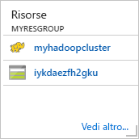
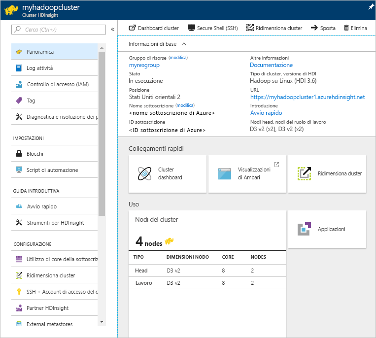

# Esercitazione su Hadoop: Introduzione all'uso di Hadoop in HDInsight

Informazioni su come creare cluster [Hadoop](http://hadoop.apache.org/) in HDInsight e come eseguire processi Hive in HDInsight. [Apache Hive](https://hive.apache.org/) è il componente più diffuso dell'ecosistema Hadoop. HDInsight attualmente viene fornito con [sette diversi tipi di cluster](apache-hadoop-introduction.md#overview). Ogni tipo di cluster supporta un set diverso di componenti. Tutti i tipi di cluster supportano Hive. Per un elenco dei componenti supportati in HDInsight, vedere [Novità delle versioni cluster di Hadoop incluse in HDInsight](../hdinsight-component-versioning.md)  

[!INCLUDE [delete-cluster-warning](../../../includes/hdinsight-delete-cluster-warning.md)]

## Prerequisiti
Prima di iniziare questa esercitazione, è necessario avere:

* **Sottoscrizione di Azure**: per creare un account di valutazione gratuito di un mese, passare ad [azure.microsoft.com/free](https://azure.microsoft.com/free).

## Creare cluster

La maggior parte dei processi Hadoop è costituita da processi batch. Viene creato un cluster, si eseguono alcuni processi e quindi si elimina il cluster. In questa sezione viene creato un cluster Hadoop in HDInsight usando un [modello di Azure Resource Manager](../../azure-resource-manager/resource-group-template-deploy.md). Per questa esercitazione non è necessario conoscere il modello di Resource Manager. Per altri metodi di creazione di cluster e per informazioni sulle proprietà usate in questa esercitazione, vedere [Creare cluster HDInsight](../hdinsight-hadoop-provision-linux-clusters.md). Usare il selettore nella parte superiore della pagina per scegliere le opzioni di creazione del cluster.

Il modello di Resource Manager usato in questa esercitazione è disponibile in [GitHub](https://azure.microsoft.com/resources/templates/101-hdinsight-linux-ssh-password/). 

1. Fare clic sull'immagine seguente per accedere ad Azure e aprire il modello di Resource Manager nel portale di Azure. 
   
    
2. Immettere o selezionare i valori seguenti:
   
    .
   
    * **Sottoscrizione**: selezionare una sottoscrizione di Azure.
    * **Gruppo di risorse**: creare un gruppo di risorse o selezionarne uno esistente.  Un gruppo di risorse è un contenitore di componenti di Azure.  In questo caso, il gruppo di risorse contiene il cluster HDInsight e l'account di Archiviazione di Azure dipendente. 
    * **Località**: selezionare una località di Azure in cui si vuole creare il cluster.  Scegliere una località vicina all'utente per ottenere prestazioni migliori. 
    * **Tipo di cluster**: selezionare **hadoop** per questa esercitazione.
    * **Nome del cluster**: immettere un nome per il cluster Hadoop.
    * **Cluster login name and password**: il nome dell'account di accesso predefinito è **admin**.
    * **SSH username and password**: il nome utente predefinito è **sshuser**.  È possibile rinominarlo. 
     
    Alcune proprietà sono state impostate come hardcoded nel modello.  È possibile configurare questi valori dal modello.

    * **Località**: la località del cluster e l'account di archiviazione dipendente condividono la stessa località del gruppo di risorse.
    * **Versione cluster**: 3.6
    * **Tipo di sistema operativo**: Linux
    * **Numero di nodi del ruolo di lavoro**: 2

     Ogni cluster ha una dipendenza da un [account di archiviazione di Azure](../hdinsight-hadoop-use-blob-storage.md) o da un [account Azure Data Lake](../hdinsight-hadoop-use-data-lake-store.md). Viene indicato come account di archiviazione predefinito. Il cluster HDInsight e l'account di archiviazione predefinito devono avere un percorso condiviso nella stessa area di Azure. L'eliminazione dei cluster non comporta l'eliminazione dell'account di archiviazione. 
     
     Per una spiegazione più approfondita di queste proprietà, vedere l'articolo su come [create cluster Hadoop in HDInsight](../hdinsight-hadoop-provision-linux-clusters.md).

3. Selezionare **Accetto le condizioni riportate sopra** e **Aggiungi al dashboard** e quindi fare clic su **Acquista**. Verrà visualizzato un nuovo riquadro denominato **Distribuzione di Distribuzione modello** nel dashboard del portale. La creazione di un cluster richiede circa 20 minuti. Dopo la creazione del cluster, la didascalia del riquadro viene cambiata nel nome del gruppo di risorse specificato. Il portale apre automaticamente il gruppo di risorse. È possibile visualizzare sia la risorsa di archiviazione predefinita sia il cluster.
   
    .

4. Fare clic sul nome del cluster per aprire il cluster.

   

## Eseguire query Hive
[Apache Hive](hdinsight-use-hive.md) è il componente più diffuso usato in HDInsight. Esistono diversi modi per eseguire processi Hive in HDInsight. In questa esercitazione si usa la visualizzazione Hive di Ambari dal portale. Per altri metodi di esecuzione di processi Hive, vedere [Usare Hive in HDInsight](hdinsight-use-hive.md).

1. Nella schermata precedente fare clic su **Dashboard cluster** e quindi su **Dashboard cluster HDInsight**.  È inoltre possibile passare a **https://&lt;NomeCluster>.azurehdinsight.net**, dove &lt;NomeCluster> è il cluster creato nella sezione precedente per aprire Ambari.
2. Immettere il nome utente e la password Hadoop specificati nella sezione precedente. Il nome utente predefinito è **admin**.
3. Aprire la **visualizzazione Hive** come illustrato nella schermata seguente:
   
    .
4. Nella sezione **Query Editor** (Editor di query) della pagina incollare l'istruzione HiveQL seguente nel foglio di lavoro:
   
        SHOW TABLES;
   
   > [!NOTE]
   > Il punto e virgola è obbligatorio per Hive.       
   > 
   > 
5. Fare clic su **Execute**. Sotto Query Editor (Editor di query) verrà visualizzata la sezione **Query Process Results** (Risultati elaborazione query) con le informazioni sul processo. 
   
    Al termine dell'elaborazione della query, nella sezione **Query Process Results** (Risultati elaborazione query) vengono visualizzati i risultati dell'operazione. Verrà visualizzata una tabella denominata **hivesampletable**. Questa tabella Hive di esempio è disponibile in tutti i cluster HDInsight.
   
    .
6. Ripetere i passaggi 4 e 5 per eseguire questa query:
   
        SELECT * FROM hivesampletable;
   
   > [!TIP]
   > Si noti l'elenco a discesa **Save results** (Salva risultati) in alto a sinistra nella sezione **Query Process Results** (Risultati elaborazione query), che può essere usato per scaricare i risultati o per salvarli in Archiviazione HDInsight come file con estensione CSV.
   > 
   > 
7. Fare clic su **History** per ottenere un elenco dei processi.

Dopo aver completato un processo Hive, è possibile [esportare i risultati in un database SQL di Azure o in un database di SQL Server](apache-hadoop-use-sqoop-mac-linux.md). È anche possibile [visualizzare i risultati in Excel](apache-hadoop-connect-excel-power-query.md). Per altre informazioni sull'uso di Hive in HDInsight, vedere [Usare Hive e HiveQL con Hadoop in HDInsight per analizzare un file Apache log4j di esempio](hdinsight-use-hive.md).

## Eseguire la pulizia dell'esercitazione
Al termine dell'esercitazione, è consigliabile eliminare il cluster. Con HDInsight, i dati vengono archiviati in Archiviazione di Azure ed è possibile eliminare tranquillamente un cluster quando non viene usato. Vengono addebitati i costi anche per i cluster HDInsight che non sono in uso. Poiché i costi per il cluster sono decisamente superiori a quelli per l'archiviazione, economicamente ha senso eliminare i cluster quando non vengono usati. 

> [!NOTE]
> [Azure Data Factory](../hdinsight-hadoop-create-linux-clusters-adf.md) consente di creare cluster HDInsight su richiesta e di configurare un'impostazione TimeToLive per eliminare automaticamente i cluster. 
> 
> 

**Per eliminare il cluster e/o l'account di archiviazione predefinito**

1. Accedere al [portale di Azure](https://portal.azure.com).
2. Dal dashboard del portale fare clic sul riquadro con il nome del gruppo di risorse usato durante la creazione del cluster.
3. Fare clic su **Elimina** per eliminare il gruppo di risorse che include il cluster e l'account di archiviazione predefinito oppure fare clic sul nome del cluster nel riquadro **Risorse**e quindi su **Elimina**. Si noti che l'eliminazione del gruppo di risorse comporta l'eliminazione dell'account di archiviazione. Se si vuole mantenere l'account di archiviazione, scegliere di eliminare solo il cluster.

## Risoluzione dei problemi

Se si verificano problemi di creazione dei cluster HDInsight, vedere i [requisiti dei controlli di accesso](../hdinsight-administer-use-portal-linux.md#create-clusters).

## Passaggi successivi
In questa esercitazione si è appreso come creare un cluster HDInsight basato su Linux usando un modello di Resource Manager ed eseguire query Hive di base.

Per altre informazioni sull'analisi dei dati con HDInsight, vedere gli articoli seguenti:

* Per altre informazioni sull'uso di Hive con HDInsight, incluse le procedure per eseguire query Hive da Visual Studio, vedere [Usare Hive con HDInsight](hdinsight-use-hive.md).
* Per informazioni su Pig, un linguaggio usato per la trasformazione dei dati, vedere [Usare Pig con HDInsight](hdinsight-use-pig.md).
* Per altre informazioni su MapReduce, un framework software che consente di scrivere programmi per l'elaborazione dei dati in Hadoop, vedere [Usare MapReduce con HDInsight](hdinsight-use-mapreduce.md).
* Per altre informazioni sull'uso di HDInsight Tools per Visual Studio per analizzare i dati in HDInsight, vedere [Introduzione all'uso di Hadoop Tools per Visual Studio per HDInsight](apache-hadoop-visual-studio-tools-get-started.md).

Se si è pronti per iniziare a usare i dati, ma sono necessarie altre informazioni sulle modalità di archiviazione dei dati in HDInsight o sulle procedure di importazione dei dati in HDInsight, vedere gli articoli seguenti:

* Per informazioni sul modo in cui HDInsight usa Archiviazione di Azure, vedere [Usare Archiviazione di Azure con HDInsight](../hdinsight-hadoop-use-blob-storage.md).
* Per informazioni su come caricare i dati in HDInsight, vedere [Caricare dati in HDInsight](../hdinsight-upload-data.md).

Per altre informazioni sulla creazione o la gestione di un cluster HDInsight, vedere gli articoli seguenti:

* Per altre informazioni sulla gestione di cluster HDInsight basati su Linux, vedere [Gestire i cluster HDInsight tramite Ambari](../hdinsight-hadoop-manage-ambari.md).
* Per altre informazioni sulle opzioni che è possibile selezionare durante la creazione di un cluster HDInsight, vedere [Creare cluster Hadoop basati su Linux in HDInsight](../hdinsight-hadoop-provision-linux-clusters.md).
* Se si ha familiarità con Linux e Hadoop ma si vogliono informazioni specifiche su Hadoop in HDInsight, vedere [Uso di HDInsight in Linux](../hdinsight-hadoop-linux-information.md). In questo articolo sono disponibili informazioni quali:
  
  * URL per i servizi ospitati nel cluster, ad esempio Ambari e WebHCat
  * Il percorso del file Hadoop e gli esempi nel file system locale
  * L'utilizzo di archiviazione di Azure (WASB) anziché di HDFS come archivio predefinito di dati

[1]: ../HDInsight/apache-hadoop-visual-studio-tools-get-started.md

[hdinsight-provision]: hdinsight-provision-linux-clusters.md
[hdinsight-upload-data]: hdinsight-upload-data.md
[hdinsight-use-hive]: hdinsight-use-hive.md
[hdinsight-use-pig]: hdinsight-use-pig.md

