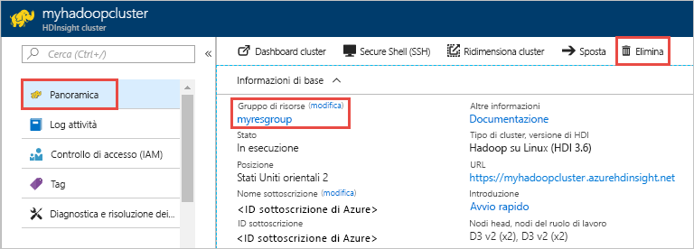

# Guida introduttiva: Creare cluster Apache Hadoop in Azure HDInsight con un modello di Resource Manager

Questo argomento di avvio rapido illustra come creare un cluster Apache Hadoop in Azure HDInsight tramite un modello di Resource Manager.

Modelli simili sono disponibili in [Modelli di avvio rapido di Azure](https://azure.microsoft.com/resources/templates/?resourceType=Microsoft.Hdinsight&pageNumber=1&sort=Popular). Le informazioni di riferimento per il modello sono disponibili [qui](https://docs.microsoft.com/azure/templates/microsoft.hdinsight/allversions).  È anche possibile creare un cluster usando il [portale di Azure](apache-hadoop-linux-create-cluster-get-started-portal.md).  

HDInsight attualmente viene fornito con [sette diversi tipi di cluster](./apache-hadoop-introduction.md#cluster-types-in-hdinsight). Ogni tipo di cluster supporta un set diverso di componenti. Tutti i tipi di cluster supportano Hive. Per un elenco dei componenti supportati in HDInsight, vedere [Novità delle versioni cluster di Hadoop incluse in HDInsight](../hdinsight-component-versioning.md)  

Se non si ha una sottoscrizione di Azure, [creare un account gratuito](https://azure.microsoft.com/free/) prima di iniziare.

## Creare un cluster Hadoop

1. Selezionare il pulsante **Distribuisci in Azure** seguente per accedere ad Azure e aprire il modello di Resource Manager nel portale di Azure.
   
    

2. Immettere o selezionare i valori seguenti:

    |Proprietà  |DESCRIZIONE  |
    |---------|---------|
    |**Sottoscrizione**     |  Selezionare la sottoscrizione di Azure. |
    |**Gruppo di risorse**     | Creare un gruppo di risorse o selezionarne uno esistente.  Un gruppo di risorse è un contenitore di componenti di Azure.  In questo caso, il gruppo di risorse contiene il cluster HDInsight e l'account di Archiviazione di Azure dipendente. |
    |**Posizione**     | Selezionare una posizione di Azure in cui si vuole creare il cluster.  Scegliere una località vicina all'utente per ottenere prestazioni migliori. |
    |**Nome del cluster**     | Immettere un nome per il cluster Hadoop. Poiché tutti i cluster in HDInsight condividono lo stesso spazio dei nomi DNS, è necessario che questo nome sia univoco. Il nome può contenere solo lettere minuscole, numeri e segni meno e deve iniziare con una lettera.  Ogni trattino deve essere preceduto e seguito da un carattere diverso da un trattino.  Il nome deve inoltre avere una lunghezza compresa tra 3 e 59 caratteri. |
    |**Tipo di cluster**     | Selezionare **hadoop**. |
    |**Nome di accesso e password del cluster**     | Il nome di accesso predefinito è **admin**. La password deve avere una lunghezza minima di 10 caratteri e deve contenere almeno una cifra, una lettera maiuscola, una lettera minuscola e un carattere non alfanumerico, ad eccezione di ' " ` \). Assicurarsi di **non fornire** password comuni, ad esempio "Pass@word1".|
    |**Nome utente e password SSH**     | Il nome utente predefinito è **sshuser**.  È possibile rinominare il nome utente SSH.  Per la password utente SSH sono previsti gli stessi requisiti della password di accesso al cluster.|

    Alcune proprietà sono state impostate come hardcoded nel modello.  È possibile configurare questi valori dal modello. Per una spiegazione più approfondita di queste proprietà, vedere [Creare cluster Apache Hadoop in HDInsight](../hdinsight-hadoop-provision-linux-clusters.md).

    > [!NOTE]  
    > I valori immessi devono essere univoci e devono seguire le linee guida sulle convenzioni di denominazione. Il modello non esegue controlli di convalida. Se i valori immessi sono già in uso o non seguono le linee guida, viene visualizzato un errore dopo l'invio del modello.  

    

3. Selezionare **Accetto le condizioni riportate sopra** e quindi **Acquista**. Si riceverà una notifica che indica che la distribuzione è in corso.  La creazione di un cluster richiede circa 20 minuti.

4. Dopo aver creato il cluster, si riceverà una notifica con il messaggio **La distribuzione è riuscita** e un collegamento **Vai al gruppo di risorse**.  Nella pagina **Gruppo di risorse** saranno presenti il nuovo cluster HDInsight e l'archivio predefinito associato al cluster. Ogni cluster ha una dipendenza da un [account di archiviazione di Azure](../hdinsight-hadoop-use-blob-storage.md) o un [account di Azure Data Lake Storage](../hdinsight-hadoop-use-data-lake-store.md). Viene indicato come account di archiviazione predefinito. Il cluster HDInsight e il relativo account di archiviazione predefinito devono avere un percorso condiviso nella stessa area di Azure. L'eliminazione dei cluster non comporta l'eliminazione dell'account di archiviazione.

> [!NOTE]  
> Per altri metodi di creazione di cluster e per informazioni sulle proprietà usate in questo argomento di avvio rapido, vedere [Creare cluster HDInsight](../hdinsight-hadoop-provision-linux-clusters.md).

## Pulire le risorse

Al termine dell'argomento di avvio rapido, può essere opportuno eliminare il cluster. Con HDInsight, i dati vengono archiviati in Archiviazione di Azure ed è possibile eliminare tranquillamente un cluster quando non viene usato. Vengono addebitati i costi anche per i cluster HDInsight che non sono in uso. Poiché i costi per il cluster sono decisamente superiori a quelli per l'archiviazione, economicamente ha senso eliminare i cluster quando non vengono usati.

> [!NOTE]  
> Se si procede *subito* con l'esercitazione successiva per imparare come eseguire le operazioni ETL mediante Hadoop in HDInsight, è possibile mantenere il cluster in esecuzione, poiché nell'esercitazione è necessario creare nuovamente un cluster Hadoop. Se invece non si prevede di passare subito all'esercitazione successiva, è necessario eliminare il cluster ora.

**Per eliminare il cluster e/o l'account di archiviazione predefinito**

1. Tornare alla scheda del browser in cui è visualizzato il portale di Azure. Occorre visualizzare la pagina di panoramica del cluster. Se si vuole solo eliminare il cluster ma conservare l'account di archiviazione predefinito, scegliere **Elimina**.

    

2. Se si intende eliminare il cluster, nonché l'account di archiviazione predefinito, selezionare il nome del gruppo di risorse (evidenziato nello screenshot precedente) per aprire la pagina di gruppo di risorse.

3. Selezionare **Elimina gruppo di risorse** per eliminare il gruppo di risorse che contiene il cluster e l'account di archiviazione predefinito. Si noti che l'eliminazione del gruppo di risorse comporta l'eliminazione dell'account di archiviazione. Se si vuole mantenere l'account di archiviazione, scegliere di eliminare solo il cluster.

## Passaggi successivi

Questo argomento di avvio rapido illustra come creare un cluster Apache Hadoop in HDInsight tramite un modello di Resource Manager. Passare all'articolo successivo per informazioni su come eseguire un'operazione di estrazione, trasformazione e caricamento (ETL) usando Hadoop in HDInsight.

> [!div class="nextstepaction"]
>[Estrarre, trasformare e caricare dati usando Interactive Query su HDInsight](../interactive-query/interactive-query-tutorial-analyze-flight-data.md)