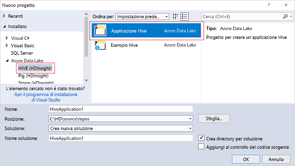

# Connettersi ad Azure HDInsight ed eseguire query Hive usando Strumenti Data Lake per Visual Studio

Informazioni su come usare Strumenti Data Lake per Visual Studio (detti anche Strumenti per Azure Data Lake e analisi di flusso) per connettersi a cluster Hadoop in [Azure HDInsight](../hdinsight-hadoop-introduction.md) e inviare query Hive. Per altre informazioni sull'uso di HDInsight, vedere [Introduzione a HDInsight](../hdinsight-hadoop-introduction.md) e [Introduzione all'uso di HDInsight](apache-hadoop-linux-tutorial-get-started.md). Per altre informazioni sulla connessione a un cluster Storm, vedere [Sviluppo di topologie C# per Apache Storm in HDInsight mediante Visual Studio](../storm/apache-storm-develop-csharp-visual-studio-topology.md).

È possibile usare Data Lake Tools per Visual Studio per accedere sia a Data Lake Analytics che a HDInsight.  Per informazioni su Data Lake Tools, vedere [Esercitazione: Sviluppare script U-SQL con Data Lake Tools per Visual Studio](../../data-lake-analytics/data-lake-analytics-data-lake-tools-get-started.md).

**Prerequisiti**

Per completare questa esercitazione e usare Strumenti Data Lake in Visual Studio, sono necessari gli elementi seguenti:

* Un cluster Azure HDInsight: per crearne uno, vedere [Iniziare a usare Hadoop in Azure HDInsight](apache-hadoop-linux-tutorial-get-started.md). Per informazioni su come eseguire query Apache Hive interattive, è necessario un cluster [Interactive Query in HDInsight](../interactive-query/apache-interactive-query-get-started.md).
* Una workstation con Visual Studio 2013/2015/2017.
    
    > [!NOTE]
    > Attualmente, Data Lake Tools per Visual Studio è disponibile solo con la versione in lingua inglese.
    > 
    > 

## Installare e aggiornare Strumenti Data Lake per Visual Studio

Gli strumenti Data Lake Tools vengono installati per impostazione predefinita per Visual Studio 2017. Nelle versioni precedenti di Visual Studio è possibile installarli usando l'[Installazione guidata piattaforma Web](https://www.microsoft.com/web/downloads/). È necessario scegliere quello che corrisponde alla versione di Visual Studio in uso. Se Visual Studio non è installato, è possibile installare la versione più recente di Visual Studio Community e Azure SDK usando l'[Installazione guidata piattaforma Web](https://www.microsoft.com/web/downloads/):

**Per aggiornare gli strumenti**
1. Aprire Visual Studio.
2. Scegliere **Estensioni e aggiornamenti** dal menu **Strumenti**.
3. Espandere **Aggiornamenti** e aggiornare **Strumenti per Azure Data Lake e analisi di flusso**, se presente.

> [!NOTE]
>
> Solo la versione 2.3.0.0 o successiva supporta la connessione ai cluster Interactive Query e l'esecuzione di query Hive interattive.

## Connettersi alle sottoscrizioni di Azure
Data Lake Tools per Visual Studio consente di connettersi a cluster HDInsight ed eseguire alcune operazioni di gestione di base e query Hive.

> [!NOTE]
> Per informazioni sulla connessione a un cluster Hadoop generico, vedere l'articolo relativo alla [scrittura e all'invio di query Hive con Visual Studio](http://blogs.msdn.com/b/xiaoyong/archive/2015/05/04/how-to-write-and-submit-hive-queries-using-visual-studio.aspx).
> 
> 

**Per connettersi alla sottoscrizione di Azure**

1. Aprire Visual Studio.
2. Scegliere **Esplora server** dal menu **Visualizza** per aprire la finestra Esplora server.
3. Espandere **Azure** e quindi **HDInsight**.
   
   > [!NOTE]
   > Si noti che la finestra **Elenco attività HDInsight** è aperta. Se non viene visualizzata, scegliere **Altre finestre** dal menu **Visualizza** e quindi fare clic su **HDInsight Task List Window** (Finestra elenco attività HDInsight).  
   > 
   > 
4. Immettere le credenziali della sottoscrizione di Azure e fare clic su **Accedi**. L'autenticazione è necessaria solo se non si è mai eseguita la connessione alla sottoscrizione di Azure da Visual Studio sulla workstation.
5. In Esplora server viene visualizzato un elenco di cluster HDInsight esistenti. Se non sono disponibili cluster, è possibile crearne uno usando il portale di Azure, Azure PowerShell o HDInsight SDK. Per altre informazioni, vedere [Creare cluster Hadoop in HDInsight](../hdinsight-hadoop-provision-linux-clusters.md).
   
   
6. Espandere un cluster HDInsight. Vengono visualizzati i **database Hive**, un account di archiviazione predefinito, gli account di archiviazione collegati e il **log del servizio Hadoop**. È possibile espandere ulteriormente le entità.

Dopo la connessione alla sottoscrizione di Azure, sarà possibile eseguire le attività seguenti:

**Per connettersi al portale di Azure da Visual Studio**

* In Esplora server espandere **Azure** > **HDInsight**, fare clic con il pulsante destro del mouse su un cluster HDInsight e quindi scegliere **Manage Cluster in Azure portal** (Gestisci cluster nel portale di Azure).

**Per porre domande e fornire commenti e suggerimenti da Visual Studio**

* Nel menu **Strumenti** scegliere **HDInsight** e quindi fare clic su **Forum MSDN** per porre domande oppure su **Commenti e suggerimenti**.

## Esplorare le risorse collegate
Da Esplora server è possibile visualizzare l'account di archiviazione predefinito e qualsiasi account di archiviazione collegato. Se si espande l'account di archiviazione predefinito, è possibile visualizzare i contenitori presenti. L'account di archiviazione predefinito e il contenitore predefinito sono contrassegnati. Per visualizzare i contenuti, è possibile anche fare clic su uno dei contenitori con il pulsante destro del mouse.

Dopo aver aperto un contenitore, è possibile usare i pulsanti seguenti per caricare, eliminare e scaricare i BLOB:

## Eseguire query Hive interattive
[Apache Hive](http://hive.apache.org) è un'infrastruttura di data warehouse basata su Hadoop che consente di fornire funzionalità di riepilogo, query e analisi di dati. Data Lake Tools per Visual Studio supporta l'esecuzione di query Hive da Visual Studio. Per altre informazioni su Hive, vedere [Usare Hive con HDInsight](hdinsight-use-hive.md).

[Interactive Query](../interactive-query/apache-interactive-query-get-started.md) sfrutta [Hive in LLAP](https://cwiki.apache.org/confluence/display/Hive/LLAP) in Apache Hive 2.1 e garantisce l'interattività alle query di stile del data warehouse complesse sui set di dati di grandi dimensioni archiviati. L'esecuzione di query Hive in Interactive Query è molto più veloce rispetto ai tradizionali processi batch Hive.  Per altre informazioni sull'esecuzione di processi batch Hive, vedere [Eseguire processi batch Hive](#run-hive-batch-jobs).

> [!note]
>
> L'esecuzione di query Hive interattive è supportata solo quando ci si connette a un cluster [Interactive Query in HDInsight](../interactive-query/apache-interactive-query-get-started.md).

Data Lake Tools per Visual Studio consente inoltre agli utenti di visualizzare i contenuti del processo Hive raccogliendo ed esponendo i log YARN di alcuni processi Hive.

### Visualizzare **hivesampletable**
I cluster HDInsight includono una tabella Hive di esempio denominata *hivesampletable*. Questa tabella Hive viene usata per mostrare come elencare tabelle Hive, visualizzare gli schemi di tabella ed elencare le righe nella tabella Hive.

**Per elencare tabelle Hive e visualizzare lo schema di tabella Hive**

1. In **Esplora server** espandere **Azure** > **HDInsight** > cluster desiderato > **Hive Databases** (Database Hive) > **default** (predefinito) > **hivesampletable** per visualizzare lo schema della tabella.
2. Fare clic con il pulsante destro del mouse su **hivesampletable** e quindi scegliere **Visualizza prime 100 righe** per elencare le righe. Questa operazione equivale ad eseguire la seguente query Hive mediante il driver ODBC di Hive:
   
     SELECT * FROM hivesampletable LIMIT 100
   
   È possibile personalizzare il numero delle righe.
   
   

### Creare tabelle Hive
Per creare una tabella Hive è possibile usare l'interfaccia utente grafica o query Hive. Per informazioni sull'uso di query Hive, vedere [Eseguire query Hive](#run.queries).

**Per creare una tabella Hive**

1. In **Esplora server** espandere **Azure** > **Cluster HDInsight** > un cluster HDInsight > **Hive Databases** (Database Hive) e quindi fare clic con il pulsante destro del mouse su **default** (predefinito) e scegliere **Crea tabella**.
2. Configurare la tabella.
3. Fare clic su **Crea tabella** per inviare il processo per creare la nuova tabella Hive.
   
    

### Convalidare ed eseguire query Hive
Esistono due modi per creare ed eseguire query Hive:

* Creare query ad hoc
* Creare un'applicazione Hive

**Per creare, convalidare ed eseguire query ad hoc**

1. In **Esplora server** espandere **Azure** e quindi **Cluster HDInsight**.
2. Fare clic con il pulsante destro del mouse sul cluster in cui si desidera eseguire la query, quindi scegliere **Scrivi una query Hive**.
3. Immettere le query Hive. Si noti che l'editor Hive supporta IntelliSense. Data Lake Tools per Visual Studio supporta il caricamento di metadati remoti durante la modifica dello script Hive. Ad esempio, quando si digita "SELECT * FROM", IntelliSense elenca tutti i nomi di tabella suggeriti. Quando si specifica un nome di tabella, i nomi delle colonne sono elencati da IntelliSense. Gli strumenti supportano quasi tutte le funzioni definite dall'utente predefinite, le sottoquery e le istruzioni DML Hive.
   
    
   
    
   
   > [!NOTE]
   > Vengono elencati solo i metadati del cluster selezionato nella barra degli strumenti HDInsight.
   > 
   > 
4. (Facoltativo) Fare clic su **Convalida script** per verificare la presenza di eventuali errori di sintassi nello script.
   
    
5. Fare clic su **Submit** (Invio) o **Submit (Advanced)** (Invio - Avanzato). L'opzione di invio avanzato consente di configurare le impostazioni per **Nome processo**, **Argomenti**, **Configurazioni aggiuntive** e **Directory di stato** per lo script:
   
    
   
    Dopo l'invio, è possibile visualizzare una finestra di **riepilogo del processo Hive** .
   
    
6. Usare il pulsante **Refresh** (Aggiorna) per aggiornare lo stato del processo finché non risulta **Completed** (Completato).
7. Fare clic sui collegamenti in basso per visualizzare **Query processo**, **Output del processo**, **Log del processo** o **Log Yarn**.

**Per creare ed eseguire una soluzione Hive**

1. Scegliere **Nuovo** dal menu **File** e quindi fare clic su **Progetto**.
2. Selezionare **HDInsight** nel riquadro sinistro e **Hive Application** (Applicazione Hive) nel riquadro centrale, immettere le proprietà e quindi fare clic su **OK**.
   
    
3. In **Esplora soluzioni** fare doppio clic su **Script.hql** per aprirlo.
4. Per convalidare lo script Hive, è possibile fare clic sul pulsante **Validate Script** (Convalida script) oppure fare clic con il pulsante destro del mouse sullo script nell'editor di Hive e quindi scegliere **Validate Script** (Convalida script) dal menu di scelta rapida.

### Visualizzare processi Hive
È possibile visualizzare query di processo, output di processo, log di processo e log Yarn per i processi Hive. Per altre informazioni, vedere la schermata precedente.

La versione più recente degli strumenti consente di visualizzare i contenuti dei processi Hive raccogliendo ed esponendo i log YARN. Un log YARN consente di analizzare eventuali problemi di prestazioni. Per altre informazioni su come HDInsight raccoglie i log YARN, vedere [Accedere ai log dell'applicazione HDInsight a livello di codice](../hdinsight-hadoop-access-yarn-app-logs.md).

**Per visualizzare processi Hive**

1. In **Esplora server** espandere **Azure** e quindi **HDInsight**.
2. Fare clic con il pulsante destro del mouse su un cluster HDInsight, quindi scegliere **Visualizza processi**. Viene visualizzato l'elenco di processi Hive eseguiti nel cluster.
3. Fare clic su un processo incluso nell'elenco dei processi per selezionarlo e quindi usare la finestra **Hive Job Summary** (Riepilogo processo Hive) per aprire **Job Query** (Query processo), **Job Output** (Output processo), **Job Log** (Log processo) o **Yarn log** (Log YARN).
   
    

### Esecuzione di processi Hive più veloce tramite HiveServer2
> [!NOTE]
> Questa funzionalità è disponibile solo per i cluster HDInsight versione 3.2 e successive.
> 
> 

In precedenza, i processi Hive venivano inviati da Data Lake Tools tramite [WebHCat](https://cwiki.apache.org/confluence/display/Hive/WebHCat), noto anche come Templeton. Per restituire i dettagli del processo e le informazioni sugli errori occorreva molto tempo.
Per risolvere questo problema di prestazioni, Data Lake Tools esegue i processi Hive direttamente nel cluster tramite HiveServer2, ignorando così i protocolli RDP/SSH.
Oltre a ottenere prestazioni migliori, gli utenti possono visualizzare Hive in grafici Tez e i dettagli dell'attività.

Per cluster HDInsight versione 3.2 o successiva, è disponibile un pulsante **Execute via HiveServer2** (Esegui tramite HiveServer2):

È anche possibile visualizzare i log in streaming in tempo reale e i grafici del processo, se si esegue la query Hive in Tez.

**Differenza tra l'esecuzione di query tramite HiveServer2 e l'invio di query tramite WebHCat**

L'esecuzione di query tramite HiveServer2 presenta numerosi vantaggi in termini di prestazioni, ma anche diverse limitazioni. Alcune delle limitazioni non sono adatte all'utilizzo per scopi di produzione. La tabella seguente illustra le differenze:

|  | Esecuzione tramite HiveServer2 | Invio tramite WebHCat |
| --- | --- | --- |
| Eseguire query |Elimina il sovraccarico in WebHCat, che avvia un processo MapReduce denominato "TempletonControllerJob". |Se la query viene eseguita tramite WebHCat, WebHCat avvia un processo MapReduce con il quale viene introdotta latenza aggiuntiva. |
| Trasmettere log |In tempo quasi reale. |I log di esecuzione del processo sono disponibili solo al termine del processo. |
| Visualizzare la cronologia processo |Se una query viene eseguita tramite HiveServer2, la relativa cronologia processo (log del processo e output del processo) non viene mantenuta. L'applicazione può essere visualizzata nell'interfaccia utente di YARN con informazioni limitate. |Se una query viene eseguita tramite WebHCat, la relativa cronologia processo (il log del processo, l'output del processo) viene mantenuta e può essere visualizzata tramite Visual Studio, HDInsight SDK o PowerShell. |
| Chiudere la finestra |L'esecuzione tramite HiveServer2 è "sincrona", di conseguenza è necessario mantenere le finestre aperte. Se le finestre vengono chiuse, l'esecuzione della query viene annullata. |L'invio tramite WebHCat è "asincrono", pertanto è possibile inviare la query tramite WebHCat e chiudere Visual Studio. È possibile tornare in questa pagina e visualizzare i risultati in qualsiasi momento. |

### Grafico delle prestazioni del processo Hive Tez
Data Lake Tools supporta la visualizzazione di grafici delle prestazioni per i processi Hive eseguiti dal motore di esecuzione Tez. Per informazioni su come abilitare Tez, vedere l'articolo relativo all'[uso di Hive in HDInsight](hdinsight-use-hive.md). Dopo avere inviato un processo Hive in Visual Studio, Visual Studio mostra il grafico al termine del processo.  Per ottenere l'ultimo stato del processo, potrebbe essere necessario fare clic sul pulsante **Aggiorna** .

> [!NOTE]
> Questa funzionalità è disponibile solo per le versioni del cluster HDInsight successive alla 3.2.4.593 e funzionano solo per i processi completati, se il processo è stato inviato tramite WebHCat. Questo grafico viene visualizzato quando si esegue la query tramite HiveServer2. 
> 
> 

Per comprendere meglio la query Hive, in questa versione è stata aggiunta la visualizzazione degli operatori Hive. Per visualizzare tutti gli operatori all'interno di un vertice, è sufficiente fare doppio clic sui vertici del grafico del processo. Per visualizzare altri dettagli di un operatore specifico, passare il puntatore sull'operatore.

### Visualizzazione dell'esecuzione dell'attività per i processi Hive in Tez
È possibile usare la visualizzazione dell'esecuzione dell'attività per i processi Hive in Tez per ottenere informazioni strutturate e visive per i processi Hive e per visualizzare informazioni dettagliate sul processo. Quando si verificano problemi di prestazioni, questa visualizzazione consente di ottenere altri dettagli, ad esempio il funzionamento di ogni attività e le relative informazioni dettagliate (lettura-scrittura dei dati, ora di inizio/fine della pianificazione e così via), per poter regolare le configurazioni del processo o l'architettura del sistema in base alle informazioni visualizzate.

## Eseguire processi batch Hive
[Apache Hive](http://hive.apache.org) è un'infrastruttura di data warehouse basata su Hadoop che consente di fornire funzionalità di riepilogo, query e analisi di dati. Data Lake Tools per Visual Studio supporta l'esecuzione di query Hive da Visual Studio. Per altre informazioni su Hive, vedere [Usare Hive con HDInsight](hdinsight-use-hive.md).

Fatta eccezione per il cluster Interactive Query, testare script Hive in un cluster HDInsight è un'operazione che può richiedere molto tempo, ad esempio alcuni minuti. Data Lake Tools per Visual Studio consente di eseguire la convalida dello script Hive in locale senza connettersi a un cluster attivo. Per altre informazioni sull'esecuzione delle query interattive, vedere [Eseguire query Hive interattive](#run-interactive-hive-queries).

Data Lake Tools per Visual Studio consente inoltre agli utenti di visualizzare i contenuti del processo Hive raccogliendo ed esponendo i log YARN di alcuni processi Hive.

Per altre informazioni su come eseguire i processi batch Hive, vedere la sezione [Eseguire query Hive interattive](#run-interactive-hive-queries). Le informazioni di questa sezione si applicano all'esecuzione di processi batch Hive che richiedono più tempo.

## Eseguire script Pig
Data Lake Tools per Visual Studio supporta la creazione di script Pig e il relativo invio a cluster HDInsight. Gli utenti possono creare un progetto Pig dal modello e quindi inviare lo script ai cluster HDInsight.

## Commenti e suggerimenti e problemi noti
* Attualmente i risultati di HiveServer2 vengono visualizzati in modalità solo testo, che non è ideale. Microsoft sta lavorando alla correzione del problema.
* Se i risultati iniziano con valori NULL, non vengono visualizzati. Poiché questo problema è stato risolto, nel caso blocchi l'attività contattare il team di supporto.
* Lo script HQL creato da Visual Studio viene codificato a seconda dell'impostazione dell'area locale dell'utente. È possibile che lo script non venga eseguito correttamente se l'utente lo carica nel cluster come binario.

## Passaggi successivi
In questo articolo è stato illustrato come connettersi a cluster HDInsight da Visual Studio, usando il pacchetto Data Lake Tools (HDInsight), e come eseguire una query Hive. Per altre informazioni, vedere:

* [Usare Hive di Hadoop in HDInsight](hdinsight-use-hive.md)
* [Introduzione all'uso di Hadoop in HDInsight](apache-hadoop-linux-tutorial-get-started.md)
* [Inviare processi Hadoop in HDInsight](submit-apache-hadoop-jobs-programmatically.md)
* [Analizzare i dati di Twitter con Hadoop in HDInsight](../hdinsight-analyze-twitter-data.md)

