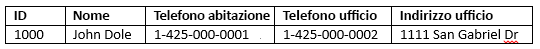
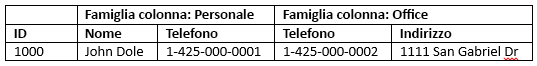

# <a name="quickstart-query-apache-hbase-in-azure-hdinsight-with-hbase-shell"></a>Guida introduttiva: Eseguire query Apache HBase in Azure HDInsight con la shell di HBase

In questo argomento di avvio rapido si apprenderà come usare la shell di Apache HBase per creare una tabella HBase, inserire dati e quindi eseguire query sulla tabella.

Se non si ha una sottoscrizione di Azure, creare un [account gratuito](https://azure.microsoft.com/free/?WT.mc_id=A261C142F) prima di iniziare.

## <a name="prerequisites"></a>Prerequisiti

* Un cluster Apache HBase. Per creare un cluster HDInsight, vedere [Creare un cluster](../hadoop/apache-hadoop-linux-tutorial-get-started.md#create-cluster).  Assicurarsi di scegliere il tipo di cluster **HBase**.

* Un client SSH. Per altre informazioni, vedere [Connettersi a HDInsight (Apache Hadoop) con SSH](../hdinsight-hadoop-linux-use-ssh-unix.md).

## <a name="create-a-table-and-manipulate-data"></a>Creare una tabella e manipolare i dati

Per la maggior parte delle persone, i dati vengono visualizzati in formato tabulare:



In HBase, che rappresenta un'implementazione di [Cloud BigTable](https://cloud.google.com/bigtable/), gli stessi dati sono simili a:



È possibile usare SSH per connettersi ai cluster HBase e quindi usare la shell di Apache HBase per creare tabelle HBase, inserire dati ed eseguire query sui dati.

1. Usare il comando `ssh` per connettersi al cluster HBase. Modificare il comando seguente sostituendo `CLUSTERNAME` con il nome del cluster in uso e quindi immettere il comando:

    ```cmd
    ssh sshuser@CLUSTERNAME-ssh.azurehdinsight.net
    ```

2. Usare il comando `hbase shell` per avviare la shell interattiva di HBase. Immettere il comando seguente nella connessione SSH:

    ```bash
    hbase shell
    ```

3. Usare il comando `create` per creare una tabella HBase con famiglie a due colonne. Immettere il comando seguente:

    ```hbase
    create 'Contacts', 'Personal', 'Office'
    ```

4. Usare il comando `list` per elencare tutte le tabelle in HBase. Immettere il comando seguente:

    ```hbase
    list
    ```

5. Usare il comando `put` per inserire i valori per una determinata colonna in una determinata riga di una determinata tabella. Immettere il comando seguente:

    ```hbase
    put 'Contacts', '1000', 'Personal:Name', 'John Dole'
    put 'Contacts', '1000', 'Personal:Phone', '1-425-000-0001'
    put 'Contacts', '1000', 'Office:Phone', '1-425-000-0002'
    put 'Contacts', '1000', 'Office:Address', '1111 San Gabriel Dr.'
    ```

6. Usare il comando `scan` per analizzare e restituire i dati della tabella `Contacts`. Immettere il comando seguente:

    ```hbase
    scan 'Contacts'
    ```

7. Usare il comando `get` per recuperare il contenuto di una riga. Immettere il comando seguente:

    ```hbase
    get 'Contacts', '1000'
    ```

    Verranno visualizzati risultati simili a quelli che si ottengono usando il comando `scan` perché esiste solo una riga.

8. Usare il comando `delete` per eliminare il valore di una cella in una tabella. Immettere il comando seguente:

    ```hbase
    delete 'Contacts', '1000', 'Office:Address'
    ```

9. Usare il comando `disable` per disabilitare la tabella. Immettere il comando seguente:

    ```hbase
    disable 'Contacts'
    ```

10. Usare il comando `drop` per eliminare una tabella da HBase. Immettere il comando seguente:

    ```hbase
    drop 'Contacts'
    ```

11. Usare il comando `exit` per interrompere la shell interattiva di HBase. Immettere il comando seguente:

    ```hbase
    exit
    ```

Per altre informazioni sullo schema di tabella HBase, vedere [Introduzione alla progettazione dello schema Apache HBase](http://0b4af6cdc2f0c5998459-c0245c5c937c5dedcca3f1764ecc9b2f.r43.cf2.rackcdn.com/9353-login1210_khurana.pdf). Per altri comandi HBase, vedere [Apache HBase Reference Guide](https://hbase.apache.org/book.html#quickstart) (Guida di riferimento di Apache HBase).

## <a name="clean-up-resources"></a>Pulire le risorse

Al termine dell'argomento di avvio rapido, può essere opportuno eliminare il cluster. Con HDInsight, i dati vengono archiviati in Archiviazione di Azure ed è possibile eliminare tranquillamente un cluster quando non viene usato. Vengono addebitati i costi anche per i cluster HDInsight che non sono in uso. Poiché i costi per il cluster sono decisamente superiori a quelli per l'archiviazione, economicamente ha senso eliminare i cluster quando non vengono usati.

Per eliminare un cluster, vedere [Eliminare un cluster HDInsight tramite browser, PowerShell o l'interfaccia della riga di comando di Azure](../hdinsight-delete-cluster.md).

## <a name="next-steps"></a>Passaggi successivi

In questo argomento di avvio rapido si è appreso come usare la shell di Apache HBase per creare una tabella HBase, inserire dati e quindi eseguire query sulla tabella. Per altre informazioni sui dati archiviati in HBase, vedere l'articolo successivo che illustrerà come eseguire query con Apache Spark.

> [!div class="nextstepaction"]
> [Usare Apache Spark per leggere e scrivere dati Apache HBase](../hdinsight-using-spark-query-hbase.md)