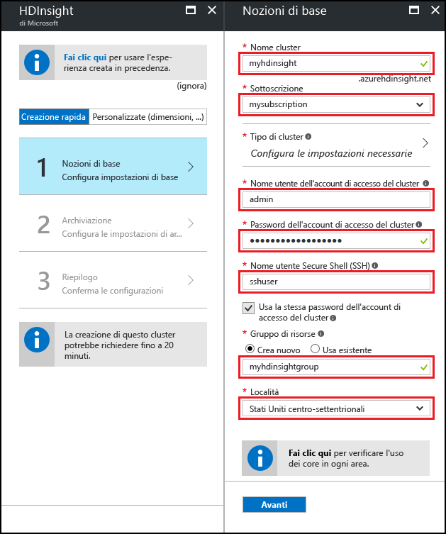
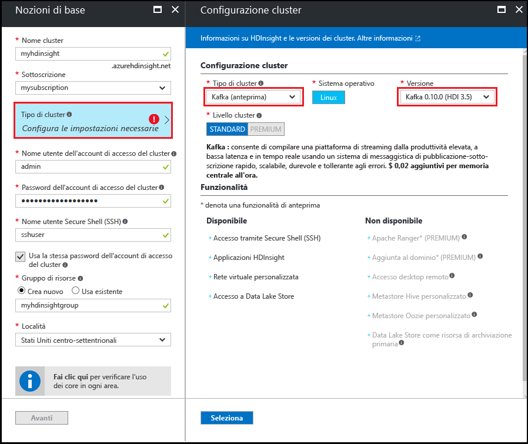
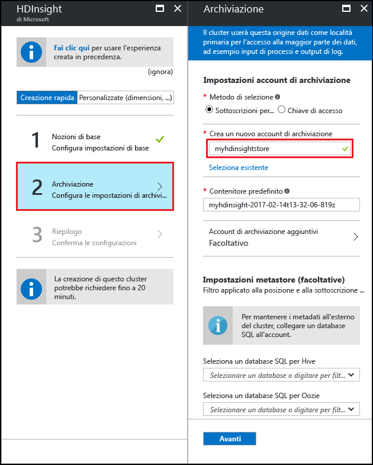
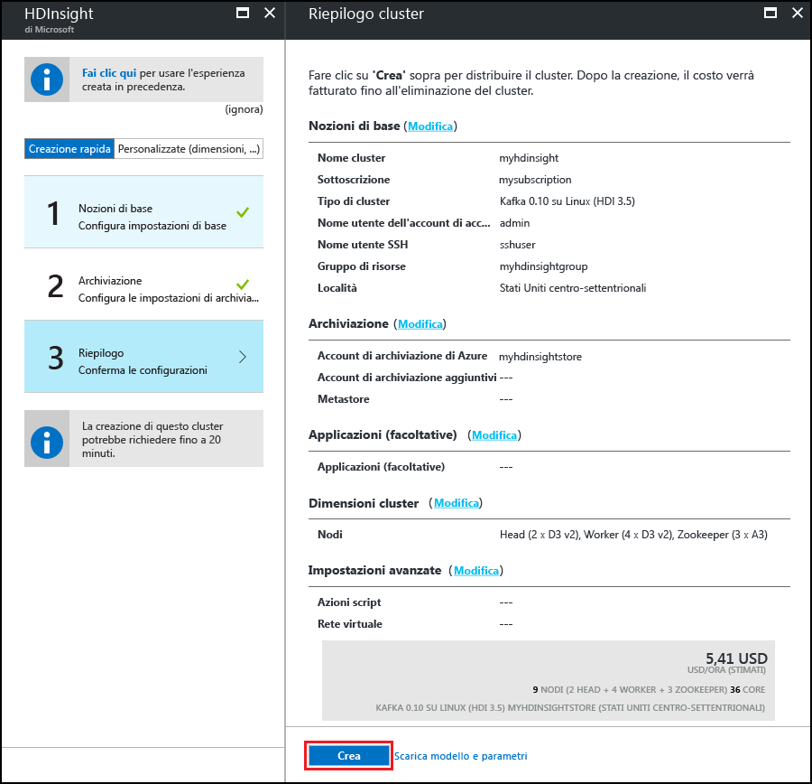

# Iniziare a usare Apache Kafka (anteprima) in HDInsight
<a id="start-with-apache-kafka-preview-on-hdinsight" class="xliff"></a>

Questo articolo illustra come creare e usare un cluster [Apache Kafka](https://kafka.apache.org) in Azure HDInsight. Kafka è una piattaforma di streaming distribuita open source disponibile con HDInsight. Viene spesso usata come broker di messaggi perché mette a disposizione funzionalità simili a una coda messaggi di pubblicazione/sottoscrizione.

> [!NOTE]
> Sono attualmente disponibili due versioni di Kafka con HDInsight; 0.9.0 (HDInsight 3.4) e 0.10.0 (HDInsight 3.5). I passaggi in questo documento presuppongono che si usi Kafka in HDInsight 3.5.

[!INCLUDE [delete-cluster-warning](../../includes/hdinsight-delete-cluster-warning.md)]

## Prerequisiti
<a id="prerequisites" class="xliff"></a>

* [Java JDK 8](http://www.oracle.com/technetwork/java/javase/downloads/index.html) o equivalente, ad esempio OpenJDK.

* [Apache Maven](http://maven.apache.org/) 

## Creare un cluster Kafka
<a id="create-a-kafka-cluster" class="xliff"></a>

Per creare un cluster Kafka in HDInsight seguire questa procedura:

1. Nel [portale di Azure](https://portal.azure.com) fare clic su **+ Nuovo**, **Intelligence e analisi** e quindi selezionare **HDInsight**.
   
    

2. Nel pannello **Informazioni di base** immettere le informazioni seguenti:

    * **Nome del cluster**: nome del cluster HDInsight.
    * **Sottoscrizione**: selezionare la sottoscrizione da usare.
    * **Nome utente dell'account di accesso del cluster** e **Password dell'account di accesso del cluster**: account di accesso usato per il cluster su HTTPS. Queste credenziali vengono usate per accedere a servizi quali l'interfaccia utente Web di Ambari o l'API REST.
    * **Secure Shell (SSH) username** (Nome utente SSH): account di accesso usato per il cluster su SSH. Per impostazione predefinita, la password corrisponde alla password di accesso al cluster.
    * **Gruppo di risorse**: il gruppo di risorse nel quale viene creato il cluster.
    * **Posizione**: area di Azure in cui creare il cluster.
   
    

3. Selezionare **Tipo di cluster**, quindi impostare i valori seguenti nel pannello **Configurazione cluster**:
   
    * **Tipo di cluster**: Kafka

    * **Versione**: Kafka 0.10.0 (HDI 3.5)

    * **Livello cluster**: Standard
     
    Usare infine il pulsante **Seleziona** per salvare le impostazioni.
     
    

4. Dopo avere selezionato il tipo di cluster, usare il pulsante __Seleziona__ per impostare il tipo di cluster. Usare quindi il pulsante __Avanti__ per completare la configurazione di base.

5. Nel pannello **Archiviazione** selezionare o creare un account di archiviazione. Per la procedura illustrata in questo documento, non modificare i valori predefiniti degli altri campi nel pannello. Usare il pulsante __Avanti__ per salvare la configurazione della risorsa di archiviazione.

    

6. Nel pannello __Applicazioni (facoltativo)__ selezionare __Avanti__ per continuare. Non sono richieste applicazioni per questo esempio.

7. Nel pannello __Dimensioni del cluster__ selezionare __Avanti__ per continuare.

    > [!WARNING]
    > Per garantire la disponibilità di Kafka in HDInsight, il cluster deve contenere almeno tre nodi del ruolo di lavoro.

    

    > [!NOTE]
    > La voce relativa ai dischi per nodo del ruolo di lavoro consente di controllare la scalabilità di Kafka in HDInsight. Per altre informazioni, vedere [Configurare l'archiviazione e la scalabilità per Apache Kafka in HDInsight](hdinsight-apache-kafka-scalability.md).

8. Nel pannello __Impostazioni avanzate__ selezionare __Avanti__ per continuare.

9. Nel pannello **Riepilogo** esaminare la configurazione per il cluster. Usare i collegamenti __Modifica__ per cambiare eventuali impostazioni non corrette. Usare infine il pulsante __Crea__ per creare il cluster.
   
    
   
    > [!NOTE]
    > La creazione del cluster può richiedere fino a 20 minuti.

## Connettersi al cluster
<a id="connect-to-the-cluster" class="xliff"></a>

Dal client usare SSH per connettersi al cluster:

```ssh SSHUSER@CLUSTERNAME-ssh.azurehdinsight.net```

Sostituire **SSHUSER** con il nome utente SSH specificato durante la creazione del cluster. Sostituire **CLUSTERNAME** con il nome del cluster.

Quando richiesto, immettere la password usata per l'account SSH.

Per altre informazioni, vedere [Usare SSH con HDInsight](hdinsight-hadoop-linux-use-ssh-unix.md).

## <a id="getkafkainfo"></a>Ottenere le informazioni sugli host Zookeeper e broker

Quando si usa Kafka è necessario conoscere due valori di host, ovvero *Zookeeper* e *broker*. Questi host vengono usati con l'API Kafka e molte delle utilità offerte con Kafka.

Seguire questa procedura per creare le variabili di ambiente che contengono le informazioni sugli host. Queste variabili di ambiente vengono usate nei passaggi di questo documento.

1. Da una connessione SSH al cluster usare questo comando per installare l'utilità `jq`. Questa utilità consente di analizzare documenti JSON e risulta utile nel recupero delle informazioni sugli host broker:
   
    ```bash
    sudo apt -y install jq
    ```

2. usare i comandi seguenti per impostare le variabili di ambiente con le informazioni recuperate da Ambari. Sostituire __CLUSTERNAME__ con il nome del cluster Kafka. Sostituire __PASSWORD__ con la password di accesso (amministratore) usata durante la creazione del cluster.

    ```bash
    export KAFKAZKHOSTS=`curl --silent -u admin:'PASSWORD' -G https://CLUSTERNAME.azurehdinsight.net/api/v1/clusters/CLUSTERNAME/services/ZOOKEEPER/components/ZOOKEEPER_SERVER | jq -r '["\(.host_components[].HostRoles.host_name):2181"] | join(",")'`

    export KAFKABROKERS=`curl --silent -u admin:'PASSWORD' -G https://CLUSTERNAME.azurehdinsight.net/api/v1/clusters/CLUSTERNAME/services/KAFKA/components/KAFKA_BROKER | jq -r '["\(.host_components[].HostRoles.host_name):9092"] | join(",")'`

    echo '$KAFKAZKHOSTS='$KAFKAZKHOSTS
    echo '$KAFKABROKERS='$KAFKABROKERS
    ```

    Il testo seguente è un esempio del contenuto di `$KAFKAZKHOSTS`:
   
    `zk0-kafka.eahjefxxp1netdbyklgqj5y1ud.ex.internal.cloudapp.net:2181,zk2-kafka.eahjefxxp1netdbyklgqj5y1ud.ex.internal.cloudapp.net:2181,zk3-kafka.eahjefxxp1netdbyklgqj5y1ud.ex.internal.cloudapp.net:2181`
   
    Il testo seguente è un esempio del contenuto di `$KAFKABROKERS`:
   
    `wn1-kafka.eahjefxxp1netdbyklgqj5y1ud.cx.internal.cloudapp.net:9092,wn0-kafka.eahjefxxp1netdbyklgqj5y1ud.cx.internal.cloudapp.net:9092`
   
    > [!WARNING]
    > Le informazioni restituite da questa sessione non sono sempre precise. Se si ridimensiona il cluster, verranno aggiunti o rimossi broker. Se si verifica un errore e viene sostituito un nodo, il nome host per il nodo può cambiare.
    >
    > È necessario recuperare le informazioni sugli host Zookeeper e broker poco prima di usarle, per assicurare che siano valide.

## Creare un argomento
<a id="create-a-topic" class="xliff"></a>

Kafka archivia i flussi di dati in categorie denominate *argomenti*. Da una connessione SSH a un nodo head del cluster, usare uno script fornito con Kafka per creare un argomento:

```bash
/usr/hdp/current/kafka-broker/bin/kafka-topics.sh --create --replication-factor 3 --partitions 8 --topic test --zookeeper $KAFKAZKHOSTS
```

Questo comando si connette a Zookeeper usando le informazioni sull'host archiviate in `$KAFKAZKHOSTS` e quindi crea un argomento Kafka denominato **test**. Per verificare che l'argomento sia stato creato è possibile usare lo script seguente per elencare gli argomenti:

```bash
/usr/hdp/current/kafka-broker/bin/kafka-topics.sh --list --zookeeper $KAFKAZKHOSTS
```

L'output di questo comando elenca gli argomenti Kafka, incluso l'argomento **test**.

## Produrre e utilizzare record
<a id="produce-and-consume-records" class="xliff"></a>

Kafka archivia i *record* negli argomenti. I record vengono prodotti da *producer* e usati da *consumer*. I producer recuperano i record da *broker* di Kafka. Ogni nodo del ruolo di lavoro nel cluster HDInsight è un broker Kafka.

Seguire questa procedura per archiviare i record nell'argomento test creato in precedenza e quindi leggerli usando un consumer:

1. Dalla sessione SSH, usare uno script fornito con Kafka per scrivere record nell'argomento:
   
    ```bash
    /usr/hdp/current/kafka-broker/bin/kafka-console-producer.sh --broker-list $KAFKABROKERS --topic test
    ```
   
    Non si torna al prompt dopo questo comando. Digitare invece alcuni messaggi di testo e quindi usare **Ctrl + C** per arrestare l'invio all'argomento. Ogni riga viene inviata come record distinto.

2. Usare uno script fornito con Kafka per leggere record dall'argomento:
   
    ```bash
    /usr/hdp/current/kafka-broker/bin/kafka-console-consumer.sh --bootstrap-server $KAFKABROKERS --topic test --from-beginning
    ```
   
    Questo comando recupera i record dall'argomento e li visualizza. L'uso di `--from-beginning` indica al consumer di partire dall'inizio del flusso, quindi verranno recuperati tutti i record.

3. Usare __Ctrl + C__ per arrestare il consumer.

## API per producer e consumer
<a id="producer-and-consumer-api" class="xliff"></a>

È anche possibile produrre e usare record a livello di codice con le [API Kafka](http://kafka.apache.org/documentation#api). Seguire questa procedura per scaricare e compilare un producer e un consumer basati su Java:

1. Scaricare gli esempi da [https://github.com/Azure-Samples/hdinsight-kafka-java-get-started](https://github.com/Azure-Samples/hdinsight-kafka-java-get-started). Per l'esempio producer/consumer usare il progetto disponibile nella directory `Producer-Consumer`. Questo esempio contiene le classi seguenti:
   
    * **Run**: avvia il consumer o il producer.

    * **Producer**: archivia 1.000.000 di record nell'argomento.

    * **Consumer**: legge i record dall'argomento.

2. Passare alla directory `Producer-Consumer` dell'esempio e quindi usare il comando seguente per creare un pacchetto con estensione jar:

    ```
    mvn clean package
    ```

    Questo comando crea una directory denominata `target`, che contiene un file denominato `kafka-producer-consumer-1.0-SNAPSHOT.jar`.

3. Usare i comandi seguenti per copiare il file `kafka-producer-consumer-1.0-SNAPSHOT.jar` nel cluster HDInsight:
   
    ```bash
    scp ./target/kafka-producer-consumer-1.0-SNAPSHOT.jar SSHUSER@CLUSTERNAME-ssh.azurehdinsight.net:kafka-producer-consumer.jar
    ```
   
    Sostituire **SSHUSER** con l'utente SSH del cluster e **CLUSTERNAME** con il nome del cluster. Quando richiesto, immettere la password per l'utente SSH.

4. Dopo che il comando `scp` ha terminato di copiare il file, connettersi al cluster usando SSH. Usare il comando seguente per scrivere i record nell'argomento di test:

    ```bash
    ./kafka-producer-consumer.jar producer $KAFKABROKERS
    ```

    Viene visualizzato un contatore che indica il numero di record scritti.

    > [!NOTE]
    > Se viene visualizzato un errore di autorizzazione negata, usare il comando seguente per rendere il file eseguibile: ```chmod +x kafka-producer-consumer.jar```

5. Quando il processo è terminato, usare il comando seguente per leggere dall'argomento:
   
    ```bash
    ./kafka-producer-consumer.jar consumer $KAFKABROKERS
    ```
   
    Verranno visualizzati i record letti e il numero di record. È possibile che vengano archiviati più di 1.000.000 record perché nel passaggio precedente sono stati inviati diversi record all'argomento tramite uno script.

6. Usare __Ctrl + C__ per uscire dal consumer.

### Consumer multipli
<a id="multiple-consumers" class="xliff"></a>

Un concetto importante con Kafka è che i consumer usano un gruppo di consumer definito da un ID gruppo durante la lettura dei record. L'uso dello stesso gruppo con più consumer consente di ottenere operazioni di lettura con bilanciamento del carico da un argomento. Ogni consumer nel gruppo riceve una parte dei record. Per verificare il funzionamento del processo, seguire questa procedura:

1. Aprire una nuova sessione SSH per il cluster, in modo da averne due. In ogni sessione usare il comando seguente per avviare un consumer con lo stesso ID gruppo:
   
    ```bash
    ./kafka-producer-consumer.jar consumer $KAFKABROKERS mygroup
    ```

    > [!NOTE]
    > Usare i comandi descritti nella sezione [Ottenere le informazioni sugli host Zookeeper e broker](#getkafkainfo) per impostare `$KAFKABROKERS` per questa sessione SSH.

2. Si noti che ogni sessione indica il conteggio dei record ricevuti dall'argomento. Il totale di entrambe le sessioni deve corrispondere a quello ricevuto in precedenza da un solo consumer.

Il consumo da parte dei client dello stesso gruppo viene gestito tramite le partizioni dell'argomento. Per l'argomento `test` creato in precedenza sono presenti otto partizioni. Se si aprono otto sessioni SSH e si avvia un consumer in tutte le sessioni, ogni consumer legge i record da una singola partizione dell'argomento.

> [!IMPORTANT]
> Un gruppo di consumer non può contenere un numero di istanze di consumer maggiore del numero di partizioni. In questo esempio, un gruppo di consumer può contenere fino a 8 consumer perché è questo il numero di partizioni nell'argomento. In alternativa è possibile avere più gruppi di consumer, ognuno con al massimo 8 consumer.

I record vengono archiviati in Kafka nell'ordine in cui vengono ricevuti in una partizione. Per ottenere il recapito dei record nell'ordine *all'interno di una partizione*, creare un gruppo di consumer con un numero di istanze corrispondente al numero di partizioni. Per ottenere il recapito dei record nell'ordine *all'interno dell'argomento*, creare un gruppo di consumer con una sola istanza.

## API di streaming
<a id="streaming-api" class="xliff"></a>

L'API di streaming è stata aggiunta a Kafka nella versione 0.10.0; le versioni precedenti si basano su Apache Spark o Storm per l'elaborazione dei flussi.

1. Se non è già stato fatto, scaricare gli esempi da [https://github.com/Azure-Samples/hdinsight-kafka-java-get-started](https://github.com/Azure-Samples/hdinsight-kafka-java-get-started) nell'ambiente di sviluppo. Per l'esempio di streaming usare il progetto disponibile nella directory `streaming`.
   
    Questo progetto contiene una sola classe, `Stream`, che legge i record dall'argomento `test` creato in precedenza. Conta le parole lette ed emette ogni parola e il conteggio in un argomento denominato `wordcounts`. L'argomento `wordcounts` viene creato in un passaggio successivo di questa sezione.

2. Dalla riga di comando nell'ambiente di sviluppo, passare le directory alla posizione della directory `Streaming` e quindi usare il comando seguente per creare un pacchetto JAR:

    ```bash
    mvn clean package
    ```

    Questo comando crea una directory denominata `target`, che contiene un file denominato `kafka-streaming-1.0-SNAPSHOT.jar`.

3. Usare i comandi seguenti per copiare il file `kafka-streaming-1.0-SNAPSHOT.jar` nel cluster HDInsight:
   
    ```bash
    scp ./target/kafka-streaming-1.0-SNAPSHOT.jar SSHUSER@CLUSTERNAME-ssh.azurehdinsight.net:kafka-streaming.jar
    ```
   
    Sostituire **SSHUSER** con l'utente SSH del cluster e **CLUSTERNAME** con il nome del cluster. Quando richiesto, immettere la password per l'utente SSH.

4. Quando il comando `scp` avrà terminato di copiare il file, connettersi al cluster tramite SSH e quindi usare il comando seguente per creare l'argomento `wordcounts`:

    ```bash
    /usr/hdp/current/kafka-broker/bin/kafka-topics.sh --create --replication-factor 3 --partitions 8 --topic wordcounts --zookeeper $KAFKAZKHOSTS
    ```

5. Successivamente, avviare il processo di flusso usando il comando seguente:
   
    ```bash
    ./kafka-streaming.jar $KAFKABROKERS $KAFKAZKHOSTS 2>/dev/null &
    ```
   
    Questo comando avvia il processo di streaming in background.

6. Usare il comando seguente per inviare messaggi all'argomento `test`. I messaggi vengono elaborati dall'esempio di streaming:
   
    ```bash
    ./kafka-producer-consumer.jar producer $KAFKABROKERS &>/dev/null &
    ```

7. Usare il comando seguente per visualizzare l'output scritto nell'argomento `wordcounts` dal processo di flusso:
   
    ```bash
    /usr/hdp/current/kafka-broker/bin/kafka-console-consumer.sh --zookeeper $KAFKAZKHOSTS --topic wordcounts --from-beginning --formatter kafka.tools.DefaultMessageFormatter --property print.key=true --property key.deserializer=org.apache.kafka.common.serialization.StringDeserializer --property value.deserializer=org.apache.kafka.common.serialization.LongDeserializer
    ```
   
    > [!NOTE]
    > Per visualizzare i dati, è necessario indicare al consumer di stampare la chiave e il deserializzatore da usare per la chiave e il valore. Il nome della chiave corrisponde alla parola e il valore della chiave contiene il conteggio.
   
    L'output è simile al testo seguente:
   
        dwarfs  13635
        ago     13664
        snow    13636
        dwarfs  13636
        ago     13665
        a       13803
        ago     13666
        a       13804
        ago     13667
        ago     13668
        jumped  13640
        jumped  13641
        a       13805
        snow    13637
   
    > [!NOTE]
    > Il conteggio viene incrementato ogni volta che viene rilevata una parola.

7. Usare __Ctrl + C__ per uscire dal consumer, quindi usare il comando `fg` per riportare in primo piano l'attività di streaming in background. Usare __Ctrl + C__ anche per uscire dall'attività.

## Eliminazione del cluster
<a id="delete-the-cluster" class="xliff"></a>

[!INCLUDE [delete-cluster-warning](../../includes/hdinsight-delete-cluster-warning.md)]

## Risoluzione dei problemi
<a id="troubleshoot" class="xliff"></a>

Se si verificano problemi di creazione dei cluster HDInsight, vedere i [requisiti dei controlli di accesso](hdinsight-administer-use-portal-linux.md#create-clusters).

## Passaggi successivi
<a id="next-steps" class="xliff"></a>

In questo documento sono state illustrate le nozioni di base per l'uso di Apache Kafka in HDInsight. Per altre informazioni sull'uso di Kafka, vedere:

* [Garantire la disponibilità elevata dei dati con Kafka in HDInsight](hdinsight-apache-kafka-high-availability.md)
* [Aumentare la scalabilità configurando dischi gestiti con Kafka in HDInsight](hdinsight-apache-kafka-scalability.md)
* [Documentazione di Apache Kafka](http://kafka.apache.org/documentation.html) in kafka.apache.org.
* [Usare MirrorMaker per creare una replica di Kafka in HDInsight](hdinsight-apache-kafka-mirroring.md)
* [Usare Apache Storm (anteprima) con Kafka in HDInsight](hdinsight-apache-storm-with-kafka.md)
* [Use Apache Spark with Kafka on HDInsight](hdinsight-apache-spark-with-kafka.md) (Usare Apache Spark con Kafka in HDInsight)
* [Connect to Kafka through an Azure Virtual Network](hdinsight-apache-kafka-connect-vpn-gateway.md) (Connettersi a Kafka tramite una rete virtuale di Azure)

