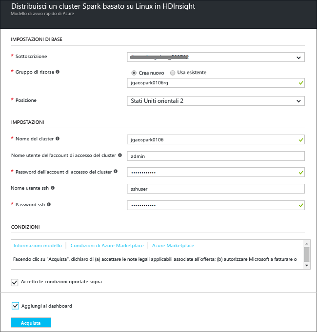
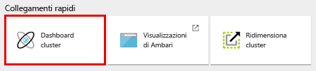

# Introduzione: Creare un cluster Apache Spark in Azure HDInsight ed eseguire query interattive usando Spark SQL

Informazioni su come creare un cluster [Apache Spark](hdinsight-apache-spark-overview.md) in HDInsight e quindi usare [Jupyter](https://jupyter.org) Notebook per eseguire query interattive Spark SQL nel cluster Spark.

   

## Prerequisiti
* **Una sottoscrizione di Azure**. Prima di iniziare questa esercitazione, è necessario disporre di un abbonamento ad Azure. Vedere [Crea subito il tuo account Azure gratuito](https://azure.microsoft.com/free).

## Creare un cluster Spark
In questa sezione viene creato un cluster Spark in HDInsight usando un [modello di Azure Resource Manager](https://azure.microsoft.com/resources/templates/101-hdinsight-spark-linux/). Per altri metodi di creazione dei cluster, vedere [Creare cluster HDInsight](hdinsight-hadoop-provision-linux-clusters.md).

1. Fare clic sull'immagine seguente per aprire il modello nel portale di Azure.         

    

2. Immettere i valori seguenti:

    

    * **Sottoscrizione**: selezionare la sottoscrizione di Azure per questo cluster.
    * **Gruppo di risorse**: creare un gruppo di risorse o selezionarne uno esistente. Il gruppo di risorse viene usato per gestire le risorse di Azure per i progetti.
    * **Posizione**: selezionare una posizione per il gruppo di risorse.  Questa posizione viene usata anche per l'archiviazione cluster predefinita e il cluster HDInsight.
    * **Nome cluster**: immettere un nome per il cluster Hadoop che verrà creato.
    * **Versione di Spark**: selezionare la versione di Spark da installare nel cluster.
    * **Nome utente e password di accesso del cluster**: il nome dell'account di accesso predefinito è admin.
    * **Nome utente e password SSH**.

   Annotare questi valori  perché sarà necessario usarli più avanti nell'esercitazione.

3. Selezionare **Accetto le condizioni riportate sopra**, selezionare **Aggiungi al dashboard** e quindi fare clic su **Acquista**. È possibile visualizzare un nuovo riquadro denominato Invio della distribuzione per Distribuzione modello. La creazione del cluster richiede circa 20 minuti.

> [!NOTE]
> Questo articolo crea un cluster Spark che usa [BLOB del servizio di archiviazione di Azure come risorsa di archiviazione del cluster](hdinsight-hadoop-use-blob-storage.md). È anche possibile creare un cluster Spark che usa [Azure Data Lake Store](../data-lake-store/data-lake-store-overview.md) come risorsa di archiviazione aggiuntiva, oltre ai BLOB del servizio di archiviazione di Azure come risorsa di archiviazione predefinita. Per istruzioni, vedere [Creare un cluster HDInsight con Archivio Data Lake](../data-lake-store/data-lake-store-hdinsight-hadoop-use-portal.md).
>
>

## Eseguire una query SQL Spark

In questa sezione è possibile usare un notebook Jupyter per eseguire query SQL Spark sul cluster Spark. I cluster HDInsight Spark offrono tre kernel che è possibile usare con Jupyter Notebook. Si tratta di:

* **PySpark** (per le applicazioni scritte in Python)
* **PySpark3** (per le applicazioni scritte in Python3)
* **Spark** (per le applicazioni scritte in Scala)

In questo articolo si usa il kernel **PySpark**. Per altre informazioni sui kernel, vedere [Usare i kernel per Jupyter Notebook con cluster Apache Spark in HDInsight](hdinsight-apache-spark-jupyter-notebook-kernels.md). Ecco alcuni principali vantaggi dell'uso del kernel PySpark:

* I contesti per Spark e Hive vengono impostati automaticamente.
* Usare comandi speciali nelle celle, ad esempio `%%sql` per eseguire direttamente query SQL o Hive senza anteporre frammenti di codice.
* L'output delle query SQL o Hive viene visualizzato automaticamente.

### Creare un notebook di Jupyter con il kernel PySpark

1. Aprire il [portale di Azure](https://portal.azure.com/).

2. Se si è scelto di aggiungere il cluster al dashboard, fare clic sul riquadro del cluster nel dashboard per avviare il relativo pannello.

    Se il cluster non è stato aggiunto al dashboard, nel riquadro sinistro fare clic su **Cluster HDInsight** e quindi sul cluster creato.

3. In **Collegamenti rapidi** fare clic su **Dashboard cluster** e quindi su **Notebook di Jupyter**. Se richiesto, immettere le credenziali per il cluster.

   

   > [!NOTE]
   > È anche possibile raggiungere il notebook di Jupyter per il cluster aprendo l'URL seguente nel browser. Sostituire **CLUSTERNAME** con il nome del cluster:
   >
   > `https://CLUSTERNAME.azurehdinsight.net/jupyter`
   >
   >
3. Creare un notebook. Fare clic su **Nuovo** e quindi su **PySpark**.

   

   Un nuovo notebook verrà creato e aperto con il nome Untitled (Untitled.pynb).

4. Fare clic sul nome del notebook nella parte superiore e, se si vuole, immettere un nome descrittivo.

    

5. Incollare il codice seguente in una cella vuota e quindi premere **MAIUSC + INVIO** per eseguire il codice. Il codice importa i tipi necessari per questo scenario:

        from pyspark.sql.types import *

    Poiché il notebook è stato creato tramite il kernel PySpark, non è necessario creare contesti in modo esplicito. I contesti Spark e Hive vengono creati automaticamente quando si esegue la prima cella di codice.

    

    Ogni volta che si esegue un processo in Jupyter, il titolo della finestra del Web browser visualizza lo stato **(Occupato)** accanto al titolo del notebook. È anche visibile un cerchio pieno accanto al testo **PySpark** nell'angolo in alto a destra. Al termine del processo viene visualizzato un cerchio vuoto.

6. Eseguire questo codice per registrare un set di dati di esempio come tabella temporanea (**hvac**).

        # Load the data
        hvacText = sc.textFile("wasbs:///HdiSamples/HdiSamples/SensorSampleData/hvac/HVAC.csv")

        # Create the schema
        hvacSchema = StructType([StructField("date", StringType(), False),StructField("time", StringType(), False),StructField("targettemp", IntegerType(), False),StructField("actualtemp", IntegerType(), False),StructField("buildingID", StringType(), False)])

        # Parse the data in hvacText
        hvac = hvacText.map(lambda s: s.split(",")).filter(lambda s: s[0] != "Date").map(lambda s:(str(s[0]), str(s[1]), int(s[2]), int(s[3]), str(s[6]) ))

        # Create a data frame
        hvacdf = sqlContext.createDataFrame(hvac,hvacSchema)

        # Register the data fram as a table to run queries against
        hvacdf.registerTempTable("hvac")

    I cluster Spark in HDInsight includono un file di dati di esempio, **hvac.csv**, in **\HdiSamples\HdiSamples\SensorSampleData\hvac**.

7. Eseguire questo codice per effettuare una query sui dati.

        %%sql
        SELECT buildingID, (targettemp - actualtemp) AS temp_diff, date FROM hvac WHERE date = \"6/1/13\"

   Dato che si usa un kernel PySpark, è ora possibile eseguire direttamente una query SQL sulla tabella temporanea **hvac** creata usando il comando Magic `%%sql`. Per altre informazioni sul comando Magic `%%sql` e sugli altri comandi Magic disponibili con il kernel PySpark, vedere [Kernel disponibili per i notebook di Jupyter con cluster Spark HDInsight](hdinsight-apache-spark-jupyter-notebook-kernels.md#parameters-supported-with-the-sql-magic).

   L'output tabulare seguente viene visualizzato per impostazione predefinita.

     

    È anche possibile visualizzare i risultati in altri formati. Ad esempio, un grafico ad area per lo stesso output apparirebbe come segue.

    

9. Al termine dell'esecuzione dell'applicazione, arrestare il notebook per rilasciare le risorse del cluster. A tale scopo, dal menu **File** del notebook fare clic su **Close and Halt** (Chiudi e interrompi).

## Risoluzione dei problemi

Di seguito sono indicati alcuni problemi comuni riscontrabili con l'uso di cluster HDInsight.

### Requisiti di controllo di accesso
[!INCLUDE [access-control](../../includes/hdinsight-access-control-requirements.md)]

## Eliminazione del cluster
[!INCLUDE [delete-cluster-warning](../../includes/hdinsight-delete-cluster-warning.md)]

## Vedere anche
* [Panoramica: Apache Spark su Azure HDInsight](hdinsight-apache-spark-overview.md)

### Scenari
* [Spark con Business Intelligence: eseguire l'analisi interattiva dei dati con strumenti di Business Intelligence mediante Spark in HDInsight](hdinsight-apache-spark-use-bi-tools.md)
* [Spark con Machine Learning: utilizzare Spark in HDInsight per l'analisi della temperatura di compilazione utilizzando dati HVAC](hdinsight-apache-spark-ipython-notebook-machine-learning.md)
* [Spark con Machine Learning: usare Spark in HDInsight per prevedere i risultati del controllo degli alimenti](hdinsight-apache-spark-machine-learning-mllib-ipython.md)
* [Streaming Spark: usare Spark in HDInsight per la creazione di applicazioni di streaming in tempo reale](hdinsight-apache-spark-eventhub-streaming.md)
* [Analisi dei log del sito Web mediante Spark in HDInsight](hdinsight-apache-spark-custom-library-website-log-analysis.md)
* [Application Insight telemetry data analysis using Spark in HDInsight (Analisi dei dati di telemetria di Application Insights con Spark in HDInsight)](hdinsight-spark-analyze-application-insight-logs.md)

### Creare ed eseguire applicazioni
* [Creare un'applicazione autonoma con Scala](hdinsight-apache-spark-create-standalone-application.md)
* [Eseguire processi in modalità remota in un cluster Spark usando Livy](hdinsight-apache-spark-livy-rest-interface.md)

### Strumenti ed estensioni
* [Usare il plug-in degli strumenti HDInsight per IntelliJ IDEA per creare e inviare applicazioni Spark Scala](hdinsight-apache-spark-intellij-tool-plugin.md)
* [Use HDInsight Tools Plugin for IntelliJ IDEA to debug Spark applications remotely (Usare il plug-in Strumenti HDInsight per IntelliJ IDEA per eseguire il debug di applicazioni Spark in remoto)](hdinsight-apache-spark-intellij-tool-plugin-debug-jobs-remotely.md)
* [Usare i notebook di Zeppelin con un cluster Spark in HDInsight](hdinsight-apache-spark-use-zeppelin-notebook.md)
* [Kernel disponibili per notebook di Jupyter nel cluster Spark per HDInsight](hdinsight-apache-spark-jupyter-notebook-kernels.md)
* [Usare pacchetti esterni con i notebook Jupyter](hdinsight-apache-spark-jupyter-notebook-use-external-packages.md)
* [Installare Jupyter Notebook nel computer e connetterlo a un cluster HDInsight Spark](hdinsight-apache-spark-jupyter-notebook-install-locally.md)

### Gestire risorse
* [Gestire le risorse del cluster Apache Spark in Azure HDInsight](hdinsight-apache-spark-resource-manager.md)
* [Tenere traccia ed eseguire il debug di processi in esecuzione nel cluster Apache Spark in Azure HDInsight](hdinsight-apache-spark-job-debugging.md)

[hdinsight-versions]: hdinsight-component-versioning.md
[hdinsight-upload-data]: hdinsight-upload-data.md
[hdinsight-storage]: hdinsight-hadoop-use-blob-storage.md

[azure-purchase-options]: http://azure.microsoft.com/pricing/purchase-options/
[azure-member-offers]: http://azure.microsoft.com/pricing/member-offers/
[azure-free-trial]: http://azure.microsoft.com/pricing/free-trial/
[azure-management-portal]: https://manage.windowsazure.com/
[azure-create-storageaccount]: storage-create-storage-account.md

