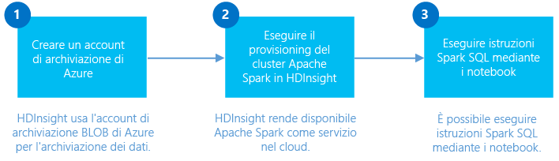

<properties
	pageTitle="Creare un cluster Spark in HDInsight Linux e usare Spark SQL da Jupyter per l'analisi interattiva | Microsoft Azure"
	description="Istruzioni dettagliate su come creare rapidamente un cluster Apache Spark in HDInsight e quindi usare Spark SQL da notebook di Jupyter per eseguire query interattive."
	services="hdinsight"
	documentationCenter=""
	authors="nitinme"
	manager="paulettm"
	editor="cgronlun"
	tags="azure-portal"/>

<tags
	ms.service="hdinsight"
	ms.workload="big-data"
	ms.tgt_pltfrm="na"
	ms.devlang="na"
	ms.topic="get-started-article"
	ms.date="06/07/2016"
	ms.author="nitinme"/>

# Introduzione: creare cluster Apache Spark in HDInsight Linux ed eseguire query interattive usando Spark SQL

Informazioni su come creare un cluster Apache Spark in HDInsight e quindi usare il notebook di [Jupyter](https://jupyter.org) per eseguire query interattive Spark SQL nel cluster Spark.

   

[AZURE.INCLUDE [delete-cluster-warning](../../includes/hdinsight-delete-cluster-warning.md)]

**Prerequisiti:**

- **Una sottoscrizione di Azure**. Prima di iniziare questa esercitazione, è necessario disporre di un abbonamento ad Azure. Vedere [Ottenere una versione di prova gratuita di Azure](https://azure.microsoft.com/documentation/videos/get-azure-free-trial-for-testing-hadoop-in-hdinsight/).

- **Client SSH (Secure Shell)**: i sistemi Linux, Unix e OS X offrono un client SSH tramite il comando `ssh`. Per i sistemi Windows, è consigliabile [PuTTY](http://www.chiark.greenend.org.uk/~sgtatham/putty/download.html).
    
- **Chiavi Secure Shell (SSH) (facoltative)**: è possibile proteggere l'account SSH usato per connettersi al cluster mediante una password o una chiave pubblica. L'uso di una password è il metodo più rapido ed è consigliabile usare questa opzione se si vuole creare rapidamente un cluster ed eseguire alcuni processi di test. L'uso di una chiave risulta più sicuro, anche se richiede passaggi di impostazione aggiuntivi. È possibile adottare questo approccio durante la creazione di un cluster di produzione. In questo articolo viene usato l'approccio di password. Per istruzioni su come creare e usare chiavi SSH con HDInsight, vedere gli articoli seguenti:

	-  Da un computer Linux: [Usare SSH con HDInsight basato su Linux (Hadoop) da Linux, Unix o OS X](hdinsight-hadoop-linux-use-ssh-unix.md).
    
	-  Da un computer Windows: [Usare SSH con HDInsight basato su Linux (Hadoop) da Windows](hdinsight-hadoop-linux-use-ssh-windows.md).

>[AZURE.NOTE] Questo articolo usa un modello di Azure Resource Manager per creare un cluster Spark che usa [BLOB di archiviazione di Azure come risorsa di archiviazione del cluster](hdinsight-hadoop-use-blob-storage.md). È anche possibile creare un cluster Spark che usa [Archivio Azure Data Lake](../data-lake-store/data-lake-store-overview.md) come risorsa di archiviazione aggiuntiva, oltre ai BLOB di archiviazione di Azure come risorsa di archiviazione predefinita. Per istruzioni, vedere [Creare un cluster HDInsight con Archivio Data Lake](../data-lake-store/data-lake-store-hdinsight-hadoop-use-portal.md).

## Creare un cluster Spark

In questa sezione viene creato un cluster HDInsight versione 3.4 (Spark versione 1.6.1) con un modello di distribuzione Azure Resource Manager. Per informazioni sulle versioni di HDInsight e sui relativi contratti di servizio, vedere l'articolo relativo al [controllo delle versioni del componente HDInsight](hdinsight-component-versioning.md). Per altri metodi di creazione dei cluster, vedere [Creare cluster HDInsight](hdinsight-hadoop-provision-linux-clusters.md).

1. Fare clic sull'immagine seguente per aprire un modello di Gestione risorse di Azure nel portale di Azure.         

    
    
    Il modello di Azure Resource Manager è disponibile in un contenitore BLOB pubblico, **https://hditutorialdata.blob.core.windows.net/armtemplates/create-linux-based-spark-cluster-in-hdinsight.json*.
   
2. Nel pannello Parametri immettere le informazioni seguenti:

    - **ClusterName** (Nome cluster): immettere un nome per il cluster Hadoop che verrà creato.
    - **Cluster login name/password** (Nome di accesso cluster/Password di accesso cluster): il nome di accesso predefinito è admin.
    - **Nome utente SSH/Password SSH**.
    
    Annotare questi valori. Sarà necessario usarli più avanti nell'esercitazione.

    > [AZURE.NOTE] Il protocollo SSH viene usato per accedere in modalità remota al cluster HDInsight tramite una riga di comando. Il nome utente e la password specificati qui sono usati per la connessione al cluster tramite SSH. Il nome utente SSH deve essere univoco, in quanto crea un account utente in tutti i nodi del cluster HDInsight. Di seguito sono riportati alcuni nomi di account riservati per l'uso da parte dei servizi nel cluster che non devono essere usati come nome utente SSH:
    >
    > root, hdiuser, storm, hbase, ubuntu, zookeeper, hdfs, yarn, mapred, hbase, hive, oozie, falcon, sqoop, admin, tez, hcat, hdinsight-zookeeper.

	> Per altre informazioni sull'uso di SSH con HDInsight, vedere gli articoli seguenti:

	> * [Usare SSH con Hadoop basato su Linux in HDInsight da Linux, Unix o OS X](hdinsight-hadoop-linux-use-ssh-unix.md)
	> * [Usare SSH con Hadoop basato su Linux in HDInsight da Windows](hdinsight-hadoop-linux-use-ssh-windows.md)

    
3\. Fare clic su **OK** per salvare i parametri.

4\. Nel pannello **Distribuzione personalizzata** fare clic sulla casella a discesa **Gruppo di risorse** e quindi scegliere **Nuovo** per creare un nuovo gruppo di risorse. Il gruppo di risorse è un contenitore che raggruppa il cluster, l'account di archiviazione dipendente e altre risorse collegate.

5\. Fare clic su **Note legali** e quindi su **Crea**.

6\. Fare clic su **Crea**. Verrà visualizzato un nuovo riquadro denominato Invio della distribuzione per Distribuzione modello. La creazione del cluster e del database SQL richiede circa 20 minuti.

## Eseguire query Spark SQL con un notebook di Jupyter

In questa sezione è possibile usare un notebook Jupyter per eseguire query SQL Spark sul cluster Spark. I cluster HDInsight Spark offrono due kernel aggiuntivi che è possibile usare con Jupyter Notebook. Si tratta di:

* **PySpark** (per le applicazioni scritte in Python)
* **Spark** (per le applicazioni scritte in Scala)

In questo articolo si userà il kernel PySpark. Nell'articolo [Kernel disponibili per i notebook Jupyter con cluster HDInsight Spark](hdinsight-apache-spark-jupyter-notebook-kernels.md#why-should-i-use-the-new-kernels) sono descritti in dettaglio i vantaggi dell'uso del kernel PySpark. Ecco, tuttavia, i principali vantaggi dell'uso del kernel PySpark:

* Non è necessario impostare i contesti per Spark e Hive. Questi vengono impostati automaticamente.
* È possibile usare comandi speciali nelle celle, ad esempio `%%sql` per eseguire direttamente query SQL o Hive senza anteporre frammenti di codice.
* L'output delle query SQL o Hive viene visualizzato automaticamente.

### Creare un notebook di Jupyter con il kernel PySpark 

1. Dalla Schermata iniziale del [portale di Azure](https://portal.azure.com/) fare clic sul riquadro del cluster Spark (se è stato aggiunto sulla Schermata iniziale). È anche possibile passare al cluster in **Sfoglia tutto** > **Cluster HDInsight**.   

2. Dal pannello del cluster Spark fare clic su **Collegamenti rapidi** e dal pannello **Dashboard cluster** fare clic su **Notebook di Jupyter**. Se richiesto, immettere le credenziali per il cluster.

	> [AZURE.NOTE] È anche possibile raggiungere il notebook di Jupyter per il cluster aprendo l'URL seguente nel browser. Sostituire __CLUSTERNAME__ con il nome del cluster:
	>
	> `https://CLUSTERNAME.azurehdinsight.net/jupyter`

2. Creare un nuovo notebook. Fare clic su **Nuovo** e quindi su **PySpark**.

	

3. Un nuovo notebook verrà creato e aperto con il nome Untitled.pynb. Fare clic sul nome del notebook nella parte superiore e immettere un nome descrittivo.

	

4. Poiché il notebook è stato creato tramite il kernel PySpark, non è necessario creare contesti in modo esplicito. I contesti Spark e Hive vengono creati automaticamente quando si esegue la prima cella di codice. È possibile iniziare con l'importazione dei tipi necessari per questo scenario. A tale scopo incollare il frammento di codice seguente in una cella e premere **MAIUSC+INVIO**.

		from pyspark.sql.types import *
		
	Ogni volta che viene eseguito un processo in Jupyter, il titolo della finestra del Web browser visualizzerà lo stato **(Occupato)** accanto al titolo del notebook. È anche visibile un cerchio pieno accanto al testo **PySpark** nell'angolo in alto a destra. Dopo il completamento del processo, viene visualizzato un cerchio vuoto.

	 

4. Caricare i dati di esempio in una tabella temporanea. Quando si crea un cluster Spark in HDInsight, il file di dati di esempio **hvac.csv** viene copiato nell'account di archiviazione associato in **\\HdiSamples\\HdiSamples\\SensorSampleData\\hvac**.

	In una cella vuota incollare l'esempio di codice seguente e premere **MAIUSC+INVIO**. Questo esempio di codice registra i dati in una tabella temporanea denominata **hvac**.

		# Load the data
		hvacText = sc.textFile("wasb:///HdiSamples/HdiSamples/SensorSampleData/hvac/HVAC.csv")
		
		# Create the schema
		hvacSchema = StructType([StructField("date", StringType(), False),StructField("time", StringType(), False),StructField("targettemp", IntegerType(), False),StructField("actualtemp", IntegerType(), False),StructField("buildingID", StringType(), False)])
		
		# Parse the data in hvacText
		hvac = hvacText.map(lambda s: s.split(",")).filter(lambda s: s[0] != "Date").map(lambda s:(str(s[0]), str(s[1]), int(s[2]), int(s[3]), str(s[6]) ))
		
		# Create a data frame
		hvacdf = sqlContext.createDataFrame(hvac,hvacSchema)
		
		# Register the data fram as a table to run queries against
		hvacdf.registerTempTable("hvac")

5. Dato che si usa un kernel PySpark, è ora possibile eseguire direttamente una query SQL sulla tabella temporanea **hvac** appena creata usando il comando speciale `%%sql`. Per altre informazioni sul comando speciale `%%sql` e sugli altri comandi speciali disponibili con il kernel PySpark, vedere [Kernel disponibili per i notebook Jupyter con cluster HDInsight Spark](hdinsight-apache-spark-jupyter-notebook-kernels.md#why-should-i-use-the-new-kernels).
		
		%%sql
		SELECT buildingID, (targettemp - actualtemp) AS temp_diff, date FROM hvac WHERE date = "6/1/13"

5. Una volta che il processo viene completato correttamente, per impostazione predefinita viene visualizzato l'output tabulare seguente.

 	

	È anche possibile visualizzare i risultati in altri formati. Ad esempio, un grafico ad area per lo stesso output apparirebbe come segue.

	

6. Dopo aver eseguito l'applicazione, è consigliabile arrestare il notebook per rilasciare le risorse. A tale scopo, dal menu **File** del notebook fare clic su **Close and Halt**. Questa operazione consente di arrestare e chiudere il notebook.

##Eliminazione del cluster

[AZURE.INCLUDE [delete-cluster-warning](../../includes/hdinsight-delete-cluster-warning.md)]

## Vedere anche

* [Panoramica: Apache Spark su Azure HDInsight](hdinsight-apache-spark-overview.md)

### Scenari

* [Spark con Business Intelligence: eseguire l'analisi interattiva dei dati con strumenti di Business Intelligence mediante Spark in HDInsight](hdinsight-apache-spark-use-bi-tools.md)

* [Spark con Machine Learning: utilizzare Spark in HDInsight per l'analisi della temperatura di compilazione utilizzando dati HVAC](hdinsight-apache-spark-ipython-notebook-machine-learning.md)

* [Spark con Machine Learning: usare Spark in HDInsight per prevedere i risultati del controllo degli alimenti](hdinsight-apache-spark-machine-learning-mllib-ipython.md)

* [Streaming Spark: usare Spark in HDInsight per la creazione di applicazioni di streaming in tempo reale](hdinsight-apache-spark-eventhub-streaming.md)

* [Analisi dei log del sito Web mediante Spark in HDInsight](hdinsight-apache-spark-custom-library-website-log-analysis.md)

### Creare ed eseguire applicazioni

* [Creare un'applicazione autonoma con Scala](hdinsight-apache-spark-create-standalone-application.md)

* [Eseguire processi in modalità remota in un cluster Spark usando Livy](hdinsight-apache-spark-livy-rest-interface.md)

### Strumenti ed estensioni

* [Usare il plug-in degli strumenti HDInsight per IntelliJ IDEA per creare e inviare applicazioni Spark in Scala](hdinsight-apache-spark-intellij-tool-plugin.md)

* [Use HDInsight Tools Plugin for IntelliJ IDEA to debug Spark applications remotely](hdinsight-apache-spark-intellij-tool-plugin-debug-jobs-remotely.md) (Usare il plug-in Strumenti HDInsight per IntelliJ IDEA per eseguire il debug di applicazioni Spark in remoto)

* [Usare i notebook di Zeppelin con un cluster Spark in HDInsight](hdinsight-apache-spark-use-zeppelin-notebook.md)

* [Kernel disponibili per notebook di Jupyter nel cluster Spark per HDInsight](hdinsight-apache-spark-jupyter-notebook-kernels.md)

* [Usare pacchetti esterni con i notebook Jupyter](hdinsight-apache-spark-jupyter-notebook-use-external-packages.md)

* [Installare Jupyter Notebook nel computer e connetterlo a un cluster HDInsight Spark](hdinsight-apache-spark-jupyter-notebook-install-locally.md)

### Gestire risorse

* [Gestire le risorse del cluster Apache Spark in Azure HDInsight](hdinsight-apache-spark-resource-manager.md)

* [Tenere traccia ed eseguire il debug di processi in esecuzione nel cluster Apache Spark in Azure HDInsight](hdinsight-apache-spark-job-debugging.md)

[hdinsight-versions]: hdinsight-component-versioning.md
[hdinsight-upload-data]: hdinsight-upload-data.md
[hdinsight-storage]: hdinsight-hadoop-use-blob-storage.md

[azure-purchase-options]: http://azure.microsoft.com/pricing/purchase-options/
[azure-member-offers]: http://azure.microsoft.com/pricing/member-offers/
[azure-free-trial]: http://azure.microsoft.com/pricing/free-trial/
[azure-management-portal]: https://manage.windowsazure.com/
[azure-create-storageaccount]: storage-create-storage-account.md

<!---HONumber=AcomDC_0608_2016-->