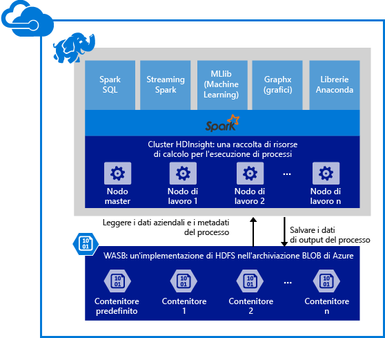

# Panoramica: Apache Spark in HDInsight Linux
<a href="http://spark.apache.org/" target="_blank">Apache Spark</a> è un framework open source di elaborazione parallela che supporta l'elaborazione in memoria per migliorare le prestazioni di applicazioni analitiche di Big Data. Il motore di elaborazione Spark è costruito per la velocità, la semplicità d'uso e le analisi sofisticate. Le funzionalità di elaborazione in memoria rendono Spark un valido strumento per l'esecuzione di algoritmi iterativi in calcoli grafici e di Machine Learning. Spark è inoltre compatibile con archiviazione Blob di Azure (WASB) in modo che i dati esistenti archiviati in Azure possono essere elaborati facilmente tramite Spark.

Quando si crea un cluster di Spark in HDInsight, si creano risorse di calcolo di Azure con Spark installato e configurato. Bastano circa dieci minuti per creare un cluster di Spark in HDInsight. I dati per la varianza sono archiviati nell'archivio BLOB di Azure. Vedere [Usare l'archivio BLOB di Azure con HDInsight][hdinsight-storage].

**Si vuole iniziare a usare Apache Spark in Azure HDInsight?** Vedere [Guida introduttiva: creare un cluster di Spark in HDInsight ed eseguire applicazioni di esempio usando Jupyter](hdinsight-apache-spark-jupyter-spark-sql.md).

> [!NOTE]
> Per un elenco di problemi noti e limitazioni con la versione corrente, vedere [Problemi noti di Apache Spark in Azure HDInsight (Linux)](hdinsight-apache-spark-jupyter-spark-sql.md).
> 
> 

## Perché usare Spark in Azure HDInsight?
Azure HDInsight offre un servizio Spark completamente gestito. I vantaggi dell'uso di Spark in HDInsight sono:

| Funzionalità | Descrizione |
| --- | --- |
| Facilità di creazione dei cluster |È possibile creare un nuovo cluster Spark in HDInsight in pochi minuti mediante il portale di gestione di Azure, Azure PowerShell o l’SDK HDInsight .NET. Vedere [Introduzione ai cluster Spark in HDInsight](hdinsight-apache-spark-jupyter-spark-sql.md) |
| Semplicità d'uso |I cluster Spark in HDInsight includono i notebook Jupyter preconfigurati. È possibile usarli per la visualizzazione e l'elaborazione interattiva di dati. L'URL è https://CLUSTERNAME.azurehdinsight.net/jupyter. Sostituire **CLUSTERNAME** con il nome del cluster Spark HDInsight. |
| API REST |Spark in HDInsight include [Livy](https://github.com/cloudera/hue/tree/master/apps/spark/java#welcome-to-livy-the-rest-spark-server), un server di processo Spark basato su REST-API per inviare e monitorare i processi in esecuzione in modalità remota. |
| Supporto per Archivio Azure Data Lake |Spark in HDInsight può essere configurato per usare Archivio Azure Data Lake come risorsa di archiviazione aggiuntiva. Per altre informazioni su Archivio Data Lake, vedere [Panoramica di Archivio Azure Data Lake](../data-lake-store/data-lake-store-overview.md). |
| Integrazione con servizi di Azure |Spark in HDInsight viene fornito con un connettore per Hub eventi di Azure. Gli utenti possono creare applicazioni di streaming mediante Hub eventi, oltre a [Kafka](http://kafka.apache.org/)che è già disponibile come parte di Spark. |
| Supporto per R Server |È possibile impostare R Server in un cluster HDInsight Spark per eseguire calcoli R distribuiti con la velocità garantita da un cluster Spark. Per altre informazioni, vedere [Introduzione all'uso di R Server su HDInsight](hdinsight-hadoop-r-server-get-started.md). |
| Integrazione con IntelliJ IDEA |È possibile usare il plug-in HDInsight per IntelliJ per creare e inviare applicazioni a un cluster HDInsight Spark. Per altre informazioni, vedere [Use HDInsight Tools Plugin for IntelliJ IDEA to create Spark applications for HDInsight Spark Linux cluster](hdinsight-apache-spark-intellij-tool-plugin.md)(Usare il plug-in Strumenti HDInsight per IntelliJ IDEA per creare applicazioni Spark per il cluster HDInsight Spark Linux). |
| Query simultanee |Spark in HDInsight supporta query simultanee. In questo modo più query da un utente o più query da vari utenti e applicazioni possono condividere le stesse risorse di cluster. |
| La memorizzazione nella cache nelle unità SSD |È possibile scegliere di memorizzare i dati in memoria o nelle SSD associate ai nodi del cluster. La memorizzazione nella cache in memoria offre le migliori prestazioni di query ma può essere costosa; la memorizzazione nella cache in SSDs fornisce un'ottima opzione per migliorare le prestazioni delle query senza la necessità di creare un cluster di dimensioni necessario ad adattare l'intero set di dati in memoria. |
| Integrazione con strumenti di Business Intelligence |Spark per HDInsight offre connettori per strumenti di Business Intelligence, come [Power BI](http://www.powerbi.com/) e [Tableau](http://www.tableau.com/products/desktop), per l'analisi dei dati. |
| Librerie Anaconda precaricate |I cluster Spark in HDInsight sono dotati di librerie Anaconda preinstallate [Anaconda](http://docs.continuum.io/anaconda/) offre quasi 200 librerie per Machine Learning, l'analisi dei dati, la visualizzazione e così via. |
| Scalabilità |Anche se è possibile specificare il numero di nodi del cluster durante la fase di creazione, in seguito può essere necessario aumentare o ridurre il cluster sulla base del carico di lavoro. Tutti i cluster HDInsight consentono di modificare il numero di nodi del cluster. Inoltre, è possibile eliminare i cluster Spark senza alcuna perdita di dati poiché tutti i dati vengono memorizzati nell'archivio BLOB di Azure. |
| Supporto 24/7 |Spark in HDInsight include il supporto continuo a livello aziendale e un Contratto di servizio che garantisce tempi di attività pari al 99,9%. |

## Quali sono i casi d'uso per Spark in HDInsight?
Apache Spark in HDInsight consente gli scenari principali seguenti.

### Analisi dei dati interattivi e Business Intelligence
[Esaminare un'esercitazione](hdinsight-apache-spark-use-bi-tools.md)

Apache Spark in HDInsight archivia i dati nei blob di Azure. Gli esperti aziendali e i responsabili decisionali possono analizzare e generare rapporti su dati e usare Microsoft Power BI per creare rapporti dai dati analizzati. Gli analisti possono avviare dai dati non strutturati/semi strutturato in archiviazione di Azure, definire uno schema per i dati usando notebook e quindi compilare modelli di dati tramite Microsoft Power BI. Spark in HDInsight supporta inoltre una serie di strumenti di BI di terze parti quali Tableau, Qlikview e Lumira SAP ed è una piattaforma ideale per analisti dei dati, esperti aziendali e responsabili decisionali.

### Machine learning iterativo
[Esaminare un'esercitazione: stima delle temperature di compilazione mediante i dati HVAC](hdinsight-apache-spark-ipython-notebook-machine-learning.md)

[Esaminare un'esercitazione: stima dei risultati di ispezione del cibo](hdinsight-apache-spark-machine-learning-mllib-ipython.md)

Apache Spark viene fornito con [MLlib](http://spark.apache.org/mllib/), una libreria di machine learning basata su Spark. Inoltre, Spark in HDInsight include inoltre Anaconda, una distribuzione di Python con un'ampia gamma di pacchetti per l'apprendimento automatico. Aggiungendo il supporto incorporato per notebook Jupyter si otterrà un ambiente di qualità elevata per la creazione di applicazioni di Machine Learning.  

### Analisi dei dati in tempo reale e streaming
[Esaminare un'esercitazione](hdinsight-apache-spark-eventhub-streaming.md)

L'analisi dei dati in tempo reale viene usata per gli scenari che vanno dalla riduzione dei tempi di analisi dei dati attraverso l'elaborazione di dati quando arrivano alla creazione di una vera soluzione di streaming. Spark in HDInsight offre un supporto completo per la creazione di soluzioni di analisi in tempo reale. Mentre Spark ha già connettori per acquisire i dati da molte origini, quali socket Kafka, Flume, Twitter, ZeroMQ o TCP, Spark in HDInsight aggiunge un eccellente supporto per l'inserimento di dati da Hub eventi di Azure. Hub eventi è il servizio di Accodamento messaggi maggiormente usato in Azure. Disporre di un supporto per Hub eventi rende Spark in HDInsight la piattaforma ideale per la compilazione della pipeline di analisi in tempo reale.

## Quali componenti sono inclusi come parte di un cluster di Spark?
Spark in HDInsight include i componenti seguenti che sono disponibili nei cluster per impostazione predefinita.

* [Spark Core](https://spark.apache.org/docs/1.5.1/). Viene fornito con Spark Core, Spark SQL, streaming API Spark, GraphX e MLlib Spark.
* [Anaconda](http://docs.continuum.io/anaconda/)
* [Livy](https://github.com/cloudera/hue/tree/master/apps/spark/java#welcome-to-livy-the-rest-spark-server)
* [Notebook Jupyter](https://jupyter.org)

Spark in HDInsight fornisce inoltre un [driver ODBC](http://go.microsoft.com/fwlink/?LinkId=616229) per la connettività ai cluster Spark in HDInsight da strumenti di Business Intelligence, quali Microsoft Power BI e Tableau.

## Dove iniziare?
Iniziare con la creazione di un cluster Spark in HDInsight Linux. Vedere [Guida introduttiva: creare un cluster di Spark in HDInsight ed eseguire applicazioni di esempio usando Jupyter](hdinsight-apache-spark-jupyter-spark-sql.md). 

## Passaggi successivi
### Scenari
* [Spark con Business Intelligence: eseguire l'analisi interattiva dei dati con strumenti di Business Intelligence mediante Spark in HDInsight](hdinsight-apache-spark-use-bi-tools.md)
* [Spark con Machine Learning: utilizzare Spark in HDInsight per l'analisi della temperatura di compilazione utilizzando dati HVAC](hdinsight-apache-spark-ipython-notebook-machine-learning.md)
* [Spark con Machine Learning: usare Spark in HDInsight per prevedere i risultati del controllo degli alimenti](hdinsight-apache-spark-machine-learning-mllib-ipython.md)
* [Streaming Spark: usare Spark in HDInsight per la creazione di applicazioni di streaming in tempo reale](hdinsight-apache-spark-eventhub-streaming.md)
* [Analisi dei log del sito Web mediante Spark in HDInsight](hdinsight-apache-spark-custom-library-website-log-analysis.md)

### Creare ed eseguire applicazioni
* [Creare un'applicazione autonoma con Scala](hdinsight-apache-spark-create-standalone-application.md)
* [Eseguire processi in modalità remota in un cluster Spark usando Livy](hdinsight-apache-spark-livy-rest-interface.md)

### Strumenti ed estensioni
* [Usare il plug-in degli strumenti HDInsight per IntelliJ IDEA per creare e inviare applicazioni Spark in Scala](hdinsight-apache-spark-intellij-tool-plugin.md)
* [Use HDInsight Tools Plugin for IntelliJ IDEA to debug Spark applications remotely (Usare il plug-in Strumenti HDInsight per IntelliJ IDEA per eseguire il debug di applicazioni Spark in remoto)](hdinsight-apache-spark-intellij-tool-plugin-debug-jobs-remotely.md)
* [Usare i notebook di Zeppelin con un cluster Spark in HDInsight](hdinsight-apache-spark-use-zeppelin-notebook.md)
* [Kernel disponibili per notebook di Jupyter nel cluster Spark per HDInsight](hdinsight-apache-spark-jupyter-notebook-kernels.md)
* [Usare pacchetti esterni con i notebook Jupyter](hdinsight-apache-spark-jupyter-notebook-use-external-packages.md)
* [Installare Jupyter Notebook nel computer e connetterlo a un cluster HDInsight Spark](hdinsight-apache-spark-jupyter-notebook-install-locally.md)

### Gestire risorse
* [Gestire le risorse del cluster Apache Spark in Azure HDInsight](hdinsight-apache-spark-resource-manager.md)
* [Tenere traccia ed eseguire il debug di processi in esecuzione nel cluster Apache Spark in Azure HDInsight](hdinsight-apache-spark-job-debugging.md)

[hdinsight-storage]: hdinsight-hadoop-use-blob-storage.md

<!--HONumber=Nov16_HO2-->

