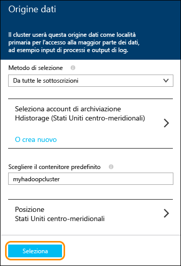

<properties
	pageTitle="Eseguire un cluster Spark su HDInsight di Azure e usare SQL Spark da Zeppelin e Jupyter per l'analisi interattiva | Microsoft Azure"
	description="Istruzioni dettagliate su come eseguire rapidamente un cluster Apache Spark in HDInsight, quindi usare notebook SQL Spark da Zeppelin e Jupyter per l'esecuzione di query interattive."
	services="hdinsight"
	documentationCenter=""
	authors="nitinme"
	manager="paulettm"
	editor="cgronlun"
	tags="azure-portal"/>

<tags
	ms.service="hdinsight"
	ms.workload="big-data"
	ms.tgt_pltfrm="na"
	ms.devlang="na"
	ms.topic="article"
	ms.date="08/07/2015"
	ms.author="nitinme"/>

# Avvio: eseguire il provisioning Apache Spark e avviare query interattive usando SQL Spark in HDInsight di Azure.

[AZURE.INCLUDE [hdinsight-azure-preview-portal](../../includes/hdinsight-azure-preview-portal.md)]

* [Eseguire il provisioning di Apache Spark in HDInsight ed eseguire query interattive utilizzando SQL di Spark](hdinsight-apache-spark-zeppelin-notebook-jupyter-spark-sql-v1.md)

Imparare come eseguire il provisioning di un cluster Apache Spark in HDInsight tramite l'opzione Creazione rapida e quindi usare i notebook sul Web [Zeppelin](https://zeppelin.incubator.apache.org) e [Jupyter](https://jupyter.org) per l'esecuzione di query interattive sul cluster Spark.

   

**Prerequisiti:**

Prima di iniziare questa esercitazione, è necessario disporre di un abbonamento ad Azure. Vedere [Ottenere una versione di valutazione gratuita di Azure](http://azure.microsoft.com/documentation/videos/get-azure-free-trial-for-testing-hadoop-in-hdinsight/).

## Eseguire il provisioning di un cluster HDInsight Spark

In questa sezione si esegue una versione 3.2 del cluster HDInsight, basato sulla versione 1.3.1. in Spark. Per informazioni sulle versioni di HDInsight e sui relativi contratti di servizio, vedere l'articolo relativo al [controllo delle versioni del componente HDInsight](hdinsight-component-versioning.md).

>[AZURE.NOTE]I passaggi descritti in questo articolo creano un cluster Apache Spark in HDInsight usando le impostazioni di configurazione di base. Per informazioni su altre impostazioni di configurazione di cluster (ad esempio l’utilizzo di un’ulteriore archiviazione, l'uso di una rete virtuale di Azure o di un metastore per Hive) vedere: [Eseguire il provisioning di cluster HDInsight con opzioni personalizzate](hdinsight-apache-spark-provision-clusters.md).

**Come eseguire un cluster Spark**

1. Accedere al [portale di anteprima di Azure](https://ms.portal.azure.com/).

2. Fare clic su **NUOVO**, fare clic su **Analisi di dati**, quindi fare clic su **HDInsight**.

    

3. Immettere un **Nome cluster**, selezionare **Hadoop** per il **tipo di Cluster**, e dal menu a discesa **Sistema operativo Cluster**, selezionare **Windows Server 2012 R2 Datacenter**. Un segno di spunta verde appare accanto al Nome del cluster, se disponibile.

	

4. Se si dispone di più di una sottoscrizione, fare clic sulla voce**Sottoscrizione** per selezionare la sottoscrizione di Azure da utilizzare per il cluster.

5. Fare clic su **Gruppo di risorse** per visualizzare un elenco di gruppi di risorse esistenti e selezionare quello in cui creare il cluster. In alternativa, è possibile fare clic su **Crea nuovo** e quindi immettere il nome del nuovo gruppo di risorse. Viene visualizzato un segno di spunta verde per indicare se il nome del nuovo gruppo è disponibile.

	> [AZURE.NOTE]Questa voce è impostata su uno dei gruppi di risorse esistenti, se disponibili.

6. Fare clic su **Credenziali**, e poi immettere un **Nome utente di accesso al Cluster** e la **Password dell'account di accesso Cluster**. Se si desidera attivare il desktop remoto nel nodo del cluster, su**Abilita Desktop remoto**, fare clic su **Sì** e poi specificare i valori richiesti. In questa esercitazione non richiede desktop remoto, quindi è possibile ignorare questo passaggio. Fare clic su **Seleziona** nella parte inferiore per salvare la configurazione delle credenziali.

	

7. Fare clic su **Origine dati** per scegliere un'origine dati esistente per il cluster o crearne una nuova. Quando si esegue il provisioning di un cluster Hadoop in HDInsight, si specifica un account di archiviazione di Azure. Un contenitore di archiviazione BLOB specifico dell'account viene designato come file system predefinito, come in HDFS (Hadoop Distributed File System, file system distribuito Hadoop). Per impostazione predefinita, il provisioning del cluster HDInsight viene effettuato nello stesso data center dell'account di archiviazione specificato. Per altre informazioni, vedere l'argomento relativo all'[uso dell'archiviazione BLOB di Azure con HDInsight][hdinsight-storage].

	

	Attualmente è possibile selezionare un Account di archiviazione di Azure come origine dati per un cluster HDInsight. Utilizzare quanto segue per comprendere le voci nel pannello **Origine dati**.

	- **Metodo di selezione**: impostare questa proprietà su **Da tutte le sottoscrizioni** per consentire l'esplorazione di account di archiviazione da tutte le sottoscrizioni. Impostare questa proprietà su **Tasto di scelta** se si desidera immettere il **Nome di archiviazione** e il **Tasto di scelta** di un account di archiviazione esistente.

	- **Seleziona account di archiviazione / Crea nuovo**: fare clic su **Seleziona account di archiviazione** per cercare e selezionare un account di archiviazione esistente da associare al cluster. Fare clic su **Crea nuovo** per creare un nuovo account di archiviazione. Utilizzare il campo che viene visualizzato per immettere il nome dell'account di archiviazione. Se il nome è disponibile, viene visualizzato un segno di spunta verde.

	- **Scegli contenitore predefinito**: utilizzare questa opzione per immettere il nome del contenitore predefinito da utilizzare per il cluster. È possibile immettere qualsiasi nome, è consigliabile utilizzare lo stesso nome del cluster in modo che sia facilmente intuibile che il contenitore viene utilizzato per tale cluster specifico.

	- **Percorso**: l'area geografica dove si trova o dove verrà creato l'account di archiviazione.

		> [AZURE.IMPORTANT]La selezione del percorso per l'origine dati predefinito imposta anche il percorso del cluster HDInsight. L'origine dati del cluster e l’origine dati predefinita devono trovarsi nella stessa area.

	Fare clic su **Seleziona** per salvare la configurazione dell’origine dati.

8. Fare clic su **Livelli di prezzi nodo** per visualizzare informazioni sui nodi che verranno creati per questo cluster. Impostare il numero di nodi del ruolo di lavoro necessari per il cluster. Verrà visualizzato il costo stimato del cluster all'interno del pannello.

	

	Fare clic su **Seleziona** per salvare la configurazione del prezzo del nodo.

9. Nel pannello**Nuovo cluster HDInsight**, assicurarsi che **Aggiungi alla schermata iniziale** sia selezionato, quindi fare clic su **Crea**. Questo crea il cluster e aggiunge una sezione apposita nella schermata iniziale del portale di Azure. L'icona indica che il cluster sta eseguendo il provisioning e verrà visualizzata l'icona di HDInsight, una volta completato il provisioning.

	| Durante il provisioning | Provisioning completato |
	| ------------------ | --------------------- |
	|  |  |

	> [AZURE.NOTE]La creazione del cluster richiederà del tempo, in genere circa 15 minuti. Utilizzare il riquadro sulla schermata iniziale, o la voce **Notifiche** a sinistra della pagina per controllare il processo di provisioning.

10. Al termine del provisioning, fare clic sul riquadro per il cluster Spark dalla schermata iniziale per avviare il pannello del cluster.

## Eseguire query interattive SQL Spark usando un notebook Zeppelin

Dopo che è stato eseguito un cluster, è possibile usare un notebook on line Zeppelin per eseguire query interattive SQL Spark contro il cluster HDInsight Spark. In questa sezione, utilizzeremo un file dati di esempio (hvac.csv) predefiniti sul cluster per eseguire alcune query interattive SQL Spark.

>[AZURE.NOTE]Il notebook che avete creato seguendo le istruzioni seguenti è inoltre disponibile come predefinito sul cluster. Dopo aver avviato Zeppelin, si noterà il notebook dal nome **Esercitazione Zeppelin HVAC**.

1. Avviare il notebook Zeppelin. Dal pannello del cluster Spark fare clic su **Collegamenti rapidi**, e dal pannello **Dashboard del Cluster**, fare clic su **Notebook Zeppelin**. Quando richiesto, immettere le credenziali per il cluster. Seguire le istruzioni nella pagina visualizzata per avviare il notebook.

2. Creare un nuovo notebook. Dal riquadro intestazione fare clic su **Notebook** quindi fare clic su **Creare una nuova nota**.

	

	Nella stessa pagina, sotto l’intestazione **Notebook**, verrà visualizzato un nuovo blocco appunti con il nome che inizia con **Nota XXXXXXXXX**. Fare clic su nuovo notebook.

3. Nella pagina web per il nuovo notebook, fare clic sull'intestazione e se si vuole modificare il nome del notebook. Premere INVIO per salvare la modifica del nome. Inoltre, assicurarsi che l'intestazione del notebook mostri lo stato **Connesso** nell'angolo in alto a destra.

	

4. Caricare i dati di esempio in una tabella temporanea. Quando si esegue il provisioning di un cluster di Spark in HDInsight, il file di dati di esempio **hvac.csv** viene copiato sull’account di archiviazione associato **\\HdiSamples\\SensorSampleData\\hvac**.

	Nel paragrafo vuoto creato per impostazione predefinita del nuovo notebook, incollare il seguente snippet:

		// Create an RDD using the default Spark context, sc
		val hvacText = sc.textFile("wasb:///HdiSamples/SensorSampleData/hvac/HVAC.csv")

		// Define a schema
		case class Hvac(date: String, time: String, targettemp: Integer, actualtemp: Integer, buildingID: String)

		// Map the values in the .csv file to the schema
		val hvac = hvacText.map(s => s.split(",")).filter(s => s(0) != "Date").map(
    		s => Hvac(s(0),
            		s(1),
            		s(2).toInt,
            		s(3).toInt,
            		s(6)
        	)
		).toDF()

		// Register as a temporary table called "hvac"
		hvac.registerTempTable("hvac")

	Premere **SHIFT + INVIO** sulla tastiera oppure fare clic sul pulsante **Riprodurre** affinché il paragrafo esegua il frammento di codice. Lo stato nell’angolo destro superiore del paragrafo deve passare da PRONTO, IN ATTESA, IN ESECUZIONE, a COMPLETATO. L'output appare nella parte inferiore dello stesso paragrafo. Nella schermata è simile al seguente:

	

	È inoltre possibile fornire un titolo a ogni paragrafo. Nell'angolo superiore destro, selezionare l’icona **Impostazioni**, quindi fare clic su **Mostra titolo**.

5. È ora possibile eseguire istruzioni SQL Spark su tabella **hvac**. Incollare la query seguente in un nuovo paragrafo. La query recupera l'ID di generazione e la differenza tra la destinazione e le temperature effettive per ogni creazione di una determinata data. Premere **MAIUSC + INVIO**.

		%sql
		select buildingID, (targettemp - actualtemp) as temp_diff, date
		from hvac
		where date = "6/1/13"

	Il comando **%sql** all'inizio indica il notebook per usare l'interprete SQL Spark. È possibile esaminare gli interpreti definiti dalla scheda **Interprete** nell'intestazione del notebook.

	Nella schermata riportata di seguito sono illustrate questo output.

	

	Scegliere le opzioni di visualizzazione (evidenziate nel rettangolo) per passare tra diverse rappresentazioni per lo stesso output. Fare clic su**Impostazioni**per scegliere la chiave e i valori nell'output. La schermata precedente usa **buildingID** come chiave e la media di **temp\_diff** come valore.

6. È inoltre possibile eseguire istruzioni SQL Spark tramite le variabili nella query. Il seguente snippet illustra come definire una variabile**Temp**nella query con i valori possibili che si vuole eseguire. Quando si esegue la query per la prima volta, un elenco a tendina viene popolato automaticamente con i valori specificati per la variabile.

		%sql
		select buildingID, date, targettemp, (targettemp - actualtemp) as temp_diff
		from hvac
		where targettemp > "${Temp = 65,65|75|85}"

	Incollare questo snippet in un nuovo paragrafo e premere**MAIUSC + INVIO**. Nella schermata riportata di seguito sono illustrate questo output.

	

	Per le query successive, è possibile selezionare un nuovo valore dall'elenco a tendina e quindi eseguire nuovamente la query. Fare clic su**Impostazioni**per scegliere la chiave e i valori nell'output. La schermata precedente usa **buildingID** come chiave, la media di **temp\_diff** come valore e **targettemp** come gruppo.

7. Riavviare l’interprete Spark SQL per uscire dall'applicazione. Scegliere la scheda **Interprete** nella parte superiore e per l'interprete Spark fare clic su **Riavvia**.

	

## Esecuzione di query SQL Spark mediante un notebook Jupyter

In questa sezione, è possibile usare un notebook Jupyter per eseguire query SQL Spark su un cluster Spark.

>[AZURE.NOTE]Il notebook che avete creato seguendo le istruzioni seguenti è inoltre disponibile come predefinito sul cluster. Dopo aver avviato Jupyter, si noterà il notebook dal nome**HVACTutorial.ipynb**.

1. Avviare il notebook Jupyter. Dal pannello del cluster Spark fare clic su **Collegamenti rapidi**, e dal pannello **Dashboard del Cluster**, fare clic su **Notebook Jupyter**. Quando richiesto, immettere le credenziali di amministratore per il cluster di Spark.

2. Creare un nuovo notebook. Fare clic su **Nuovo**, quindi fare clic su **Python2**.

	

3. Un nuovo notebook verrà creato e aperto con il nome Untitled.pynb. Fare clic sul nome del notebook nella parte superiore e immettere un nome descrittivo.

	

4. Importare i moduli necessari e creare i contesti SQL e Spark. Incollare il seguente io esempio di codice in una cella vuota e quindi premere **MAIUSC + INVIO**.

		from pyspark import SparkContext
		from pyspark.sql import SQLContext
		from pyspark.sql.types import *

		# Create Spark and SQL contexts
		sc = SparkContext('spark://headnodehost:7077', 'pyspark')
		sqlContext = SQLContext(sc)

	Ogni volta che viene eseguito un processo in Jupyter, il titolo della finestra del browser web visualizzerà uno stato **(Occupato)** accanto al titolo notebook. È inoltre possibile notare un cerchio pieno accanto al testo **Python 2** nell'angolo in alto a destra. Dopo il completamento del processo, viene visualizzato un cerchio vuoto.

	 

4. Caricare i dati di esempio in una tabella temporanea. Quando si esegue il provisioning di un cluster di Spark in HDInsight, il file di dati di esempio **hvac.csv** viene copiato sull’account di archiviazione associato **\\HdiSamples\\SensorSampleData\\hvac**.

	In una cella vuota, incollare il seguente esempio di codice e premere **MAIUSC + INVIO**. Questo esempio di codice consente di registrare i dati in una tabella temporanea denominata **hvac**.

		# Load the data
		hvacText = sc.textFile("wasb:///HdiSamples/SensorSampleData/hvac/HVAC.csv")

		# Create the schema
		hvacSchema = StructType([StructField("date", StringType(), False),StructField("time", StringType(), False),StructField("targettemp", IntegerType(), False),StructField("actualtemp", IntegerType(), False),StructField("buildingID", StringType(), False)])

		# Parse the data in hvacText
		hvac = hvacText.map(lambda s: s.split(",")).filter(lambda s: s[0] != "Date").map(lambda s:(str(s[0]), str(s[1]), int(s[2]), int(s[3]), str(s[6]) ))

		# Create a data frame
		hvacdf = sqlContext.createDataFrame(hvac,hvacSchema)

		# Register the data fram as a table to run queries against
		hvacdf.registerAsTable("hvac")

		# Run queries against the table and display the data
		data = sqlContext.sql("select buildingID, (targettemp - actualtemp) as temp_diff, date from hvac where date = "6/1/13"")
		data.show()

5. Una volta che il processo viene completato correttamente, viene visualizzato l'output seguente.

		buildingID temp_diff date  
		4          8         6/1/13
		3          2         6/1/13
		7          -10       6/1/13
		12         3         6/1/13
		7          9         6/1/13
		7          5         6/1/13
		3          11        6/1/13
		8          -7        6/1/13
		17         14        6/1/13
		16         -3        6/1/13
		8          -8        6/1/13
		1          -1        6/1/13
		12         11        6/1/13
		3          14        6/1/13
		6          -4        6/1/13
		1          4         6/1/13
		19         4         6/1/13
		19         12        6/1/13
		9          -9        6/1/13
		15         -10       6/1/13

6. Riavviare il kernel per uscire dall'applicazione. Dalla barra del menu superiore, fare clic su **Kernel**, quindi fare clic su **Riavvia**, quindi fare clic su **Riavvia** nuovamente al prompt.

	

## Vedere anche

* [Panoramica: Apache Spark su Azure HDInsight](hdinsight-apache-spark-overview.md)
* [Eseguire il provisioning di uno Spark nel cluster HDInsight](hdinsight-apache-spark-provision-clusters.md)
* [Eseguire l’analisi interattiva dei dati con strumenti di Business Intelligence mediante Spark in HDInsight](hdinsight-apache-spark-use-bi-tools.md)
* [Usare Spark in HDInsight per la creazione di applicazioni di Machine Learning](hdinsight-apache-spark-ipython-notebook-machine-learning.md)
* [Usare Spark in HDInsight per la creazione di applicazioni di streaming in tempo reale](hdinsight-apache-spark-csharp-apache-zeppelin-eventhub-streaming.md)
* [Gestire le risorse del cluster Apache Spark in Azure HDInsight](hdinsight-apache-spark-resource-manager.md)

[hdinsight-versions]: ../hdinsight-component-versioning/
[hdinsight-upload-data]: ../hdinsight-upload-data/
[hdinsight-storage]: ../hdinsight-use-blob-storage/

[azure-purchase-options]: http://azure.microsoft.com/pricing/purchase-options/
[azure-member-offers]: http://azure.microsoft.com/pricing/member-offers/
[azure-free-trial]: http://azure.microsoft.com/pricing/free-trial/
[azure-management-portal]: https://manage.windowsazure.com/
[azure-create-storageaccount]: ../storage-create-storage-account/

<!---HONumber=Sept15_HO4-->