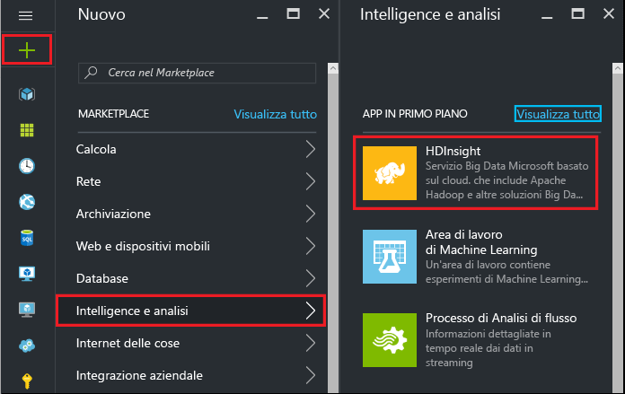
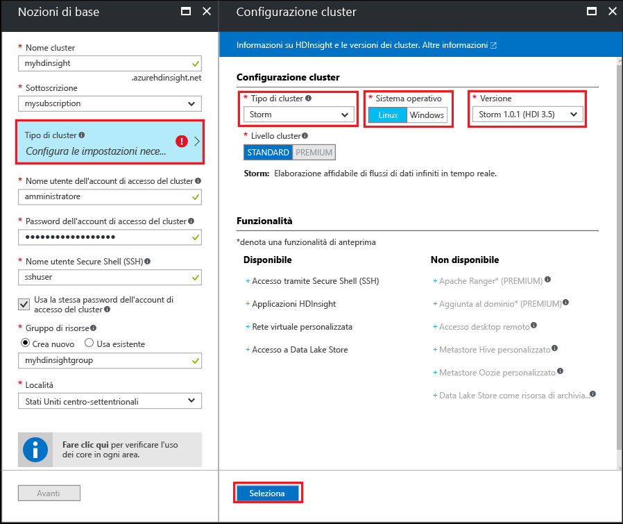

#Introduzione all'analisi di Big Data tramite esempi di Storm Starter in HDInsight basato su Linux

Apache Storm è un sistema di calcolo in tempo reale scalabile, a tolleranza di errore e distribuito per l'elaborazione di flussi di dati. Con Storm in Azure HDInsight è possibile creare un cluster Storm basato sul cloud che esegue analisi di Big Data in tempo reale.

> [!IMPORTANT]
> Linux è l'unico sistema operativo usato in HDInsight versione 3.4 o successiva. Per altre informazioni, vedere [HDInsight deprecato in Windows](hdinsight-component-versioning.md#hdi-version-32-and-33-nearing-deprecation-date).

## Prerequisiti

[!INCLUDE [delete-cluster-warning](../../includes/hdinsight-delete-cluster-warning.md)]

* **Una sottoscrizione di Azure**. Vedere [Ottenere una versione di prova gratuita di Azure](https://azure.microsoft.com/documentation/videos/get-azure-free-trial-for-testing-hadoop-in-hdinsight/).

* **Familiarità con SSH e SCP**. Per altre informazioni sull'uso di SSH e SCP con HDInsight, vedere i documenti seguenti:
  
    * [Usare SSH con Hadoop basato su Linux in HDInsight da Bash in Windows 10, Linux, Unix o OS X](hdinsight-hadoop-linux-use-ssh-unix.md)
    
    * [Usare SSH con Hadoop basato su Linux in HDInsight da Windows con PuTTY](hdinsight-hadoop-linux-use-ssh-windows.md)

### Requisiti di controllo di accesso

[!INCLUDE [access-control](../../includes/hdinsight-access-control-requirements.md)]

## Creare un cluster di Storm

Per creare uno Storm nel cluster HDInsight, seguire questa procedura:

1. Nel [portale di Azure](https://portal.azure.com) fare clic su **+ Nuovo**, **Intelligence e analisi** e quindi selezionare **HDInsight**.
   
    

2. Nel pannello **Informazioni di base** immettere le informazioni seguenti:

    * **Nome del cluster**: nome del cluster HDInsight.
    * **Sottoscrizione**: selezionare la sottoscrizione da usare.
    * **Nome utente dell'account di accesso del cluster** e **Password dell'account di accesso del cluster**: account di accesso usato per il cluster su HTTPS. Queste credenziali vengono usate per accedere a servizi quali l'interfaccia utente Web di Ambari o l'API REST.
    * **Secure Shell (SSH) username** (Nome utente SSH): account di accesso usato per il cluster su SSH. Per impostazione predefinita, la password corrisponde alla password di accesso al cluster.
    * **Gruppo di risorse**: il gruppo di risorse nel quale viene creato il cluster.
    * **Posizione**: area di Azure in cui creare il cluster.
   
    

3. Selezionare **Tipo di cluster**, quindi impostare i valori seguenti nel pannello **Configurazione cluster**:
   
    * **Tipo di cluster**: Storm

    * **Sistema operativo**: Linux

    * **Versione**: Storm 1.0.1 (HDI 3.5)

    * **Livello cluster**: Standard
     
    Usare infine il pulsante **Seleziona** per salvare le impostazioni.
     
    

4. Dopo avere selezionato il tipo di cluster, usare il pulsante __Seleziona__ per impostare il tipo di cluster. Usare quindi il pulsante __Avanti__ per completare la configurazione di base.

5. Nel pannello **Archiviazione** selezionare o creare un account di archiviazione. Per la procedura illustrata in questo documento, non modificare i valori predefiniti degli altri campi nel pannello. Usare il pulsante __Avanti__ per salvare la configurazione della risorsa di archiviazione.

    

6. Nel pannello **Riepilogo** esaminare la configurazione per il cluster. Usare i collegamenti __Modifica__ per cambiare eventuali impostazioni non corrette. Usare infine il pulsante __Crea__ per creare il cluster.
   
    
   
    > [!NOTE]
    > La creazione del cluster può richiedere fino a 20 minuti.

## Eseguire un esempio Storm Starter in HDInsight

1. Connettersi al cluster HDInsight usando SSH:
   
        ssh USERNAME@CLUSTERNAME-ssh.azurehdinsight.net
   
    Se è stata usata una password per proteggere l'account utente SSH, viene richiesto di specificarla. Se è stata usata una chiave pubblica, può essere necessario usare il parametro `-i` per specificare la chiave privata corrispondente. Ad esempio: `ssh -i ~/.ssh/id_rsa USERNAME@CLUSTERNAME-ssh.azurehdinsight.net`.
   
    Per altre informazioni sull'uso di SSH con HDInsight basato su Linux, vedere gli articoli seguenti:
   
    * [Usare SSH con Hadoop basato su Linux in HDInsight da Bash in Windows 10, Linux, Unix o OS X](hdinsight-hadoop-linux-use-ssh-unix.md)

    * [Usare SSH con Hadoop basato su Linux in HDInsight da Windows con PuTTY](hdinsight-hadoop-linux-use-ssh-windows.md)

2. Usare il comando seguente per avviare una topologia di esempio:
   
        storm jar /usr/hdp/current/storm-client/contrib/storm-starter/storm-starter-topologies-*.jar org.apache.storm.starter.WordCountTopology wordcount
   
    > [!NOTE]
    > Nelle versioni precedenti di HDInsight, il nome della classe della topologia è `storm.starter.WordCountTopology` anziché `org.apache.storm.starter.WordCountTopology`.
   
    Il comando avvierà la topologia di esempio WordCount nel cluster usando "wordcount" come nome descrittivo. Verranno generate in modo casuale le frasi e verranno conteggiate le occorrenze di ogni parola nelle frasi.
   
    > [!NOTE]
    > Durante l'invio di una topologia al cluster, è prima di tutto necessario copiare il file con estensione jar contenente il cluster prima di usare il comando `storm`. Usare il comando `scp` per copiare il file. Ad esempio: `scp FILENAME.jar USERNAME@CLUSTERNAME-ssh.azurehdinsight.net:FILENAME.jar`
    > 
    > L'esempio WordCount e altri esempi di avvio dell'utilità storm sono già inclusi nel cluster in `/usr/hdp/current/storm-client/contrib/storm-starter/`.

Se si è interessati a visualizzare il codice sorgente per gli esempi di Storm Starter, è possibile trovare il codice all'indirizzo [https://github.com/apache/storm/tree/1.0.x-branch/examples/storm-starter](https://github.com/apache/storm/tree/1.0.x-branch/examples/storm-starter). Questo collegamento è per Storm 1.0, che viene offerto con HDInsight 3.5. Per altre versioni di Storm, usare il pulsante __Branch__ nella parte superiore della pagina per selezionare una versione diversa di Storm.

## Monitorare la topologia

L'interfaccia utente di Storm è inclusa nel cluster HDInsight e fornisce un'interfaccia Web da usare con le topologie in esecuzione.

Usare la procedura seguente per monitorare la topologia con l'interfaccia utente Storm:

1. Per visualizzare l'interfaccia utente di Storm, aprire un Web browser alla pagina https://CLUSTERNAME.azurehdinsight.net/stormui. Sostituire **CLUSTERNAME** con il nome del cluster.
    
    > [!NOTE]
    > Se viene richiesto di fornire un nome utente e una password, immettere l'amministratore del cluster e la password usati durante la creazione del cluster.

2. Nella sezione **Topology summary** (Riepilogo topologie) selezionare la voce **wordcount** (conteggio parole) nella colonna **Nome**. Verranno visualizzate informazioni sulla topologia.
    
    
    
    In questa pagina sono disponibili le informazioni seguenti:
    
    * **Topology stats** : informazioni di base sulle prestazioni della topologia, organizzate in intervalli di tempo.
     
        > [!NOTE]
        > La selezione di un intervallo di tempo specifico determina la modifica dell'intervallo di tempo relativo a informazioni visualizzate in altre sezioni della pagina.

    * **Spouts** : informazioni di base sugli spout, incluso l'ultimo errore restituito da ciascuno di essi.
    
    * **Bolts** : informazioni di base sui bolt.
    
    * **Topology configuration** : informazioni dettagliate sulla configurazione della topologia.
     
    Questa pagina fornisce anche azioni che possono essere eseguite sulla topologia:
   
    * **Activate** : riprende l'elaborazione di una topologia disattivata.
    
    * **Deactivate** : sospende una topologia in esecuzione.
    
    * **Rebalance** : regola il parallelismo della topologia. È necessario ribilanciare le topologie in esecuzione dopo aver modificato il numero di nodi del cluster. Il ribilanciamento regola il parallelismo per compensare l'aumento o la diminuzione del numero di nodi del cluster. Per altre informazioni, vedere l'articolo relativo al [parallelismo di una topologia Storm](http://storm.apache.org/documentation/Understanding-the-parallelism-of-a-Storm-topology.html).
    
    * **Kill** : arresta una topologia Storm dopo il timeout specificato.

3. In questa pagina selezionare una voce nella sezione **Spouts** o **Bolts**. Verranno visualizzate informazioni relative al componente selezionato.
   
    
   
    In questa pagina vengono visualizzate le informazioni seguenti:
   
    * **Spout/Bolt stats** : informazioni di base sulle prestazioni, organizzate in intervalli di tempo.
     
        > [!NOTE]
        > La selezione di un intervallo di tempo specifico determina la modifica dell'intervallo di tempo relativo a informazioni visualizzate in altre sezioni della pagina.
     
    * **Input stats** (solo bolt): informazioni sui componenti che generano dati utilizzati dal bolt.
    
    * **Output stats** : informazioni sui dati generati dal bolt.
    
    * **Executors** : informazioni sulle istanze del componente.
    
    * **Errors** : errori generati dal componente.

4. Quando si visualizzano i dettagli di uno spout o di un bolt, selezionare una voce nella colonna **Porta** della sezione **Esecutori** per visualizzare i dettagli relativi a una specifica istanza del componente.
   
        2015-01-27 14:18:02 b.s.d.task [INFO] Emitting: split default ["with"]
        2015-01-27 14:18:02 b.s.d.task [INFO] Emitting: split default ["nature"]
        2015-01-27 14:18:02 b.s.d.executor [INFO] Processing received message source: split:21, stream: default, id: {}, [snow]
        2015-01-27 14:18:02 b.s.d.task [INFO] Emitting: count default [snow, 747293]
        2015-01-27 14:18:02 b.s.d.executor [INFO] Processing received message source: split:21, stream: default, id: {}, [white]
        2015-01-27 14:18:02 b.s.d.task [INFO] Emitting: count default [white, 747293]
        2015-01-27 14:18:02 b.s.d.executor [INFO] Processing received message source: split:21, stream: default, id: {}, [seven]
        2015-01-27 14:18:02 b.s.d.task [INFO] Emitting: count default [seven, 1493957]
   
    In questo esempio, la parola **seven** è stata rilevata 1493957 volte. In altri termini, il numero indica le occorrenze della parola dall'avvio della topologia.

## Arrestare la topologia

Tornare alla pagina **Riepilogo topologie** per la topologia relativa al conteggio delle parole e quindi fare clic sul pulsante **Kill** dalla sezione **Topology actions** (Azioni di topologia). Quando richiesto, immettere 10 per il numero di secondi di attesa prima dell'arresto della topologia. Dopo il periodo di timeout, la topologia non viene più visualizzata nella sezione **Interfaccia utente di Storm** del dashboard.

## Eliminazione del cluster

[!INCLUDE [delete-cluster-warning](../../includes/hdinsight-delete-cluster-warning.md)]

## Passaggi successivi

In questa esercitazione di Apache Storm, sono state illustrate le nozioni di base dell'uso di Storm in HDInsight. Vedere quindi altre informazioni su come [sviluppare topologie basate su Java con Maven](hdinsight-storm-develop-java-topology.md).

Se si ha già familiarità con lo sviluppo di topologie basate su Java e si vuole distribuire una topologia esistente in HDInsight, vedere [Distribuire e gestire topologie Apache Storm in HDInsight](hdinsight-storm-deploy-monitor-topology-linux.md).

Uno sviluppatore .NET può creare le topologie C# o C#/Java ibride con Virtual Studio. Per altre informazioni, vedere [Sviluppare topologie C# per Apache Storm in HDInsight con gli strumenti Hadoop per Visual Studio](hdinsight-storm-develop-csharp-visual-studio-topology.md).

Di seguito sono riportati alcuni esempi delle topologie che si possono usare con Storm in HDInsight:

* [Topologie di esempio per Storm in HDInsight](hdinsight-storm-example-topology.md)

[apachestorm]: https://storm.incubator.apache.org
[stormdocs]: http://storm.incubator.apache.org/documentation/Documentation.html
[stormstarter]: https://github.com/apache/storm/tree/master/examples/storm-starter
[stormjavadocs]: https://storm.incubator.apache.org/apidocs/
[azureportal]: https://manage.windowsazure.com/
[hdinsight-provision]: hdinsight-provision-clusters.md
[preview-portal]: https://portal.azure.com/

