# Esercitazione di Apache Storm: Introduzione all'analisi di Big Data mediante esempi di Storm Starter su HDInsight
Apache Storm è un sistema di calcolo in tempo reale scalabile, a tolleranza di errore e distribuito per l'elaborazione di flussi di dati. Con Storm in Microsoft Azure HDInsight è possibile creare un cluster Storm basato sul cloud che esegue analisi di Big Data in tempo reale. 

> [!NOTE]
> I passaggi descritti in questo articolo si basano sull'uso di un cluster HDInsight basato su Windows. Per i passaggi per creare uno Storm basato su Linux nel cluster HDInsight, vedere [Esercitazione Apache Storm: Iniziare a utilizzare l'esempio Storm Starter mediante l’analisi di dati in HDInsight](hdinsight-apache-storm-tutorial-get-started-linux.md)
> 
> 

## Prerequisiti
[!INCLUDE [delete-cluster-warning](../../includes/hdinsight-delete-cluster-warning.md)]

Per completare correttamente questa esercitazione di Apache Storm, è necessario quanto segue:

* **Una sottoscrizione di Azure**. Vedere [Ottenere una versione di valutazione gratuita di Azure](https://azure.microsoft.com/documentation/videos/get-azure-free-trial-for-testing-hadoop-in-hdinsight/).

### Requisiti di controllo di accesso
[!INCLUDE [access-control](../../includes/hdinsight-access-control-requirements.md)]

## Creare un cluster di Storm
Storm in HDInsight usa Archiviazione BLOB di Azure per archiviare i file di log e le topologie inviate al cluster. Per creare un account di archiviazione di Azure da usare con il cluster, seguire questa procedura:

1. Accedere al [portale di Azure][preview-portal].
2. Selezionare **Nuovo**, selezionare **Analisi dei dati**, quindi selezionare **HDInsight**.
   
    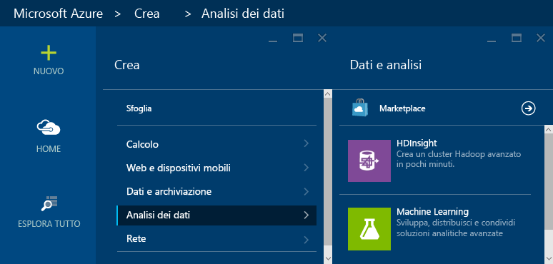
3. Immettere un valore in **Nome cluster**. Un segno di spunta verde appare accanto al **Nome del cluster**, se disponibile.
4. Se sono disponibili più sottoscrizioni, selezionare la voce **Sottoscrizione** per specificare la sottoscrizione di Azure da usare per il cluster.
5. Usare **Selezionare il tipo di cluster** per selezionare un cluster **Storm**. In **Sistema operativo** selezionare Windows. In **Livello cluster** selezionare STANDARD. Infine, usare il pulsante di selezione per salvare le impostazioni.
   
   
6. Selezionare **Gruppo di risorse** per visualizzare un elenco a discesa di gruppi di risorse esistenti e quindi selezionare quello in cui creare il cluster. In alternativa, è possibile selezionare **Nuovo** e quindi immettere il nome del nuovo gruppo di risorse. Viene visualizzato un segno di spunta verde per indicare se il nome del nuovo gruppo è disponibile.
7. Fare clic su **Credenziali** e quindi immettere un valore in **Nome utente dell'account di accesso del cluster** e in **Password dell'account di accesso del cluster**. Usare infine il pulsante **Seleziona** per impostare le credenziali. Il desktop remoto non verrà utilizzato in questo documento, pertanto è possibile lasciarlo disabilitato.
   
    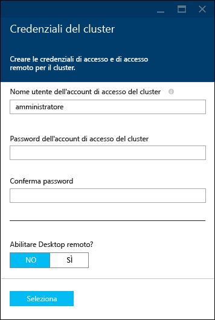
8. Per **Origine dati**, è possibile selezionare la voce per scegliere un'origine dati esistente o crearne una nuova.
   
    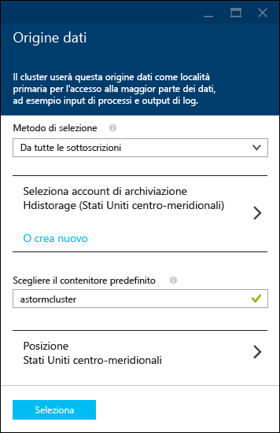
   
    Attualmente è possibile selezionare un account di archiviazione di Azure come origine dati per un cluster HDInsight. Usare le informazioni seguenti per comprendere le voci nel pannello **Origine dati** .
   
   * **Metodo di selezione**: impostare questa proprietà su **Da tutte le sottoscrizioni** per consentire l'esplorazione di account di archiviazione da tutte le sottoscrizioni. Impostare questa proprietà su **Chiave di accesso** per immettere il **Nome di archiviazione** e la **Chiave di accesso** di un account di archiviazione esistente.
   * **Crea nuovo**: per creare un nuovo account di archiviazione. Usare il campo che viene visualizzato per immettere il nome dell'account di archiviazione. Se il nome è disponibile, viene visualizzato un segno di spunta verde.
   * **Scegliere il contenitore predefinito**: usare questa opzione per immettere il nome del contenitore predefinito da usare per il cluster. È possibile immettere qualsiasi nome, è consigliabile utilizzare lo stesso nome del cluster in modo che sia facilmente intuibile che il contenitore viene utilizzato per tale cluster specifico.
   * **Località**: l'area geografica in cui si trova o in cui verrà creato l'account di archiviazione.
     
     > [!IMPORTANT]
     > La selezione del percorso per l'origine dati predefinito imposta anche il percorso del cluster HDInsight. L'origine dati del cluster e l'origine dati predefinita devono trovarsi nella stessa area.
     > 
     > 
   * **Seleziona**: per salvare la configurazione dell'origine dati.
9. Selezionare **Piani tariffari per il nodo** per visualizzare informazioni sui nodi che verranno creati per questo cluster. Per impostazione predefinita, il numero di nodi del ruolo di lavoro è impostato su **4**. Impostare questa proprietà su **1**, perché è sufficiente per questa esercitazione e riduce il costo del cluster. Il costo stimato del cluster verrà visualizzato nella parte inferiore del pannello.
   
    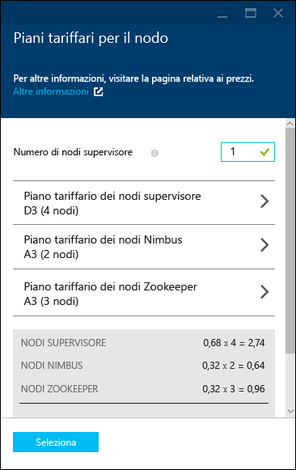
   
    Usare **Seleziona** per salvare le informazioni sui **Piani tariffari per il nodo**.
10. Selezionare **Configurazione facoltativa**. Questo pannello consente di selezionare la versione del cluster e di configurare altre impostazioni facoltative, come l'aggiunta a una **rete virtuale**.
    
     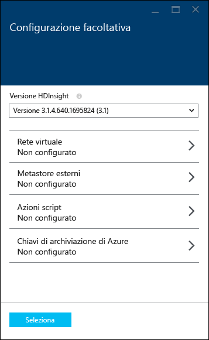
11. Assicurarsi che **Aggiungi alla Schermata iniziale** sia selezionato e quindi selezionare **Crea**. Verrà creato il cluster e verrà aggiunto un riquadro apposito nella Schermata iniziale del portale di Azure. L'icona indica che il cluster sta eseguendo il provisioning e viene sostituita dall'icona di HDInsight al termine del provisioning.
    
    | Durante il provisioning | Provisioning completato |
    | --- | --- |
    |  |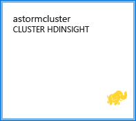 |
    
    > [!NOTE]
    > La creazione del cluster richiede tempo, in genere circa 15 minuti. Usare il riquadro nella Schermata iniziale o la voce **Notifiche** a sinistra della pagina per controllare il processo di provisioning.
    > 
    > 

## Eseguire un esempio Storm Starter in HDInsight
Questa esercitazione di Apache Storm presenta l'analisi di Big Data mediante esempi di Storm Starter in GitHub.

Ogni cluster Storm in HDInsight viene fornito con Storm Dashboard, usato per caricare ed eseguire topologie Storm nel cluster. Ogni cluster viene inoltre fornito con topologie di esempio che possono essere eseguite direttamente da Storm Dashboard.

### Connettersi al dashboard
Il dashboard si trova in **https://&lt;nomecluster>.azurehdinsight.net//**, dove **nomecluster** è il nome del cluster. È anche possibile trovare un collegamento al dashboard selezionando il cluster dalla Schermata iniziale e il collegamento **Dashboard** nella parte superiore del pannello.

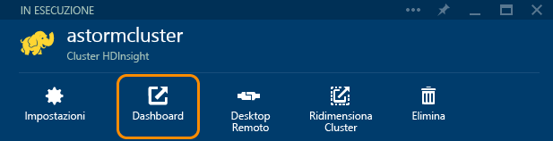

> [!NOTE]
> Quando si esegue la connessione al dashboard, viene chiesto di immettere un nome utente e una password. Immettere il nome amministratore (**admin**) e la password usati per la creazione del cluster.
> 
> 

Dopo aver caricato Storm Dashboard, verrà visualizzato il modulo **Submit Topology** .

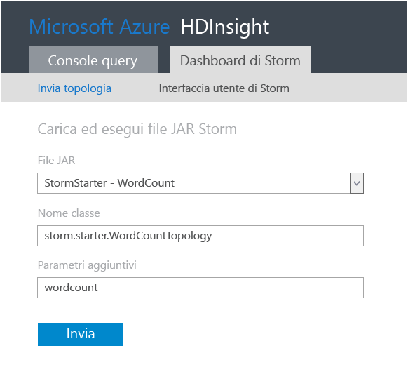

Il modulo **Invia topologia** può essere usato per caricare ed eseguire file con estensione jar contenenti topologie Storm. Include inoltre diversi esempi di base forniti con il cluster.

### Eseguire l'esempio relativo al conteggio parole dal progetto Storm Starter in GitHub
Gli esempi forniti con il cluster includono diverse varianti di una topologia di conteggio parole. Questi esempi includono uno **spout** che genera frasi in modo casuale e **bolt** che suddividono ogni frase in singole parole e quindi contano le occorrenze di ciascuna di esse. Questi esempi sono compresi negli [esempi di Storm Starter](https://github.com/apache/storm/tree/master/examples/storm-starter), che fanno parte di Apache Storm.

Per eseguire un esempio di Storm Starter, seguire questa procedura:

1. Selezionare **StormStarter - WordCount** dall'elenco a discesa **File JAR**. Nei campi **Nome classe** e **Parametri aggiuntivi** verranno inseriti i parametri relativi a questo esempio.
   
    
   
   * **Class Name** : nome della classe nel file con estensione jar che invia la topologia.
   * **Additional Parameters** : qualsiasi parametro necessario per la topologia. In questo esempio il campo viene usato per fornire un nome descrittivo della topologia inviata.
2. Fare clic su **Invia**. Dopo qualche secondo, nel campo **Risultato** viene visualizzato il comando usato per inviare il processo nonché i risultati di tale comando. Il campo **Errore** visualizza eventuali errori verificatisi durante l'invio della topologia.
   
    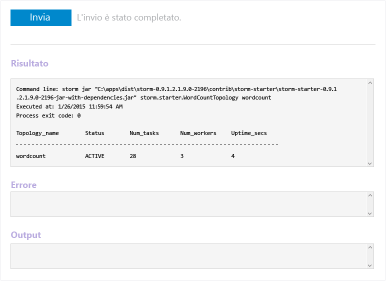
   
   > [!NOTE]
   > I risultati non indicano che la topologia è stata completata. **Dopo essere stata avviata, una topologia Storm viene eseguita fino a quando non viene arrestata.** La topologia relativa al conteggio parole genera frasi casuali e, fino a quando non viene arrestata, conta le occorrenze di ogni parola.
   > 
   > 

### Monitorare la topologia
L'interfaccia utente di Storm consente di monitorare la topologia.

1. Selezionare **Storm UI** nella parte superiore di Storm Dashboard. Verranno visualizzate informazioni di riepilogo relative al cluster e a tutte le topologie in esecuzione.
   
    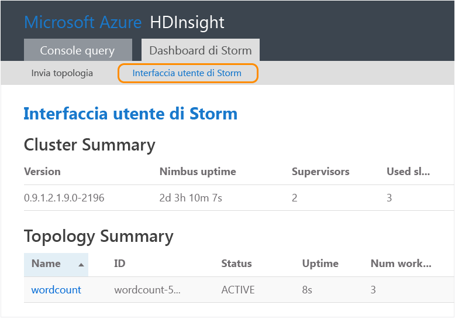
   
    Dalla pagina sopra descritta è possibile visualizzare l'intervallo di tempo per cui la topologia è stata attiva, nonché il numero di thread di lavoro, esecutori e attività usati.
   
   > [!NOTE]
   > La colonna **Nome** contiene il nome descrittivo fornito prima nel campo **Parametri aggiuntivi**.
   > 
   > 
2. Nella sezione **Topology summary** (Riepilogo topologie) selezionare la voce **wordcount** (conteggio parole) nella colonna **Nome**. Verranno visualizzate altre informazioni sulla topologia.
   
    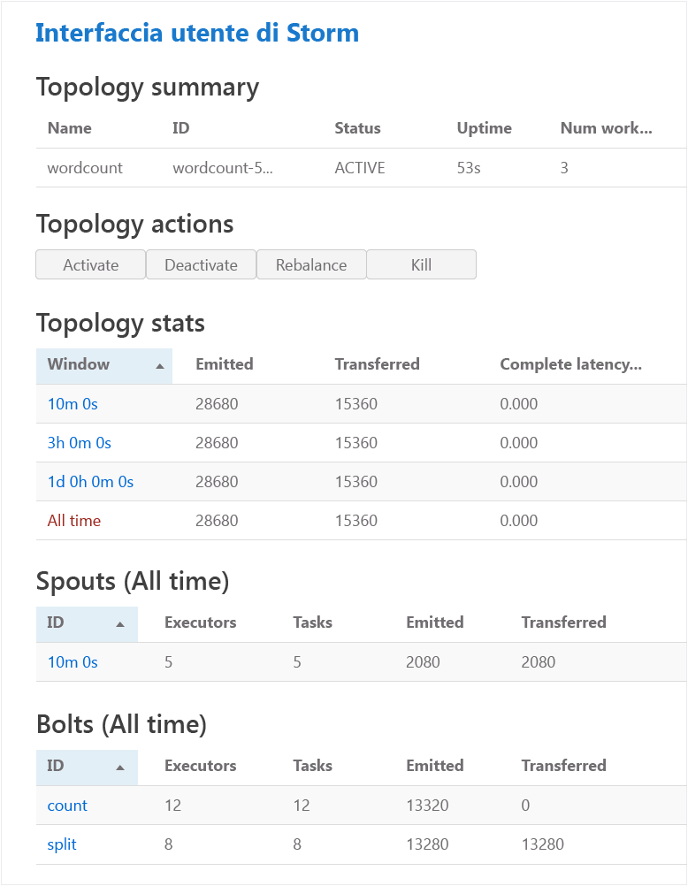
   
    In questa pagina sono disponibili le informazioni seguenti:
   
   * **Topology stats** : informazioni di base sulle prestazioni della topologia, organizzate in intervalli di tempo.
     
     > [!NOTE]
     > La selezione di un intervallo di tempo specifico determina la modifica dell'intervallo di tempo relativo a informazioni visualizzate in altre sezioni della pagina.
     > 
     > 
   * **Spouts** : informazioni di base sugli spout, incluso l'ultimo errore restituito da ciascuno di essi.
   * **Bolts** : informazioni di base sui bolt.
   * **Topology configuration** : informazioni dettagliate sulla configurazione della topologia.
     
     Questa pagina fornisce anche azioni che possono essere eseguite sulla topologia:
   * **Activate** : riprende l'elaborazione di una topologia disattivata.
   * **Deactivate** : sospende una topologia in esecuzione.
   * **Rebalance** : regola il parallelismo della topologia. È necessario ribilanciare le topologie in esecuzione dopo aver modificato il numero di nodi del cluster. Questo consente alla topologia di regolare il parallelismo per compensare l'aumento o la diminuzione del numero di nodi del cluster. Per altre informazioni, vedere l'articolo relativo al [parallelismo di una topologia Storm](http://storm.apache.org/documentation/Understanding-the-parallelism-of-a-Storm-topology.html).
   * **Kill** : arresta una topologia Storm dopo il timeout specificato.
3. In questa pagina selezionare una voce nella sezione **Spouts** o **Bolts**. Verranno visualizzate informazioni relative al componente selezionato.
   
    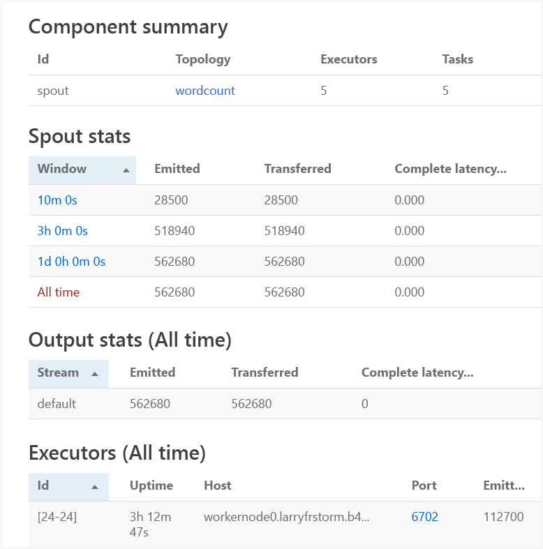
   
    In questa pagina vengono visualizzate le informazioni seguenti:
   
   * **Spout/Bolt stats** : informazioni di base sulle prestazioni, organizzate in intervalli di tempo.
     
     > [!NOTE]
     > La selezione di un intervallo di tempo specifico determina la modifica dell'intervallo di tempo relativo a informazioni visualizzate in altre sezioni della pagina.
     > 
     > 
   * **Input stats** (solo bolt): informazioni sui componenti che generano dati utilizzati dal bolt.
   * **Output stats** : informazioni sui dati generati dal bolt.
   * **Executors** : informazioni sulle istanze del componente.
   * **Errors** : errori generati dal componente.
4. Quando si visualizzano i dettagli di uno spout o di un bolt, selezionare una voce nella colonna **Porta** della sezione **Esecutori** per visualizzare i dettagli relativi a una specifica istanza del componente.
   
        2015-01-27 14:18:02 b.s.d.task [INFO] Emitting: split default ["with"]
        2015-01-27 14:18:02 b.s.d.task [INFO] Emitting: split default ["nature"]
        2015-01-27 14:18:02 b.s.d.executor [INFO] Processing received message source: split:21, stream: default, id: {}, [snow]
        2015-01-27 14:18:02 b.s.d.task [INFO] Emitting: count default [snow, 747293]
        2015-01-27 14:18:02 b.s.d.executor [INFO] Processing received message source: split:21, stream: default, id: {}, [white]
        2015-01-27 14:18:02 b.s.d.task [INFO] Emitting: count default [white, 747293]
        2015-01-27 14:18:02 b.s.d.executor [INFO] Processing received message source: split:21, stream: default, id: {}, [seven]
        2015-01-27 14:18:02 b.s.d.task [INFO] Emitting: count default [seven, 1493957]
   
    Da questi dati è possibile osservare che la parola **seven** è stata rilevata 1.493.957 volte. In altri termini, il numero 1493957 indica le occorrenze della parola dall'avvio della topologia.

### Arrestare la topologia
Tornare alla pagina **Topology summary** (Riepilogo topologie) per la topologia relativa al conteggio parole e quindi selezionare **Termina** nella sezione **Topology actions** (Azioni di topologia). Quando richiesto, immettere 10 per il numero di secondi di attesa prima dell'arresto della topologia. Dopo il periodo di timeout, la topologia non viene più visualizzata nella sezione **Interfaccia utente di Storm** del dashboard.

## Eliminazione del cluster
[!INCLUDE [delete-cluster-warning](../../includes/hdinsight-delete-cluster-warning.md)]

## Riepilogo
In questa esercitazione di Apache Storm si è usato Storm Starter per apprendere come creare un cluster Storm in HDInsight e usare Storm Dashboard per distribuire, monitorare e gestire topologie Storm.

## Passaggi successivi
* **Strumenti HDInsight per Visual Studio**: gli strumenti di HDInsight consentono di usare Visual Studio per inviare, monitorare e gestire topologie Storm in modo simile a quanto avviene in Storm Dashboard, descritto prima. HDInsight Tools offre inoltre la possibilità di creare topologie Storm C#. Include infine topologie di esempio che è possibile distribuire ed eseguire sul cluster.
  
    Per altre informazioni, vedere [Introduzione all'uso di HDInsight Hadoop Tools per Visual Studio per eseguire una query Hive](hdinsight-hadoop-visual-studio-tools-get-started.md).
* **File di esempio**: nella directory **%STORM_HOME%\contrib** del cluster Storm in HDInsight sono disponibili diversi esempi. Ogni esempio deve contenere quanto riportato di seguito:
  
  * Il codice sorgente, ad esempio storm-starter-0.9.1.2.1.5.0-2057-sources.jar
  * I documenti Java, ad esempio storm-starter-0.9.1.2.1.5.0-2057-javadocs.jar
  * L'esempio, ad esempio storm-starter-0.9.1.2.1.5.0-2057-jar-with-dependencies.jar
    
    Usare il comando "jar" per estrarre il codice sorgente o i documenti Java, ad esempio "jar -xvf storm-starter-0.9.1.2.1.5.0.2057-javadoc.jar".
    
    > [!NOTE]
    > I documenti Java sono costituiti da pagine Web. Dopo aver estratto i file, usare un browser per visualizzare il file **index.html** .
    > 
    > 
    
    Per accedere a questi esempi, è necessario abilitare Desktop remoto per Storm nel cluster HDInsight e quindi copiare i file da **%STORM_HOME%\contrib**.
* Il documento seguente contiene un elenco di altri esempi che è possibile usare con Storm in HDInsight:
  
  * [Topologie di esempio per Storm in HDInsight](hdinsight-storm-example-topology.md)

[apachestorm]: https://storm.incubator.apache.org
[stormdocs]: http://storm.incubator.apache.org/documentation/Documentation.html
[stormstarter]: https://github.com/apache/storm/tree/master/examples/storm-starter
[stormjavadocs]: https://storm.incubator.apache.org/apidocs/
[azureportal]: https://manage.windowsazure.com/
[hdinsight-provision]: hdinsight-provision-clusters.md
[preview-portal]: https://portal.azure.com/

<!--HONumber=Nov16_HO3-->

