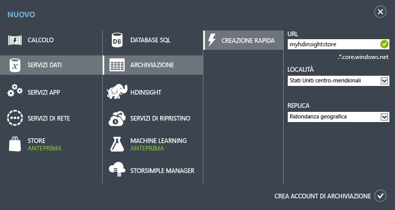

<properties
	pageTitle="Esercitazione di Apache Storm: Introduzione a Storm | Microsoft Azure"
	description="Introduzione all'analisi di Big Data mediante Apache Storm ed esempi di Storm Starter in HDInsight. Informazioni su come usare Storm per elaborare i dati in tempo reale."
	keywords="apache storm,apache storm tutorial,big data analytics,storm starter"
	services="hdinsight"
	documentationCenter=""
	authors="Blackmist"
	manager="paulettm"
	editor="cgronlun"/>

<tags
   ms.service="hdinsight"
   ms.devlang="java"
   ms.topic="get-started-article"
   ms.tgt_pltfrm="na"
   ms.workload="big-data"
   ms.date="07/06/2015"
   ms.author="larryfr"/>

# Esercitazione di Apache Storm: Introduzione all'analisi di Big Data mediante esempi di Storm Starter su HDInsight

Apache Storm è un sistema di calcolo in tempo reale scalabile, a tolleranza di errore e distribuito per l'elaborazione di flussi di dati. Con Storm in Azure HDInsight è possibile creare un cluster Storm basato sul cloud che esegue analisi di Big Data in tempo reale.

## Prima di iniziare

Per completare correttamente questa esercitazione di Apache Storm, è necessario quanto segue:

- **Una sottoscrizione di Azure**. Vedere [Ottenere una versione di prova gratuita di Azure](http://azure.microsoft.com/documentation/videos/get-azure-free-trial-for-testing-hadoop-in-hdinsight/).

## Creare un account di archiviazione di Azure

Storm in HDInsight usa Archiviazione BLOB di Azure per archiviare i file di log e le topologie inviate al cluster. Per creare un account di Archiviazione di Azure da usare con il cluster, seguire questa procedura:

1. Accedere al [portale di Azure](http://manage.windowsazure.com/).

2. Fare clic su **NUOVO** nell'angolo inferiore sinistro, selezionare **SERVIZI DATI**, quindi **ARCHIVIAZIONE** e infine su **CREAZIONE RAPIDA**.

	

3. Immettere le informazioni richieste in **URL**, **LOCALITÀ** e **REPLICA** e quindi fare clic su **CREA ACCOUNT DI ARCHIVIAZIONE**. Non selezionare un gruppo di affinità durante la creazione dell'archivio per HDInsight. Il nuovo account di archiviazione verrà incluso nell'elenco di archiviazione.

	>[AZURE.NOTE]L'opzione Creazione rapida per il provisioning di un cluster HDInsight, come quello usato in questa esercitazione, non richiede un percorso durante il provisioning del cluster. Il cluster si trova invece per impostazione predefinita nello stesso data center usato per l'account di archiviazione. Assicurarsi di creare l'account di archiviazione nelle aree supportate per il cluster, ovvero: **Asia orientale**, **Asia sudorientale**, **Europa settentrionale**, **Europa occidentale**, **Stati Uniti Orientali**, **Stati Uniti Occidentali**, **Stati Uniti centro-settentrionali** e **Stati Uniti centro-meridionali**.

4. Attendere che il valore **STATO** del nuovo account di archiviazione venga modificato in **Online**.

Per altre informazioni sulla creazione di account di archiviazione, vedere [Come creare un account di archiviazione](../storage/storage-create-storage-account.md)

##Eseguire il provisioning di un cluster Storm nel portale di Azure

Quando si esegue il provisioning di un cluster HDInsight, si esegue il provisioning delle risorse di calcolo di Azure che includono Apache Storm e le applicazioni correlate. È anche possibile creare cluster Hadoop per altre versioni usando il portale di Azure, i cmdlet Azure PowerShell per HDInsight o .NET SDK per HDInsight. Per istruzioni, vedere [Provisioning di cluster HDInsight con opzioni personalizzate][hdinsight-provision]. Per informazioni sulle diverse versioni di HDInsight e i relativi contratti di servizio, vedere [Novità delle versioni cluster di Hadoop incluse in HDInsight](hdinsight-component-versioning.md).

[AZURE.INCLUDE [provisioningnote](../../includes/hdinsight-provisioning.md)]

1. Accedere al [portale di Azure][azureportal].

2. Fare clic su **HDInsight** a sinistra e quindi su **+NUOVO** nell'angolo inferiore sinistro della pagina.

3. Fare clic sull'icona di HDInsight nella seconda colonna e quindi selezionare **STORM**.

	

4. Immettere un nome cluster e una password univoci per l'account amministratore. In **ACCOUNT DI ARCHIVIAZIONE** selezionare l'account di archiviazione creato in precedenza.

	Per **DIMENSIONE DEL CLUSTER** selezionare la dimensione **1 nodo dati** da usare per il cluster. Questa scelta consente di contenere i costi associati al cluster. Per l'uso in produzione, è necessario creare un cluster di maggiori dimensioni.

	> [AZURE.NOTE]L'account amministratore del cluster è **admin**. La password immessa è la password per questo account. Queste informazioni sono necessarie per eseguire azioni con il cluster, ad esempio l'invio o la gestione di topologie Storm.

5. Infine, selezionare il segno di spunta accanto a **CREAZIONE DEL CLUSTER HDINSIGHT** per creare il cluster.

> [AZURE.NOTE]Il provisioning del cluster richiede un po' di tempo, in genere meno di 15 minuti, per creare il cluster, configurare il software e installare i dati e le topologie di esempio.

##Eseguire un esempio Storm Starter in HDInsight

Questa esercitazione di Apache Storm presenta l'analisi di Big Data mediante esempi di Storm Starter in GitHub.

Ogni cluster Storm in HDInsight viene fornito con Storm Dashboard, usato per caricare ed eseguire topologie Storm nel cluster. Ogni cluster viene inoltre fornito con topologie di esempio che possono essere eseguite direttamente da Storm Dashboard.

###Connettersi al dashboard

Il dashboard si trova in **https://&lt;clustername>.azurehdinsight.net//**, dove **NomeCluster** è il nome del cluster. È inoltre possibile trovare un collegamento al dashboard nella parte inferiore della pagina del portale di Azure relativa al cluster.

> [AZURE.NOTE]Durante la connessione al dashboard, verrà chiesto di immettere un nome utente e una password. Immettere il nome amministratore (**admin**) e la password usati per la creazione del cluster.

Dopo aver caricato Storm Dashboard, verrà visualizzato il modulo **Submit Topology**.

Il modulo **Submit Topology** può essere usato per caricare ed eseguire file con estensione jar contenenti file e topologie Storm. Include inoltre diversi esempi di base forniti con il cluster.

###Eseguire l'esempio relativo al conteggio parole dal progetto Storm Starter in GitHub

Gli esempi forniti con il cluster includono diverse varianti di una topologia di conteggio parole. Questi esempi includono uno **spout** che genera frasi in modo casuale e **bolt** che suddividono ogni frase in singole parole e quindi contano le occorrenze di ciascuna di esse. Questi esempi sono compresi negli [esempi di Storm Starter](https://github.com/apache/storm/tree/master/examples/storm-starter), che fanno parte di Apache Storm.

Per eseguire un esempio di Storm Starter, seguire questa procedura:

1. Selezionare **StormStarter - WordCount** dall'elenco a discesa **Jar File**. Nei campi **Class Name** e **Additional Parameters** verranno inseriti i parametri relativi a questo esempio.

	

	* **Class Name**: nome della classe nel file con estensione jar che invia la topologia.
	* **Additional Parameters**: qualsiasi parametro necessario per la topologia. In questo esempio il campo viene usato per fornire un nome descrittivo della topologia inviata.

2. Fare clic sul pulsante **Submit**. Dopo qualche secondo, nel campo **Result** verrà visualizzato il comando usato per inviare il processo nonché i risultati di tale comando. Il campo **Error** visualizzerà eventuali errori verificatisi nella topologia di invio.

	

	> [AZURE.NOTE]I risultati non indicano che la topologia è stata completata. **Dopo essere stata avviata, una topologia Storm viene eseguita fino a quando non viene arrestata.** La topologia relativa al conteggio parole genererà frasi in modo casuale e, fino a quando non verrà arrestata, conterà le occorrenze di ogni parola.

###Monitorare la topologia

L'interfaccia utente di Storm consente di monitorare la topologia.

1. Selezionare **Storm UI** nella parte superiore di Storm Dashboard. Verranno visualizzate informazioni di riepilogo relative al cluster e a tutte le topologie in esecuzione.

	

	Dalla pagina sopra descritta è possibile visualizzare l'intervallo di tempo per cui la topologia è stata attiva, nonché il numero di thread di lavoro, esecutori e attività usati.

	> [AZURE.NOTE]La colonna **Name** contiene il nome descrittivo fornito in precedenza nel campo **Additional Parameters**.

4. Nella sezione **Topology summary** selezionare la voce **wordcount** nella colonna **Name**. Verranno visualizzate altre informazioni sulla topologia.

	

	In questa pagina sono disponibili le informazioni seguenti:

	* **Topology stats**: informazioni di base sulle prestazioni della topologia, organizzate in intervalli di tempo.

		> [AZURE.NOTE]La selezione di un intervallo di tempo specifico determina la modifica dell'intervallo di tempo relativo a informazioni visualizzate in altre sezioni della pagina.

	* **Spouts**: informazioni di base sugli spout, incluso l'ultimo errore restituito da ciascuno di essi.

	* **Bolts**: informazioni di base sui bolt.

	* **Topology configuration**: informazioni dettagliate sulla configurazione della topologia.

	Questa pagina fornisce anche azioni che possono essere eseguite sulla topologia:

	* **Activate**: riprende l'elaborazione di una topologia disattivata.

	* **Deactivate**: sospende una topologia in esecuzione.

	* **Rebalance**: regola il parallelismo della topologia. È necessario ribilanciare le topologie in esecuzione dopo aver modificato il numero di nodi del cluster. Questo consente alla topologia di regolare il parallelismo per compensare l'aumento o la diminuzione del numero di nodi del cluster. Per altre informazioni, vedere l'articolo relativo al [parallelismo di una topologia Storm](http://storm.apache.org/documentation/Understanding-the-parallelism-of-a-Storm-topology.html).

	* **Kill**: arresta una topologia Storm dopo il timeout specificato.

5. In questa pagina selezionare una voce nella sezione **Spouts** o **Bolts**. Verranno visualizzate informazioni relative al componente selezionato.

	

	In questa pagina vengono visualizzate le informazioni seguenti:

	* **Spout/Bolt stats**: informazioni di base sulle prestazioni, organizzate in intervalli di tempo.

		> [AZURE.NOTE]La selezione di un intervallo di tempo specifico determina la modifica dell'intervallo di tempo relativo a informazioni visualizzate in altre sezioni della pagina.

	* **Input stats** (solo bolt): informazioni sui componenti che generano dati utilizzati dal bolt.

	* **Output stats**: informazioni sui dati generati dal bolt.

	* **Executors**: informazioni sulle istanze del componente.

	* **Errors**: errori generati dal componente.

5. Quando si visualizzano i dettagli di uno spout o di un bolt, selezionare una voce nella colonna **Port** della sezione **Executors** per visualizzare i dettagli relativi a una specifica istanza del componente.

		2015-01-27 14:18:02 b.s.d.task [INFO] Emitting: split default ["with"]
		2015-01-27 14:18:02 b.s.d.task [INFO] Emitting: split default ["nature"]
		2015-01-27 14:18:02 b.s.d.executor [INFO] Processing received message source: split:21, stream: default, id: {}, [snow]
		2015-01-27 14:18:02 b.s.d.task [INFO] Emitting: count default [snow, 747293]
		2015-01-27 14:18:02 b.s.d.executor [INFO] Processing received message source: split:21, stream: default, id: {}, [white]
		2015-01-27 14:18:02 b.s.d.task [INFO] Emitting: count default [white, 747293]
		2015-01-27 14:18:02 b.s.d.executor [INFO] Processing received message source: split:21, stream: default, id: {}, [seven]
		2015-01-27 14:18:02 b.s.d.task [INFO] Emitting: count default [seven, 1493957]

	Da questi dati è possibile vedere che la parola **seven** è stata rilevata 1493957 volte. In altri termini, il numero 1493957 indica le occorrenze della parola dall'avvio della topologia.

###Arrestare la topologia

Tornare alla pagina **Topology summary** per la topologia relativa al conteggio parole e quindi fare clic sul pulsante **Kill** nella sezione **Topology actions**. Quando richiesto, immettere 10 per il numero di secondi di attesa prima dell'arresto della topologia. Dopo il periodo di timeout, la topologia non verrà più visualizzata nella sezione **Storm UI** del dashboard.

##Riepilogo

In questa esercitazione di Apache Storm si è usato Storm Starter per apprendere come creare un cluster Storm in HDInsight e usare Storm Dashboard per distribuire, monitorare e gestire topologie Storm.

##Passaggi successivi

* **HDInsight Tools per Visual Studio**: HDInsight Tools consente di usare Visual Studio per inviare, monitorare e gestire topologie Storm in modo simile a quanto avviene in Storm Dashboard, descritto in precedenza. HDInsight Tools offre inoltre la possibilità di creare topologie Storm C#. Include infine topologie di esempio che è possibile distribuire ed eseguire sul cluster.

	Per altre informazioni, vedere [Introduzione all'uso di HDInsight Tools per Visual Studio](hdinsight-hadoop-visual-studio-tools-get-started.md).

* **File di esempio**: nella directory **%STORM_HOME%\contrib** del cluster Storm in HDInsight sono disponibili diversi esempi. Ogni esempio deve contenere quanto riportato di seguito:

	* Il codice sorgente, ad esempio storm-starter-0.9.1.2.1.5.0-2057-sources.jar

	* I documenti Java, ad esempio storm-starter-0.9.1.2.1.5.0-2057-javadocs.jar

	* L'esempio, ad esempio storm-starter-0.9.1.2.1.5.0-2057-jar-with-dependencies.jar

	Usare il comando "jar" per estrarre il codice sorgente o i documenti Java, ad esempio "jar -xvf storm-starter-0.9.1.2.1.5.0.2057-javadoc.jar".

	> [AZURE.NOTE]I documenti Java sono costituiti da pagine Web. Dopo aver estratto i file, usare un browser per visualizzare il file **index.html**.

	Per accedere a questi esempi, è necessario abilitare Desktop remoto per Storm nel cluster HDInsight e quindi copiare i file da **%STORM_HOME%\contrib**.

* Il documento seguente contiene un elenco di altri esempi che è possibile usare con Storm in HDInsight:

	* [Topologie di esempio per Storm in HDInsight](hdinsight-storm-example-topology.md)

[apachestorm]: https://storm.incubator.apache.org
[stormdocs]: http://storm.incubator.apache.org/documentation/Documentation.html
[stormstarter]: https://github.com/apache/storm/tree/master/examples/storm-starter
[stormjavadocs]: https://storm.incubator.apache.org/apidocs/
[azureportal]: https://manage.windowsazure.com/
[hdinsight-provision]: hdinsight-provision-clusters.md

<!---HONumber=July15_HO4-->