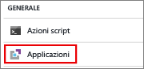
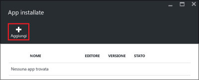
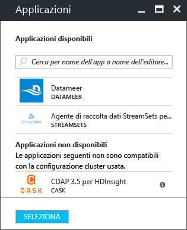
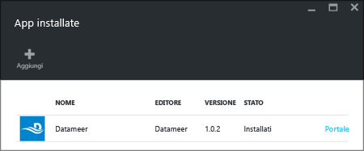

<properties
   	pageTitle="Installare applicazioni Hadoop in HDInsight | Microsoft Azure"
   	description="Informazioni su come installare applicazioni HDInsight in applicazioni HDInsight."
   	services="hdinsight"
   	documentationCenter=""
   	authors="mumian"
   	manager="jhubbard"
   	editor="cgronlun"
	tags="azure-portal"/>

<tags
   	ms.service="hdinsight"
   	ms.devlang="na"
   	ms.topic="hero-article"
   	ms.tgt_pltfrm="na"
   	ms.workload="big-data"
   	ms.date="09/14/2016"
   	ms.author="jgao"/>



# Installare applicazioni HDInsight

Un'applicazione HDInsight è un'applicazione che gli utenti possono installare in un cluster HDInsight basato su Linux. Queste applicazioni possono essere sviluppate da Microsoft, da fornitori di software indipendenti (ISV) o dall'utente. In questo articolo si apprenderà come installare un'applicazione pubblicata. Per installare un'applicazione personalizzata, vedere [Installare applicazioni HDInsight personalizzate](hdinsight-apps-install-custom-applications.md).

Attualmente è disponibile un'applicazione pubblicata:

- **Datameer**: [Datameer](http://www.datameer.com/documentation/display/DAS50/Home?ls=Partners&lsd=Microsoft&c=Partners&cd=Microsoft) offre agli analisti un modo interattivo per rilevare, analizzare e visualizzare i risultati nei Big Data. Consente di effettuare il pull di altre origini dati con facilità per individuare nuove relazioni e ottenere rapidamente le risposte necessarie.

>[AZURE.NOTE] Datameer è attualmente supportata solo nei cluster Azure HDInsight versione 3.2.

Nelle istruzioni illustrate in questo articolo si usa il portale di Azure. È anche possibile esportare il modello di Azure Resource Manager dal portale oppure ottenere una copia del modello di Resource Manager dai fornitori e usare l'interfaccia della riga di comando di Azure e Azure PowerShell per distribuire il modello. Vedere [Creare cluster Hadoop basati su Linux in HDInsight tramite modelli ARM](hdinsight-hadoop-create-linux-clusters-arm-templates.md).

## Prerequisiti

Per installare applicazioni HDInsight in un cluster HDInsight esistente, è necessario un cluster HDInsight. Per crearne uno, vedere [Creare cluster](hdinsight-hadoop-linux-tutorial-get-started.md#create-cluster). È anche possibile installare applicazioni HDInsight quando si crea un cluster HDInsight.

## Installare applicazioni in cluster esistenti

La procedura seguente illustra come installare applicazioni HDInsight in un cluster HDInsight esistente.

**Per installare un'applicazione HDInsight**

1. Accedere al [portale di Azure](https://portal.azure.com).
2. Fare clic su **Cluster HDInsight** nel menu a sinistra. Se non è visualizzato, fare clic su **Esplora** e quindi su **Cluster HDInsight**.
3. Fare clic su un cluster HDInsight. Se non ci sono cluster disponibili, è necessario crearne uno. Vedere [Creare cluster](hdinsight-hadoop-linux-tutorial-get-started.md#create-cluster).
4. Nel pannello **Impostazioni** fare clic su **Applicazioni** nella categoria **Generale**. Il pannello **App installate** elenca tutte le applicazioni installate.

    

5. Fare clic su **Aggiungi** nel menu del pannello.

    

	Verrà visualizzato un elenco delle applicazioni HDInsight esistenti.

	

6. Fare clic su una delle applicazioni, accettare le condizioni legali e quindi fare clic su **Seleziona**.

È possibile vedere lo stato di installazione dell'applicazione dalle notifiche del portale facendo clic sull'icona a forma di campana nella parte superiore del portale. Dopo l'installazione dell'applicazione, questa verrà visualizzata nel pannello App installate.

## Installare applicazioni durante la creazione del cluster

È possibile installare applicazioni HDInsight quando si crea un cluster. Durante il processo, le applicazioni HDInsight vengono installate dopo la creazione del cluster e mentre è nello stato in corso di esecuzione. La procedura seguente illustra come installare applicazioni HDInsight mentre si crea un cluster.

**Per installare un'applicazione HDInsight**

1. Accedere al [portale di Azure](https://portal.azure.com).
2. Fare clic su **NUOVO**, su **Dati e analisi** e quindi su **HDInsight**.
3. Immettere il **Nome cluster**: deve essere un nome univoco globale.
4. Fare clic su **Sottoscrizione** per selezionare la sottoscrizione di Azure utilizzata per il cluster.
5. Fare clic su **Selezionare il tipo di cluster** e quindi selezionare:

    - **Tipo di cluster**: in caso di dubbi su questa opzione, scegliere **Hadoop**. È il tipo di cluster più diffuso.
    - **Sistema operativo**: selezionare **Linux**.
    - **Versione**: utilizzare la versione predefinita, in caso di dubbi. Per altre informazioni, vedere [Versioni del cluster HDInsight](hdinsight-component-versioning.md).
    - **Livello del cluster**: HDInsight di Azure fornisce offerte cloud per i Big Data in due categorie: livello Standard e livello Premium. Per altre informazioni, vedere [Livelli di cluster](hdinsight-hadoop-provision-linux-clusters.md#cluster-tiers).
6. Fare clic su **Applicazioni**, fare clic su una delle applicazioni pubblicate e quindi su **Seleziona**.
6. Fare clic su **Credenziali** e quindi immettere una password per l'utente amministratore. È anche necessario immettere un valore nel campo **Nome utente SSH** e un valore in **PASSWORD** o **CHIAVE PUBBLICA**, che verranno usati per autenticare l'utente SSH. Si consiglia di utilizzare una chiave pubblica. Fare clic su **Seleziona** nella parte inferiore per salvare la configurazione delle credenziali.
8. Fare clic su **Origine dati**, selezionare uno degli account di archiviazione esistenti oppure crearne uno nuovo da usare come account di archiviazione predefinito per il cluster.
9. Fare clic su **Gruppo di risorse** per selezionare un gruppo di risorse esistente o fare clic su **Nuovo** per crearne uno nuovo.

10. Nel pannello **Nuovo cluster HDInsight** assicurarsi che l'opzione **Aggiungi a Schermata iniziale** sia selezionata e quindi fare clic su **Crea**.

## Elencare le app HDInsight installate e le proprietà

Il portale include un elenco delle applicazioni HDInsight installate per un cluster e le proprietà di ognuna.

**Per elencare le applicazioni HDInsight e visualizzare le proprietà**

1. Accedere al [portale di Azure](https://portal.azure.com).
2. Fare clic su **Cluster HDInsight** nel menu a sinistra. Se non è visualizzato, fare clic su **Esplora** e quindi su **Cluster HDInsight**.
3. Fare clic su un cluster HDInsight.
4. Nel pannello **Impostazioni** fare clic su **Applicazioni** nella categoria **Generale**. Il pannello App installate elenca tutte le applicazioni installate.

	

5. Fare clic su una delle applicazioni installate per visualizzare la proprietà. Il pannello delle proprietà elenca:

    - Nome dell'app: nome all'applicazione.
    - Stato: stato dell'applicazione.
    - Pagina Web: URL dell'applicazione Web distribuita all'eventuale nodo perimetrale. Le credenziali sono le stesse usate per le credenziali utente HTTP configurate per il cluster.
    - Endpoint HTTP: le credenziali sono le stesse usate per le credenziali utente HTTP configurate per il cluster.
    - Endpoint SSH: è possibile usare [SSH](hdinsight-hadoop-linux-use-ssh-unix.md) per connettersi al nodo perimetrale. Le credenziali SSH sono le stesse usate per le credenziali utente SSH configurate per il cluster.

6. Per eliminare un'applicazione, fare clic con il pulsante destro del mouse sull'applicazione e quindi scegliere **Elimina** dal menu di scelta rapida.

## Connettersi al nodo perimetrale

È possibile connettersi al nodo perimetrale tramite HTTP e SSH. Le informazioni sull'endpoint sono disponibili nel [portale](#list-installed-hdinsight-apps-and-properties). Per altre informazioni sull'uso di SSH, vedere [Usare SSH con Hadoop basato su Linux in HDInsight da Linux, Unix o OS X](hdinsight-hadoop-linux-use-ssh-unix.md).

Le credenziali dell'endpoint HTTP sono le credenziali utente HTTP configurate per il cluster HDInsight. Le credenziali dell'endpoint SSH sono le credenziali SSH configurate per il cluster HDInsight.

## Risoluzione dei problemi

Vedere [Risolvere i problemi di installazione](hdinsight-apps-install-custom-applications.md#troubleshoot-the-installation).

## Passaggi successivi

- [Installare applicazioni HDInsight personalizzate](hdinsight-apps-install-custom-applications.md): informazioni su come distribuire in HDInsight un'applicazione HDInsight non pubblicata.
- [Pubblicare applicazioni HDInsight](hdinsight-apps-publish-applications.md): informazioni su come pubblicare applicazioni HDInsight personalizzate in Azure Marketplace.
- [MSDN: Install an HDInsight application](https://msdn.microsoft.com/library/mt706515.aspx) (MSDN: Installare un'applicazione HDInsight): informazioni su come definire le applicazioni HDInsight.
- [Personalizzare cluster HDInsight basati su Linux tramite Azioni script](hdinsight-hadoop-customize-cluster-linux.md): informazioni su come usare Azioni script per installare applicazioni aggiuntive.
- [Creare cluster Hadoop basati su Linux in HDInsight tramite modelli ARM](hdinsight-hadoop-create-linux-clusters-arm-templates.md): informazioni su come chiamare i modelli di Azure Resource Manager per creare cluster HDInsight.
- [Use empty edge nodes in HDInsight](hdinsight-apps-use-edge-node.md) (Usare nodi perimetrali vuoti in HDInsight): informazioni su come usare un nodo perimetrale vuoto per l'accesso a cluster HDInsight, il test di applicazioni HDInsight e l'hosting di applicazioni HDInsight.

<!---HONumber=AcomDC_0914_2016-->