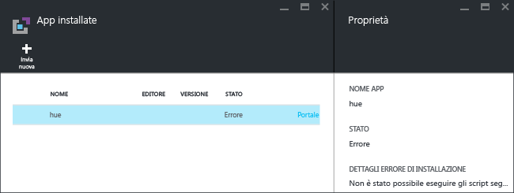
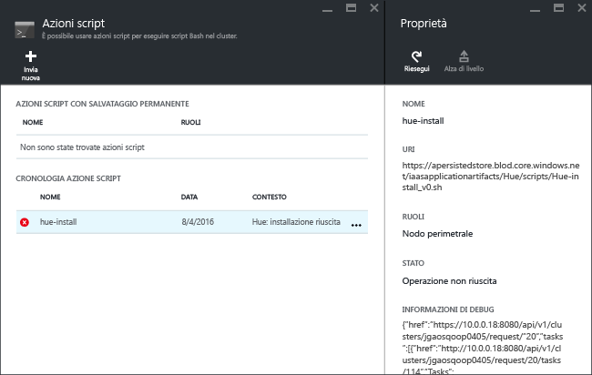

# Installare applicazioni Hadoop personalizzate in Azure HDInsight

Questo articolo illustra come installare un'applicazione Hadoop non pubblicata nel portale di Azure in Azure HDInsight. L'applicazione che verrà installata in questo articolo è [Hue](http://gethue.com/).

Un'applicazione HDInsight è un'applicazione che gli utenti possono installare in un cluster HDInsight basato su Linux.  Queste applicazioni possono essere sviluppate da Microsoft, da fornitori di software indipendenti (ISV) o dall'utente.  

Altri articoli correlati:

* [Installare applicazioni HDInsight](hdinsight-apps-install-applications.md): informazioni su come installare un'applicazione HDInsight nei cluster.
* [Pubblicare applicazioni HDInsight](hdinsight-apps-publish-applications.md): informazioni su come pubblicare applicazioni HDInsight personalizzate in Azure Marketplace.
* [MSDN: Install an HDInsight application](https://msdn.microsoft.com/library/mt706515.aspx)(MSDN: Installare un'applicazione HDInsight): informazioni su come definire le applicazioni HDInsight.

## Prerequisiti
Per installare applicazioni HDInsight in un cluster HDInsight esistente, è necessario un cluster HDInsight. Per crearne uno, vedere [Creare cluster](hdinsight-hadoop-linux-tutorial-get-started.md#create-cluster). È anche possibile installare applicazioni HDInsight quando si crea un cluster HDInsight.

## Installare applicazioni HDInsight
Le applicazioni HDInsight possono essere installate quando si crea un cluster o in un cluster HDInsight esistente. Per definire i modelli di Azure Resource Manager, vedere [MSDN: Install an HDInsight application](https://msdn.microsoft.com/library/mt706515.aspx)(MSDN: Installare un'applicazione HDInsight).

File necessari per distribuire questa applicazione (Hue):

* [azuredeploy.json](https://github.com/hdinsight/Iaas-Applications/blob/master/Hue/azuredeploy.json): modello di Azure Resource Manager per installare l'applicazione HDInsight. Per sviluppare il proprio modello di Azure Resource Manager, vedere [MSDN: Install an HDInsight application](https://msdn.microsoft.com/library/mt706515.aspx) (MSDN: Installare un'applicazione HDInsight).
* [hue-install_v0.sh](https://github.com/hdinsight/Iaas-Applications/blob/master/Hue/scripts/Hue-install_v0.sh): azione script chiamata dal modello di Resource Manager per configurare il nodo perimetrale.
* [hue-binaries.tgz](https://hdiconfigactions.blob.core.windows.net/linuxhueconfigactionv01/hue-binaries-14-04.tgz): file binario hue chiamato da hui-install_v0.sh.
* [hue-binaries-14-04.tgz](https://hdiconfigactions.blob.core.windows.net/linuxhueconfigactionv01/hue-binaries-14-04.tgz): file binario hue chiamato da hui-install_v0.sh.
* [webwasb-tomcat.tar.gz](https://hdiconfigactions.blob.core.windows.net/linuxhueconfigactionv01/webwasb-tomcat.tar.gz): applicazione Web di esempio (Tomcat) chiamata da hui-install_v0.sh.

**Per installare Hue in un cluster HDInsight esistente**

1. Fare clic sull'immagine seguente per accedere ad Azure e aprire il modello di Azure Resource Manager nel portale di Azure.

    

    Questo pulsante apre un modello di Azure Resource Manager nel portale di Azure.  Il modello di Azure Resource Manager è disponibile all'indirizzo [https://github.com/hdinsight/Iaas-Applications/tree/master/Hue](https://github.com/hdinsight/Iaas-Applications/tree/master/Hue).  Per informazioni su come scrivere questo modello di Azure Resource Manager, vedere [MSDN: Install an HDInsight application](https://msdn.microsoft.com/library/mt706515.aspx)(MSDN: Installare un'applicazione HDInsight).
2. Nel pannello **Parametri** immettere le informazioni seguenti:

   * **ClusterName**: immettere il nome del cluster in cui installare l'applicazione. Deve essere un cluster esistente.
3. Fare clic su **OK** per salvare i parametri.
4. Nel pannello **Distribuzione personalizzata** immettere **Gruppo di risorse**.  Il gruppo di risorse è un contenitore che raggruppa il cluster, l'account di archiviazione dipendente e altre risorse. È necessario usare lo stesso gruppo di risorse del cluster.
5. Fare clic su **Note legali** e quindi su **Crea**.
6. Verificare che la casella di controllo **Aggiungi al dashboard** sia selezionata e quindi fare clic su **Crea**. È possibile visualizzare lo stato dell'installazione dal riquadro aggiunto al dashboard del portale e dalla notifica del portale facendo clic sull'icona a forma di campana nella parte superiore del portale.  Sono necessari circa 10 minuti per installare l'applicazione.

**Per installare Hue durante la creazione di un cluster**

1. Fare clic sull'immagine seguente per accedere ad Azure e aprire il modello di Azure Resource Manager nel portale di Azure.

    

    Questo pulsante apre un modello di Azure Resource Manager nel portale di Azure.  Il modello di Azure Resource Manager è disponibile all'indirizzo [https://hditutorialdata.blob.core.windows.net/hdinsightapps/create-linux-based-hadoop-cluster-in-hdinsight.json](https://hditutorialdata.blob.core.windows.net/hdinsightapps/create-linux-based-hadoop-cluster-in-hdinsight.json).  Per informazioni su come scrivere questo modello di Azure Resource Manager, vedere [MSDN: Install an HDInsight application](https://msdn.microsoft.com/library/mt706515.aspx)(MSDN: Installare un'applicazione HDInsight).
2. Seguire le istruzioni per creare il cluster e installare Hue. Per altre informazioni sulla creazione di cluster HDInsight, vedere [Creare cluster Hadoop basati su Linux in HDInsight](hdinsight-hadoop-provision-linux-clusters.md).

Oltre al portale di Azure è anche possibile usare [Azure PowerShell](hdinsight-hadoop-create-linux-clusters-arm-templates.md#deploy-with-powershell) e l'[interfaccia della riga di comando di Azure](hdinsight-hadoop-create-linux-clusters-arm-templates.md#deploy-with-cli) per chiamare modelli di Resource Manager.

## Convalidare l'installazione
È possibile controllare lo stato dell'applicazione nel portale di Azure per convalidare l'installazione dell'applicazione. È anche possibile verificare che il risultato di tutti gli endpoint HTTP sia quello previsto e convalidare l'eventuale pagina Web:

**Per aprire il portale di Hue**

1. Accedere al [portale di Azure](https://portal.azure.com).
2. Fare clic su **Cluster HDInsight** nel menu a sinistra.  Se non è visualizzato, fare clic su **Esplora** e quindi su **Cluster HDInsight**.
3. Fare clic sul cluster in cui è stata installata l'applicazione.
4. Nel pannello **Impostazioni** fare clic su **Applicazioni** nella categoria **Generale**. **hue** risulterà elencato nel pannello **App installate**.
5. Fare clic su **hue** nell'elenco per visualizzare le proprietà.  
6. Fare clic sul collegamento Pagina Web per convalidare il sito Web. Aprire l'endpoint HTTP in un browser per convalidare l'interfaccia utente Web di Hue e aprire l'endpoint SSH usando un client SSH. Per altre informazioni, vedere [Usare SSH con HDInsight](hdinsight-hadoop-linux-use-ssh-unix.md).

## Risolvere i problemi di installazione
È possibile controllare lo stato dell'installazione dell'applicazione dalla notifica del portale facendo clic sull'icona a forma di campana nella parte superiore del portale.

Se l'installazione di un'applicazione non è riuscita, è possibile visualizzare i messaggi di errore ed eseguire il debug delle informazioni da 3 posizioni:

* Applicazioni HDInsight: informazioni generali sull'errore.

    Aprire il cluster dal portale e fare clic su Applicazioni nel pannello Impostazioni:

    
* Azione script di HDInsight: se il messaggio di errore delle applicazioni di HDInsight indica un errore dell'azione script, nel pannello Azioni script verranno presentati altri dettagli sull'errore di script.

    Nel pannello Impostazioni fare clic su Azioni script. In Cronologia azione script vengono visualizzati i messaggi di errore.

    
* Interfaccia utente Web Ambari: se lo script di installazione è stato la causa dell'errore, usare l'interfaccia utente Web Ambari per controllare i log completi degli script di installazione.

    Per altre informazioni, vedere [Risoluzione dei problemi](hdinsight-hadoop-customize-cluster-linux.md#troubleshooting).

## Rimuovere applicazioni HDInsight
Le applicazioni HDInsight possono essere rimosse in diversi modi.

### Usare il portale
**Per rimuovere un'applicazione usando il portale**

1. Accedere al [portale di Azure](https://portal.azure.com).
2. Fare clic su **Cluster HDInsight** nel menu a sinistra.  Se non è visualizzato, fare clic su **Esplora** e quindi su **Cluster HDInsight**.
3. Fare clic sul cluster in cui è stata installata l'applicazione.
4. Nel pannello **Impostazioni** fare clic su **Applicazioni** nella categoria **Generale**. Verrà visualizzato un elenco di applicazioni installate. Per questa esercitazione, **hue** risulterà elencato nel pannello **App installate**.
5. Fare clic con il pulsante destro del mouse sull'applicazione da rimuovere e quindi scegliere **Elimina**.
6. Fare clic su **Sì** per confermare.

Dal portale è anche possibile eliminare il cluster o il gruppo di risorse che contiene l'applicazione.

### Usare Azure PowerShell
È possibile eliminare il cluster o il gruppo di risorse con Azure PowerShell. Vedere [Eliminare cluster usando Azure PowerShell](hdinsight-administer-use-powershell.md#delete-clusters).

### Utilizzare l'interfaccia della riga di comando di Azure
È possibile eliminare il cluster o il gruppo di risorse con l'interfaccia della riga di comando di Azure. Vedere [Eliminare cluster usando l'interfaccia della riga di comando di Azure](hdinsight-administer-use-command-line.md#delete-clusters).

## Passaggi successivi
* [MSDN: Install an HDInsight application](https://msdn.microsoft.com/library/mt706515.aspx)(MSDN: Installare un'applicazione HDInsight): informazioni su come sviluppare modelli di Azure Resource Manager per distribuire applicazioni HDInsight.
* [Installare applicazioni HDInsight](hdinsight-apps-install-applications.md): informazioni su come installare un'applicazione HDInsight nei cluster.
* [Pubblicare applicazioni HDInsight](hdinsight-apps-publish-applications.md): informazioni su come pubblicare applicazioni HDInsight personalizzate in Azure Marketplace.
* [Personalizzare cluster HDInsight basati su Linux tramite Azioni script](hdinsight-hadoop-customize-cluster-linux.md): informazioni su come usare Azioni script per installare applicazioni aggiuntive.
* [Creare cluster Hadoop basati su Linux in HDInsight tramite modelli ARM](hdinsight-hadoop-create-linux-clusters-arm-templates.md): informazioni su come chiamare i modelli di Azure Resource Manager per creare cluster HDInsight.
* [Use empty edge nodes in HDInsight](hdinsight-apps-use-edge-node.md)(Usare nodi perimetrali vuoti in HDInsight): informazioni su come usare un nodo perimetrale vuoto per l'accesso a cluster HDInsight, il test di applicazioni HDInsight e l'hosting di applicazioni HDInsight.
