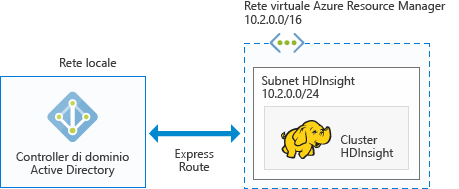

# Pianificare cluster Hadoop aggiunti a un dominio di Azure in HDInsight

Il cluster Hadoop tradizionale è un cluster a utente singolo, adatto alla maggior parte delle aziende con team di piccole dimensioni che compilano carichi di lavoro di Big Data. Man mano che aumenta la diffusione di Hadoop, molte aziende stanno passando a un modello in cui i cluster sono gestiti da team IT e condivisi tra più team di sviluppo. Di conseguenza, i cluster multiutente sono una delle funzionalità più richieste in HDInsight.

Anziché compilare autenticazione e autorizzazione multiutente proprie, HDInsight si basa sul provider di identità più diffuso, ovvero Active Directory (AD). La funzionalità gruppi di sicurezza in Active Directory permette di gestire l'autorizzazione multiutente in HDInsight. Grazie all'integrazione di HDInsight con Active Directory, gli utenti Active Directory possono comunicare con i cluster usando le proprie credenziali Active Directory. HDInsight esegue il mapping dell'utente Active Directory a un utente Hadoop locale, in modo che tutti i servizi in esecuzione in HDInsight, come Ambari, server Hive, Ranger, server Thrift Spark e così via, funzionino senza problemi per l'utente autenticato.

## Integrare HDInsight con Active Directory

L'integrazione di HDInsight con Active Directory permette di aggiungere i nodi del cluster HDInsight al dominio di Active Directory. HDInsight crea entità servizio per i servizi Hadoop in esecuzione nel cluster e le inserisce in un'unità organizzativa (OU) specificata in Active Directory. HDInsight crea anche mapping con DNS inverso nel dominio di Active Directory per gli indirizzi IP dei nodi che vengono aggiunti al dominio.

Per ottenere questa configurazione è possibile seguire diverse architetture, scegliendo la più adatta alle proprie esigenze.

**1. HDInsight integrato con Active Directory in esecuzione in Azure IAAS**

Si tratta dell'architettura più semplice per l'integrazione di HDInsight con Active Directory. Il controller di dominio Active Directory viene eseguito in una o più macchine virtuali in Azure, che in genere si trovano all'interno di una rete virtuale. È necessario configurare un'altra rete virtuale per il cluster HDInsight. Per fare in modo che HDInsight comunichi con Active Directory, è necessario effettuare il peering delle reti virtuali usando il [peering tra reti virtuali](../virtual-network/virtual-networks-create-vnetpeering-arm-portal.md).

> [!NOTE]
> In questa architettura non è possibile usare Azure Data Lake Store con il cluster HDInsight.
 

Prerequisiti per Active Directory:

* È necessario creare un'[unità organizzativa](../active-directory-domain-services/active-directory-ds-admin-guide-create-ou.md) in cui inserire le macchine virtuali del cluster HDInsight e le entità servizio usate dal cluster.
* [LDAPS](../active-directory-domain-services/active-directory-ds-admin-guide-configure-secure-ldap.md) deve essere configurato per la comunicazione con Active Directory. Il certificato usato per configurare LDAPS deve essere un certificato reale (non un certificato autofirmato).
* È necessario creare zone con DNS inverso nel dominio per l'intervallo di indirizzi IP della subnet HDInsight, ad esempio 10.2.0.0/24 nella figura precedente.
* È necessario un account del servizio o un account utente, usato per creare il cluster HDInsight. L'account deve avere le autorizzazioni seguenti:

    - Autorizzazioni per creare oggetti entità servizio e oggetti computer all'interno dell'unità organizzativa.
    - Autorizzazioni per creare regole proxy per DNS inverso.
    - Autorizzazioni per aggiungere computer al dominio di Active Directory.

**2. HDInsight integrato con Azure AD solo cloud**

Per Azure Active Directory (Azure AD) solo cloud è necessario configurare un controller di dominio in modo che sia possibile integrare HDInsight con l'istanza di Azure Active Directory. A tale scopo è possibile usare [Azure Active Directory Domain Services](../active-directory-domain-services/active-directory-ds-overview.md). Azure Active Directory Domain Services crea i controller di dominio nel cloud e ne fornisce gli indirizzi IP. Per garantire disponibilità elevata, crea due controller di dominio.

Attualmente, Azure Active Directory Domain Services esiste solo in reti virtuali classiche ed è accessibile unicamente con il portale di Azure classico. La rete virtuale HDInsight si trova nel portale di Azure, di cui è necessario effettuare il peering con la rete virtuale classica usando il peering tra reti virtuali.

> [!NOTE]
> Per poter effettuare il peering tra una rete virtuale classica e una rete virtuale di Azure Resource Manager, entrambe le reti virtuali devono trovarsi nella stessa area e nella stessa sottoscrizione di Azure.

Prerequisiti per Active Directory:

* È necessario creare un'[unità organizzativa](../active-directory-domain-services/active-directory-ds-admin-guide-create-ou.md) in cui inserire le macchine virtuali del cluster HDInsight e le entità servizio usate dal cluster. 
* [LDAPS](../active-directory-domain-services/active-directory-ds-admin-guide-configure-secure-ldap.md) deve essere impostato durante la configurazione di Active Directory Domain Services. Il certificato usato per configurare LDAPS deve essere un certificato reale (non un certificato autofirmato).
* È necessario creare zone con DNS inverso nel dominio per l'intervallo di indirizzi IP della subnet HDInsight, ad esempio 10.2.0.0/24 nella figura precedente. 
* [Gli hash delle password](../active-directory-domain-services/active-directory-ds-getting-started-password-sync.md) devono essere sincronizzati tra Azure AD e Active Directory Domain Services.
* È necessario un account del servizio o un account utente, usato per creare il cluster HDInsight. L'account deve avere le autorizzazioni seguenti:

    - Autorizzazioni per creare oggetti entità servizio e oggetti computer all'interno dell'unità organizzativa.
    - Autorizzazioni per creare regole proxy per DNS inverso.
    - Autorizzazioni per aggiungere computer al dominio di Active Directory.

**3. HDInsight integrato con un'istanza di Active Directory locale tramite VPN**

Questa architettura è simile all'architettura n. 1. L'unica differenza è che, in questo caso, Active Directory è locale e la comunicazione tra HDInsight e Active Directory avviene tramite una [connessione VPN da Azure alla rete locale](../expressroute/expressroute-introduction.md).

> [!NOTE]
> In questa architettura non è possibile usare Azure Data Lake Store con il cluster HDInsight.

Prerequisiti per Active Directory:

* È necessario creare un'[unità organizzativa](../active-directory-domain-services/active-directory-ds-admin-guide-create-ou.md) in cui inserire le macchine virtuali del cluster HDInsight e le entità servizio usate dal cluster.
* [LDAPS](../active-directory-domain-services/active-directory-ds-admin-guide-configure-secure-ldap.md) deve essere configurato per la comunicazione con Active Directory. Il certificato usato per configurare LDAPS deve essere un certificato reale (non un certificato autofirmato).
* È necessario creare zone con DNS inverso nel dominio per l'intervallo di indirizzi IP della subnet HDInsight, ad esempio 10.2.0.0/24 nella figura precedente.
* È necessario un account del servizio o un account utente, usato per creare il cluster HDInsight. L'account deve avere le autorizzazioni seguenti:

    - Autorizzazioni per creare oggetti entità servizio e oggetti computer all'interno dell'unità organizzativa.
    - Autorizzazioni per creare regole proxy per DNS inverso.
    - Autorizzazioni per aggiungere computer al dominio di Active Directory.

**4. HDInsight integrato con un'istanza di Active Directory locale sincronizzata con Azure AD**

Questa architettura è simile all'architettura n. 2. L'unica differenza è che l'istanza di Active Directory locale è sincronizzata con Azure Active Directory. È necessario configurare un controller di dominio nel cloud in modo che sia possibile integrare HDInsight con l'istanza di Azure Active Directory. A tale scopo è possibile usare [Azure Active Directory Domain Services](../active-directory-domain-services/active-directory-ds-overview.md). Active Directory Domain Services crea i controller di dominio nel cloud e ne fornisce gli indirizzi IP. Per garantire disponibilità elevata, crea due controller di dominio.

Attualmente, Azure Active Directory Domain Services esiste solo in reti virtuali classiche ed è accessibile unicamente con il portale di Azure classico. La rete virtuale HDInsight si trova nel portale di Azure, di cui è necessario effettuare il peering con la rete virtuale classica usando il peering tra reti virtuali.

> [!NOTE]
> Per poter effettuare il peering tra una rete virtuale classica e una rete virtuale di Azure Resource Manager, entrambe le reti virtuali devono trovarsi nella stessa area e nella stessa sottoscrizione di Azure.

Prerequisiti per Active Directory:

* È necessario creare un'[unità organizzativa](../active-directory-domain-services/active-directory-ds-admin-guide-create-ou.md) in cui inserire le macchine virtuali del cluster HDInsight e le entità servizio usate dal cluster. 
* [LDAPS](../active-directory-domain-services/active-directory-ds-admin-guide-configure-secure-ldap.md) deve essere impostato durante la configurazione di Active Directory Domain Services. Il certificato usato per configurare LDAPS deve essere un certificato reale (non un certificato autofirmato).
* È necessario creare zone con DNS inverso nel dominio per l'intervallo di indirizzi IP della subnet HDInsight, ad esempio 10.2.0.0/24 nella figura precedente. 
* [Gli hash delle password](../active-directory-domain-services/active-directory-ds-getting-started-password-sync.md) devono essere sincronizzati tra Azure AD e Active Directory Domain Services.
* È necessario un account del servizio o un account utente, usato per creare il cluster HDInsight. L'account deve avere le autorizzazioni seguenti:

    - Autorizzazioni per creare oggetti entità servizio e oggetti computer all'interno dell'unità organizzativa.
    - Autorizzazioni per creare regole proxy per DNS inverso.
    - Autorizzazioni per aggiungere computer al dominio di Active Directory.

**5. HDInsight integrato con un'istanza di Azure AD non predefinita (solo per test e sviluppo)**

Questa architettura è simile all'architettura n. 2. Per la maggior parte delle aziende, l'accesso amministratore ad Active Directory è limitato solo a determinati utenti. Per eseguire una verifica o semplicemente per provare a creare un cluster aggiunto a un dominio, anziché attendere che l'amministratore configuri i prerequisiti in Active Directory, potrebbe essere utile creare una nuova istanza di Azure Active Directory nella sottoscrizione. Dato che si tratta di un'istanza di Azure AD creata dall'utente, quest'ultimo ha tutte le autorizzazioni necessarie per configurare Active Directory Domain Services.

Active Directory Domain Services crea i controller di dominio nel cloud e ne fornisce gli indirizzi IP. Per garantire disponibilità elevata, crea due controller di dominio.

Attualmente, Active Directory Domain Services esiste solo in reti virtuali classiche. Per configurare Active Directory Domain Services è quindi necessario accedere al portale classico e creare una rete virtuale classica. La rete virtuale HDInsight si trova nel portale di Azure, di cui è necessario effettuare il peering con la rete virtuale classica usando il peering tra reti virtuali.

> [!NOTE]
> Per poter effettuare il peering tra una rete virtuale classica e una rete virtuale di Azure Resource Manager, entrambe le reti virtuali devono trovarsi nella stessa area e nella stessa sottoscrizione di Azure.

Prerequisiti per Active Directory:

* È necessario creare un'[unità organizzativa](../active-directory-domain-services/active-directory-ds-admin-guide-create-ou.md) in cui inserire le macchine virtuali del cluster HDInsight e le entità servizio usate dal cluster. 
* [LDAPS](../active-directory-domain-services/active-directory-ds-admin-guide-configure-secure-ldap.md) deve essere impostato durante la configurazione di Active Directory Domain Services. È possibile creare un [certificato autofirmato](../active-directory-domain-services/active-directory-ds-admin-guide-configure-secure-ldap.md) per configurare LDAPS. Tuttavia, per usare un certificato autofirmato è necessario inviare una richiesta di eccezione a <a href="mailto:hdipreview@microsoft.com">hdipreview@microsoft.com</a>.
* È necessario creare zone con DNS inverso nel dominio per l'intervallo di indirizzi IP della subnet HDInsight, ad esempio 10.2.0.0/24 nella figura precedente. 
* [Gli hash delle password](../active-directory-domain-services/active-directory-ds-getting-started-password-sync.md) devono essere sincronizzati tra Azure AD e Active Directory Domain Services.
* È necessario un account del servizio o un account utente, usato per creare il cluster HDInsight. L'account deve avere le autorizzazioni seguenti:

    - Autorizzazioni per creare oggetti entità servizio e oggetti computer all'interno dell'unità organizzativa.
    - Autorizzazioni per creare regole proxy per DNS inverso.
    - Autorizzazioni per aggiungere computer al dominio di Active Directory.

## Passaggi successivi
* Per configurare un cluster HDInsight aggiunto al dominio, vedere [Configure Domain-joined HDInsight clusters](hdinsight-domain-joined-configure.md) (Configurare i cluster HDInsight aggiunti al dominio).
* Per informazioni sulla gestione di cluster HDInsight aggiunti a un dominio, vedere [Gestione dei cluster HDInsight aggiunti al dominio](hdinsight-domain-joined-manage.md).
* Per configurare i criteri ed eseguire query Hive, vedere [Configure Hive policies for Domain-joined HDInsight clusters](hdinsight-domain-joined-run-hive.md) (Configurare criteri Hive per cluster HDInsight aggiunti al dominio).
* Per eseguire query Hive usando SSH nei cluster HDInsight aggiunti al dominio, vedere [Uso di SSH con Hadoop basato su Linux in HDInsight da Linux, Unix oppure OS X](hdinsight-hadoop-linux-use-ssh-unix.md).

<!--HONumber=Feb17_HO1-->

