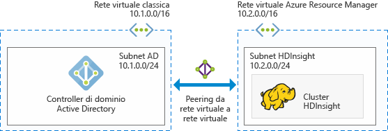

# Pianificare cluster Hadoop aggiunti a un dominio di Azure in HDInsight

Il cluster Hadoop tradizionale è un cluster a utente singolo, adatto alla maggior parte delle aziende con team di piccole dimensioni che compilano carichi di lavoro di dati di grandi dimensioni. Man mano che aumenta la diffusione di Hadoop, molte aziende stanno passando a un modello in cui i cluster sono gestiti da team IT e condivisi tra più team di sviluppo. Di conseguenza, le funzionalità basate su cluster multiutente sono tra le più richieste in Azure HDInsight.

Invece di compilare autenticazione e autorizzazione multiutente proprie, HDInsight si basa sul provider di identità più diffuso, ovvero Azure Active Directory (Azure AD). La funzionalità di sicurezza in Azure AD permette di gestire l'autorizzazione multiutente in HDInsight. Integrando HDInsight con Azure AD, è possibile comunicare con il cluster usando le credenziali di Azure AD. Poiché HDInsight esegue il mapping di un utente Azure AD a un utente Hadoop locale, tutti i servizi in esecuzione in HDInsight, come Ambari, server Hive, Ranger, server Thrift Spark e altri, funzionano senza problemi per l'utente autenticato.

## Integrare HDInsight con Azure AD

L'integrazione di HDInsight con Azure AD permette di aggiungere i nodi del cluster HDInsight al dominio di Azure AD. HDInsight crea entità servizio per i servizi Hadoop in esecuzione nel cluster e le inserisce in un'unità organizzativa (OU) specificata in Azure AD. HDInsight crea anche mapping con DNS inverso nel dominio di Azure AD per gli indirizzi IP dei nodi che vengono aggiunti al dominio.

È possibile eseguire questa configurazione usando più architetture. È possibile scegliere tra le seguenti architetture.

**HDInsight integrato con Azure AD in esecuzione in Azure IaaS**

Si tratta dell'architettura più semplice per l'integrazione di HDInsight con Azure AD. Il controller di dominio Azure AD viene eseguito in una o più macchine virtuali in Azure, che in genere si trovano in una rete virtuale. È necessario configurare un'altra rete virtuale per il cluster HDInsight. Per fare in modo che HDInsight comunichi con Azure AD, è necessario eseguire il peering delle reti virtuali usando il [peering tra reti virtuali](../virtual-network/virtual-networks-create-vnetpeering-arm-portal.md).

> [!NOTE]
> In questa architettura non è possibile usare Azure Data Lake Store con il cluster HDInsight.

Prerequisiti per Azure AD:

* È necessario creare un'[unità organizzativa](../active-directory-domain-services/active-directory-ds-admin-guide-create-ou.md) in cui inserire le macchine virtuali del cluster HDInsight e le entità servizio usate dal cluster.
* È necessario configurare [Lightweight Directory Access Protocol](../active-directory-domain-services/active-directory-ds-admin-guide-configure-secure-ldap.md) (LDAP) per comunicare con Azure AD. Il certificato usato per configurare i protocolli LDAP deve essere un certificato reale (non un certificato autofirmato).
* È necessario creare zone con DNS inverso nel dominio per l'intervallo di indirizzi IP della subnet HDInsight, ad esempio 10.2.0.0/24 nella figura precedente.
* È necessario un account del servizio o un account utente. Usare questo account per creare il cluster HDInsight. L'account deve avere le autorizzazioni seguenti:

    - Autorizzazioni per creare oggetti entità servizio e oggetti computer nell'unità organizzativa
    - Autorizzazioni per creare regole proxy per DNS inverso.
    - Autorizzazioni per aggiungere computer al dominio di Active Directory

**HDInsight integrato con Azure AD solo cloud**

Per Azure AD solo cloud, configurare un controller di dominio in modo che HDInsight possa essere integrato con Azure AD. A tale scopo è possibile usare [Azure Active Directory Domain Services](../active-directory-domain-services/active-directory-ds-overview.md). Active Directory Domain Services crea i controller di dominio nel cloud e ne fornisce gli indirizzi IP. Per garantire disponibilità elevata, crea due controller di dominio.

Attualmente, Azure Active Directory Domain Services esiste solo in reti virtuali classiche ed è accessibile unicamente usando il portale di Azure classico. La rete virtuale HDInsight si trova nel portale di Azure, di cui è necessario eseguire il peering con la rete virtuale classica usando il peering tra reti virtuali.

> [!NOTE]
> Per poter eseguire il peering tra una rete virtuale classica e una rete virtuale di Azure Resource Manager, entrambe le reti virtuali devono trovarsi nella stessa area e nella stessa sottoscrizione di Azure.

Prerequisiti per Azure AD:

* È necessario creare un'[unità organizzativa](../active-directory-domain-services/active-directory-ds-admin-guide-create-ou.md) in cui inserire le macchine virtuali del cluster HDInsight e le entità servizio usate dal cluster.
* I protocolli [LDAP](../active-directory-domain-services/active-directory-ds-admin-guide-configure-secure-ldap.md) devono essere impostati durante la configurazione di Azure Active Directory Domain Services. Il certificato usato per configurare i protocolli LDAP deve essere un certificato reale (non un certificato autofirmato).
* È necessario creare zone con DNS inverso nel dominio per l'intervallo di indirizzi IP della subnet HDInsight, ad esempio 10.2.0.0/24 nella figura precedente.
* Gli [hash delle password](../active-directory-domain-services/active-directory-ds-getting-started-password-sync.md) devono essere sincronizzati tra Azure AD e Azure Active Directory Domain Services.
* È necessario un account del servizio o un account utente. Usare questo account per creare il cluster HDInsight. L'account deve avere le autorizzazioni seguenti:

    - Autorizzazioni per creare oggetti entità servizio e oggetti computer nell'unità organizzativa
    - Autorizzazioni per creare regole proxy per DNS inverso.
    - Autorizzazioni per aggiungere computer al dominio di Azure AD

## Passaggi successivi
* Per configurare un cluster HDInsight aggiunto al dominio, vedere [Configurare i cluster HDInsight aggiunti al dominio](hdinsight-domain-joined-configure.md).
* Per gestire i cluster HDInsight aggiunti a un dominio, vedere [Gestire i cluster HDInsight aggiunti al dominio](hdinsight-domain-joined-manage.md).
* Per configurare i criteri ed eseguire query Hive, vedere [Configurare criteri Hive per cluster HDInsight aggiunti al dominio](hdinsight-domain-joined-run-hive.md).
* Per eseguire query Hive usando SSH nei cluster HDInsight aggiunti al dominio, vedere [Usare SSH con HDInsight](hdinsight-hadoop-linux-use-ssh-unix.md).

