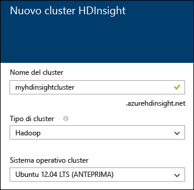
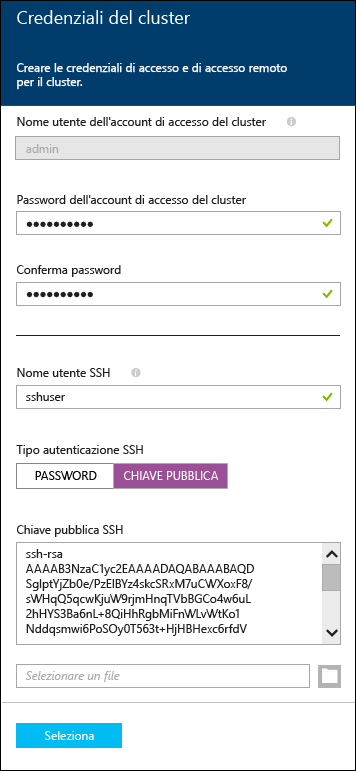
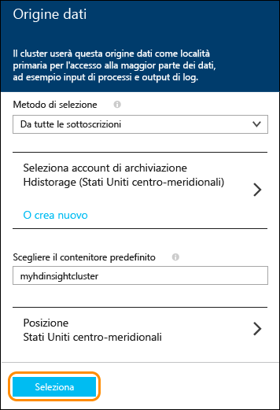
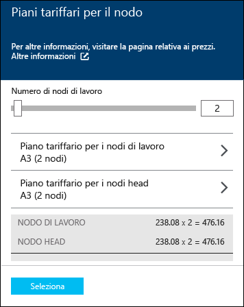
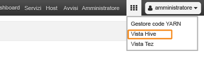

<properties
   	pageTitle="Esercitazione di Linux: Introduzione a Hadoop e Hive | Microsoft Azure"
   	description="Seguire questa esercitazione di Linux per iniziare a utilizzare Hadoop in HDInsight. Informazioni su come eseguire il provisioning di cluster Linux ed eseguire query sui dati con Hive."
   	services="hdinsight"
   	documentationCenter=""
   	authors="nitinme"
   	manager="paulettm"
   	editor="cgronlun"
	tags="azure-portal"/>

<tags
   	ms.service="hdinsight"
   	ms.devlang="na"
   	ms.topic="hero-article"
   	ms.tgt_pltfrm="na"
   	ms.workload="big-data"
   	ms.date="12/03/2015"
   	ms.author="nitinme"/>

# Esercitazione di Hadoop: Introduzione all'uso di Hadoop con Hive in HDInsight in Linux

> [AZURE.SELECTOR]
- [Windows](hdinsight-hadoop-tutorial-get-started-windows.md)
- [Linux](hdinsight-hadoop-linux-tutorial-get-started.md)

Questo documento fornisce un'introduzione rapida all'uso di Azure HDInsight in Linux e illustra come creare un cluster Hadoop basato su Linux, aprire l'interfaccia utente Web di Ambari e quindi eseguire una query Hive usando la visualizzazione Hive di Ambari.

> [AZURE.NOTE]Se non si ha esperienza di Hadoop e dell'uso dei Big Data, sono disponibili altre informazioni su [Apache Hadoop](http://go.microsoft.com/fwlink/?LinkId=510084), [MapReduce](http://go.microsoft.com/fwlink/?LinkId=510086), [Hadoop Distributed File System (HDFS)](http://go.microsoft.com/fwlink/?LinkId=510087) e [Hive](http://go.microsoft.com/fwlink/?LinkId=510085). Per informazioni sull'abilitazione di Hadoop in Azure tramite HDInsight, vedere [Introduzione a Hadoop in HDInsight](hdinsight-hadoop-introduction.md).

## Prerequisiti

Prima di iniziare questa esercitazione Linux per Hadoop, è necessario disporre di quanto segue:

- **Una sottoscrizione di Azure**: vedere [Ottenere una versione di valutazione gratuita di Azure](http://azure.microsoft.com/documentation/videos/get-azure-free-trial-for-testing-hadoop-in-hdinsight/).

## Effettuare il provisioning di un cluster HDInsight in Linux

Quando si esegue il provisioning di un cluster, vengono create le risorse di calcolo di Azure che includono servizi e risorse Hadoop. In questa sezione si effettua il provisioning di un cluster HDInsight versione 3.2 contenente Hadoop versione 2.2. Per informazioni sulle versioni di HDInsight e sui relativi contratti di servizio, vedere l'articolo relativo al [controllo delle versioni del componente HDInsight](hdinsight-component-versioning.md). Per informazioni dettagliate sulla creazione di un cluster HDInsight, vedere [Effettuare il provisioning di cluster HDInsight con opzioni personalizzate][hdinsight-provision].

>[AZURE.NOTE]È inoltre possibile creare cluster Hadoop in esecuzione nel sistema operativo Windows Server. Per istruzioni, vedere [Introduzione ad HDInsight in Windows](hdinsight-hadoop-tutorial-get-started-windows.md).

Per creare un nuovo cluster, seguire questa procedura.

1. Accedere al [portale di Azure](https://ms.portal.azure.com/).
2. Fare clic su **NUOVO**, fare clic su **Analisi di dati** e quindi fare clic su **HDInsight**.

    

3. Immettere un valore in **Nome cluster**, selezionare **Hadoop** per **Tipo di cluster** e dall'elenco a discesa **Sistema operativo cluster** selezionare **Ubuntu**. Un segno di spunta verde verrà visualizzato accanto al nome del cluster, se disponibile.

	

4. Se sono disponibili più sottoscrizioni, selezionare la voce **Sottoscrizione** per specificare la sottoscrizione di Azure da usare per il cluster.

5. Fare clic su **Gruppo di risorse** per visualizzare un elenco di gruppi di risorse esistenti e quindi selezionare quello in cui creare il cluster. In alternativa, è possibile fare clic su **Crea nuovo** e quindi immettere il nome del nuovo gruppo di risorse. Verrà visualizzato un segno di spunta verde per indicare se il nome del nuovo gruppo è disponibile.

	> [AZURE.NOTE]Questa voce sarà impostata su uno dei gruppi di risorse esistenti, se disponibili.

6. Fare clic su **Credenziali** e quindi immettere una password per l'utente amministratore. È necessario immettere anche un **Nome utente SSH**. Per il **Tipo di autenticazione SSH**, fare clic su **PASSWORD** e specificare una password per l'utente SSH. Fare clic su **Seleziona** nella parte inferiore per salvare la configurazione delle credenziali.

	

    > [AZURE.NOTE]Il protocollo SSH viene usato per accedere in modalità remota al cluster HDInsight tramite una riga di comando. Il nome utente e la password specificati qui sono usati per la connessione al cluster tramite SSH.

	Per altre informazioni sull'uso di SSH con HDInsight, vedere i documenti seguenti:

	* [Usare SSH con Hadoop basato su Linux in HDInsight da Linux, Unix o OS X](hdinsight-hadoop-linux-use-ssh-unix.md)
	* [Usare SSH con Hadoop basato su Linux in HDInsight da Windows](hdinsight-hadoop-linux-use-ssh-windows.md)

7. Fare clic su **Origine dati** per scegliere un'origine dati esistente per il cluster o crearne una nuova. Quando si esegue il provisioning di un cluster Hadoop in HDInsight, si specifica un account di archiviazione di Azure. Un contenitore di archiviazione BLOB specifico dell'account viene designato come file system predefinito, come in HDFS (Hadoop Distributed File System, file system distribuito Hadoop). Per impostazione predefinita, il provisioning del cluster HDInsight viene effettuato nello stesso data center dell'account di archiviazione specificato. Per altre informazioni, vedere l'argomento relativo all'[uso dell'archiviazione BLOB di Azure con HDInsight](hdinsight-use-blob-storage.md).

	

	Attualmente è possibile selezionare un account di archiviazione di Azure come origine dati per un cluster HDInsight. Usare le informazioni seguenti per comprendere le voci nel pannello **Origine dati**.

	- **Metodo di selezione**: impostare questa proprietà su **Da tutte le sottoscrizioni** per consentire l'esplorazione di account di archiviazione da tutte le sottoscrizioni. Impostare questa proprietà su **Chiave di accesso** se si vuole immettere un valore nei campi **Nome archiviazione** e **Chiave di accesso** per un account di archiviazione esistente.

	- **Seleziona account di archiviazione/Crea nuovo**: fare clic su **Seleziona account di archiviazione** per cercare e selezionare un account di archiviazione esistente da associare al cluster. Fare clic su **Crea nuovo** per creare un nuovo account di archiviazione. Utilizzare il campo che viene visualizzato per immettere il nome dell'account di archiviazione. Se il nome è disponibile, verrà visualizzato un segno di spunta verde.

	- **Scegliere il contenitore predefinito**: usare questa opzione per immettere il nome del contenitore predefinito da usare per il cluster. È possibile immettere qualsiasi nome, è consigliabile utilizzare lo stesso nome del cluster in modo che sia facilmente intuibile che il contenitore viene utilizzato per tale cluster specifico.

	- **Località**: l'area geografica in cui si trova o in cui verrà creato l'account di archiviazione.

		> [AZURE.IMPORTANT]La selezione del percorso per l'origine dati predefinito imposterà anche il percorso del cluster HDInsight. L'origine dati del cluster e l’origine dati predefinita devono trovarsi nella stessa area.

	Fare clic su **Seleziona** per salvare la configurazione dell'origine dati.

8. Fare clic su **Piani tariffari per il nodo** per visualizzare informazioni sui nodi che verranno creati per questo cluster. Impostare il numero di nodi del ruolo di lavoro necessari per il cluster. Verrà visualizzato il costo stimato del cluster all'interno del pannello.

	
    
    > [AZURE.IMPORTANT]Se si prevedono più di 32 nodi di lavoro, al momento della creazione del cluster o con il ridimensionamento del cluster dopo la creazione, è necessario selezionare una dimensione del nodo head con almeno 8 core e 14 GB di RAM.
    >
    > Per altre informazioni sulle dimensioni dei nodi e sui costi associati, vedere [Prezzi di HDInsight](https://azure.microsoft.com/pricing/details/hdinsight/).

	Fare clic su **Seleziona** per salvare la configurazione dei prezzi del nodo.

9. Nel pannello **Nuovo cluster HDInsight** assicurarsi che **Aggiungi alla Schermata iniziale** sia selezionato, quindi fare clic su **Crea**. Questo creerà il cluster e aggiungerà una sezione apposita nella schermata iniziale del portale di Azure. L'icona indica che il cluster sta eseguendo il provisioning e verrà visualizzata l'icona di HDInsight, una volta completato il provisioning.

Durante il provisioning|Provisioning completato
------------------|---------------------
	|

> [AZURE.NOTE]La creazione del cluster richiederà del tempo, in genere circa 15 minuti. Usare il riquadro nella Schermata iniziale o la voce **Notifiche** nella parte sinistra della pagina per controllare il processo di provisioning.

Al termine del provisioning, fare clic sul riquadro per il cluster dalla schermata iniziale per avviare il pannello del cluster.

##Connettersi alla visualizzazione Hive

Le visualizzazioni di Ambari forniscono diverse utilità in una pagina Web. Nelle sezioni seguenti si userà la visualizzazione Hive per eseguire query Hive nel cluster HDInsight.

> [AZURE.NOTE]Ambari è un'utilità per la gestione e il monitoraggio fornita con i cluster HDInsight basati su Linux. Ambari include numerose funzionalità che non verranno illustrate in questo documento. Per altre informazioni, vedere [Gestire i cluster HDInsight usando l'interfaccia utente Web di Ambari](hdinsight-hadoop-manage-ambari.md).

Per accedere alle visualizzazioni di Ambari dal portale di Azure, selezionare il cluster HDInsight e quindi selezionare __Visualizzazioni di Ambari__ nella sezione __Collegamenti rapidi__.

Per passare direttamente ad Ambari, andare a https://CLUSTERNAME.azurehdinsight.net in un Web browser (dove __CLUSTERNAME__ è il nome del cluster HDInsight) e quindi selezionare il set di quadrati nel menu della pagina (accanto al collegamento __Admin__ e al pulsante a sinistra della pagina) per elencare le visualizzazioni disponibili. Selezionare __Hive view__.

.

> [AZURE.NOTE]Quando si accede ad Ambari, verrà richiesto di eseguire l'autenticazione per il sito. Immettere il nome dell'account amministratore (il valore predefinito è `admin`) e la password usati durante la creazione del cluster.

Verrà visualizzata una pagina simile alla seguente:

##Eseguire una query Hive

Usare i passaggi seguenti nella visualizzazione Hive per eseguire una query Hive nei dati inclusi nel cluster.

1. Nella sezione __Query Editor__ della pagina incollare le istruzioni HiveQL seguenti nel foglio di lavoro:

		DROP TABLE log4jLogs;
		CREATE EXTERNAL TABLE log4jLogs(t1 string, t2 string, t3 string, t4 string, t5 string, t6 string, t7 string)
		ROW FORMAT DELIMITED FIELDS TERMINATED BY ' '
		STORED AS TEXTFILE LOCATION 'wasb:///example/data/';
		SELECT t4 AS sev, COUNT(*) AS cnt FROM log4jLogs WHERE t4 = '[ERROR]' GROUP BY t4;

	Le istruzioni eseguono queste azioni:

	- **DROP TABLE**: elimina la tabella e il file di dati, qualora la tabella esista già.
	- **CREATE EXTERNAL TABLE**: crea una nuova tabella "esterna" in Hive. Le tabelle esterne archiviano solo la definizione della tabella in Hive. I dati vengono lasciati nella posizione originale.
	- **ROW FORMAT**: indica a Hive il modo in cui sono formattati i dati. In questo caso, i campi in ogni log sono separati da uno spazio.
	- **STORED AS TEXTFILE LOCATION**: indica a Hive dove sono archiviati i dati (la directory example/data) e che sono archiviati come testo.
	- **SELECT**: seleziona un numero di tutte le righe in cui la colonna t4 include il valore [ERROR].

	>[AZURE.NOTE]È consigliabile usare le tabelle esterne quando si prevede che i dati sottostanti vengano aggiornati da un'origine esterna, ad esempio un processo automatico di caricamento dei dati, oppure da un'altra operazione MapReduce, ma si vuole che le query Hive usino sempre i dati più recenti. L'eliminazione di una tabella esterna *non* comporta anche l'eliminazione dei dati. Viene eliminata solo la definizione della tabella.

2. Usare il pulsante __Execute__ nella parte inferiore di Query Editor per avviare la query. Il colore diventerà arancione e il testo cambierà in __Stop execution__. Sotto Query Editor verrà visualizzata una sezione __Query Process Results__ che conterrà le informazioni sul processo.

    > [AZURE.IMPORTANT]È possibile che alcuni browser non aggiornino correttamente il log o le informazioni sui risultati. Se si esegue un processo che prosegue all'infinito senza aggiornare il log o restituire risultati, provare a usare Mozilla FireFox o Google Chrome.
    
3. Una volta completata la query, la sezione __Query Process Results__ visualizzerà i risultati dell'operazione. Il pulsante __Stop execution__ verrà sostituito da un pulsante __Execute__ verde. La scheda __Results__ conterrà le informazioni seguenti:

        sev       cnt
        [ERROR]   3

    La scheda __Logs__ può essere usata per visualizzare le informazioni sulla registrazione create dal processo, che possono essere utili per la risoluzione di eventuali problemi con una query.
    
    > [AZURE.TIP]Si noti l'elenco a discesa __Save results__ in alto a sinistra nella sezione __Query Process Results__, che può essere usato per scaricare i risultati o per salvarli nell'archivio HDInsight come file con estensione CSV.

3. Selezionare le prime quattro righe di questa query, quindi selezionare __Execute__. Si noti che, al termine del processo, non viene visualizzato alcun risultato. Se infatti si usa il pulsante __Execute__ quando parte della query è selezionata, verranno eseguite solo le istruzioni selezionate. In questo caso, la selezione non include l'istruzione finale che recupera le righe dalla tabella. Se si seleziona solo tale riga e si usa __Execute__, verranno visualizzati i risultati previsti.

3. Usare il pulsante __New Worksheet__ nella parte inferiore di __Query Editor__ per creare un nuovo foglio di lavoro. Nel nuovo foglio di lavoro immettere le istruzioni HiveQL seguenti:

		CREATE TABLE IF NOT EXISTS errorLogs (t1 string, t2 string, t3 string, t4 string, t5 string, t6 string, t7 string) STORED AS ORC;
		INSERT OVERWRITE TABLE errorLogs SELECT t1, t2, t3, t4, t5, t6, t7 FROM log4jLogs WHERE t4 = '[ERROR]';

	Le istruzioni eseguono queste azioni:

	- **CREATE TABLE IF NOT EXISTS**: crea una tabella, se non esiste già. Poiché non viene usata la parola chiave **EXTERNAL**, questa è una tabella interna che viene archiviata nel data warehouse di Hive e gestita completamente da Hive. A differenza di quanto accade con le tabelle esterne, se si elimina una tabella interna verranno eliminati anche i dati sottostanti.
	- **STORED AS ORC**: archivia i dati nel formato ORC (Optimized Row Columnar). Questo è un formato altamente ottimizzato ed efficiente per l'archiviazione di dati Hive.
	- **INSERT OVERWRITE ... SELECT**: seleziona dalla tabella **log4jLogs** le righe contenenti [ERROR], quindi inserisce i dati nella tabella **errorLogs**.
    
    Usare il pulsante __Execute__ per eseguire la query. La scheda __Results__ non conterrà alcuna informazione perché nessuna riga viene restituita da questa query, ma lo stato visualizzato sarà __SUCCEEDED__.
    
4. A destra di Query Editor è presente una riga di icone. Selezionare quella simile a una catena.

    
    
    Questa è la visualizzazione __Visual Explain__ della query, che può essere utile per conoscere il flusso delle query complesse. Per un equivalente testuale di questa visualizzazione, usare il pulsante __Explain__ in Query Editor.
    
    
    
    Le altre icone sono le seguenti:
    
        * Settings: The gear icon allows you to change Hive settings, such as setting `hive.execution.engine` or Tez parameters.
        * Tez: Displays the Directed Acyclic Graph (DAG) that Tez used to perform the query. If you want to view the DAG for queries you've ran in the past, use the __Tez View__ instead.
        * Notifications: Displays notifications, such as "Query has been submitted" or if an error occurs when running a query.

5. Selezionare l'icona __SQL__ per tornare a Query Editor, quindi creare un nuovo foglio di lavoro e immettere la query seguente:

        SELECT * from errorLogs;
    
    Usare il pulsante __Save as__ nella parte inferiore dell'editor. Assegnare a questa query il nome __Errorlogs__ e selezionare __OK__. Si noti che il nome del foglio di lavoro diventa __Errorlogs__.
    
    Le query salvate vengono visualizzate anche nella scheda __Saved Queries__ nella parte superiore della pagina. Selezionare questa opzione per visualizzare l'elenco __Errorlogs__. Selezionando il nome, la query verrà aperta in Query Editor.

4. Eseguire la query __Errorlogs__. I risultati saranno i seguenti:

        errorlogs.t1 	errorlogs.t2 	errorlogs.t3 	errorlogs.t4 	errorlogs.t5 	errorlogs.t6 	errorlogs.t7
        2012-02-03 	18:35:34 	SampleClass0 	[ERROR] 	incorrect 	id 	
        2012-02-03 	18:55:54 	SampleClass1 	[ERROR] 	incorrect 	id 	
        2012-02-03 	19:25:27 	SampleClass4 	[ERROR] 	incorrect 	id

## Passaggi successivi

In questo documento, si è appreso come creare un cluster HDInsight basato su Linux tramite il portale di Azure, connettersi al cluster tramite SSH ed eseguire query Hive di base.

Per altre informazioni sull'analisi dei dati con HDInsight, vedere gli articoli seguenti:

- Per altre informazioni sull'uso di Hive con HDInsight, incluse le procedure per eseguire query Hive da Visual Studio, vedere [Usare Hive con HDInsight][hdinsight-use-hive].

- Per informazioni su Pig, un linguaggio usato per la trasformazione dei dati, vedere [Usare Pig con HDInsight][hdinsight-use-pig].

- Per altre informazioni su MapReduce, un framework software che consente di scrivere programmi per l'elaborazione dei dati in Hadoop, vedere [Usare MapReduce con HDInsight][hdinsight-use-mapreduce].

- Per altre informazioni sull'uso di HDInsight Tools per Visual Studio per analizzare i dati in HDInsight, vedere [Introduzione all'uso di Hadoop Tools per Visual Studio per HDInsight](hdinsight-hadoop-visual-studio-tools-get-started.md).

Se si è pronti per iniziare a usare i dati, ma sono necessarie altre informazioni sulle modalità di archiviazione dei dati in HDInsight o sulle procedure di importazione dei dati in HDInsight, vedere gli argomenti seguenti:

- Per informazioni sul modo in cui HDInsight usa l'archiviazione BLOB di Azure, vedere [Usare l'archiviazione BLOB di Azure con HDInsight](hdinsight-use-blob-storage.md).

- Per informazioni sulle modalità di caricamento di dati in HDInsight, vedere [Caricare dati in HDInsight][hdinsight-upload-data].

Per altre informazioni sulla creazione o la gestione di un cluster HDInsight, vedere gli argomenti seguenti:

- Per altre informazioni sulla gestione di cluster HDInsight basati su Linux, vedere [Gestire i cluster HDInsight tramite Ambari](hdinsight-hadoop-manage-ambari.md).

- Per altre informazioni sulle opzioni che è possibile selezionare durante la creazione di un cluster HDInsight, vedere [Effettuare il provisioning di HDInsight in Linux con opzioni personalizzate](hdinsight-hadoop-provision-linux-clusters.md).

- Se si ha familiarità con Linux e Hadoop, ma si vogliono informazioni specifiche su Hadoop in HDInsight, vedere [Uso di HDInsight in Linux](hdinsight-hadoop-linux-information.md). In questo argomento vengono fornite informazioni quali, ad esempio:

	* URL per i servizi ospitati nel cluster, ad esempio Ambari e WebHCat
	* Il percorso del file Hadoop e gli esempi nel file system locale
	* L'utilizzo di archiviazione di Azure (WASB) anziché di HDFS come archivio predefinito di dati

[1]: ../HDInsight/hdinsight-hadoop-visual-studio-tools-get-started.md

[hdinsight-provision]: hdinsight-provision-clusters.md
[hdinsight-admin-powershell]: hdinsight-administer-use-powershell.md
[hdinsight-upload-data]: hdinsight-upload-data.md
[hdinsight-use-mapreduce]: hdinsight-use-mapreduce.md
[hdinsight-use-hive]: hdinsight-use-hive.md
[hdinsight-use-pig]: hdinsight-use-pig.md

[powershell-download]: http://go.microsoft.com/fwlink/p/?linkid=320376&clcid=0x409
[powershell-install-configure]: ../install-configure-powershell.md
[powershell-open]: ../install-configure-powershell.md#Install

[img-hdi-dashboard]: ./media/hdinsight-hadoop-tutorial-get-started-windows/HDI.dashboard.png
[img-hdi-dashboard-query-select]: ./media/hdinsight-hadoop-tutorial-get-started-windows/HDI.dashboard.query.select.png
[img-hdi-dashboard-query-select-result]: ./media/hdinsight-hadoop-tutorial-get-started-windows/HDI.dashboard.query.select.result.png
[img-hdi-dashboard-query-select-result-output]: ./media/hdinsight-hadoop-tutorial-get-started-windows/HDI.dashboard.query.select.result.output.png
[img-hdi-dashboard-query-browse-output]: ./media/hdinsight-hadoop-tutorial-get-started-windows/HDI.dashboard.query.browse.output.png
[image-hdi-clusterstatus]: ./media/hdinsight-hadoop-tutorial-get-started-windows/HDI.ClusterStatus.png
[image-hdi-gettingstarted-powerquery-importdata]: ./media/hdinsight-hadoop-tutorial-get-started-windows/HDI.GettingStarted.PowerQuery.ImportData.png
[image-hdi-gettingstarted-powerquery-importdata2]: ./media/hdinsight-hadoop-tutorial-get-started-windows/HDI.GettingStarted.PowerQuery.ImportData2.png

<!---HONumber=AcomDC_1210_2015-->