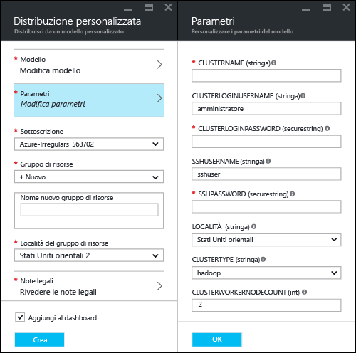
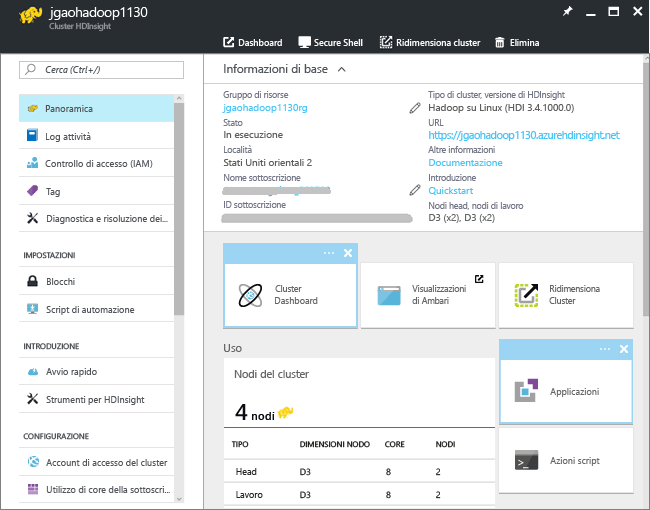

<properties
   	pageTitle="Esercitazione di Linux: Introduzione a Hadoop e Hive | Microsoft Azure"
   	description="Seguire questa esercitazione di Linux per iniziare a utilizzare Hadoop in HDInsight. Informazioni su come eseguire il provisioning di cluster Linux ed eseguire query sui dati con Hive."
   	services="hdinsight"
   	documentationCenter=""
   	authors="mumian"
   	manager="jhubbard"
   	editor="cgronlun"
	tags="azure-portal"/>



<tags
   	ms.service="hdinsight"
   	ms.devlang="na"
   	ms.topic="hero-article"
   	ms.tgt_pltfrm="na"
   	ms.workload="big-data"
   	ms.date="09/14/2016"
   	ms.author="jgao"/>



# Esercitazione di Hadoop: Introduzione all'uso di Hadoop basato su Linux in HDInsight

> [AZURE.SELECTOR]
- [Basato su Linux](hdinsight-hadoop-linux-tutorial-get-started.md)
- [Basato su Windows](hdinsight-hadoop-tutorial-get-started-windows.md)

Informazioni su come creare cluster [Hadoop](http://hadoop.apache.org/) basati su in HDInsight e come eseguire processi Hive in HDInsight. [Apache Hive](https://hive.apache.org/) è il componente più diffuso dell'ecosistema Hadoop. HDInsight include attualmente quattro tipi di cluster diversi, ovvero [Hadoop](hdinsight-hadoop-introduction.md), [Spark](hdinsight-apache-spark-overview.md), [HBase](hdinsight-hbase-overview.md) e [Storm](hdinsight-storm-overview.md). Ogni tipo di cluster supporta un set diverso di componenti. Tutti i quattro tipi di cluster supportano Hive. Per un elenco dei componenti supportati in HDInsight, vedere [Novità delle versioni cluster di Hadoop incluse in HDInsight](hdinsight-component-versioning.md).

[AZURE.INCLUDE [delete-cluster-warning](../../includes/hdinsight-delete-cluster-warning.md)]

## Prerequisiti

Prima di iniziare questa esercitazione, è necessario avere:

- **Sottoscrizione di Azure**: per creare un account di valutazione gratuito di un mese, passare ad [azure.microsoft.com/free](https://azure.microsoft.com/free).

### Requisiti di controllo di accesso

[AZURE.INCLUDE [access-control](../../includes/hdinsight-access-control-requirements.md)]

## Creare cluster

La maggior parte dei processi Hadoop è costituita da processi batch. Viene creato un cluster, si eseguono alcuni processi e quindi si elimina il cluster. In questa sezione si creerà un cluster Hadoop basato su Linux in HDInsight usando il [modello di Azure Resource Manager](../resource-group-template-deploy.md). Il modello di Resource Manager è completamente personalizzabile e consente di creare facilmente risorse di Azure come HDInsight. Per questa esercitazione non è necessario conoscere il modello di Resource Manager. Per altri metodi di creazione di cluster e per informazioni sulle proprietà usate in questa esercitazione, vedere [Creare cluster HDInsight](hdinsight-hadoop-provision-linux-clusters.md). Il modello di Resource Manager usato in questa esercitazione si trova in un contenitore BLOB pubblico, [https://hditutorialdata.blob.core.windows.net/armtemplates/create-linux-based-hadoop-cluster-in-hdinsight.json](https://hditutorialdata.blob.core.windows.net/armtemplates/create-linux-based-hadoop-cluster-in-hdinsight.json).

1. Fare clic sull'immagine seguente per accedere ad Azure e aprire il modello di Azure Resource Manager nel portale di Azure.

    

2. Nel pannello **Parametri** immettere le informazioni seguenti:

    .

    - **ClusterName**: immettere un nome per il cluster Hadoop che verrà creato.
    - **Nome utente e password di accesso del cluster**: il nome dell'account di accesso predefinito è **admin**.
    - **Nome utente e password SSH**: il nome utente predefinito è **sshuser**. È possibile rinominarlo.
    
    Gli altri parametri sono facoltativi per il completamento di questa esercitazione. È possibile lasciarli invariati.
    
    Ogni cluster ha una dipendenza dall'account di archiviazione BLOB di Azure. Viene in genere indicato come account di archiviazione predefinito. Il cluster HDInsight e l'account di archiviazione predefinito devono avere un percorso condiviso nella stessa area di Azure. L'eliminazione dei cluster non comporta l'eliminazione dell'account di archiviazione. Il nome dell'account di archiviazione predefinito nel modello corrisponde al nome del cluster a cui viene aggiunto "store".
    
3. Fare clic su **OK** per salvare i parametri.
4. Nel pannello **Distribuzione personalizzata** immettere un **Nuovo nome gruppo di risorse** per creare un nuovo gruppo di risorse. Il gruppo di risorse è un contenitore che raggruppa il cluster, l'account di archiviazione dipendente e altre risorse. La posizione del gruppo di risorse può essere diversa dalla posizione del cluster.
5. Fare clic su **Note legali** e quindi su **Crea**.
6. Verificare che la casella di controllo **Aggiungi al dashboard** sia selezionata e quindi fare clic su **Crea**. Verrà visualizzato un nuovo riquadro con nome **Distribuzione dell'entità Distribuzione modello in corso**. La creazione di un cluster richiede circa 20 minuti.
7.  Dopo la creazione del cluster, la didascalia del riquadro viene cambiata nel nome del gruppo di risorse specificato. Nel portale vengono aperti automaticamente due pannelli con il cluster e le impostazioni del cluster.

    .

    Vengono elencate due risorse, ovvero il cluster e l'account di archiviazione predefinito.

##Eseguire query Hive

[Apache Hive](hdinsight-use-hive.md) è il componente più diffuso usato in HDInsight. Esistono diversi modi per eseguire processi Hive in HDInsight. In questa esercitazione si userà la visualizzazione di Ambari Hive dal portale per eseguire alcuni processi Hive. Per altri metodi di esecuzione di processi Hive, vedere [Usare Hive in HDInsight](hdinsight-use-hive.md).

1. Passare a **https://&lt;ClusterName>.azurehdinsight.net**, dove &lt;ClusterName> è il cluster creato nella sezione precedente per aprire Ambari.
2. Immettere il nome utente e la password Hadoop specificati nella sezione precedente. Il nome utente predefinito è **admin**.
3. Aprire la **visualizzazione Hive** come illustrato nella schermata seguente:

    .
4. Nella sezione __Query Editor__ della pagina incollare le istruzioni HiveQL seguenti nel foglio di lavoro:

		SHOW TABLES;

    >[AZURE.NOTE] Il punto e virgola è obbligatorio per Hive.
        
5. Fare clic su __Execute__. Sotto Query Editor verrà visualizzata una sezione __Query Process Results__ che conterrà le informazioni sul processo.

    Una volta completata la query, la sezione __Query Process Results__ visualizzerà i risultati dell'operazione. Verrà visualizzata una tabella denominata **hivesampletable**. Questa tabella Hive di esempio è disponibile in tutti i cluster HDInsight.

    .

6. Ripetere i passaggi 4 e 5 per eseguire questa query:

        SELECT * FROM hivesampletable;

    > [AZURE.TIP] Si noti l'elenco a discesa __Save results__ in alto a sinistra nella sezione __Query Process Results__, che può essere usato per scaricare i risultati o per salvarli nell'archivio HDInsight come file con estensione CSV.

7. Fare clic su **History** per ottenere un elenco dei processi.

Dopo aver completato un processo Hive, è possibile [esportare i risultati in un database SQL di Azure o in un database SQL Server](hdinsight-use-sqoop-mac-linux.md). È anche possibile [visualizzare i risultati in Excel](hdinsight-connect-excel-power-query.md). Per altre informazioni sull'uso di Hive in HDInsight, vedere [Usare Hive e HiveQL con Hadoop in HDInsight per analizzare un file Apache log4j di esempio](hdinsight-use-hive.md).

##Eseguire la pulizia dell'esercitazione

Al termine dell'esercitazione, è consigliabile eliminare il cluster. Con HDInsight, i dati vengono archiviati in Archiviazione di Azure ed è possibile eliminare tranquillamente un cluster quando non viene usato. Vengono addebitati i costi anche per i cluster HDInsight che non sono in uso. Poiché i costi per il cluster sono decisamente superiori a quelli per l'archiviazione, economicamente ha senso eliminare i cluster quando non vengono usati.

>[AZURE.NOTE] [Azure Data Factory](hdinsight-hadoop-create-linux-clusters-adf.md) consente di creare cluster HDInsight su richiesta e di configurare un'impostazione TimeToLive per eliminare automaticamente i cluster.

**Per eliminare il cluster e/o l'account di archiviazione predefinito**

1. Accedere al [portale di Azure](https://portal.azure.com).
2. Dal dashboard del portale fare clic sul riquadro con il nome del gruppo di risorse usato durante la creazione del cluster.
3. Fare clic su **Elimina** nel pannello delle risorse per eliminare il gruppo di risorse che include il cluster e l'account di archiviazione predefinito oppure fare clic sul nome del cluster nel riquadro **Risorse**e quindi su **Elimina** nel pannello del cluster. Si noti che l'eliminazione del gruppo di risorse comporta l'eliminazione dell'account di archiviazione. Se si vuole mantenere l'account di archiviazione, scegliere di eliminare solo il cluster.

## Passaggi successivi

In questa esercitazione si è appreso come creare un cluster HDInsight basato su Linux usando un modello di Resource Manager ed eseguire query Hive di base.

Per altre informazioni sull'analisi dei dati con HDInsight, vedere gli articoli seguenti:

- Per altre informazioni sull'uso di Hive con HDInsight, incluse le procedure per eseguire query Hive da Visual Studio, vedere [Usare Hive con HDInsight][hdinsight-use-hive].

- Per informazioni su Pig, un linguaggio usato per la trasformazione dei dati, vedere [Usare Pig con HDInsight][hdinsight-use-pig].

- Per altre informazioni su MapReduce, un framework software che consente di scrivere programmi per l'elaborazione dei dati in Hadoop, vedere [Usare MapReduce con HDInsight][hdinsight-use-mapreduce].

- Per altre informazioni sull'uso di HDInsight Tools per Visual Studio per analizzare i dati in HDInsight, vedere [Introduzione all'uso di Hadoop Tools per Visual Studio per HDInsight](hdinsight-hadoop-visual-studio-tools-get-started.md).

Se si è pronti per iniziare a usare i dati, ma sono necessarie altre informazioni sulle modalità di archiviazione dei dati in HDInsight o sulle procedure di importazione dei dati in HDInsight, vedere gli argomenti seguenti:

- Per informazioni sul modo in cui HDInsight usa l'archiviazione BLOB di Azure, vedere [Usare l'archiviazione BLOB di Azure con HDInsight](hdinsight-hadoop-use-blob-storage.md).

- Per informazioni sulle modalità di caricamento di dati in HDInsight, vedere [Caricare dati in HDInsight][hdinsight-upload-data].

Per altre informazioni sulla creazione o la gestione di un cluster HDInsight, vedere gli argomenti seguenti:

- Per altre informazioni sulla gestione di cluster HDInsight basati su Linux, vedere [Gestire i cluster HDInsight tramite Ambari](hdinsight-hadoop-manage-ambari.md).

- Per altre informazioni sulle opzioni che è possibile selezionare durante la creazione di un cluster HDInsight, vedere [Creare cluster Hadoop basati su Linux in HDInsight](hdinsight-hadoop-provision-linux-clusters.md).

- Se si ha familiarità con Linux e Hadoop ma si vogliono informazioni specifiche su Hadoop in HDInsight, vedere [Uso di HDInsight in Linux](hdinsight-hadoop-linux-information.md). In questo argomento vengono fornite informazioni quali, ad esempio:

	* URL per i servizi ospitati nel cluster, ad esempio Ambari e WebHCat
	* Il percorso del file Hadoop e gli esempi nel file system locale
	* L'utilizzo di archiviazione di Azure (WASB) anziché di HDFS come archivio predefinito di dati

[1]: ../HDInsight/hdinsight-hadoop-visual-studio-tools-get-started.md

[hdinsight-provision]: hdinsight-provision-clusters.md
[hdinsight-admin-powershell]: hdinsight-administer-use-powershell.md
[hdinsight-upload-data]: hdinsight-upload-data.md
[hdinsight-use-mapreduce]: hdinsight-use-mapreduce.md
[hdinsight-use-hive]: hdinsight-use-hive.md
[hdinsight-use-pig]: hdinsight-use-pig.md

[powershell-download]: http://go.microsoft.com/fwlink/p/?linkid=320376&clcid=0x409
[powershell-install-configure]: powershell-install-configure.md
[powershell-open]: powershell-install-configure.md#Install

[img-hdi-dashboard]: ./media/hdinsight-hadoop-tutorial-get-started-windows/HDI.dashboard.png
[img-hdi-dashboard-query-select]: ./media/hdinsight-hadoop-tutorial-get-started-windows/HDI.dashboard.query.select.png
[img-hdi-dashboard-query-select-result]: ./media/hdinsight-hadoop-tutorial-get-started-windows/HDI.dashboard.query.select.result.png
[img-hdi-dashboard-query-select-result-output]: ./media/hdinsight-hadoop-tutorial-get-started-windows/HDI.dashboard.query.select.result.output.png
[img-hdi-dashboard-query-browse-output]: ./media/hdinsight-hadoop-tutorial-get-started-windows/HDI.dashboard.query.browse.output.png
[image-hdi-clusterstatus]: ./media/hdinsight-hadoop-tutorial-get-started-windows/HDI.ClusterStatus.png
[image-hdi-gettingstarted-powerquery-importdata]: ./media/hdinsight-hadoop-tutorial-get-started-windows/HDI.GettingStarted.PowerQuery.ImportData.png
[image-hdi-gettingstarted-powerquery-importdata2]: ./media/hdinsight-hadoop-tutorial-get-started-windows/HDI.GettingStarted.PowerQuery.ImportData2.png

<!---HONumber=AcomDC_1005_2016-->