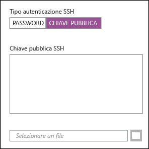

<properties
   pageTitle="Usare chiavi SSH con Hadoop basato su Linux da Linux, Unix o OS X | Microsoft Azure"
   description="È possibile accedere a HDInsight basato su Linux tramite Secure Shell (SSH). Questo documento fornisce informazioni sull'uso di SSH con HDInsight da client OS X, Unix o Linux."
   services="hdinsight"
   documentationCenter=""
   authors="Blackmist"
   manager="paulettm"
   editor="cgronlun"
	tags="azure-portal"/>

<tags
   ms.service="hdinsight"
   ms.devlang="na"
   ms.topic="article"
   ms.tgt_pltfrm="na"
   ms.workload="big-data"
   ms.date="09/15/2015"
   ms.author="larryfr"/>

#Uso di SSH con Hadoop basato su Linux in HDInsight da Linux, Unix oppure OS X:

> [AZURE.SELECTOR]
- [Windows](hdinsight-hadoop-linux-use-ssh-windows.md)
- [Linux, Unix, OS X](hdinsight-hadoop-linux-use-ssh-unix.md)

[Secure Shell (SSH)](https://en.wikipedia.org/wiki/Secure_Shell) consente di eseguire in modalità remota operazioni nei cluster di HDInsight basato su Liux tramite un'interfaccia della riga di comando. Questo documento fornisce informazioni sull'uso di SSH con HDInsight da client OS X, Unix o Linux.

> [AZURE.NOTE]I passaggi descritti in questo articolo presuppongono l'uso di un client Linux, Unix o OS X. Sebbene questa procedura possa essere eseguita su un client basato su Windows se è stato installato un pacchetto che fornisce `ssh` e `ssh-keygen`, ad esempio Git per Windows, per i client basati su Windows è consigliabile eseguire la procedura descritta in [Usare SSH con HDInsight (Hadoop) basato su Linux da Windows](hdinsight-hadoop-linux-use-ssh-windows.md).

##Prerequisiti

* **ssh-keygen** e **ssh** per i client Linux, Unix e OS X. Queste utilità vengono in genere fornita con il sistema operativo o sono disponibili tramite il sistema di gestione pacchetti.

* Un moderno Web browser che supporta HTML5.

OPPURE

* [Azure CLI per Mac, Linux e Windows](../xplat-cli-install.md).

##Che cos'è SSH?

SSH è un'utilità per accedere ed eseguire in modalità remota i comandi in un server remoto. Con HDInsight basato su Linux, SSH stabilisce una connessione crittografata al nodo head del cluster e fornisce una riga di comando che consente di digitare i comandi. I comandi vengono quindi eseguiti direttamente sul server.

###SSH user name

Un nome utente SSH è il nome utilizzato per autenticarsi con il cluster HDInsight. Quando si specifica un nome utente SSH durante la creazione del cluster, l'utente viene creato in tutti i nodi del cluster. Una volta creato il cluster, è possibile utilizzare questo nome utente per la connessione a nodi head del cluster HDInsight. Dai nodi head, è quindi possibile connettersi ai nodi del singolo lavoratore.

> [AZURE.NOTE]Un nome utente SSH deve essere univoco. Poiché un nome utente SSH crea un account utente sul cluster HDInsight, esso non è in conflitto con gli utenti esistenti creati da HDInsight. Di seguito sono indicati i nomi riservati per l’uso da parte dei servizi in esecuzione nel cluster HDInsight e che non possono essere utilizzati come nome utente SSH:
>
> root, hdiuser, storm, hbase, ubuntu, zookeeper, hdfs, yarn, mapred, hbase, hive, oozie, falcon, sqoop, admin, tez, hcat, hdinsight-zookeeper.

###Password SSH o chiave pubblica

Un utente SSH può utilizzare una password o chiave pubblica per l'autenticazione. Una password è semplicemente una stringa di testo composta dall’utente, mentre una chiave pubblica è parte di una coppia di chiavi crittografiche generata per identificare l’utente in modo univoco.

Una chiave è più sicura di una password, ma si richiedono passaggi aggiuntivi per generare la chiave ed è necessario gestire i file che contengono la chiave in un luogo sicuro. Chiunque riesca ad accedere ai file di chiave, ottiene accesso all’account dell’utente. O se si perdono i file di chiave, non si sarà in grado di accedere al proprio account.

Una coppia di chiavi è costituita da una chiave pubblica (che viene inviata al server di HDInsight) e una chiave privata (che verrà mantenuta nel computer client.) Quando ci si connette al server di HDInsight tramite SSH, il client SSH utilizzerà la chiave privata nel computer in uso per l'autenticazione con il server.

##Creare una chiave SSH

Se si prevede di usare chiavi SSH con il cluster, attenersi alle seguenti informazioni. Se si prevede di utilizzare una password, è possibile ignorare questa sezione.

1. Aprire una sessione terminal e usare il comando seguente per verificare se sono disponibili chiavi SSH esistenti:

		ls -al ~/.ssh

	Cercare i file seguenti nell'elenco di directory. Si tratta di nomi comuni per le chiavi pubbliche SSH:

	* id\_dsa.pub
	* id\_ecdsa.pub
	* id\_ed25519.pub
	* id\_rsa.pub

2. Se non si vuole usare un file esistente o non si hanno chiavi SSH, eseguire il comando seguente per generare un nuovo file:

		ssh-keygen -t rsa

	Verrà richiesto di specificare le seguenti informazioni:

	* Il percorso del file: il percorso predefinito è ~/.ssh/id\\_rsa.
	* Una passphrase: verrà richiesto di immetterla una seconda volta.

		> [AZURE.NOTE]È consigliabile usare una passphrase sicura per la chiave. Tuttavia, se si dimentica la passphrase, non è possibile recuperarla.

	Al termine del comando, si disporrà di due nuovi file: la chiave privata (ad esempio **id\_rsa**) e la chiave pubblica (ad esempio **id\_rsa.pub**).

##Creare un cluster HDInsight basato su Linux

Quando si crea un cluster HDInsight basato su Linux, è necessario fornire la chiave pubblica creata in precedenza. Da client Linux, Unix o OS X è possibile creare un cluster HDInsight in due modi:

* **Portale di anteprima di Azure**: viene usato un portale basato sul Web per creare il cluster.

* **Interfaccia della riga di comando di Azure**: usa i comandi della riga di comando per creare il cluster.

Ognuno di questi metodi richiederà un password o una chiave pubblica. Per informazioni dettagliate sulla creazione di un cluster HDInsight basato su Linux, vedere l'articolo [Provisioning di cluster Hadoop Linux in HDInsight con opzioni personalizzate](hdinsight-hadoop-provision-linux-clusters.md).

###Portale di anteprima di Azure

Quando si usa il [portale di anteprima di Azure][preview-portal] per creare un cluster HDInsight basato su Linux, è necessario compilare il campo **NOME UTENTE SSH** e selezionare **PASSWORD** o **CHIAVE PUBBLICA SSH**.

Se si seleziona **CHIAVE PUBBLICA SSH**, incollare la chiave pubblica (contenuta nel file con l’estensione **pub**) nel campo __SSH PublicKey__ oppure selezionare __Seleziona un file__ per cercare e selezionare il file di chiave pubblica.



> [AZURE.NOTE]Il file della chiave è semplicemente un file di testo. Il contenuto dovrebbe essere simile al seguente:```
ssh-rsa AAAAB3NzaC1yc2EAAAADAQABAAABAQCelfkjrpYHYiks4TM+r1LVsTYQ4jAXXGeOAF9Vv/KGz90pgMk3VRJk4PEUSELfXKxP3NtsVwLVPN1l09utI/tKHQ6WL3qy89WVVVLiwzL7tfJ2B08Gmcw8mC/YoieT/YG+4I4oAgPEmim+6/F9S0lU2I2CuFBX9JzauX8n1Y9kWzTARST+ERx2hysyA5ObLv97Xe4C2CQvGE01LGAXkw2ffP9vI+emUM+VeYrf0q3w/b1o/COKbFVZ2IpEcJ8G2SLlNsHWXofWhOKQRi64TMxT7LLoohD61q2aWNKdaE4oQdiuo8TGnt4zWLEPjzjIYIEIZGk00HiQD+KCB5pxoVtp user@system
> ```

Verrà creato un account di accesso per l'utente specificato usando la password o la chiave pubblica fornita.

###Interfaccia della riga di comando per Azure per Mac, Linux e Windows

È possibile usare l'[interfaccia della riga di comando di Azure per Mac, Linux e Windows](../xplat.md) per creare un nuovo cluster tramite il comando `azure hdinsight cluster create`.

Per altre informazioni sull'uso di questo comando, vedere l'articolo [Provisioning di cluster Hadoop Linux in HDInsight con opzioni personalizzate](hdinsight-hadoop-provision-linux-clusters.md).

##Connettersi a un cluster HDInsight basato su Linux

Da una sessione terminal usare il comando SSH per la connessione al nodo head del cluster specificando l'indirizzo e il nome utente:

* **Indirizzo SSH**: il nome del cluster, seguito da **-ssh.azurehdinsight.net**. Ad esempio, **mycluster-ssh.azurehdinsight.net**.

* **Nome utente**: il nome utente SSH fornito durante la creazione del cluster.

L'esempio seguente consentirà di connettersi al cluster **mycluster** come utente **me**:

	ssh me@mycluster-ssh.azurehdinsight.net

Se è stata usata una password per l'account utente, verrà richiesto di immetterla.

Se è stata usata una chiave SSH è protetta con una passphrase, verrà richiesto di immettere la passphrase. In caso contrario, SSH tenterà di eseguire automaticamente l'autenticazione usando una delle chiavi private locali nel client.

> [AZURE.NOTE]Se SSH non esegue automaticamente l'autenticazione con la chiave privata corretta, usare il parametro **-i** e specificare il percorso della chiave privata. Nell'esempio seguente la chiave privata verrà caricata da `~/.ssh/id_rsa`:
>
> `ssh -i ~/.ssh/id_rsa me@mycluster-ssh.azurehdinsight.net`

Se non viene specificata alcuna porta, SSH imposterà automaticamente la porta 22, che si connetterà a headnode0 nel cluster HDInsight. Se si utilizza la porta 23, si è connessi a headnode1. Per maggiori informazioni sui nodi head, vedere [Disponibilità e affidabilità dei cluster Hadoop in HDInsight](hdinsight-high-availability-linux.md).

###Connettersi ai nodi di lavoro

I nodi di lavoro non sono direttamente accessibili dall'esterno del data center di Azure, ma è possibile accedervi dal nodo head del cluster tramite SSH.

Se si usa una chiave SSH per autenticare l'account utente, è necessario completare i passaggi seguenti nel client:

1. Usando un editor di testo, aprire `~/.ssh/config`. Se questo file non esiste, è possibile crearlo immettendo `touch ~/.ssh/config` nel terminale.

2. Aggiungere il codice seguente al file. Sostituire *CLUSTERNAME* con il nome del cluster HDInsight.

        Host CLUSTERNAME-ssh.azurehdinsight.net
          ForwardAgent yes

    Questo consente di configurare l'inoltro dell'agente SSH per il cluster HDInsight.

3. Testare l'inoltro dell'agente SSH tramite il comando seguente dal terminale:

        echo "$SSH_AUTH_SOCK"

    Dovrebbero essere restituiti informazioni simili alle seguenti:

        /tmp/ssh-rfSUL1ldCldQ/agent.1792

    Se non viene restituita alcuna informazione, significa **ssh-agent** non è in esecuzione. Consultare la documentazione del sistema operativo per i passaggi specifici sull'installazione e sulla configurazione di **ssh agent** oppure vedere l'articolo relativo all'[uso di ssh-agent con ssh](http://mah.everybody.org/docs/ssh).

4. Dopo avere verificato che **ssh-agent** è in esecuzione, usare il comando seguente per aggiungere la chiave privata SSH all'agente:

        ssh-add ~/.ssh/id_rsa

    Se la chiave privata viene archiviata in un altro file, sostituire `~/.ssh/id_rsa` con il percorso del file.

Usare la procedura seguente per connettersi ai nodi di lavoro per il cluster.

> [AZURE.IMPORTANT]Se si usa una chiave SSH per autenticare l'account, è necessario completare i passaggi precedenti per verificare che l'inoltro dell'agente sia funzionando:

1. Connettersi al cluster HDInsight tramite SSH, come descritto in precedenza.

2. Una volta effettuata la connessione, usare il comando seguente per recuperare un elenco dei nodi del cluster. Sostituire *ADMINPASSWORD* con la password per l'account amministratore del cluster. Sostituire *CLUSTERNAME* con il nome del cluster.

        curl --user admin:ADMINPASSWORD https://CLUSTERNAME.azurehdinsight.net/api/v1/hosts

    In questo modo le informazioni verranno sostituite nel formato JSON per i nodi del cluster, tra cui `host_name`, che contiene il nome di dominio completo (FQDN) per ogni nodo. Di seguito è riportato un esempio di una voce `host_name` restituita dal comando **curl**:

        "host_name" : "workernode0.workernode-0-e2f35e63355b4f15a31c460b6d4e1230.j1.internal.cloudapp.net"

3. Dopo aver creato un elenco dei nodi di lavoro ai quali connettersi, usare il comando seguente dalla sessione SSH al server per aprire una connessione a un nodo di lavoro:

        ssh USERNAME@FQDN

    Sostituire *USERNAME* con il nome utente SSH e *FQDN* con il FQDN per il nodo di lavoro, ad esempio `workernode0.workernode-0-e2f35e63355b4f15a31c460b6d4e1230.j1.internal.cloudapp.net`.

    > [AZURE.NOTE]Se è stata usata una password per l'autenticazione della sessione SSH, verrà richiesto di immetterla di nuovo. Se si usa una chiave SSH, la connessione dovrebbe terminare senza alcuna richiesta.

4. Una volta stabilita la sessione, la richiesta del terminale cambierà da `username@headnode` a `username@workernode` per indicare che si è connessi al nodo di lavoro. Tutti i comandi eseguiti a questo punto verranno eseguiti sul nodo del lavoro.

4. Al termine dell'esecuzione di azioni su un nodo di lavoro, usare il comando `exit` per chiudere la sessione per il nodo di lavoro. In questo modo si tornerà alla richiesta `username@headnode`.

##Aggiungere altri account

1. Generare una nuova chiave pubblica e una nuova chiave privata per il nuovo account utente come descritto nella sezione [Creare una chiave SSH](#create-an-ssh-key-optional).

	> [AZURE.NOTE]La chiave privata deve essere generata in un client che l'utente userà per connettersi al cluster o essere trasferita in modo sicuro in tale client dopo la creazione.

1. Da una sessione SSH al cluster aggiungere il nuovo utente con il comando seguente:

		sudo adduser --disabled-password <username>

	Verrà creato un nuovo account utente, ma verrà disabilitata l'autenticazione tramite password.

2. Creare la directory e i file per contenere la chiave usando i comandi seguenti:

		sudo mkdir -p /home/<username>/.ssh
		sudo touch /home/<username>/.ssh/authorized_keys
		sudo nano /home/<username>/.ssh/authorized_keys

3. Quando si apre l'editor nano, copiare e incollare il contenuto della chiave pubblica per il nuovo account utente. Usare infine **Ctrl-X** per salvare il file e uscire dall'editor.

	

4. Usare il comando seguente per specificare il nuovo account utente come proprietario della cartella .ssh e del contenuto.

		sudo chown -hR <username>:<username> /home/<username>/.ssh

5. Sarà ora possibile eseguire l'autenticazione nel server con il nuovo account utente e la chiave privata.

##<a id="tunnel"></a>Tunneling SSH

SSH può essere usato anche per effettuare il tunneling di richieste locali, ad esempio richieste Web, al cluster HDInsight. La richiesta verrà quindi instradata alla risorsa richiesta come se provenisse dal nodo head del cluster HDInsight.

> [AZURE.IMPORTANT]Un tunnel SSH è un requisito per l'accesso al web dell'interfaccia utente per alcuni servizi Hadoop. Ad esempio, la UI di cronologia processi o di gestione delle risorse dell'interfaccia utente possono essere accessibili solo tramite un tunnel SSH.

Per altre informazioni sulla creazione e sull'uso di un tunnel SSH, vedere [Usare il tunneling SSH per accedere all'interfaccia Web di Ambari, ResourceManager, JobHistory, NameNode, Oozie e altre interfacce Web](hdinsight-linux-ambari-ssh-tunnel.md).

##Passaggi successivi

Ora che si è appreso come eseguire l'autenticazione usando una chiave SSH, è possibile imparare a usare MapReduce con Hadoop in HDInsight.

* [Usare Hive con HDInsight](hdinsight-use-hive.md)

* [Usare Pig con HDInsight](hdinsight-use-pig.md)

* [Usare processi MapReduce con HDInsight](hdinsight-use-mapreduce.md)

[preview-portal]: https://portal.azure.com/

<!---HONumber=Oct15_HO3-->