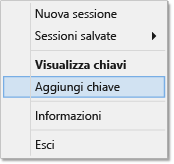

# Usare SSH con HDInsight (Hadoop) da PuTTY in Windows

> [!div class="op_single_selector"]
> * [PuTTY (Windows)](hdinsight-hadoop-linux-use-ssh-windows.md)
> * [SSH (Windows, Linux, Unix, OS X)](hdinsight-hadoop-linux-use-ssh-unix.md)

[Secure Shell (SSH)](https://en.wikipedia.org/wiki/Secure_Shell) consente di eseguire in modalità remota operazioni nei cluster di HDInsight basati su Linux usando un'interfaccia della riga di comando. Questo documento fornisce informazioni sulla connessione a HDInsight da client basati su Windows mediante il client SSH PuTTY.

> [!NOTE]
> I passaggi descritti in questo articolo presuppongono l'uso di un sistema basato su Windows con il client SSH PuTTY. Se si usa un sistema Linux, Unix, OS X o Windows che fornisce il comando `ssh`, vedere [Usare SSH con Hadoop basato su Linux in HDInsight da Linux, Unix o OS X](hdinsight-hadoop-linux-use-ssh-unix.md).

## Prerequisiti

* **PuTTY** e **PuTTYGen** per client basati su Windows. Queste utilità sono disponibili nella pagina [http://www.chiark.greenend.org.uk/~sgtatham/putty/download.html](http://www.chiark.greenend.org.uk/~sgtatham/putty/download.html).
* Un moderno Web browser che supporta HTML5.

## Che cos'è SSH?

SSH è un'utilità per accedere ed eseguire in modalità remota i comandi in un server remoto. Con HDInsight basato su Linux, SSH stabilisce una connessione crittografata al nodo head del cluster e fornisce una riga di comando che consente di digitare i comandi. I comandi vengono quindi eseguiti direttamente sul server.

Tradizionalmente, in Windows non è disponibile un client SSH. PuTTY è un client SSH con interfaccia grafica che può essere installato in Windows.

### SSH user name

Un nome utente SSH è il nome utilizzato per autenticarsi con il cluster HDInsight. Quando si specifica un nome utente SSH durante la creazione del cluster, l'utente viene creato in tutti i nodi del cluster. Una volta creato il cluster, è possibile utilizzare questo nome utente per la connessione a nodi head del cluster HDInsight. Dai nodi head, è quindi possibile connettersi ai nodi del singolo lavoratore.

### Password SSH o chiave pubblica

Un utente SSH può utilizzare una password o chiave pubblica per l'autenticazione. Una password è semplicemente una stringa di testo composta dall’utente, mentre una chiave pubblica è parte di una coppia di chiavi crittografiche generata per identificare l’utente in modo univoco.

Una chiave è più sicura di una password, ma si richiedono passaggi aggiuntivi per generare la chiave ed è necessario gestire i file che contengono la chiave in un luogo sicuro. Chiunque riesca ad accedere ai file di chiave, ottiene accesso all’account dell’utente. O se si perdono i file di chiave, non si sarà in grado di accedere al proprio account.

Una coppia di chiavi è costituita da una chiave pubblica (che viene inviata al server di HDInsight) e una chiave privata (che verrà mantenuta nel computer client.) Quando ci si connette al server di HDInsight tramite SSH, il client SSH utilizzerà la chiave privata nel computer in uso per l'autenticazione con il server.

## Creare una chiave SSH

Se si prevede di usare chiavi SSH con il cluster, attenersi alle seguenti informazioni. Se si prevede di utilizzare una password, è possibile ignorare questa sezione.

1. Aprire PuTTYGen.

2. In **Type of key to generate** (Tipo di chiave da generare) selezionare **SSH-2 RSA** e quindi fare clic su **Generate** (Genera).
   
    

3. Spostare il puntatore del mouse nell'area al di sotto dell'indicatore di stato finché la relativa barra non si riempie. Spostando il mouse si generano dati casuali che vengono usati per generare la chiave.
   
    
   
    Dopo che la chiave è stata generata, verrà visualizzata la chiave pubblica.

4. Per maggiore sicurezza, è possibile immettere una passphrase nel campo **Key passphrase** (Passphrase chiave) e quindi digitare lo stesso valore nel campo **Confirm passphrase** (Conferma passphrase).
   
    
   
   > [!NOTE]
   > È consigliabile usare una passphrase sicura per la chiave. Tuttavia, se si dimentica la passphrase, non è possibile recuperarla.

5. Fare clic su **Save private key** (Salva chiave privata) per salvare la chiave in un file con estensione **ppk**. Questa chiave verrà usata per l'autenticazione nel cluster HDInsight basato su Linux.
   
   > [!NOTE]
   > Conservare la chiave in un luogo sicuro, in quanto può essere usata per accedere al cluster HDInsight basato su Linux.

6. Fare clic su **Save public key** (Salva chiave pubblica) per salvare la chiave come file con estensione **txt**. In questo modo sarà possibile riusare la chiave pubblica in futuro, quando si creeranno altri cluster HDInsight basati su Linux.
   
   > [!NOTE]
   > La chiave pubblica viene visualizzata anche nella parte superiore di PuTTYGen. È possibile fare clic con il pulsante destro del mouse su questo campo, copiare il valore e quindi incollarlo in un modulo, quando si crea un cluster tramite il portale di Azure.

## Creare un cluster HDInsight basato su Linux

Quando si crea un cluster HDInsight basato su Linux, è necessario fornire la chiave pubblica creata in precedenza. Dai client basati su Windows è possibile creare un cluster HDInsight basato su Linux in due modi:

* **Portale di Azure** - usa un portale basato sul Web per creare il cluster.

* **Interfaccia della riga di comando di Azure** : usa i comandi della riga di comando per creare il cluster.

Ognuno di questi metodi richiede la chiave pubblica. Per informazioni dettagliate sulla creazione di un cluster HDInsight basato su Linux, vedere l'articolo [Provisioning di cluster Hadoop Linux in HDInsight con opzioni personalizzate](hdinsight-hadoop-provision-linux-clusters.md).

### Portale di Azure

Quando si usa il [portale di Azure][preview-portal] per creare un cluster HDInsight basato su Linux, è necessario inserire un **nome utente SSH** e scegliere se specificare una **PASSWORD** o una **CHIAVE PUBBLICA SSH**.

Se si seleziona **Chiave pubblica SSH**, incollare la chiave pubblica, visualizzata nel campo **Public key for pasting into OpenSSH authorized\_keys file** (Chiave pubblica da incollare nel file OpenSSH autorized_keys) di PuttyGen, nel campo **Chiave pubblica SSH** oppure selezionare **Selezionare un file** per cercare e selezionare il file contenente la chiave pubblica.

Viene creato un account di accesso per l'utente specificato ed è possibile eseguire l'autenticazione tramite password o con chiave SSH.

### Interfaccia della riga di comando di Azure per Mac, Linux e Windows

È possibile usare l'[interfaccia della riga di comando di Azure per Mac, Linux e Windows](../xplat-cli-install.md) per creare un nuovo cluster tramite il comando `azure hdinsight cluster create`.

Per altre informazioni sull'uso di questo comando, vedere l'articolo [Provisioning di cluster Hadoop Linux in HDInsight con opzioni personalizzate](hdinsight-hadoop-provision-linux-clusters.md).

## Connettersi a un cluster HDInsight basato su Linux

1. Aprire PuTTY.
   
    
2. Se è stata specificata una chiave SSH quando è stato creato l'account utente, è necessario effettuare il passaggio seguente per selezionare la chiave privata da usare durante l'autenticazione nel cluster:
   
    In **Category** espandere **Connection**, **SSH** e selezionare **Auth**. Infine, fare clic su **Browse** e selezionare il file ppk che contiene la chiave privata.
   
    

3. In **Category** (Categoria) selezionare **Session** (Sessione). Nella schermata **Basic options for your PuTTY session** (Opzioni di base per la sessione di PuTTY) immettere l'indirizzo SSH del server HDInsight nel campo **Host name (or IP address)** (Nome host o indirizzo IP). Quando ci si connette a un cluster è possibile usare due indirizzi SSH.

    

    * **Indirizzo del nodo head**: per connettersi al nodo head del cluster, usare il nome del cluster seguito da **-ssh.azurehdinsight.net**. Ad esempio, **mycluster-ssh.azurehdinsight.net**.
   
    * **Indirizzo del nodo perimetrale**: in caso di connessione a R Server nel cluster HDInsight, è possibile connettersi al nodo perimetrale R Server usando l'indirizzo **RServer.CLUSTERNAME.ssh.azurehdinsight.net**, dove CLUSTERNAME è il nome del cluster. Ad esempio, **RServer.mycluster.ssh.azurehdinsight.net**.
     

4. Per salvare le informazioni di connessione per un uso futuro, immettere un nome per la connessione in **Saved Sessions** (Sessioni salvate) e quindi fare clic su **Save** (Salva). La connessione verrà aggiunta all'elenco delle sessioni salvate.
5. Fare clic su **Open** per connettersi al cluster.
   
   > [!NOTE]
   > Se questa è la prima volta che ci si è connessi al cluster, si riceverà un avviso di sicurezza. Si tratta di una situazione normale. Per continuare, fare clic su **Yes** per memorizzare nella cache la chiave RSA2 del server.

6. Quando richiesto, immettere il nome utente immesso durante la creazione del cluster. Se è stata specificata una password per l'utente, sarà necessario specificare anch'essa.

> [!NOTE]
> I passaggi precedenti presuppongono che si usi la porta 22, che si connetterà al nodo head primario nel cluster HDInsight. Se si usa la porta 23, la connessione verrà eseguita al nodo head secondario. Per maggiori informazioni sui nodi head, vedere [Disponibilità e affidabilità dei cluster Hadoop in HDInsight](hdinsight-high-availability-linux.md).

### Connettersi ai nodi di lavoro

I nodi di lavoro non sono direttamente accessibili dall'esterno del data center di Azure, ma è possibile accedervi dal nodo head del cluster tramite SSH.

Se è stata specificata una chiave SSH quando è stato creato l'account utente, è necessario eseguire la procedura seguente per selezionare la chiave privata da usare durante l'autenticazione nel cluster per connettersi ai nodi di lavoro.

1. Installare Pageant dalla pagina [http://www.chiark.greenend.org.uk/~sgtatham/putty/download.html](http://www.chiark.greenend.org.uk/~sgtatham/putty/download.html). Questa utilità consente di memorizzare nella cache le chiavi SSH per PuTTY.

2. Eseguire Pageant. Si ridurrà a icona nella barra di stato. Fare clic con il pulsante destro del mouse sull'icona e scegliere **Add Key**.
   
    

3. Quando viene visualizzata la finestra Sfoglia, selezionare il file .ppk che contiene la chiave e quindi fare clic su **Apri**. La chiave verrà aggiunta a Pageant, che la fornirà a PuTTY durante la connessione al cluster.
   
   > [!IMPORTANT]
   > Se si usa una chiave SSH per proteggere l'account, è necessario completare i passaggi precedenti per potersi connettere ai nodi di lavoro.

4. Aprire PuTTY.

5. Se si usa una chiave SSH per eseguire l'autenticazione, nella sezione **Category** (Categoria) espandere **Connection** (Connessione) e quindi **SSH** e infine selezionare **Auth** (Autenticazione).
   
    Nella sezione **Authentication parameters** (Parametri di autenticazione) abilitare **Allow agent forwarding** (Consenti inoltro agente). In questo modo PuTTY passa automaticamente l'autenticazione del certificato tramite la connessione al nodo head del cluster durante la connessione ai nodi di lavoro.
   
    

6. Connettersi al cluster come descritto in precedenza. Se si usa una chiave SSH per l'autenticazione, non è necessario selezionare la chiave: la chiave SSH aggiunta a Pageant verrà usata per l'autenticazione del cluster.

7. Dopo aver stabilito la connessione, usare il comando seguente per recuperare un elenco dei nodi del cluster. Sostituire *ADMINPASSWORD* con la password per l'account amministratore del cluster. Sostituire *CLUSTERNAME* con il nome del cluster.
   
        curl --user admin:ADMINPASSWORD https://CLUSTERNAME.azurehdinsight.net/api/v1/hosts
   
    In questo modo le informazioni verranno sostituite nel formato JSON per i nodi del cluster, tra cui `host_name`, che contiene il nome di dominio completo (FQDN) per ogni nodo. Di seguito è riportato un esempio di una voce `host_name` restituita dal comando **curl** :
   
        "host_name" : "workernode0.workernode-0-e2f35e63355b4f15a31c460b6d4e1230.j1.internal.cloudapp.net"

8. Dopo aver creato un elenco dei nodi di lavoro ai quali connettersi, usare il comando seguente dalla sessione PuTTY al server per aprire una connessione a un nodo di lavoro:
   
        ssh USERNAME@FQDN
   
    Sostituire *USERNAME* con il nome utente SSH e *FQDN* con il nome di dominio completo per il nodo di lavoro. Ad esempio: `workernode0.workernode-0-e2f35e63355b4f15a31c460b6d4e1230.j1.internal.cloudapp.net`.
    
    > [!NOTE]
    > Se è stata usata una password per l'autenticazione della sessione SSH, verrà richiesto di immetterla di nuovo. Se si usa una chiave SSH, la connessione dovrebbe terminare senza alcuna richiesta.

9. Una volta stabilita la sessione, la richiesta per la sessione PuTTY cambierà da `username@hn#-clustername` a `username@wn#-clustername` per indicare che si è connessi al nodo di lavoro. Tutti i comandi eseguiti a questo punto verranno eseguiti sul nodo del lavoro.

10. Al termine dell'esecuzione di azioni su un nodo di lavoro, usare il comando `exit` per chiudere la sessione per il nodo di lavoro. In questo modo si tornerà alla richiesta `username@hn#-clustername` .

## Aggiungere altri account

Se è necessario aggiungere altri account al cluster, eseguire i passaggi seguenti:

1. Generare una nuova chiave pubblica e una nuova chiave privata per il nuovo account utente come descritto in precedenza.

2. Da una sessione SSH al cluster aggiungere il nuovo utente con il comando seguente:
   
        sudo adduser --disabled-password <username>
   
    Verrà creato un nuovo account utente, ma verrà disabilitata l'autenticazione tramite password.

3. Creare la directory e i file per contenere la chiave usando i comandi seguenti:
   
        sudo mkdir -p /home/<username>/.ssh
        sudo touch /home/<username>/.ssh/authorized_keys
        sudo nano /home/<username>/.ssh/authorized_keys

4. Quando si apre l'editor nano, copiare e incollare il contenuto della chiave pubblica per il nuovo account utente. Usare infine **Ctrl-X** per salvare il file e uscire dall'editor.
   
    

5. Usare il comando seguente per specificare il nuovo account utente come proprietario della cartella .ssh e del contenuto.
   
        sudo chown -hR <username>:<username> /home/<username>/.ssh

6. Sarà ora possibile eseguire l'autenticazione nel server con il nuovo account utente e la chiave privata.

## Tunneling SSH

SSH può essere usato anche per effettuare il tunneling di richieste locali, ad esempio richieste Web, al cluster HDInsight. La richiesta verrà quindi instradata alla risorsa richiesta come se provenisse dal nodo head del cluster HDInsight.

> [!IMPORTANT]
> Un tunnel SSH è un requisito per l'accesso al web dell'interfaccia utente per alcuni servizi Hadoop. Ad esempio, la UI di cronologia processi o di gestione delle risorse dell'interfaccia utente possono essere accessibili solo tramite un tunnel SSH.

Per altre informazioni sulla creazione e sull'uso di un tunnel SSH, vedere [Usare il tunneling SSH per accedere all'interfaccia Web di Ambari, ResourceManager, JobHistory, NameNode, Oozie e altre interfacce Web](hdinsight-linux-ambari-ssh-tunnel.md).

## Passaggi successivi

Ora che si è appreso come eseguire l'autenticazione usando una chiave SSH, è possibile imparare a usare MapReduce con Hadoop in HDInsight.

* [Usare Hive con HDInsight](hdinsight-use-hive.md)
* [Usare Pig con HDInsight](hdinsight-use-pig.md)
* [Usare processi MapReduce con HDInsight](hdinsight-use-mapreduce.md)

[preview-portal]: https://portal.azure.com/

<!--HONumber=Jan17_HO3-->

