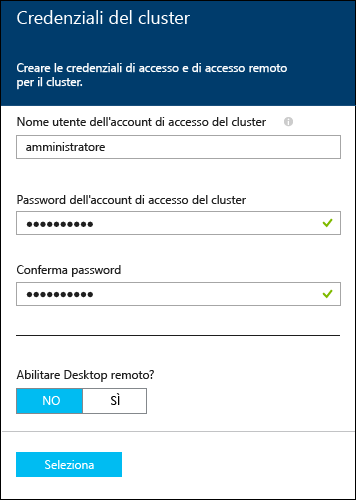
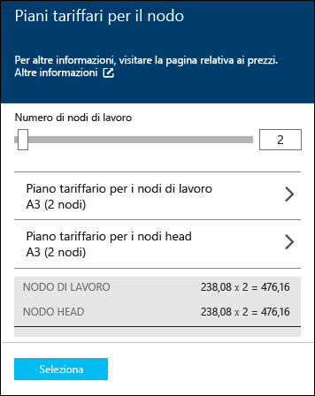

<properties
   pageTitle="Esercitazione di Hadoop: Introduzione a Hadoop in Windows | Microsoft Azure"
   description="Introduzione a Hadoop in HDInsight Informazioni su come eseguire il provisioning di cluster Hadoop in Windows, eseguire una query Hive sui dati e analizzare l'output in Excel."
   keywords="hadoop tutorial,hadoop on windows,hadoop cluster,learn hadoop, hive query"
   services="hdinsight"
   documentationCenter=""
   authors="nitinme"
   manager="paulettm"
   editor="cgronlun"
   tags="azure-portal"/>

<tags
   ms.service="hdinsight"
   ms.devlang="na"
   ms.topic="hero-article"
   ms.tgt_pltfrm="na"
   ms.workload="big-data"
   ms.date="09/03/2015"
   ms.author="nitinme"/>

# Esercitazione di Hadoop: Introduzione ad Hadoop e a una query Hive in HDInsight in Windows

> [AZURE.SELECTOR]
- [Windows](../hdinsight-hadoop-tutorial-get-started-windows.md)
- [Linux](../hdinsight-hadoop-linux-tutorial-get-started.md)

Per informazioni su Hadoop in Windows e per iniziare a usare HDInsight, questa esercitazione illustra come eseguire una query Hive su dati non strutturati in un cluster Hadoop e quindi analizzare i risultati in Microsoft Excel.

[AZURE.INCLUDE [hdinsight-azure-preview-portal](../../includes/hdinsight-azure-preview-portal.md)]

* [Introduzione all'uso di Hadoop in HDInsight su Windows](hdinsight-hadoop-tutorial-get-started-windows-v1.md)

## Obiettivi di questa esercitazione di Hadoop

Si supponga di avere un set di dati non strutturati di grandi dimensioni e di volere eseguire una query Hive sul set di dati per estrarre informazioni significative. Questo è l'obiettivo dell'esercitazione. Il risultato sarà ottenuto nel modo seguente:

   ![Esercitazione di Hadoop: Creare un account, eseguire il provisioning di un cluster Hadoop, inviare una query Hive e analizzare i dati in Excel.][image-hdi-getstarted-flow]

Guardare un video dimostrativo di questa esercitazione per imparare a usare Hadoop su HDInsight:

![Video della prima esercitazione di Hadoop: Inviare una query Hive in un cluster Hadoop e analizzare i risultati in Excel.][img-hdi-getstarted-video]

**[Guardare l'esercitazione di Hadoop per HDInsight su YouTube](https://www.youtube.com/watch?v=Y4aNjnoeaHA&list=PLDrz-Fkcb9WWdY-Yp6D4fTC1ll_3lU-QS)**

In concomitanza con la fase GA (General Availability) di Azure HDInsight, Microsoft offre anche HDInsight Emulator per Azure, noto in precedenza come *Microsoft HDInsight Developer Preview*. L'emulatore è stato progettato per scenari relativi allo sviluppo e supporta solo distribuzioni a nodo singolo. Per informazioni sull'uso di HDInsight Emulator, vedere [Introduzione a HDInsight Emulator][hdinsight-emulator].

## Prerequisiti

Prima di iniziare questa esercitazione per Hadoop, è necessario disporre di quanto segue:

- **Una sottoscrizione di Azure**. Vedere [Ottenere una versione di valutazione gratuita di Azure](http://azure.microsoft.com/documentation/videos/get-azure-free-trial-for-testing-hadoop-in-hdinsight/).
- **Una workstation** con Office 2013 Professional Plus, Office 365 Pro Plus, Excel 2013 Standalone oppure Office 2010 Professional Plus.

##Provisioning di un cluster Hadoop

Quando si esegue il provisioning di un cluster, si esegue il provisioning delle risorse di calcolo di Azure che includono Hadoop e le applicazioni correlate. In questa sezione si esegue una versione 3.2 del cluster HDInsight. È inoltre possibile creare cluster Hadoop per le altre versioni. Per istruzioni, vedere [Provisioning di cluster HDInsight con opzioni personalizzate][hdinsight-provision]. Per informazioni sulle versioni di HDInsight e sui relativi contratti di servizio, vedere l'articolo relativo al [controllo delle versioni del componente HDInsight](hdinsight-component-versioning.md).

**Per eseguire il provisioning di un cluster Hadoop**

1. Accedere al [portale di anteprima di Azure](https://ms.portal.azure.com/).
2. Fare clic su **NUOVO**, fare clic su **Analisi di dati**, quindi fare clic su **HDInsight**.

    

3. Immettere un **Nome cluster**, selezionare **Hadoop** per il **tipo di Cluster**, e dall’elenco a discesa **Sistema operativo Cluster**, selezionare **Windows Server 2012 R2 Datacenter**. Un segno di spunta verde verrà visualizzato accanto al nome del cluster, se disponibile.

	

4. Se si dispone di più di una sottoscrizione, fare clic sulla voce**Sottoscrizione** per selezionare la sottoscrizione di Azure che verrà utilizzata per il cluster.

5. Fare clic su **Gruppo di risorse** per visualizzare un elenco di gruppi di risorse esistenti, quindi selezionare quello in cui creare il cluster. In alternativa, è possibile fare clic su **Crea nuovo** e quindi immettere il nome del nuovo gruppo di risorse. Verrà visualizzato un segno di spunta verde per indicare se il nome del nuovo gruppo è disponibile.

	> [AZURE.NOTE]Questa voce sarà impostata su uno dei gruppi di risorse esistenti, se disponibili.

6. Fare clic su **Credenziali**, quindi immettere un **Nome utente di accesso al Cluster** e la **Password dell'account di accesso Cluster**. Se si desidera attivare il desktop remoto nel nodo del cluster, su**Abilita Desktop remoto**, fare clic su **Sì** e poi specificare i valori richiesti. In questa esercitazione non richiede desktop remoto, quindi è possibile ignorare questo passaggio. Fare clic su **Seleziona** nella parte inferiore per salvare la configurazione delle credenziali.

	

7. Fare clic su **Origine dati** per scegliere un'origine dati esistente per il cluster o crearne una nuova. Quando si esegue il provisioning di un cluster Hadoop in HDInsight, si specifica un account di archiviazione di Azure. Un contenitore di archiviazione BLOB specifico dell'account viene designato come file system predefinito, come in HDFS (Hadoop Distributed File System, file system distribuito Hadoop). Per impostazione predefinita, il provisioning del cluster HDInsight viene effettuato nello stesso data center dell'account di archiviazione specificato. Per altre informazioni, vedere l'argomento relativo all'[uso dell'archiviazione BLOB di Azure con HDInsight][hdinsight-storage].

	
	
	Attualmente è possibile selezionare un account di archiviazione di Azure come origine dati per un cluster HDInsight. Utilizzare quanto segue per comprendere le voci nel pannello **Origine dati**.
	
	- **Metodo di selezione**: impostare questa proprietà su **Da tutte le sottoscrizioni** per consentire l'esplorazione di account di archiviazione da tutte le sottoscrizioni. Impostare questa proprietà su **Tasto di scelta** se si desidera immettere il **Nome di archiviazione** e il **Tasto di scelta** di un account di archiviazione esistente.
	
	- **Seleziona account di archiviazione / Crea nuovo**: fare clic su **Seleziona account di archiviazione** per cercare e selezionare un account di archiviazione esistente da associare al cluster. Fare clic su **Crea nuovo** per creare un nuovo account di archiviazione. Utilizzare il campo che viene visualizzato per immettere il nome dell'account di archiviazione. Se il nome è disponibile, verrà visualizzato un segno di spunta verde.
	
	- **Scegli contenitore predefinito**: utilizzare questa opzione per immettere il nome del contenitore predefinito da utilizzare per il cluster. È possibile immettere qualsiasi nome, è consigliabile utilizzare lo stesso nome del cluster in modo che sia facilmente intuibile che il contenitore viene utilizzato per tale cluster specifico.
	
	- **Percorso**: l'area geografica dove si trova o dove verrà creato l'account di archiviazione.
	
		> [AZURE.IMPORTANT]La selezione del percorso per l'origine dati predefinito imposterà anche il percorso del cluster HDInsight. L'origine dati del cluster e l’origine dati predefinita devono trovarsi nella stessa area.
		
	Fare clic su **Seleziona** per salvare la configurazione dell’origine dati.

8. Fare clic su **Livelli di prezzi nodo** per visualizzare informazioni sui nodi che verranno creati per questo cluster. Impostare il numero di nodi del ruolo di lavoro necessari per il cluster. Verrà visualizzato il costo stimato del cluster all'interno del pannello.

	
	
	Fare clic su **Seleziona** per salvare la configurazione del prezzo del nodo.

9. Nel pannello**Nuovo cluster HDInsight**, assicurarsi che **Aggiungi alla schermata iniziale** sia selezionato, quindi fare clic su **Crea**. Questo creerà il cluster e aggiungerà una sezione apposita nella schermata iniziale del portale di Azure. L'icona indica che il cluster sta eseguendo il provisioning e verrà visualizzata l'icona di HDInsight, una volta completato il provisioning.

	| Durante il provisioning | Provisioning completato |
	| ------------------ | --------------------- |
	|  |  |

	> [AZURE.NOTE]La creazione del cluster richiederà del tempo, in genere circa 15 minuti. Utilizzare il riquadro sulla schermata iniziale, o la voce **Notifiche** a sinistra della pagina per controllare il processo di provisioning.

10. Al termine del provisioning, fare clic sul riquadro per il cluster dalla schermata iniziale per avviare il pannello del cluster.

##Eseguire dati di esempio dal portale

Un cluster HDInsight il cui provisioning è stato effettuato correttamente fornisce una console di query che include una raccolta introduttiva per l'esecuzione di esempi direttamente dal portale. Gli esempi possono essere usati per apprendere come lavorare con HDInsight seguendo le procedure dettagliare di alcuni scenari di base. Gli esempi forniscono tutti i componenti necessari, come i dati per l'analisi e le query da eseguire sui dati. Per altre informazioni sugli esempi della raccolta introduttiva, vedere [Informazioni su Hadoop in HDInsight tramite la raccolta di introduzione HDInsight](hdinsight-learn-hadoop-use-sample-gallery.md).

**Per eseguire l'esempio**

1. Dalla schermata iniziale del portale di anteprima di Azure, fare clic sul riquadro per il cluster che si è appena creato.
 
2. Dal pannello del cluster Spark, fare clic su **Dashboard**. Quando richiesto, immettere nome utente dell’admin e la password per il cluster.

	
 
3. Nella pagina Web visualizzata fare clic sulla scheda **Galleria introduttiva** e quindi, nella categoria **Soluzioni con esempi dati **, fare clic sull'esempio che si vuole eseguire. Seguire le istruzioni nella pagina Web per completare l'esempio. La tabella seguente elenca alcuni esempi e fornisce informazioni aggiuntive sulla funzione di ogni esempio.

Esempio | Funzione
------ | ---------------
[Analisi dei dati dei sensori][hdinsight-sensor-data-sample] | Informazioni su come usare HDInsight per l'elaborazione dei dati cronologici prodotti dai sistemi HVAC (Heating, Ventilating and Air Conditioning, riscaldamento, ventilazione e condizionamento dell'aria) per identificare sistemi che non sono in grado di mantenere in modo affidabile una temperatura impostata.
[Analisi del log del sito Web][hdinsight-weblogs-sample] | Informazioni su come usare HDInsight per analizzare i file di log dei siti Web per ottenere informazioni dettagliate sulla frequenza delle visite nel sito Web nell'arco di un giorno da siti Web esterni, nonché un riepilogo degli errori nei siti Web riscontrati dagli utenti.
[Analisi delle tendenze di Twitter](hdinsight-analyze-twitter-data.md) | Informazioni su come usare HDInsight per analizzare le tendenze in Twitter.

##Eseguire una query Hive dal portale
Dopo il provisioning di un cluster HDInsight, il passaggio successivo consiste nell'esecuzione di un processo Hive per eseguire query su una tabella Hive di esempio. Verrà usata la tabella *hivesampletable*, disponibile con i cluster HDInsight. La tabella contiene dati relativi a produttori, piattaforme e modelli di dispositivi mobili. Una query Hive in questa tabella recupera i dati per i dispositivi mobili di un produttore specifico.

> [AZURE.NOTE]HDInsight Tools per Visual Studio è disponibile in Azure SDK per .NET versione 2.5 o versione successiva. Usando gli strumenti in Visual Studio, sarà possibile connettersi al cluster HDInsight, creare tabelle Hive ed eseguire query Hive. Per altre informazioni, vedere [Introduzione all'uso di HDInsight Hadoop Tools per Visual Studio][1].

**Per eseguire un processo Hive dal dashboard del cluster**

1. Accedere al [portale di anteprima di Azure](https://ms.portal.azure.com/).
2. Fare clic su **ESPLORA TUTTO** e poi fare clic su **cluster HDInsight** per visualizzare un elenco di cluster, tra cui il cluster appena creato nella sezione precedente.
3. Fare clic sul nome del cluster che si vuole usare per eseguire il processo Hive e poi fare clic su **Dashboard** nella parte superiore della pagina.
4. Verrà aperta una pagina Web in una scheda diversa del browser. Immettere l'account utente e la password per Hadoop. Il nome utente predefinito è **admin**. La password corrisponde a quella immessa durante il provisioning del cluster.
5. Dal dashboard, fare clic sulla scheda **Editor Hive**. Verrà visualizzata la pagina web.

	![Scheda Editor Hive nel dashboard del cluster HDInsight.][img-hdi-dashboard]

	Nella parte superiore della pagina sono presenti diverse schede. La scheda predefinita è **Editor Hive** e le altre schede sono **Cronologia processo** e **Browser file**. Usando il dashboard, è possibile inviare query Hive, controllare i log dei processi Hadoop ed esplorare i file nell'archivio.

	> [AZURE.NOTE]Si noti che l'URL della pagina Web è *&lt;NomeCluster&gt;.azurehdinsight.net*. Invece di aprire il dashboard dal portale, è quindi possibile aprirlo da un Web browser usando l'URL.

6. Nella scheda **Editor Hive** in **Nome query** immettere **HTC20**. Il nome della query corrisponde al nome del processo. Nel riquadro della query immettere la query Hive come illustrato nell'immagine:

	![Query Hive immessa nel riquadro di query dell'Editor Hive.][img-hdi-dashboard-query-select]

4. Fare clic su **Submit**. Per ottenere i risultati sono necessari alcuni minuti. La schermata viene aggiornata ogni 30 secondi. È anche possibile fare clic su **Aggiorna** per aggiornare la schermata.

    ![Risultati di una query Hive nella parte inferiore del dashboard del cluster.][img-hdi-dashboard-query-select-result]

5. Quando lo stato indica che il processo è stato completato, fare clic sul nome della query nella schermata per visualizzare l'output. Annotare il valore per **Ora inizio processo (UTC)**. Sarà necessario più avanti.

    ![Ora di inizio processo nella scheda Cronologia processo del dashboard del cluster HDInsight.][img-hdi-dashboard-query-select-result-output]

    Questa pagina mostra anche i valori per **Output processo** e **Registro processo**. Sarà anche possibile scaricare il file di output (\_stdout) e il file di log (\_stderr).

**Per passare al file di output**

1. Nel dashboard del cluster fare clic su **Browser file**.
2. Fare clic sul nome dell'account di archiviazione, quindi sul nome del contenitore (che corrisponde al nome del cluster) e infine su **utente**.
3. Fare clic su **amministratore** e quindi sul GUID modificato più di recente (poco dopo l'ora di avvio del processo annotata in precedenza). Copiare il GUID. Sarà necessario nella sezione successiva.

   	![GUID file di output della query Hive nella scheda Browser file.][img-hdi-dashboard-query-browse-output]

##Connettersi agli strumenti di business intelligence Microsoft per Excel

È possibile usare il componente aggiuntivo Power Query per Microsoft Excel per importare l'output del processo da HDInsight in Excel, dove si possono usare gli strumenti di Microsoft Business Intelligence per analizzare ulteriormente i risultati.

Per completare questa parte dell'esercitazione, è necessario disporre di Excel 2013 o 2010.

**Per scaricare Microsoft Power Query per Excel**

- Scaricare Microsoft Power Query per Microsoft Excel dall'[Area download Microsoft](http://www.microsoft.com/download/details.aspx?id=39379) e installarlo.

**Per importare dati di HDInsight**

1. Aprire Excel e creare una nuova cartella di lavoro.
3. Dal menu **Power Query** scegliere **Da altre origini**, quindi fare clic su **Da Azure HDInsight**.

	![Menu di importazione PowerQuery in Excel per Azure HDInsight.][image-hdi-gettingstarted-powerquery-importdata]

3. Immettere **Nome account** per l'account di archiviazione BLOB di Azure associato al cluster e quindi fare clic su **OK**. Si tratta dell'account di archiviazione creato in precedenza nell'esercitazione.
4. Immettere **Chiave account** per l'account di archiviazione BLOB di Azure e quindi fare clic su **Salva**.
5. Nel riquadro destro fare doppio clic sul nome del BLOB. Per impostazione predefinita, il nome del BLOB corrisponde al nome del cluster.

6. Individuare **stdout** nella colonna **Nome**. Assicurarsi che il GUID nella colonna **Percorso cartella** corrispondente sia uguale al GUID annotato in precedenza. Una corretta corrispondenza indica che i dati di output corrispondono al processo inviato. Fare clic su **Binario** nella colonna a sinistra di **stdout**.

	![Ricerca dell'output dei dati in base al GUID nell'elenco di contenuti.][image-hdi-gettingstarted-powerquery-importdata2]

9. Fare clic su **Carica e chiudi** nell'angolo superiore sinistro per importare l'output del processo Hive in Excel.

##Passaggi successivi
In questa esercitazione di Hadoop si è appreso come effettuare il provisioning di un cluster Hadoop in Windows in HDInsight, eseguire una query Hive sui dati e importare i risultati in Excel per elaborarli ulteriormente e visualizzarli graficamente mediante gli strumenti di business intelligence. Per altre informazioni, vedere le esercitazioni seguenti:

- [Introduzione all'uso di HDInsight Hadoop Tools per Visual Studio][1]
- [Introduzione a HDInsight Emulator][hdinsight-emulator]
- [Usare l'archivio BLOB di Azure con HDInsight][hdinsight-storage]
- [Amministrazione di HDInsight tramite PowerShell][hdinsight-admin-powershell]
- [Caricare dati in HDInsight][hdinsight-upload-data]
- [Usare MapReduce con HDInsight][hdinsight-use-mapreduce]
- [Usare Hive con HDInsight][hdinsight-use-hive]
- [Usare Pig con HDInsight][hdinsight-use-pig]
- [Usare Oozie con HDInsight][hdinsight-use-oozie]
- [Sviluppare programmi per la creazione di flussi Hadoop in C# per HDInsight][hdinsight-develop-streaming]
- [Sviluppare programmi MapReduce Java per HDInsight][hdinsight-develop-mapreduce]

[1]: ../HDInsight/hdinsight-hadoop-visual-studio-tools-get-started.md

[hdinsight-versions]: hdinsight-component-versioning.md

[hdinsight-provision]: hdinsight-provision-clusters.md
[hdinsight-admin-powershell]: hdinsight-administer-use-powershell.md
[hdinsight-upload-data]: hdinsight-upload-data.md
[hdinsight-use-mapreduce]: hdinsight-use-mapreduce.md
[hdinsight-use-hive]: hdinsight-use-hive.md
[hdinsight-use-pig]: hdinsight-use-pig.md
[hdinsight-use-oozie]: hdinsight-use-oozie.md
[hdinsight-storage]: hdinsight-hadoop-use-blob-storage.md
[hdinsight-emulator]: hdinsight-hadoop-emulator-get-started.md
[hdinsight-develop-streaming]: hdinsight-hadoop-develop-deploy-streaming-jobs.md
[hdinsight-develop-mapreduce]: hdinsight-develop-deploy-java-mapreduce.md
[hadoop-hdinsight-intro]: hdinsight-hadoop-introduction.md
[hdinsight-weblogs-sample]: hdinsight-hive-analyze-website-log.md
[hdinsight-sensor-data-sample]: hdinsight-hive-analyze-sensor-data.md

[azure-purchase-options]: http://azure.microsoft.com/pricing/purchase-options/
[azure-member-offers]: http://azure.microsoft.com/pricing/member-offers/
[azure-free-trial]: http://azure.microsoft.com/pricing/free-trial/
[azure-management-portal]: https://ms.portal.azure.com/
[azure-create-storageaccount]: ../storage-create-storage-account.md

[apache-hadoop]: http://go.microsoft.com/fwlink/?LinkId=510084
[apache-hive]: http://go.microsoft.com/fwlink/?LinkId=510085
[apache-mapreduce]: http://go.microsoft.com/fwlink/?LinkId=510086
[apache-hdfs]: http://go.microsoft.com/fwlink/?LinkId=510087
[hdinsight-hbase-custom-provision]: hdinsight-hbase-tutorial-get-started.md

[powershell-download]: http://go.microsoft.com/fwlink/p/?linkid=320376&clcid=0x409
[powershell-install-configure]: ../install-configure-powershell.md
[powershell-open]: ../install-configure-powershell.md#Install

[img-hdi-dashboard]: ./media/hdinsight-hadoop-tutorial-get-started-windows/HDI.dashboard.png
[img-hdi-dashboard-query-select]: ./media/hdinsight-hadoop-tutorial-get-started-windows/HDI.dashboard.query.select.png
[img-hdi-dashboard-query-select-result]: ./media/hdinsight-hadoop-tutorial-get-started-windows/HDI.dashboard.query.select.result.png
[img-hdi-dashboard-query-select-result-output]: ./media/hdinsight-hadoop-tutorial-get-started-windows/HDI.dashboard.query.select.result.output.png
[img-hdi-dashboard-query-browse-output]: ./media/hdinsight-hadoop-tutorial-get-started-windows/HDI.dashboard.query.browse.output.png

[img-hdi-getstarted-video]: ./media/hdinsight-hadoop-tutorial-get-started-windows/hdi-get-started-video.png

[image-hdi-storageaccount-quickcreate]: ./media/hdinsight-hadoop-tutorial-get-started-windows/HDI.StorageAccount.QuickCreate.png
[image-hdi-clusterstatus]: ./media/hdinsight-hadoop-tutorial-get-started-windows/HDI.ClusterStatus.png
[image-hdi-quickcreatecluster]: ./media/hdinsight-hadoop-tutorial-get-started-windows/HDI.QuickCreateCluster.png
[image-hdi-getstarted-flow]: ./media/hdinsight-hadoop-tutorial-get-started-windows/HDI.GetStartedFlow.png

[image-hdi-gettingstarted-powerquery-importdata]: ./media/hdinsight-hadoop-tutorial-get-started-windows/HDI.GettingStarted.PowerQuery.ImportData.png
[image-hdi-gettingstarted-powerquery-importdata2]: ./media/hdinsight-hadoop-tutorial-get-started-windows/HDI.GettingStarted.PowerQuery.ImportData2.png
 

<!---HONumber=Oct15_HO3-->