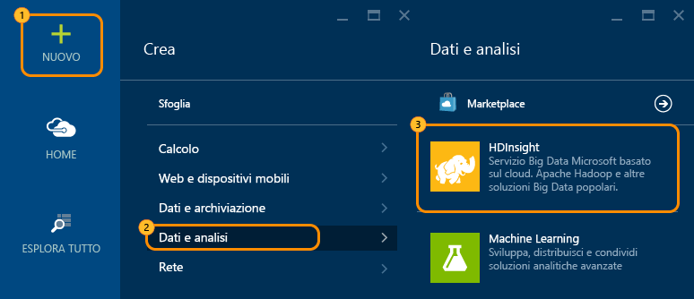
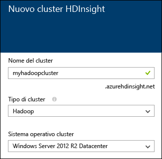
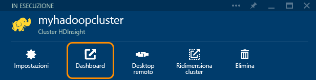

<properties
   pageTitle="Esercitazione di Hadoop: Introduzione a Hadoop in Windows | Microsoft Azure"
   description="Introduzione a Hadoop in HDInsight Informazioni su come creare cluster Hadoop in Windows, eseguire una query Hive sui dati e analizzare l'output in Excel."
   keywords="esercitazione di Hadoop,Hadoop in Windows,cluster di Hadoop,informazioni su Hadoop,query Hive"
   services="hdinsight"
   documentationCenter=""
   authors="nitinme"
   manager="jhubbard"
   editor="cgronlun"
   tags="azure-portal"/>

<tags
   ms.service="hdinsight"
   ms.devlang="na"
   ms.topic="article"
   ms.tgt_pltfrm="na"
   ms.workload="big-data"
   ms.date="03/07/2016"
   ms.author="nitinme"/>

# Esercitazione di Hadoop: Introduzione all'uso di Hadoop in HDInsight in Windows

> [AZURE.SELECTOR]
- [Basato su Linux](../hdinsight-hadoop-linux-tutorial-get-started.md)
- [Basato su Windows](../hdinsight-hadoop-tutorial-get-started-windows.md)

Per informazioni su Hadoop in Windows e per iniziare a usare HDInsight, questa esercitazione illustra come eseguire una query Hive su dati non strutturati in un cluster Hadoop e quindi analizzare i risultati in Microsoft Excel.

>[AZURE.NOTE] Le informazioni contenute in questo documento sono specifiche per i cluster HDInsight basati su Windows. Per informazioni sui cluster basati su Linux, vedere [Esercitazione di Hadoop: Introduzione all'uso di Hadoop basato su Linux in HDInsight](hdinsight-hadoop-linux-tutorial-get-started.md).

Si supponga di avere un set di dati non strutturati di grandi dimensioni e di volere eseguire una query Hive sul set di dati per estrarre informazioni significative. Questo è l'obiettivo dell'esercitazione. Ecco come effettuare questa operazione:

   !["Esercitazione di Hadoop: Creare un account, creare un cluster Hadoop, inviare una query Hive e analizzare i dati in Excel.][image-hdi-getstarted-flow]

Guardare un video dimostrativo di questa esercitazione per imparare a usare Hadoop su HDInsight:

![Video della prima esercitazione di Hadoop: Inviare una query Hive in un cluster Hadoop e analizzare i risultati in Excel.][img-hdi-getstarted-video]

**[Guardare l'esercitazione di Hadoop per HDInsight su YouTube](https://www.youtube.com/watch?v=Y4aNjnoeaHA&list=PLDrz-Fkcb9WWdY-Yp6D4fTC1ll_3lU-QS)**

In concomitanza con la fase GA (General Availability) di Azure HDInsight, Microsoft offre anche HDInsight Emulator per Azure, noto in precedenza come *Microsoft HDInsight Developer Preview*. L'emulatore è stato progettato per scenari relativi allo sviluppo e supporta solo distribuzioni a nodo singolo. Per informazioni sull'uso di HDInsight Emulator, vedere [Introduzione a HDInsight Emulator][hdinsight-emulator].

[AZURE.INCLUDE [delete-cluster-warning](../../includes/hdinsight-delete-cluster-warning.md)]

### Prerequisiti

Prima di iniziare questa esercitazione per Hadoop, è necessario disporre di quanto segue:

- **Una sottoscrizione di Azure**. Vedere [Ottenere una versione di valutazione gratuita di Azure](https://azure.microsoft.com/documentation/videos/get-azure-free-trial-for-testing-hadoop-in-hdinsight/).
- **Una workstation** con Office 2013 Professional Plus, Office 365 Pro Plus, Excel 2013 Standalone oppure Office 2010 Professional Plus.

##Creare cluster Hadoop

Quando si crea un cluster, si creano risorse di calcolo di Azure che includono Hadoop e le applicazioni correlate. In questa sezione si crea una versione 3.2 del cluster HDInsight. È inoltre possibile creare cluster Hadoop per le altre versioni. Per istruzioni, vedere [Creare cluster Hadoop in HDInsight][hdinsight-provision]. Per informazioni sulle versioni di HDInsight e sui relativi contratti di servizio, vedere l'articolo relativo al [controllo delle versioni del componente HDInsight](hdinsight-component-versioning.md).

**Per creare un cluster Hadoop**

1. Accedere al [portale di Azure](https://portal.azure.com/).
2. Fare clic su **NUOVO**, selezionare **Analisi dei dati** e quindi fare clic su **HDInsight**. Nel portale verrà aperto il pannello **Nuovo cluster HDInsight**.

    

3. Immettere o selezionare i valori seguenti:

	
	
	|Nome campo| Valore|
	|----------|------|
	|Cluster Name| Un nome univoco per l'identificazione del cluster|
	|Tipo di cluster| Selezionare **Hadoop** per questa esercitazione. |
	|Sistema operativo cluster| Selezionare **Windows Server 2012 R2 Datacenter** per questa esercitazione.|
	|HDInsight Version| Selezionare la versione più recente per questa esercitazione.|
	|Subscription| Selezionare la sottoscrizione di Azure che verrà usata per il cluster.|
	|Gruppo di risorse | Selezionare un gruppo di risorse di Azure esistente o crearne uno nuovo. Un cluster HDInsight di base contiene un cluster e il relativo account di archiviazione predefinito. È possibile raggruppare i due oggetti in un gruppo di risorse per una gestione ottimale.|
	|Credenziali| Immettere il nome utente e la password dell'account di accesso del cluster. Un cluster basato su Windows può disporre di 2 account utente. L'utente del cluster (o l'utente HTTP) viene usato per gestire il cluster e inviare i processi. Facoltativamente è possibile creare un account utente desktop remoto (RDP) per connettersi in remoto al cluster. Se si sceglie di abilitare desktop remoto, si creerà l'account utente RDP.|
	|Origine dati| Fare clic su Crea nuovo per creare un nuovo account di archiviazione di Azure predefinito. Usare il nome del cluster come nome del contenitore predefinito. Ogni cluster HDInsight include un contenitore BLOB predefinito in un account di archiviazione di Azure. Il percorso dell'account di archiviazione di Azure predefinito determina la posizione del cluster HDInsight.|
	|Piani tariffari per il nodo| Usare 1 o 2 nodi di lavoro con il piano tariffario predefinito per il nodo di lavoro e il nodo head per questa esercitazione.|
	|Configurazione facoltativa| Ignorare questa parte.|

9. Nel pannello **Nuovo cluster HDInsight** assicurarsi che l'opzione **Aggiungi alla Schermata iniziale** sia selezionata, quindi fare clic su **Crea**. Questo creerà il cluster e aggiungerà una sezione apposita nella schermata iniziale del portale di Azure. L'icona indica che il cluster è in fase di creazione e verrà visualizzata l'icona di HDInsight al termine dell'operazione.

	| Durante la creazione | Creazione completata |
	| ------------------ | --------------------- |
	|  |  |

	> [AZURE.NOTE] La creazione del cluster richiederà del tempo, in genere circa 15 minuti. Usare il riquadro nella Schermata iniziale o la voce **Notifiche** nella parte sinistra della pagina per controllare il processo di creazione.

10. Al termine della creazione, fare clic sul riquadro per il cluster dalla Schermata iniziale per avviare il pannello del cluster.

## Eseguire una query Hive dal portale
Dopo la creazione di un cluster HDInsight, il passaggio successivo consiste nell'esecuzione di un processo Hive per eseguire query su una tabella Hive di esempio. Verrà usata la tabella *hivesampletable*, disponibile con i cluster HDInsight. La tabella contiene dati relativi a produttori, piattaforme e modelli di dispositivi mobili. Una query Hive in questa tabella recupera i dati per i dispositivi mobili di un produttore specifico.

> [AZURE.NOTE] HDInsight Tools per Visual Studio è disponibile in Azure SDK per .NET versione 2.5 o versione successiva. Usando gli strumenti in Visual Studio, sarà possibile connettersi al cluster HDInsight, creare tabelle Hive ed eseguire query Hive. Per altre informazioni, vedere [Introduzione all'uso di HDInsight Hadoop Tools per Visual Studio][1].

**Per eseguire un processo Hive dal dashboard del cluster**

1. Accedere al [portale di Azure](https://portal.azure.com/).
2. Fare clic su **ESPLORA TUTTO** e poi su **Cluster HDInsight** per visualizzare un elenco di cluster, tra cui il cluster appena creato nella sezione precedente.
3. Fare clic sul nome del cluster che si vuole usare per eseguire il processo Hive e poi fare clic su **Dashboard** nella parte superiore del pannello.
4. Verrà aperta una pagina Web in una scheda diversa del browser. Immettere l'account utente e la password per Hadoop. Il nome utente predefinito è **admin**. La password corrisponde a quella immessa durante la creazione del cluster.
5. Dal dashboard fare clic sulla scheda **Editor Hive**. Verrà visualizzata la pagina web.

	![Scheda Editor Hive nel dashboard del cluster HDInsight.][img-hdi-dashboard]

	Nella parte superiore della pagina sono presenti diverse schede. La scheda predefinita è **Editor Hive** e le altre schede sono **Cronologia processo** e **Browser file**. Usando il dashboard, è possibile inviare query Hive, controllare i log dei processi Hadoop ed esplorare i file nell'archivio.

	> [AZURE.NOTE] Si noti che l'URL della pagina Web è *&lt;NomeCluster&gt;.azurehdinsight.net*. Invece di aprire il dashboard dal portale, è quindi possibile aprirlo da un Web browser usando l'URL.

6. Nella scheda **Editor Hive** in **Nome query** immettere **HTC20**. Il nome della query corrisponde al nome del processo. Nel riquadro della query immettere la query Hive come illustrato nell'immagine:

	![Query Hive immessa nel riquadro di query dell'Editor Hive.][img-hdi-dashboard-query-select]

4. Fare clic su **Submit**. Per ottenere i risultati sono necessari alcuni minuti. La schermata viene aggiornata ogni 30 secondi. È anche possibile fare clic su **Aggiorna** per aggiornare la schermata.

    ![Risultati di una query Hive nella parte inferiore del dashboard del cluster.][img-hdi-dashboard-query-select-result]

5. Quando lo stato indica che il processo è stato completato, fare clic sul nome della query nella schermata per visualizzare l'output. Annotare il valore per **Ora inizio processo (UTC)**. Sarà necessario più avanti.

    ![Ora di inizio processo nella scheda Cronologia processo del dashboard del cluster HDInsight.][img-hdi-dashboard-query-select-result-output]

    Questa pagina mostra anche i valori per **Output processo** e **Registro processo**. Sarà anche possibile scaricare il file di output (\_stdout) e il file di log (\_stderr).

**Per passare al file di output**

1. Nel dashboard del cluster fare clic su **Browser file**.
2. Fare clic sul nome dell'account di archiviazione, quindi sul nome del contenitore (che corrisponde al nome del cluster) e infine su **utente**.
3. Fare clic su **amministratore** e quindi sul GUID modificato più di recente (poco dopo l'ora di avvio del processo annotata in precedenza). Copiare il GUID. Sarà necessario nella sezione successiva.

   	![GUID file di output della query Hive nella scheda Browser file.][img-hdi-dashboard-query-browse-output]

##Connettersi agli strumenti di business intelligence Microsoft per Excel

È possibile usare il componente aggiuntivo Power Query per Microsoft Excel per importare l'output del processo da HDInsight in Excel, dove si possono usare gli strumenti di Microsoft Business Intelligence per analizzare ulteriormente i risultati.

Per completare questa parte dell'esercitazione, è necessario disporre di Excel 2013 o 2010.

**Per scaricare Microsoft Power Query per Excel**

- Scaricare Microsoft Power Query per Microsoft Excel dall'[Area download Microsoft](http://www.microsoft.com/download/details.aspx?id=39379) e installarlo.

**Per importare dati di HDInsight**

1. Aprire Excel e creare una nuova cartella di lavoro.
3. Dal menu **Power Query** scegliere **Da altre origini**, quindi fare clic su **Da Azure HDInsight**.

	![Menu di importazione PowerQuery in Excel per Azure HDInsight.][image-hdi-gettingstarted-powerquery-importdata]

3. Immettere **Nome account** per l'account di archiviazione BLOB di Azure associato al cluster e quindi fare clic su **OK**. Si tratta dell'account di archiviazione creato in precedenza nell'esercitazione.
4. Immettere **Chiave account** per l'account di archiviazione BLOB di Azure e quindi fare clic su **Salva**.
5. Nel riquadro destro fare doppio clic sul nome del BLOB. Per impostazione predefinita, il nome del BLOB corrisponde al nome del cluster.

6. Individuare **stdout** nella colonna **Nome**. Assicurarsi che il GUID nella colonna **Percorso cartella** corrispondente sia uguale al GUID annotato in precedenza. Una corretta corrispondenza indica che i dati di output corrispondono al processo inviato. Fare clic su **Binario** nella colonna a sinistra di **stdout**.

	![Ricerca dell'output dei dati in base al GUID nell'elenco di contenuti.][image-hdi-gettingstarted-powerquery-importdata2]

9. Fare clic su **Carica e chiudi** nell'angolo superiore sinistro per importare l'output del processo Hive in Excel.

##Eseguire gli esempi

Un cluster HDInsight fornisce una console di query che include una raccolta introduttiva per l'esecuzione di esempi direttamente dal portale. Gli esempi possono essere usati per apprendere come lavorare con HDInsight seguendo le procedure dettagliare di alcuni scenari di base. Gli esempi forniscono tutti i componenti necessari, come i dati per l'analisi e le query da eseguire sui dati. Per altre informazioni sugli esempi della raccolta introduttiva, vedere [Informazioni su Hadoop in HDInsight tramite la raccolta di introduzione HDInsight](hdinsight-learn-hadoop-use-sample-gallery.md).

**Per eseguire l'esempio**

1. Dalla schermata iniziale del portale di Azure fare clic sul riquadro per il cluster che si è appena creato.
 
2. Nel pannello del nuovo cluster fare clic su **Dashboard**. Quando richiesto, immettere nome utente dell’admin e la password per il cluster.

	
 
3. Nella pagina Web visualizzata fare clic sulla scheda **Guida introduttiva** e quindi, nella categoria **Soluzioni con dati di esempio**, fare clic sull'esempio che si vuole eseguire. Seguire le istruzioni nella pagina Web per completare l'esempio. La tabella seguente elenca alcuni esempi e fornisce informazioni aggiuntive sulla funzione di ogni esempio.

Esempio | Funzione
------ | ---------------
[Analisi dei dati dei sensori][hdinsight-sensor-data-sample] | Informazioni su come usare HDInsight per l'elaborazione dei dati cronologici prodotti dai sistemi HVAC (Heating, Ventilating and Air Conditioning, riscaldamento, ventilazione e condizionamento dell'aria) per identificare sistemi che non sono in grado di mantenere in modo affidabile una temperatura impostata.
[Analisi del log del sito Web][hdinsight-weblogs-sample] | Informazioni su come usare HDInsight per analizzare i file di log dei siti Web per ottenere informazioni dettagliate sulla frequenza delle visite nel sito Web nell'arco di un giorno da siti Web esterni, nonché un riepilogo degli errori nei siti Web riscontrati dagli utenti.
[Analisi delle tendenze di Twitter](hdinsight-analyze-twitter-data.md) | Informazioni su come usare HDInsight per analizzare le tendenze in Twitter.

##Eliminazione del cluster

[AZURE.INCLUDE [delete-cluster-warning](../../includes/hdinsight-delete-cluster-warning.md)]

##Passaggi successivi
In questa esercitazione di Hadoop si è appreso come creare un cluster Hadoop in Windows in HDInsight, eseguire una query Hive sui dati e importare i risultati in Excel per elaborarli ulteriormente e visualizzarli graficamente mediante gli strumenti di business intelligence. Per altre informazioni, vedere le esercitazioni seguenti:

- [Introduzione all'uso di HDInsight Hadoop Tools per Visual Studio][1]
- [Introduzione a HDInsight Emulator][hdinsight-emulator]
- [Usare l'archivio BLOB di Azure con HDInsight][hdinsight-storage]
- [Amministrazione di HDInsight tramite PowerShell][hdinsight-admin-powershell]
- [Caricare dati in HDInsight][hdinsight-upload-data]
- [Usare MapReduce con HDInsight][hdinsight-use-mapreduce]
- [Usare Hive con HDInsight][hdinsight-use-hive]
- [Usare Pig con HDInsight][hdinsight-use-pig]
- [Usare Oozie con HDInsight][hdinsight-use-oozie]
- [Sviluppare programmi MapReduce Java per HDInsight][hdinsight-develop-mapreduce]

[1]: ../HDInsight/hdinsight-hadoop-visual-studio-tools-get-started.md

[hdinsight-versions]: hdinsight-component-versioning.md

[hdinsight-provision]: hdinsight-provision-clusters.md
[hdinsight-admin-powershell]: hdinsight-administer-use-powershell.md
[hdinsight-upload-data]: hdinsight-upload-data.md
[hdinsight-use-mapreduce]: hdinsight-use-mapreduce.md
[hdinsight-use-hive]: hdinsight-use-hive.md
[hdinsight-use-pig]: hdinsight-use-pig.md
[hdinsight-use-oozie]: hdinsight-use-oozie.md
[hdinsight-storage]: hdinsight-hadoop-use-blob-storage.md
[hdinsight-emulator]: hdinsight-hadoop-emulator-get-started.md
[hdinsight-develop-mapreduce]: hdinsight-develop-deploy-java-mapreduce-linux.md
[hadoop-hdinsight-intro]: hdinsight-hadoop-introduction.md
[hdinsight-weblogs-sample]: hdinsight-hive-analyze-website-log.md
[hdinsight-sensor-data-sample]: hdinsight-hive-analyze-sensor-data.md

[azure-purchase-options]: http://azure.microsoft.com/pricing/purchase-options/
[azure-member-offers]: http://azure.microsoft.com/pricing/member-offers/
[azure-free-trial]: http://azure.microsoft.com/pricing/free-trial/
[azure-management-portal]: https://portal.azure.com/
[azure-create-storageaccount]: ../storage-create-storage-account.md

[apache-hadoop]: http://go.microsoft.com/fwlink/?LinkId=510084
[apache-hive]: http://go.microsoft.com/fwlink/?LinkId=510085
[apache-mapreduce]: http://go.microsoft.com/fwlink/?LinkId=510086
[apache-hdfs]: http://go.microsoft.com/fwlink/?LinkId=510087
[hdinsight-hbase-custom-provision]: hdinsight-hbase-tutorial-get-started.md

[powershell-download]: http://go.microsoft.com/fwlink/p/?linkid=320376&clcid=0x409
[powershell-install-configure]: powershell-install-configure.md
[powershell-open]: powershell-install-configure.md#step-1-install

[img-hdi-dashboard]: ./media/hdinsight-hadoop-tutorial-get-started-windows/HDI.dashboard.png
[img-hdi-dashboard-query-select]: ./media/hdinsight-hadoop-tutorial-get-started-windows/HDI.dashboard.query.select.png
[img-hdi-dashboard-query-select-result]: ./media/hdinsight-hadoop-tutorial-get-started-windows/HDI.dashboard.query.select.result.png
[img-hdi-dashboard-query-select-result-output]: ./media/hdinsight-hadoop-tutorial-get-started-windows/HDI.dashboard.query.select.result.output.png
[img-hdi-dashboard-query-browse-output]: ./media/hdinsight-hadoop-tutorial-get-started-windows/HDI.dashboard.query.browse.output.png

[img-hdi-getstarted-video]: ./media/hdinsight-hadoop-tutorial-get-started-windows/hdi-get-started-video.png

[image-hdi-storageaccount-quickcreate]: ./media/hdinsight-hadoop-tutorial-get-started-windows/HDI.StorageAccount.QuickCreate.png
[image-hdi-clusterstatus]: ./media/hdinsight-hadoop-tutorial-get-started-windows/HDI.ClusterStatus.png
[image-hdi-quickcreatecluster]: ./media/hdinsight-hadoop-tutorial-get-started-windows/HDI.QuickCreateCluster.png
[image-hdi-getstarted-flow]: ./media/hdinsight-hadoop-tutorial-get-started-windows/HDI.GetStartedFlow.png

[image-hdi-gettingstarted-powerquery-importdata]: ./media/hdinsight-hadoop-tutorial-get-started-windows/HDI.GettingStarted.PowerQuery.ImportData.png
[image-hdi-gettingstarted-powerquery-importdata2]: ./media/hdinsight-hadoop-tutorial-get-started-windows/HDI.GettingStarted.PowerQuery.ImportData2.png
 

<!---HONumber=AcomDC_0914_2016-->