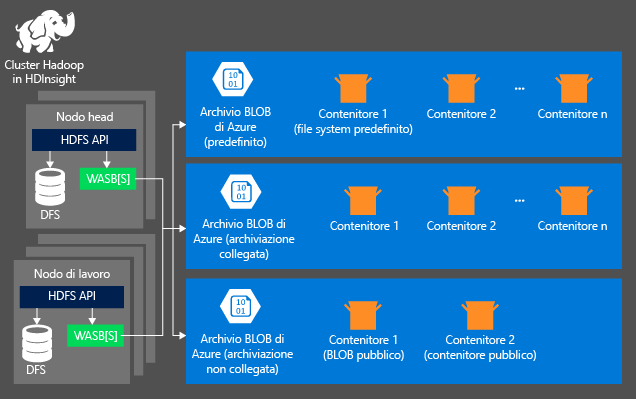
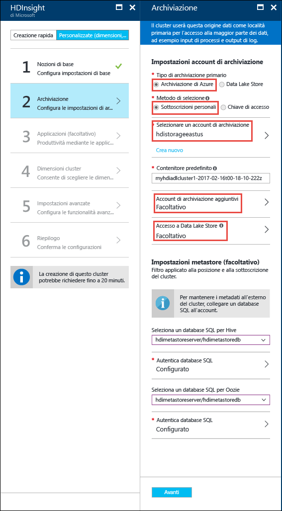

<properties
	pageTitle="Eseguire query sui dati dall'archiviazione BLOB compatibile con HDFS | Microsoft Azure"
	description="HDInsight usa l'archiviazione BLOB di Azure come archivio Big Data per HDFS. Informazioni su come eseguire query sui dati dall'archiviazione BLOB e archiviare i risultati dell'analisi."
	keywords="archiviazione BLOB, hdfs, dati strutturati, dati non strutturati"
	services="hdinsight,storage"
	documentationCenter=""
	tags="azure-portal"
	authors="mumian"
	manager="paulettm"
	editor="cgronlun"/>

<tags
	ms.service="hdinsight"
	ms.workload="big-data"
	ms.tgt_pltfrm="na"
	ms.devlang="na"
	ms.topic="get-started-article"
	ms.date="01/29/2016"
	ms.author="jgao"/>

# Usare l'archiviazione BLOB di Azure compatibile con HDFS con Hadoop in HDInsight

Informazioni su come usare l'archiviazione BLOB di Azure a basso costo con HDInsight, creare un account di archiviazione di Azure e un contenitore di archiviazione BLOB e quindi indirizzare i dati al suo interno.

L'archiviazione BLOB di Azure è una soluzione di archiviazione affidabile, con finalità generali che si integra facilmente con HDInsight. Grazie a un'interfaccia HDFS (Hadoop Distributed File System), tutti i componenti disponibili in HDInsight possono agire direttamente sui dati strutturati o non strutturati presenti nell'archiviazione BLOB.

L'archiviazione dei dati nell'archiviazione BLOB consente l'eliminazione sicura dei cluster HDInsight usati per i calcoli, senza perdita di dati utente.

> [AZURE.NOTE]	La sintassi **asv://* non è supportata nei cluster HDInsight versione 3.0. Questo significa che i processi inviati a un cluster HDInsight 3.0 che usano esplicitamente la sintassi **asv://* avranno esito negativo. Sarà pertanto necessario usare la sintassi **wasb://*. Avrà inoltre esito negativo qualsiasi processo inviato a un cluster HDInsight 3.0 e creato con un metastore esistente che contiene riferimenti espliciti a risorse che usano la sintassi asv://. Sarà necessario ricreare i metastore in modo da fare riferimento alle risorse utilizzando la sintassi wasb://.

> In HDInsight sono attualmente supportati solo i BLOB in blocchi.

> La maggior parte dei comandi HDFS, ad esempio <b>ls</b>, <b>copyFromLocal</b> e <b>mkdir</b>, funziona come previsto. Solo i comandi specifici dell'implementazione HDFS nativa (denominata DFS) ad esempio <b>fschk</b> e <b>dfsadmin</b>, mostreranno un comportamento diverso nell'archiviazione BLOB di Azure.

Per informazioni sulla creazione di un cluster HDInsight, vedere [Introduzione a HDInsight][hdinsight-get-started] o [Creazione di cluster HDInsight][hdinsight-creation].

## Architettura di archiviazione di HDInsight
Nel diagramma seguente viene mostrata una visualizzazione astratta dell'architettura di archiviazione di HDInsight:

HDInsight offre accesso al file system distribuito collegato localmente ai nodi di calcolo. Il file system è accessibile tramite l'URI completo, ad esempio:

	hdfs://<namenodehost>/<path>

HDInsight offre inoltre la possibilità di accedere ai dati archiviati nell'archiviazione BLOB di Azure. La sintassi è:

	wasb[s]://<containername>@<accountname>.blob.core.windows.net/<path>

Hadoop supporta una nozione del file system predefinito. Il file system predefinito implica uno schema e un'autorità predefiniti e può essere usato anche per risolvere percorsi relativi. Durante il processo di creazione di HDInsight, vengono designati come file system predefinito un account di archiviazione di Azure e un contenitore di archiviazione BLOB specifico di tale account.

Oltre a questo account di archiviazione, durante il processo di creazione è possibile aggiungere anche altri account di archiviazione provenienti dalla stessa sottoscrizione di Azure o da sottoscrizioni di Azure diverse. Per istruzioni sull'aggiunta di altri account di archiviazione, vedere [Creazione di cluster HDInsight][hdinsight-creation].

- **Contenitori negli account di archiviazione connessi a un cluster:** poiché il nome e la chiave dell'account sono associati al cluster durante il processo di archiviazione, si disporrà di un accesso completo ai BLOB presenti in tali contenitori.

- **Contenitori pubblici o BLOB pubblici negli account di archiviazione NON connessi a un cluster:** si disporrà di un accesso in sola lettura ai BLOB presenti in tali contenitori.

	> [AZURE.NOTE]
        Un contenitore pubblico consente di ottenere un elenco di tutti i BLOB disponibili al suo interno, nonché i metadati del contenitore stesso. È possibile accedere a un BLOB pubblico solo se ne conosce l'URL esatto. Per altre informazioni, vedere <a href="http://msdn.microsoft.com/library/windowsazure/dd179354.aspx">Limitare l'accesso a contenitori e Blob</a>.

- **Contenitori privati negli account di archiviazione NON connessi a un cluster:** non è possibile accedere ai BLOB nei contenitori a meno che non sia stato definito l'account di archiviazione quando sono stati inviati i processi WebHCat. Questo concetto verrà spiegato più avanti nell'articolo.

Gli account di archiviazione definiti durante il processo di creazione, con le rispettive chiavi, sono archiviati in %HADOOP\_HOME%/conf/core-site.xml nei nodi del cluster. Il comportamento predefinito di HDInsight consiste nell'usare gli account di archiviazione definiti nel file core-site.xml. Non è consigliabile modificare il file core-site.xml poiché è possibile che venga ricreata l'immagine del nodo head del cluster (master) oppure che ne venga eseguita la migrazione in qualsiasi momento, e le eventuali modifiche apportate al file andranno perse.

Più processi WebHCat, inclusi Hive, MapReduce, lo streaming Hadoop e Pig, possono includere una descrizione degli account di archiviazione e dei metadati (questo è valido solo per Pig con account di archiviazione, non per i metadati). La sezione [Accedere all'archiviazione BLOB tramite Azure PowerShell](#powershell) di questo articolo contiene un esempio di questa funzionalità. Per altre informazioni, vedere [Uso di un cluster HDInsight con account di archiviazione e metastore alternativi](http://social.technet.microsoft.com/wiki/contents/articles/23256.using-an-hdinsight-cluster-with-alternate-storage-accounts-and-metastores.aspx).

L’archiviazione BLOB può essere usata per i dati strutturati e non strutturati. I contenitori di archiviazione BLOB archiviano i dati come coppie chiave-valore e non esiste una gerarchia di directory. È tuttavia possibile usare il carattere barra ( / ) all'interno del nome della chiave per far sembrare che un file sia archiviato in una struttura di directory. Ad esempio, la chiave di un BLOB potrebbe essere *input/log1.txt*. Non esiste realmente una directory *input* ma, grazie alla presenza del carattere barra, il nome della chiave ha l'aspetto di un percorso di file.

###Vantaggi dell'archiviazione BLOB
I costi impliciti in termini di prestazioni associati alla mancata disponibilità di cluster di elaborazione e risorse di archiviazione in ambiente condiviso sono mitigati dalla modalità di creazione dei cluster di calcolo, in prossimità delle risorse degli account di archiviazione nell'area di Azure. Qui, grazie alla rete ad alta velocità, l'accesso ai dati nell'archiviazione BLOB di Azure da parte dei nodi di calcolo è estremamente efficiente.

L'archiviazione dei dati nell'archiviazione BLOB di Azure anziché in HDFS offre numerosi vantaggi:

* **Riuso e condivisione dei dati:** i dati in HDFS sono situati all'interno del cluster di calcolo. Solo le applicazioni che hanno accesso al cluster di calcolo, quindi, possono usare i dati tramite le API HDFS. È possibile accedere ai dati nell'archiviazione BLOB di Azure tramite le API HDFS o tramite le [API REST dell'archiviazione BLOB][blob-storage-restAPI]. Di conseguenza, è possibile produrre e usare i dati mediante un set più ampio di strumenti e applicazioni, compresi altri cluster HDInsight.
* **Archiviazione dei dati:** l'archiviazione dei dati nell'archiviazione BLOB di Azure consente l'eliminazione sicura dei cluster HDInsight usati per i calcoli, senza perdita di dati utente.
* **Costo di archiviazione dei dati:** l'archiviazione a lungo termine dei dati in DFS è più costosa rispetto all'archiviazione BLOB di Azure, in quanto il costo di un cluster di calcolo è più alto di quello di un contenitore di archiviazione BLOB di Azure. Poiché, inoltre, non è necessario ricaricare i dati ogni volta che si genera un cluster di calcolo, si risparmiano anche i costi di caricamento dei dati.
* **Scalabilità orizzontale elastica:** anche se HDFS offre scalabilità orizzontale del file system, la scala è determinata dal numero di nodi di cui si effettua la creazione per il cluster. Modificare la scala può diventare quindi un processo più complicato rispetto al semplice fare affidamento sulla scalabilità elastica offerta automaticamente dall'archiviazione BLOB di Azure.
* **Replica geografica:** è possibile eseguire la replica geografica dei contenitori di archiviazione BLOB di Azure. Sebbene questo offra ripristino geografico e ridondanza dei dati, un failover nella posizione sottoposta a replica geografica incide molto negativamente sulle prestazioni e può comportare costi aggiuntivi. È pertanto consigliabile scegliere la scelta della replica geografica con oculatezza e solo se il valore dei dati giustifica i costi aggiuntivi.

Alcuni pacchetti e processi MapReduce possono creare risultati intermedi che non vale la pena di archiviare nell'archiviazione BLOB di Azure. In questo caso, è possibile scegliere di archiviare i dati nel file system HDFS locale. In effetti, HDInsight usa DFS per molti di questi risultati intermedi nei processi Hive e in altri processi.

## Creare dei contenitori BLOB

Per usare i BLOB, è necessario creare innanzitutto un [account di archiviazione di Azure][azure-storage-create]. Nel corso di questa procedura si specifica un'area di Azure in cui verranno archiviati gli oggetti creati usando questo account. L'account di archiviazione deve trovarsi nella stessa area del cluster. Il database SQL Server del metastore Hive, inoltre, deve trovarsi nella stessa area del database SQL Server del metastore Oozie.

Ovunque si trovi, ogni oggetto BLOB creato appartiene a un contenitore presente nell'account di archiviazione di Azure. Può trattarsi di un contenitore BLOB esistente, creato all'esterno di HDInsight, oppure di un contenitore creato per un cluster HDInsight.

Il contenitore Blob predefinito archivia informazioni specifiche del cluster, come i log e la cronologia processo. Non condividere un contenitore BLOB predefinito con più cluster HDInsight. Ciò potrebbe danneggiare la cronologia processo e il cluster non funzionerà correttamente. È consigliabile utilizzare un contenitore diverso per ogni cluster e inserire i dati condivisi in un account di archiviazione collegato specificato nella distribuzione di tutti i cluster rilevanti, anziché l'account di archiviazione predefinito. Per ulteriori informazioni sulla configurazione degli account di archiviazione collegati, vedere [Creazione di cluster HDInsight][hdinsight-creation]. È comunque possibile riusare un contenitore di archiviazione predefinito dopo l'eliminazione del cluster HDInsight originale. Per i cluster HBase, in realtà, è possibile mantenere i dati e lo schema della tabella HBase creando un nuovo cluster HBase tramite il contenitore di archiviazione BLOB predefinito usato da un cluster HBase eliminato.

### Uso del portale di Azure

Durante la creazione di un cluster HDInsight dal portale, sono disponibili le opzioni per utilizzare un account di archiviazione esistente o creare un nuovo account di archiviazione:

###Utilizzare l'interfaccia della riga di comando di Azure

[AZURE.INCLUDE [use-latest-version](../../includes/hdinsight-use-latest-cli.md)]

Se è stata [installata e configurata l’interfaccia della riga di comando di Azure](../xplat-cli-install.md), il comando seguente può essere usato per un account di archiviazione e un contenitore.

	azure storage account create <storageaccountname> --type LRS

> [AZURE.NOTE] Il parametro `--type` indica la modalità di replica dell'account di archiviazione. Per altre informazioni, vedere [Replica di Archiviazione di Azure](../storage/storage-redundancy.md). Non utilizzare ZRS poiché ZRS non supporta BLOB di pagine, file, tabelle o code.

Verrà richiesto di specificare l'area geografica in cui si troverà l’account di archiviazione. È necessario creare l'account di archiviazione nella stessa area in cui si prevede di creare il cluster HDInsight.

Dopo aver creato l'account di archiviazione, usare il comando seguente per recuperare le chiavi dell’account di archiviazione:

	azure storage account keys list <storageaccountname>

Per creare un contenitore, usare il comando seguente:

	azure storage container create <containername> --account-name <storageaccountname> --account-key <storageaccountkey>

### Uso di Azure PowerShell

Se è stato [installato e configurato Azure PowerShell][powershell-install], è possibile usare il comando seguente del prompt di Azure PowerShell per creare un account di archiviazione e un contenitore:

[AZURE.INCLUDE [upgrade-powershell](../../includes/hdinsight-use-latest-powershell.md)]

	$SubscriptionID = "<Your Azure Subscription ID>"
	$ResourceGroupName = "<New Azure Resource Group Name>"
	$Location = "EAST US 2"
	
	$StorageAccountName = "<New Azure Storage Account Name>"
	$containerName = "<New Azure Blob Container Name>"
	
	Add-AzureRmAccount
	Select-AzureRmSubscription -SubscriptionId $SubscriptionID
	
	# Create resource group
	New-AzureRmResourceGroup -name $ResourceGroupName -Location $Location
	
	# Create default storage account
	New-AzureRmStorageAccount -ResourceGroupName $ResourceGroupName -Name $StorageAccountName -Location $Location -Type Standard_LRS 
	
	# Create default blob containers
	$storageAccountKey = Get-AzureRmStorageAccountKey -ResourceGroupName $resourceGroupName -StorageAccountName $StorageAccountName |  %{ $_.Key1 }
	$destContext = New-AzureStorageContext -StorageAccountName $storageAccountName -StorageAccountKey $storageAccountKey  
	New-AzureStorageContainer -Name $containerName -Context $destContext

## Riferimenti a file nell'archiviazione BLOB

Lo schema URI per l'accesso ai file nell'archiviazione BLOB da HDInsight è il seguente:

	wasb[s]://<BlobStorageContainerName>@<StorageAccountName>.blob.core.windows.net/<path>

> [AZURE.NOTE] La sintassi per fare riferimento ai file nell'emulatore di archiviazione, eseguito in HDInsight Emulator, è <i>wasb://&lt;ContainerName&gt;@storageemulator</i>.

Lo schema URI offre l'accesso non crittografato con il prefisso *wasb:* e l'accesso con crittografia SSL con il prefisso *wasbs*. Se possibile, è consigliabile usare *wasbs* anche per accedere ai dati presenti nella stessa area di Azure.

&lt;BlobStorageContainerName&gt; identifica il nome del contenitore nell'archiviazione BLOB di Azure. &lt;StorageAccountName&gt; identifica il nome dell'account di archiviazione di Azure. È necessario specificare un nome di dominio completo (FQDN).

Se non viene specificato né &lt;BlobStorageContainerName&gt; né &lt;StorageAccountName&gt;, verrà usato il file system predefinito. Per i file presenti nel file system predefinito è possibile usare un percorso relativo o un percorso assoluto. Ad esempio, è possibile fare riferimento al file *hadoop-mapreduce-examples.jar* nei cluster HDInsight nei due modi seguenti:

	wasb://mycontainer@myaccount.blob.core.windows.net/example/jars/hadoop-mapreduce-examples.jar
	wasb:///example/jars/hadoop-mapreduce-examples.jar
	/example/jars/hadoop-mapreduce-examples.jar

> [AZURE.NOTE] Nei cluster HDInsight versione 2.1 e 1.6 il nome del file è <i>hadoop-examples.jar</i>.

&lt;path&gt; è il nome del percorso HDFS del file o della directory. Poiché i contenitori nell'archiviazione BLOB di Azure sono semplicemente archivi chiave-valore, non esiste un vero file system gerarchico. Un carattere barra ( / ) all'interno di una chiave BLOB viene interpretato come un separatore di directory. Ad esempio, il nome BLOB di *hadoop-mapreduce-examples.jar* è:

	example/jars/hadoop-mapreduce-examples.jar

> [AZURE.NOTE] Quando si usano i BLOB al di fuori di HDInsight, la maggior parte delle utilità non riconosce il formato WASB e richiede invece un formato del percorso di base, ad esempio `example/jars/hadoop-mapreduce-examples.jar`.

## BLOB di accesso mediante l’interfaccia della riga di comando di Azure

Usare il comando seguente per ottenere un elenco dei comandi relativi ai BLOB:

	azure storage blob

**Esempio di uso dell’interfaccia della riga di comando di Azure per caricare un file**

	azure storage blob upload <sourcefilename> <containername> <blobname> --account-name <storageaccountname> --account-key <storageaccountkey>

**Esempio di uso dell’interfaccia della riga di comando di Azure per scaricare un file**

	azure storage blob download <containername> <blobname> <destinationfilename> --account-name <storageaccountname> --account-key <storageaccountkey>

**Esempio di uso dell’interfaccia della riga di comando di Azure per eliminare un file**

	azure storage blob delete <containername> <blobname> --account-name <storageaccountname> --account-key <storageaccountkey>

**Esempio di uso dell’interfaccia della riga di comando di Azure per elencare file**

	azure storage blob list <containername> <blobname|prefix> --account-name <storageaccountname> --account-key <storageaccountkey>

## Accesso ai BLOB tramite Azure PowerShell

> [AZURE.NOTE] I comandi in questa sezione forniscono un esempio di base dell'utilizzo di PowerShell per accedere ai dati archiviati nei BLOB. Per un esempio completo personalizzato per l'utilizzo di HDInsight, vedere [Strumenti HDInsight](https://github.com/Blackmist/hdinsight-tools).

Usare il comando seguente per ottenere un elenco dei cmdlet relativi ai BLOB:

	Get-Command *blob*

![Elenco dei cmdlet PowerShell correlati al BLOB.][img-hdi-powershell-blobcommands]

###Caricare file

Vedere [Caricare dati in HDInsight][hdinsight-upload-data].

###Download dei file

Lo script seguente consente di scaricare un BLOB in blocchi nella cartella corrente. Prima di eseguire lo script, modificare la directory in una cartella per cui si dispone di autorizzazioni di scrittura.

	$resourceGroupName = "<AzureResourceGroupName>"
	$storageAccountName = "<AzureStorageAccountName>"   # The storage account used for the default file system specified at creation.
	$containerName = "<BlobStorageContainerName>"  # The default file system container has the same name as the cluster.
	$blob = "example/data/sample.log" # The name of the blob to be downloaded.
	
	# Use Add-AzureAccount if you haven't connected to your Azure subscription
	Login-AzureRmAccount 
	Select-AzureRmSubscription -SubscriptionID "<Your Azure Subscription ID>"
	
	Write-Host "Create a context object ... " -ForegroundColor Green
	$storageAccountKey = Get-AzureRmStorageAccountKey -ResourceGroupName $resourceGroupName -Name $storageAccountName | %{ $_.key1 }
	$storageContext = New-AzureStorageContext -StorageAccountName $storageAccountName -StorageAccountKey $storageAccountKey  
	
	Write-Host "Download the blob ..." -ForegroundColor Green
	Get-AzureStorageBlobContent -Container $ContainerName -Blob $blob -Context $storageContext -Force
	
	Write-Host "List the downloaded file ..." -ForegroundColor Green
	cat "./$blob"

Fornendo il nome del gruppo di risorse e il nome del cluster, è possibile utilizzare il codice seguente:

	$resourceGroupName = "<AzureResourceGroupName>"
	$clusterName = "<HDInsightClusterName>"
	$blob = "example/data/sample.log" # The name of the blob to be downloaded.
	
	$cluster = Get-AzureRmHDInsightCluster -ResourceGroupName $resourceGroupName -ClusterName $clusterName
	$defaultStorageAccount = $cluster.DefaultStorageAccount -replace '.blob.core.windows.net'
	$defaultStorageAccountKey = Get-AzureRmStorageAccountKey -ResourceGroupName $resourceGroupName -Name $defaultStorageAccount |  %{ $_.Key1 }
	$defaultStorageContainer = $cluster.DefaultStorageContainer
	$storageContext = New-AzureStorageContext -StorageAccountName $defaultStorageAccount -StorageAccountKey $defaultStorageAccountKey 
	
	Write-Host "Download the blob ..." -ForegroundColor Green
	Get-AzureStorageBlobContent -Container $defaultStorageContainer -Blob $blob -Context $storageContext -Force

###Eliminare file

	Remove-AzureStorageBlob -Container $containerName -Context $storageContext -blob $blob

###Elencare file

	Get-AzureStorageBlob -Container $containerName -Context $storageContext -prefix "example/data/"

###Esecuzione di query Hive utilizzando un account di archiviazione non definito

Questo esempio illustra come elencare una cartella da un account di archiviazione non definito durante il processo di creazione. $clusterName = "<HDInsightClusterName>"

	$undefinedStorageAccount = "<UnboundedStorageAccountUnderTheSameSubscription>"
	$undefinedContainer = "<UnboundedBlobContainerAssociatedWithTheStorageAccount>"

	$undefinedStorageKey = Get-AzureStorageKey $undefinedStorageAccount | %{ $_.Primary }

	Use-AzureRmHDInsightCluster $clusterName

	$defines = @{}
	$defines.Add("fs.azure.account.key.$undefinedStorageAccount.blob.core.windows.net", $undefinedStorageKey)

	Invoke-AzureRmHDInsightHiveJob -Defines $defines -Query "dfs -ls wasb://$undefinedContainer@$undefinedStorageAccount.blob.core.windows.net/;"

## Passaggi successivi

In questo articolo si è appreso come usare l'archiviazione BLOB di Azure compatibile con HDFS con HDInsight e come l'archiviazione BLOB di Azure sia un componente fondamentale di HDInsight. In questo modo sarà possibile creare soluzioni scalabili di acquisizione e archiviazione a lungo termine dei dati con l'archiviazione BLOB di Azure e usare HDInsight per sbloccare le informazioni all'interno dei dati strutturati e non strutturati archiviati.

Per altre informazioni, vedere:

* [Introduzione ad Azure HDInsight][hdinsight-get-started]
* [Caricare dati in HDInsight][hdinsight-upload-data]
* [Usare Hive con HDInsight][hdinsight-use-hive]
* [Usare Pig con HDInsight][hdinsight-use-pig]
* [Usare le firme di accesso condiviso di Archiviazione di Azure per limitare l'accesso ai dati con HDInsight][hdinsight-use-sas]

[hdinsight-use-sas]: hdinsight-storage-sharedaccesssignature-permissions.md
[powershell-install]: ../powershell-install-configure.md
[hdinsight-creation]: hdinsight-provision-clusters.md
[hdinsight-get-started]: hdinsight-hadoop-tutorial-get-started-windows.md
[hdinsight-upload-data]: hdinsight-upload-data.md
[hdinsight-use-hive]: hdinsight-use-hive.md
[hdinsight-use-pig]: hdinsight-use-pig.md

[blob-storage-restAPI]: http://msdn.microsoft.com/library/windowsazure/dd135733.aspx
[azure-storage-create]: ../storage/storage-create-storage-account.md

[img-hdi-powershell-blobcommands]: ./media/hdinsight-hadoop-use-blob-storage/HDI.PowerShell.BlobCommands.png
[img-hdi-quick-create]: ./media/hdinsight-hadoop-use-blob-storage/HDI.QuickCreateCluster.png
[img-hdi-custom-create-storage-account]: ./media/hdinsight-hadoop-use-blob-storage/HDI.CustomCreateStorageAccount.png

<!---HONumber=AcomDC_0427_2016-->