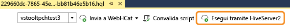
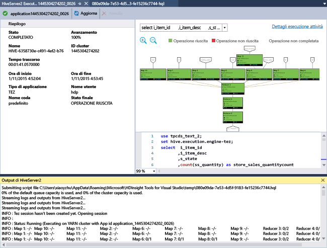
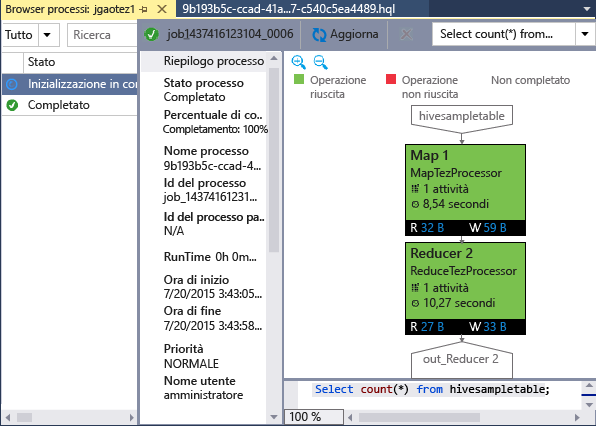

<properties
	pageTitle="Informazioni sull'uso di Hadoop Tools per Visual Studio per HDInsight | Microsoft Azure"
	description="Informazioni su come installare e usare Hadoop Tools per Visual Studio per HDInsight per connettersi a un cluster Hadoop ed eseguire una query Hive."
	keywords="strumenti Hadoop, query Hive, Visual Studio"
	services="HDInsight"
	documentationCenter=""
	tags="azure-portal"
	authors="mumian"
	manager="paulettm"
	editor="cgronlun"/>

<tags
	ms.service="hdinsight"
	ms.devlang="na"
	ms.topic="get-started-article"
	ms.tgt_pltfrm="na"
	ms.workload="big-data"
	ms.date="04/28/2016"
	ms.author="jgao"/>

# Introduzione all'uso di HDInsight Hadoop Tools per Visual Studio per eseguire una query Hive

Informazioni su come usare HDInsight Tools per Visual Studio per connettersi a cluster HDInsight e inviare query Hive. Per altre informazioni sull'uso di HDInsight, vedere [Introduzione ad HDInsight][hdinsight.introduction] e [Introduzione all'uso di HDInsight][hdinsight.get.started]. Per altre informazioni sulla connessione a un cluster Storm, vedere [Sviluppo di topologie C# per Apache Storm in HDInsight mediante Visual Studio][hdinsight.storm.visual.studio.tools].

**Prerequisiti**

Per completare questa esercitazione e usare Hadoop Tools in Visual Studio, sarà necessario quanto segue:

- Un cluster HDInsight di Azure: un cluster basato su Windows o su Linux funzionerà con la procedura descritta in questo documento. Per informazioni sulla creazione di un cluster, vedere uno degli articoli seguenti:

	- [Esercitazione di Hadoop: Introduzione all'uso di Hadoop con Hive in HDInsight in Linux](hdinsight-hadoop-linux-tutorial-get-started.md)
	- [ Introduzione all'uso di HDInsight basato su Windows](hdinsight-hadoop-tutorial-get-started-windows.md)

- Una workstation con il seguente software:

	- Windows 8.1, Windows 8 o Windows 7
	- Visual Studio (una delle versioni seguenti):
		- Visual Studio 2013 Community/Professional/Premium/Ultimate con [Update 4](https://www.microsoft.com/download/details.aspx?id=44921)
		- Visual Studio 2015 (Community/Enterprise)

	>[AZURE.NOTE] Attualmente, HDInsight Tools per Visual Studio è disponibile solo con la versione in lingua inglese.

## Installare HDInsight Tools per Visual Studio

HDInsight Tools per Visual Studio e ODBC Driver di Microsoft Hive sono inclusi nel pacchetto di Microsoft Azure SDK per .NET versione 2.5.1 o successiva. A tale scopo, è possibile usare l'[Installazione guidata piattaforma Web](http://go.microsoft.com/fwlink/?LinkId=255386). È necessario scegliere quello che corrisponde alla versione di Visual Studio in uso. Se Visual Studio non è installato nel computer, è possibile installare la versione più recente di Visual Studio Community e Azure SDK tramite l'[Installazione guidata piattaforma Web](http://go.microsoft.com/fwlink/?LinkId=255386) o i collegamenti seguenti:

- [Visual Studio Community 2015 con Microsoft Azure SDK](https://www.microsoft.com/web/handlers/webpi.ashx/getinstaller/VS2015CommunityAzurePack.appids)
- [Visual Studio Community 2013 con Microsoft Azure SDK](https://www.microsoft.com/web/handlers/webpi.ashx/getinstaller/VS2013CommunityAzurePack.appids)
- [Microsoft Azure SDK per .NET (VS 2015)](https://www.microsoft.com/web/handlers/webpi.ashx/getinstaller/VWDOrVs2015AzurePack.appids)
- [Microsoft Azure SDK per .NET (VS 2013)](https://www.microsoft.com/web/handlers/webpi.ashx/getinstaller/VWDOrVs2013AzurePack.appids)

![Hadoop Tools: Installazione guidata piattaforma Web di HDInsight Tools per Visual Studio.][1]

## Connettersi alle sottoscrizioni di Azure
HDInsight Tools per Visual Studio consente di connettersi a cluster HDInsight, eseguire alcune operazioni di gestione di base ed eseguire query Hive.

>[AZURE.NOTE] Per informazioni sulla connessione a un cluster Hadoop generico, vedere l'articolo relativo alla [scrittura e all'invio di query Hive con Visual Studio](http://blogs.msdn.com/b/xiaoyong/archive/2015/05/04/how-to-write-and-submit-hive-queries-using-visual-studio.aspx).

**Per connettersi alla sottoscrizione di Azure**

1.	Aprire Visual Studio.
2.	Scegliere **Esplora server** dal menu **Visualizza** per aprire la finestra Esplora server.
3.	Espandere **Azure** e quindi espandere **HDInsight**.

	>[AZURE.NOTE]Si noti che la finestra **Elenco attività HDInsight** è aperta. Se tale finestra non è visualizzata, selezionare **Altre finestre** dal menu **Visualizza** e fare clic su **Finestra elenco attività HDInsight**.  
4.	Immettere le credenziali della sottoscrizione di Azure e fare clic su **Accedi**. Questa operazione è necessaria solo se non si è mai eseguita la connessione alla sottoscrizione di Azure da Visual Studio sulla workstation.
5.	In Esplora server verrà visualizzato un elenco di cluster HDInsight esistenti. Se non si dispone di cluster, è possibile eseguire il provisioning di un cluster usando il portale di Azure, Azure PowerShell o HDInsight SDK. Per altre informazioni, vedere [Effettuare il provisioning di cluster HDInsight][hdinsight-provision].

	![Hadoop Tools: elenco di cluster in Esplora Server di HDInsight Tools per Visual Studio][5]
6.	Espandere un cluster HDInsight. Verranno visualizzati i **database Hive**, un account di archiviazione predefinito, gli account di archiviazione collegati e il **log del servizio Hadoop**. È possibile espandere ulteriormente le entità.

Dopo la connessione alla sottoscrizione di Azure, sarà possibile eseguire le operazioni seguenti:

**Per connettersi al portale di Azure da Visual Studio**

- Da Esplora server espandere **Azure** > **HDInsight**, fare clic con il pulsante destro del mouse su un cluster HDInsight, quindi fare clic su **Gestisci cluster nel portale Azure**.

**Per porre domande e fornire commenti e suggerimenti da Visual Studio**

- Nel menu **Strumenti** fare clic su **HDInsight**, quindi su **Forum MSDN** per porre domande o fare clic su **Commenti e suggerimenti**.

## Esplorare le risorse collegate

Da Esplora server è possibile visualizzare l'account di archiviazione predefinito e qualsiasi account di archiviazione collegato. Se si espande l'account di archiviazione predefinito, è possibile visualizzare i contenitori presenti. L'account di archiviazione predefinito e il contenitore predefinito sono contrassegnati. Per visualizzare i contenuti, è possibile anche fare clic su uno dei contenitori con il pulsante destro del mouse.

![Elenco di cluster in Esplora Server di HDInsight Tools per Visual Studio][2]

## Eseguire una query Hive
[Apache Hive][apache.hive] è un'infrastruttura di data warehouse basata su Hadoop che consente di fornire funzionalità di riepilogo, query e analisi di dati. HDInsight Tools per Visual Studio supporta l'esecuzione di query Hive da Visual Studio. Per altre informazioni su Hive, vedere [Utilizzo di Hive con HDInsight][hdinsight.hive].

Testare script Hive in un cluster HDInsight è un'operazione che può richiedere molto tempo, ad esempio alcuni minuti. HDInsight Tools per Visual Studio consente di eseguire la convalida dello script Hive in locale senza necessità di connettersi a un cluster attivo.

HDInsight Tools per Visual Studio consente inoltre di visualizzare i contenuti del processo Hive raccogliendo ed esponendo i log YARN di alcuni processi Hive.

### Visualizzare **hivesampletable**
I cluster HDInsight includono una tabella Hive di esempio denominata *hivesampletable*. Questa tabella verrà usata per mostrare come elencare tabelle Hive, visualizzare gli schemi di tabella ed elencare le righe nella tabella Hive.

**Per elencare tabelle Hive e visualizzare lo schema di tabella Hive**

1.	Da **Esplora server** espandere **Azure** > **HDInsight** > il cluster scelto > **Hive Databases** > **Default** > **hivesampletable** per visualizzare lo schema della tabella.
4.	Fare clic con il pulsante destro del mouse su **hivesampletable** e quindi scegliere **Visualizza le prime 100 righe** per elencare le righe. Questa operazione equivale ad eseguire la seguente query Hive mediante il driver ODBC di Hive:

		SELECT * FROM hivesampletable LIMIT 100

	È possibile personalizzare il numero delle righe.

	![Hadoop Tools: query dello schema di Visual Studio Hive di HDinsight][6]

### Creare tabelle Hive

Per creare una tabella Hive è possibile usare l'interfaccia utente grafica o query Hive. Per informazioni sull'uso di query Hive, vedere [Eseguire query Hive](#run.queries).

**Per creare una tabella Hive**

1. Da **Esplora server** espandere in sequenza **Azure** > **HDInsight Clusters**, un cluster HDInsight > **Hive Databases**, quindi fare clic con il pulsante destro del mouse su **default** e scegliere **Crea tabella**.
2. Configurare la tabella.
3. Fare clic su **Crea tabella** per inviare il processo per creare la nuova tabella Hive.

	![Hadoop Tools: HDInsight Tools per Visual Studio crea la tabella Hive][7]

### Convalidare ed eseguire query Hive
Esistono due modi per creare ed eseguire query Hive:

- Creare query ad hoc
- Creare un'applicazione Hive

**Per creare, convalidare ed eseguire query ad hoc**

1. Da **Esplora server** espandere **Azure**, quindi **HDInsight Clusters**.
2. Fare clic con il pulsante destro del mouse sul cluster in cui si desidera eseguire la query, quindi scegliere **Scrivi una query Hive**.
3. Immettere le query Hive. Si noti che l'editor Hive supporta IntelliSense. HDInsight Tools per Visual Studio supporta il caricamento di metadati remoti durante la modifica dello script Hive. Ad esempio, quando si digita "SELECT * FROM", IntelliSense elenca tutti i nomi di tabella suggeriti. Quando si specifica un nome di tabella, i nomi delle colonne sono elencati da IntelliSense. Lo strumento supporta quasi tutte le funzioni definite dall'utente predefinite, le sottoquery e le istruzioni DML Hive.

	![Hadoop Tools: IntelliSense di HDInsight Tools per Visual Studio][13]

	![Hadoop Tools: IntelliSense di HDInsight Tools per Visual Studio][14]

	> [AZURE.NOTE] Verranno elencati solo i metadati dei cluster selezionati nella barra degli strumenti HDInsight.
4. Facoltativo: fare clic su **Convalida script** per verificare la presenza di eventuali errori di sintassi nello script.

	![Hadoop Tools: convalida locale di HDInsight Tools per Visual Studio.][10]

4. Fare clic su **Invia** o **Invia (Avanzato)**. L'opzione di invio avanzato consente di configurare i dati relativi a **Nome processo**, **Argomenti**, **Configurazioni aggiuntive** e **Directory stato** per lo script:

	![Query Hive di Hadoop di HDInsight][9]

	Dopo l'invio, è possibile visualizzare una finestra di **riepilogo del processo Hive**.

	![Riepilogo di una query Hive di Hadoop di HDInsight][8]
5. Usare il pulsante **Aggiorna** per aggiornare lo stato del processo finché non risulta **Completato**.
6. Fare clic sui collegamenti presenti nella parte inferiore per visualizzare quanto segue: **Query processo**, **Output processo**, **Log processo** o il **log Yarn**.

**Per creare ed eseguire una soluzione Hive**

1. Scegliere **Nuovo** dal menu **FILE**, quindi fare clic su **Progetto**.
2. Selezionare **HDInsight** nel riquadro sinistro, selezionare **Applicazione Hive** nel riquadro centrale, immettere le proprietà e fare clic su **OK**.

	![Hadoop Tools: nuovo progetto Hive di HDInsight Tools per Visual Studio][11]
3. In **Esplora soluzioni** fare doppio clic su **Script.hql** per aprirlo.
4. Per convalidare lo script Hive, è possibile fare clic sul pulsante **Convalida script** oppure fare clic con il pulsante destro del mouse sullo script nell'editor di Hive e quindi fare clic su **Convalida script** nel menu di scelta rapida.

### Visualizzare processi Hive
È possibile visualizzare query di processo, output di processo, log di processo e log Yarn per i processi Hive. Per altre informazioni, vedere la schermata precedente.

La versione più recente dello strumento consente di visualizzare i contenuti dei processi Hive raccogliendo ed esponendo i log YARN. Un log YARN consente di analizzare eventuali problemi di prestazioni. Per altre informazioni su come HDInsight raccoglie log YARN, vedere [Accedere ai log dell'applicazione HDInsight a livello di codice][hdinsight.access.application.logs].

**Per visualizzare processi Hive**

1. Da **Esplora server** espandere **Azure**, quindi **HDInsight**.
2. Fare clic con il pulsante destro del mouse su un cluster HDInsight, quindi scegliere **Visualizza processi**. Verrà visualizzato l'elenco di processi Hive eseguiti nel cluster.
3. Fare clic su un processo incluso nell'elenco dei processi per selezionarlo, quindi usare la finestra di **riepilogo del processo Hive** per aprire **Query processo**, **Output processo**, **Log processo** o il **log Yarn**.

	![Hadoop Tools: HDInsight Tools per Visual Studio visualizzano i processi Hive][12]

### Esecuzione di processi Hive più veloce tramite HiveServer2

>[AZURE.NOTE] Questa funzionalità è disponibile solo per i cluster HDInsight versione 3.2 e successive.

In passato, gli strumenti HDInsight inviavano processi Hive tramite [WebHCat](https://cwiki.apache.org/confluence/display/Hive/WebHCat), noto anche come Templeton. Per restituire i dettagli del processo e le informazioni sugli errori occorreva molto tempo. Per risolvere questo problema di prestazioni, gli strumenti HDInsight eseguono i processi direttamente nel cluster tramite HiveServer2, in modo da ignorare i protocolli RDP/SSH. Oltre a ottenere prestazioni migliori, gli utenti possono visualizzare Hive in grafici Tez e i dettagli dell'attività.

Per i cluster HDInsight versione 3.2 o successive, è disponibile un pulsante **Execute via HiveServer2**:

Ed è possibile visualizzare i log in streaming in tempo reale e i grafici del processo, se si esegue la query Hive in Tex.

**Differenza tra l'esecuzione di query tramite HiveServer2 e l'invio di query tramite WebHCat**

L'esecuzione di query tramite HiveServer2 presenta numerosi vantaggi in termini di prestazioni, ma anche diverse limitazioni. Alcune delle limitazioni non sono adatte all'utilizzo per scopi di produzione. La tabella seguente illustra le differenze:

| |Esecuzione tramite HiveServer2 |Invio tramite WebHCat|
|---|---|---|
|Eseguire query|Elimina il sovraccarico in WebHCat, che avvia un processo MapReduce denominato "TempletonControllerJob".|Se la query viene eseguita tramite WebHCat, WebHCat avvierà un processo MapReduce con il quale viene introdotta latenza aggiuntiva.|
|Trasmettere log|Quasi in tempo reale.|I log di esecuzione del processo sono disponibili solo al termine del processo.|
|Visualizzare la cronologia processo|Se una query viene eseguita tramite HiveServer2, la relativa cronologia processo (il log del processo, l'output del processo) non viene mantenuta. L'applicazione può essere visualizzata nell'interfaccia utente di YARN con informazioni limitate.|Se una query viene eseguita tramite WebHCat, la relativa cronologia processo (il log del processo, l'output del processo) viene mantenuta e può essere visualizzata tramite Visual Studio, HDInsight SDK o PowerShell. |
|Chiudere la finestra| 	L'esecuzione tramite HiveServer2 è "sincrona", pertanto è necessario mantenere le finestre aperte. Se le finestre vengono chiuse, l'esecuzione della query verrà annullata.|L'invio tramite WebHCat è "asincrono", pertanto è possibile inviare la query tramite WebHCat e chiudere Visual Studio. È possibile tornare in questa pagina e visualizzare i risultati in qualsiasi momento.|

### Grafico delle prestazioni del processo Hive Tez

Gli Strumenti di Visual Studio per HDInsight supportano la visualizzazione di grafici delle prestazioni per i processi Hive eseguiti dal motore di esecuzione Tez. Per informazioni su come abilitare Tez, vedere l'articolo relativo all'[uso di Hive in HDInsight][hdinsight.hive]. Dopo avere inviato un processo Hive in Visual Studio, Visual Studio mostra il grafico al termine del processo. Per ottenere l'ultimo stato del processo, potrebbe essere necessario fare clic sul pulsante **Aggiorna**.

> [AZURE.NOTE] Questa funzionalità è disponibile solo per le versioni del cluster HDInsight successive alla 3.2.4.593 e funzionano solo per i processi completati, se il processo è stato inviato tramite WebHCat. Questo grafico viene visualizzato quando si esegue la query tramite HiveServer2. Si possono usare cluster basati sia su Windows che su Linux.

Per comprendere meglio la query Hive, è stata aggiunta la funzionalità Visualizzazione operatore Hive in questa versione. Per visualizzare tutti gli operatori all'interno di un vertice, fare doppio clic sui vertici del grafico del processo. Per visualizzare altri dettagli di un operatore specifico, passare il puntatore sull'operatore.

### Visualizzazione dell'esecuzione dell'attività per i processi Hive in Tez

È possibile usare la visualizzazione dell'esecuzione dell'attività per i processi Hive in Tez per ottenere informazioni strutturate e visive per i processi Hive e per visualizzare informazioni dettagliate sul processo. Quando si verificano problemi di prestazioni, questa visualizzazione consente di ottenere altri dettagli, ad esempio il funzionamento di ogni attività e le relative informazioni dettagliate (lettura-scrittura dei dati, ora di inizio/fine della pianificazione e così via), per poter regolare le configurazioni del processo o l'architettura del sistema in base alle informazioni visualizzate.

## Eseguire script Pig

Gli strumenti HDInsight per Visual Studio supportano la creazione di script Pig e li inviano ai cluster HDInsight. Gli utenti possono creare un progetto Pig dal modello e quindi inviare lo script ai cluster HDInsight.

## Commenti e suggerimenti e problemi noti

- Attualmente i risultati di HiveServer2 vengono visualizzati in modalità solo testo, che non è ideale. La correzione del problema è attualmente in corso.

- Se i risultati iniziano con valori NULL, non vengono visualizzati. Poiché questo problema è stato risolto, nel caso blocchi l'attività è possibile inviare un messaggio di posta elettronica o contattare il team di supporto.

Per eventuali commenti o suggerimenti oppure se si verificano problemi durante l'uso di questo strumento, inviare un messaggio di posta elettronica all'indirizzo hdivstool@microsoft.com.

## Passaggi successivi
In questo articolo è stato mostrato come connettersi a cluster HDInsight da Visual Studio, usando il pacchetto Hadoop Tools, e come eseguire una query Hive. Per altre informazioni, vedere:

- [Usare Hive di Hadoop in HDInsight][hdinsight.hive]
- [Introduzione all'uso di Hadoop in HDInsight][hdinsight.get.started]
- [Inviare processi Hadoop in HDInsight][hdinsight.submit.jobs]
- [Analizzare i dati di Twitter con Hadoop in HDInsight][hdinsight.analyze.twitter.data]

<!--Anchors-->
[Installation]: #installation
[Connect to your Azure subscription]: #connect-to-your-azure-subscription
[Navigate the linked resources]: #navigate-the-linked-resources
[Run Hive queries]: #run-hive-queries
[Next steps]: #next-steps

<!--Image references-->
[1]: ./media/hdinsight-hadoop-visual-studio-tools-get-started/hdinsight.visual.studio.tools.wpi.png
[2]: ./media/hdinsight-hadoop-visual-studio-tools-get-started/hdinsight.visual.studio.tools.linked.resources.png
[5]: ./media/hdinsight-hadoop-visual-studio-tools-get-started/hdinsight.visual.studio.tools.server.explorer.png
[6]: ./media/hdinsight-hadoop-visual-studio-tools-get-started/hdinsight.visual.studio.tools.hive.schema.png
[7]: ./media/hdinsight-hadoop-visual-studio-tools-get-started/hdinsight.visual.studio.tools.create.hive.table.png
[8]: ./media/hdinsight-hadoop-visual-studio-tools-get-started/hdinsight.visual.studio.tools.run.hive.job.summary.png
[9]: ./media/hdinsight-hadoop-visual-studio-tools-get-started/hdinsight.visual.studio.tools.submit.jobs.advanced.png
[10]: ./media/hdinsight-hadoop-visual-studio-tools-get-started/hdinsight.visual.studio.tools.validate.hive.script.png
[11]: ./media/hdinsight-hadoop-visual-studio-tools-get-started/hdinsight.visual.studio.tools.new.hive.project.png
[12]: ./media/hdinsight-hadoop-visual-studio-tools-get-started/hdinsight.visual.studio.tools.view.hive.jobs.png
[13]: ./media/hdinsight-hadoop-visual-studio-tools-get-started/hdinsight.visual.studio.tools.intellisense.table.names.png
[14]: ./media/hdinsight-hadoop-visual-studio-tools-get-started/hdinsight.visual.studio.tools.intellisense.column.names.png

<!--Link references-->
[hdinsight-provision]: hdinsight-provision-clusters.md
[hdinsight.introduction]: hdinsight-hadoop-introduction.md
[hdinsight.get.started]: hdinsight-hadoop-linux-tutorial-get-started.md
[hdinsight.hive]: hdinsight-use-hive.md
[hdinsight.submit.jobs]: hdinsight-submit-hadoop-jobs-programmatically.md
[hdinsight.analyze.twitter.data]: hdinsight-analyze-twitter-data.md
[hdinsight.storm.visual.studio.tools]: hdinsight-storm-develop-csharp-visual-studio-topology.md
[hdinsight.access.application.logs]: hdinsight-hadoop-access-yarn-app-logs.md

[apache.hive]: http://hive.apache.org

<!---HONumber=AcomDC_0504_2016-->