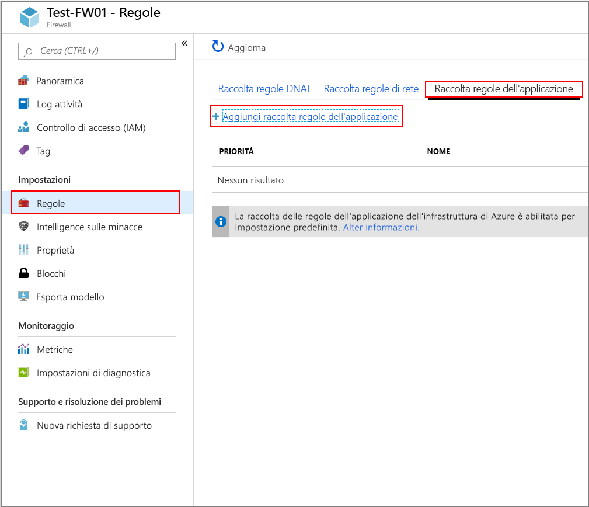
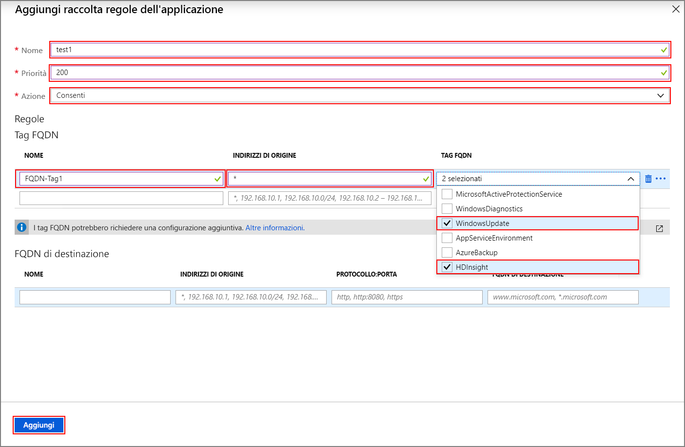
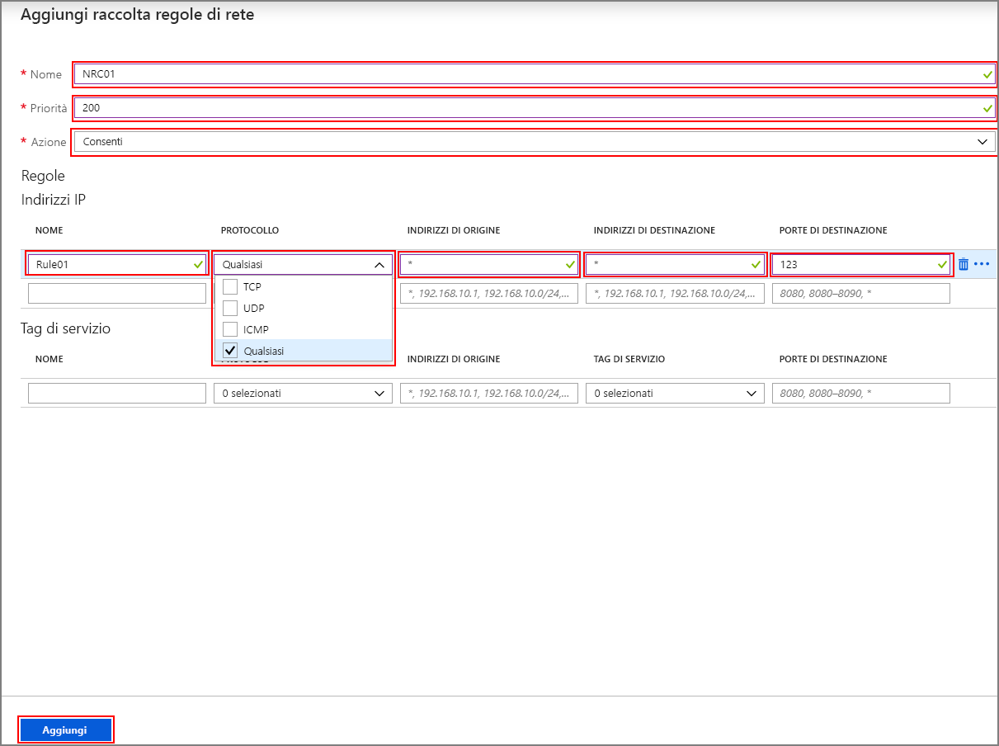

# <a name="configure-outbound-network-traffic-for-azure-hdinsight-clusters-using-firewall-preview"></a>Configurare il traffico di rete in uscita per i cluster HDInsight di Azure con Firewall (anteprima)

Questo articolo fornisce i passaggi per poter proteggere il traffico in uscita dal cluster HDInsight tramite il Firewall di Azure. I passaggi seguenti presuppongono che si sta configurando un Firewall di Azure per un cluster esistente. Se si distribuisce un nuovo cluster e un firewall, creare innanzitutto il cluster HDInsight e la subnet e quindi seguire i passaggi descritti in questa Guida.

## <a name="background"></a>Background

I cluster HDInsight di Azure vengono in genere distribuiti nella propria rete virtuale. Il cluster presenta dipendenze da servizi di fuori di tale rete virtuale che richiedono l'accesso alla rete per funzionare correttamente.

Esistono varie dipendenze che richiedono il traffico in ingresso. Il traffico di gestione in ingresso non può essere inviato attraverso un dispositivo firewall. Gli indirizzi di origine per questo tipo di traffico sono note e vengono pubblicati [qui](hdinsight-extend-hadoop-virtual-network.md#hdinsight-ip). È anche possibile creare regole di gruppo di sicurezza di rete (NSG) con queste informazioni per proteggere il traffico in ingresso per i cluster.

Le dipendenze di traffico in uscita di HDInsight sono quasi interamente definite con nomi di dominio completo, che non hanno indirizzi IP statici su cui si basano. La mancanza di indirizzi statici significa i gruppi di sicurezza di rete (Nsg) non può essere utilizzati per bloccare il traffico in uscita da un cluster. Gli indirizzi cambiano con una frequenza tale che uno non è possibile impostare le regole di base la risoluzione dei nomi corrente e usarlo per impostare le regole di sicurezza di rete.

La soluzione per proteggere gli indirizzi in uscita è usare un dispositivo firewall che può controllare il traffico in uscita in base ai nomi di dominio. Firewall di Azure è possibile limitare il traffico HTTP e HTTPS in uscita in base il FQDN della destinazione o [tag FQDN](https://docs.microsoft.com/azure/firewall/fqdn-tags).

## <a name="configuring-azure-firewall-with-hdinsight"></a>Configurazione di Firewall di Azure con HDInsight

Un riepilogo dei passaggi per bloccare traffico in uscita da di HDInsight esistente con il Firewall di Azure sono:
1. Creare una regola del firewall.
1. Aggiungere le regole di applicazione al firewall
1. Aggiungere le regole di rete verso il firewall.
1. Creare una tabella di routing.

### <a name="create-a-new-firewall-for-your-cluster"></a>Creare un nuovo firewall per il cluster

1. Creare una subnet denominata **AzureFirewallSubnet** nella rete virtuale in cui è presente il cluster. 
1. Creare una nuova regola del firewall **Test-FW01** usando la procedura in [esercitazione: Distribuire e configurare Firewall di Azure tramite il portale di Azure](../firewall/tutorial-firewall-deploy-portal.md#deploy-the-firewall).

### <a name="configure-the-firewall-with-application-rules"></a>Configurare il firewall con le regole di applicazione

Creare una raccolta di regole di applicazione che consente al cluster inviare e ricevere comunicazioni importanti.

Selezionare il nuovo firewall **Test-FW01** dal portale di Azure. Fare clic su **regole** sotto **impostazioni** > **raccolta regole applicazione** > **Aggiungi insieme di regole di applicazione**.



Nel **aggiungere la raccolta di regole dell'applicazione** schermata, seguire questa procedura:

1. Immettere un **Name**, **priorità**e fare clic su **Consenti** dal **azione** menu a discesa e immettere le seguenti regole di **FQDN tag sezione** :

   | **Nome** | **Indirizzo di origine** | **Tag di nome di dominio completo** | **Note** |
   | --- | --- | --- | --- |
   | Regola_1 | * | HDInsight e Windows Update. | Obbligatorio per i servizi HDI |

1. Aggiungere le seguenti regole per la **destinazione FQDN sezione** :

   | **Nome** | **Indirizzo di origine** | **Protocollo: porta** | **Destinazione FQDN** | **Note** |
   | --- | --- | --- | --- | --- |
   | Rule_2 | * | https:443 | login.windows.net | Consente attività di accesso di Windows |
   | Rule_3 | * | https:443,http:80 | <storage_account_name.blob.core.windows.net> | Se il cluster è supportato da WASB, aggiungere una regola per WASB. Per usare https solo per assicurarsi che le connessioni ["trasferimento sicuro obbligatorio"](https://docs.microsoft.com/azure/storage/common/storage-require-secure-transfer) è abilitata nell'account di archiviazione. |

1. Fare clic su **Aggiungi**.

   

### <a name="configure-the-firewall-with-network-rules"></a>Configurare il firewall con le regole di rete

Creare le regole di rete per configurare correttamente il cluster HDInsight.

1. Selezionare il nuovo firewall **Test-FW01** dal portale di Azure.
1. Fare clic su **regole** sotto **impostazioni** > **raccolta regole di rete** > **Aggiungi insieme di regole di rete**.
1. Nel **aggiungere una raccolta di regole di rete** schermata, immettere una **nome**, **priorità**e fare clic su **Consenti** dal **azione** dal menu a discesa.
1. Creare le regole seguenti nel **gli indirizzi IP** sezione:

   | **Nome** | **Protocollo** | **Indirizzo di origine** | **Indirizzo di destinazione** | **Porta di destinazione** | **Note** |
   | --- | --- | --- | --- | --- | --- |
   | Regola_1 | UDP | * | * | `123` | Servizio ora |
   | Rule_2 | Qualsiasi | * | DC_IP_Address_1, DC_IP_Address_2 | `*` | Se si usa Enterprise Security Package (ESP), quindi aggiungere una regola di rete nella sezione degli indirizzi IP che consente la comunicazione con AAD-DS per i cluster ESP. È possibile trovare gli indirizzi IP dei controller di dominio nella sezione AAD-DS nel portale | 
   | Rule_3 | TCP | * | Indirizzo IP dell'account di archiviazione di Data Lake | `*` | Se si Usa archiviazione di Azure Data Lake, è possibile aggiungere una regola di rete nella sezione degli indirizzi IP per risolvere un problema SNI con Azure Data Lake Store Gen1 e Gen2. Questa opzione instraderà il traffico al firewall che potrebbe comportare costi più elevati per i caricamenti di dati di grandi dimensioni, ma il traffico verrà registrata e controllabile nel log del firewall. Determinare l'indirizzo IP per l'account Data Lake Store. È possibile usare un comando di powershell, ad esempio `[System.Net.DNS]::GetHostAddresses("STORAGEACCOUNTNAME.blob.core.windows.net")` risolvere il FQDN per un indirizzo IP.|
   | Rule_4 | TCP | * | * | `12000` | (Facoltativo) Se si usa Log Analitica, quindi creare una regola di rete nella sezione degli indirizzi IP per abilitare la comunicazione con l'area di lavoro di Log Analitica. |

1. Creare le regole seguenti nel **tag di servizio** sezione:

   | **Nome** | **Protocollo** | **Indirizzo di origine** | **Tag di servizio** | **Porta di destinazione** | **Note** |
   | --- | --- | --- | --- | --- | --- |
   | Rule_7 | TCP | * | * | `1433,11000-11999,14000-14999` | Configurare una regola di rete nella sezione tag di servizio per SQL che ti permetterà di accedere e controllare il traffico SQL, a meno che non è configurato gli endpoint di servizio per SQL Server sulla subnet HDInsight che possono ignorare il firewall. |

1. Fare clic su **Add** per completare la creazione della raccolta di regole di rete.

   

### <a name="create-and-configure-a-route-table"></a>Creare e configurare una tabella di route

Creare una tabella di route con le voci seguenti:

1. Sei indirizzi compreso [questo elenco di indirizzi IP richiesti gestione di HDInsight](../hdinsight/hdinsight-extend-hadoop-virtual-network.md#hdinsight-ip) con un hop successivo **Internet**:
    1. Quattro indirizzi IP per tutti i cluster in tutte le aree
    1. Due indirizzi IP che sono specifici per l'area in cui la creazione del cluster
1. Una route di Appliance virtuale per l'IP indirizzo 0.0.0.0/0 con hop successivo in corso l'indirizzo IP privato Firewall di Azure.

Ad esempio, per configurare la tabella di route per un cluster creato nell'area Stati Uniti "Stati Uniti centrali", utilizzare i seguenti passaggi:

1. Accedere al portale di Azure.
1. Selezionare il firewall di Azure **Test-FW01**. Copia il **indirizzo IP privato** elencati nel **Panoramica** pagina. In questo esempio si userà un **adresa 10.1.1.4 di esempio**
1. Creare una nuova tabella di route.
1. Fare clic su **route** sotto **impostazioni**.
1. Fare clic su **Add** creare route per gli indirizzi IP nella tabella seguente.

| Nome route | Prefisso indirizzo | Tipo hop successivo | Indirizzo hop successivo |
|---|---|---|---|
| 168.61.49.99 | 168.61.49.99/32 | Internet | NA |
| 23.99.5.239 | 23.99.5.239/32 | Internet | NA |
| 168.61.48.131 | 168.61.48.131/32 | Internet | NA |
| 138.91.141.162 | 138.91.141.162/32 | Internet | NA |
| 13.67.223.215 | 13.67.223.215/32 | Internet | NA |
| 40.86.83.253 | 40.86.83.253/32 | Internet | NA |
| 0.0.0.0 | 0.0.0.0/0 | Appliance virtuale | 10.1.1.4 |

Completare la configurazione della tabella di route:

1. Assegnare la tabella di route alla subnet di HDInsight creata facendo **subnet** sotto **impostazioni** e quindi **associare**.
1. Nel **associa subnet** schermata, selezionare la rete virtuale che è stato creato il cluster in e il **Subnet HDInsight** è usato per il cluster HDInsight.
1. Fare clic su **OK**.

## <a name="edge-node-or-custom-application-traffic"></a>Nodo perimetrale o del traffico dell'applicazione personalizzata

I passaggi precedenti consentirà il cluster per il funzionamento senza problemi. È comunque necessario configurare le dipendenze per gestire le applicazioni personalizzate in esecuzione nei nodi del bordo, se applicabile.

Le dipendenze dell'applicazione devono essere identificate e aggiunte per il Firewall di Azure o la tabella di route.

Le route devono essere create per il traffico dell'applicazione evitare problemi di routing asimmetrici.

Se l'applicazione presenta altre dipendenze, devono essere aggiunti al Firewall di Azure. Creare regole per le applicazioni per consentire il traffico HTTP/HTTPS e regole di rete per tutto il resto.

## <a name="logging"></a>Registrazione

Firewall di Azure possono inviare i log per alcuni sistemi di archiviazione diverso. Per istruzioni sulla configurazione di registrazione per il firewall, seguire i passaggi descritti in [esercitazione: Monitorare i log del Firewall di Azure e le metriche](../firewall/tutorial-diagnostics.md).

Dopo aver completato la configurazione di registrazione, se si è la registrazione dati per Log Analitica, è possibile visualizzare il traffico bloccato con una query simile al seguente:

```
AzureDiagnostics | where msg_s contains "Deny" | where TimeGenerated >= ago(1h)
```

L'integrazione del Firewall di Azure con i log di monitoraggio di Azure è utile durante il recupero prima di tutto eseguita un'applicazione quando non si è consapevoli di tutte le dipendenze dell'applicazione. Per altre informazioni sui log di Monitoraggio di Azure, vedere [Analizzare i dati di log in Monitoraggio di Azure](../azure-monitor/log-query/log-query-overview.md)

## <a name="access-to-the-cluster"></a>Accesso al cluster
Dopo avere completato la configurazione del firewall, è possibile usare l'endpoint interno (`https://<clustername>-int.azurehdinsight.net`) per accedere la Ambari dall'interno della rete virtuale. Per usare l'endpoint pubblico (`https://<clustername>.azurehdinsight.net`) o ssh endpoint (`<clustername>-ssh.azurehdinsight.net`), assicurarsi che hai le route a destra nella tabella di route e configurare le regole NSG per evitare il problema di routing asimmetrica illustrato [qui](https://docs.microsoft.com/azure/firewall/integrate-lb).

## <a name="configure-another-network-virtual-appliance"></a>Configurare un'altra appliance virtuale di rete

>[!Important]
> Le informazioni seguenti sono **solo** necessari se si vuole configurare l'appliance virtuale di rete (NVA) diverso da Firewall di Azure.

Le istruzioni precedenti consentono di configurare il Firewall di Azure per limitare il traffico in uscita dal cluster HDInsight. Firewall di Azure viene configurato automaticamente per consentire il traffico per molti degli scenari comuni di importante. Se si desidera utilizzare un'altra appliance virtuale di rete, è necessario configurare manualmente un numero di funzionalità aggiuntive. Tenere presente come nell'esempio di configurare l'appliance virtuale di rete:

* Con gli endpoint di servizio devono essere configurati servizi che supportano endpoint di servizio.
* Dipendenze dell'indirizzo IP sono per il traffico HTTP/S (traffico TCP e UDP).
* Endpoint HTTP/HTTPS di nome di dominio completo può essere inserito nel proprio dispositivo Appliance virtuale di rete.
* Endpoint HTTP/HTTPS con caratteri jolly sono le dipendenze che possono variare basate su un numero di qualificatori.
* Assegnare la tabella di route alla subnet di HDInsight creato.

### <a name="service-endpoint-capable-dependencies"></a>Dipendenze che supportano endpoint di servizio

| **Endpoint** |
|---|
| SQL di Azure |
| Archiviazione di Azure |
| Azure Active Directory |

#### <a name="ip-address-dependencies"></a>Dipendenze di indirizzi IP

| **Endpoint** | **Dettagli** |
|---|---|
| \*:123 | Controllo dell'orologio NTP. Il traffico viene verificato in più endpoint sulla porta 123. |
| Gli indirizzi IP pubblicato [qui](hdinsight-extend-hadoop-virtual-network.md#hdinsight-ip) | Questi sono il servizio HDInsight |
| AAD-DS indirizzi IP privati per ESP cluster |
| \*: 16800 for KMS Activation di Windows |
| \*12000 per Log Analitica |

#### <a name="fqdn-httphttps-dependencies"></a>Dipendenze HTTP/HTTPS con nome di dominio completo

>[!Important]
> L'elenco seguente offre solo alcune delle più importanti FQDN. È possibile ottenere l'elenco completo dei nomi di dominio completi per la configurazione di Appliance di rete virtuale [in questo file](https://github.com/Azure-Samples/hdinsight-fqdn-lists/blob/master/HDInsightFQDNTags.json).

| **Endpoint**                                                          |
|---|
| azure.archive.ubuntu.com:80                                           |
| security.ubuntu.com:80                                                |
| ocsp.msocsp.com:80                                                    |
| ocsp.digicert.com:80                                                  |
| wawsinfraprodbay063.blob.core.windows.net:443                         |
| registry-1.docker.io:443                                              |
| auth.docker.io:443                                                    |
| production.cloudflare.docker.com:443                                  |
| download.docker.com:443                                               |
| us.archive.ubuntu.com:80                                              |
| download.mono-project.com:80                                          |
| packages.treasuredata.com:80                                          |
| security.ubuntu.com:80                                                |
| azure.archive.ubuntu.com:80                                                |
| ocsp.msocsp.com:80                                                |
| ocsp.digicert.com:80                                                |

## <a name="next-steps"></a>Passaggi successivi

* [Architettura di rete virtuale di Azure HDInsight](hdinsight-virtual-network-architecture.md)
