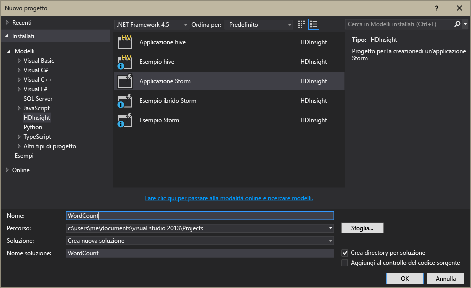

<properties
	pageTitle="Introduzione ad Apache Storm in HDInsight | Microsoft Azure"
	description="Viene fornita un'introduzione ad Apache Storm e viene mostrato come usare Storm in HDInsight per creare soluzioni di analisi in tempo reale nel cloud."
	services="hdinsight"
	documentationCenter=""
	authors="Blackmist"
	manager="paulettm"
	editor="cgronlun"/>

<tags
   ms.service="hdinsight"
   ms.devlang="na"
   ms.topic="article"
   ms.tgt_pltfrm="na"
   ms.workload="big-data"
   ms.date="07/24/2015"
   ms.author="larryfr"/>

#Introduzione ad Apache Storm in HDInsight: Analisi in tempo reale per Hadoop

Apache Storm in HDInsight consente di creare soluzioni di analisi distribuite e in tempo reale nell'ambiente Azure usando [Apache Hadoop](http://hadoop.apache.org).

##Che cos'è Apache Storm?

Apache Storm è un sistema di calcolo distribuito, a tolleranza di errore e open source che consente di elaborare i dati in tempo reale con Hadoop. Le soluzioni Storm possono fornire anche l'elaborazione garantita dei dati che consente di ripetere l'operazione per i dati non elaborati correttamente la prima volta.

##Perché usare Storm in HDInsight?

Apache Storm in HDInsight è un cluster gestito integrato nell'ambiente Azure che offre i seguenti vantaggi chiave:

* Viene eseguito come servizio gestito e dispone di un contratto di servizio con disponibilità del 99,9%.

* Consente di usare il linguaggio di programmazione preferito. Offre infatti supporto per componenti Storm scritti in **Java**, **C#** e **Python**.

	* Supporta una combinazione di linguaggi di programmazione. Ad esempio, legge i dati usando Java e li elabora in C#.

	* Usa l'interfaccia Java **Trident** per creare topologie Storm che supportano l'elaborazione di tipo"exactly-once" dei messaggi, la persistenza "transazionale" del datastore e un insieme di operazioni di analisi del flusso di uso comune.

* Include funzionalità di scalabilità orizzontale e scalabilità verticale. Consente di ridimensionare un cluster HDInsight senza alcun impatto sull'esecuzione delle topologie Storm.

* È integrato con altri servizi di Azure, inclusi hub eventi, Rete virtuale di Azure, SQL Database, Archiviazione BLOB e DocumentDB.

	* Combina le funzionalità di più cluster HDInsight usando Rete virtuale di Azure. Crea pipeline di analisi che usano cluster HDInsight, HBase o Hadoop.

Per un elenco delle aziende che usano Apache Storm per le loro soluzioni di analisi in tempo reale, vedere l'articolo relativo alle [società che usano Apache Storm](https://storm.apache.org/documentation/Powered-By.html).

Per un'introduzione all'uso di Storm, vedere [Introduzione a Storm in HDInsight][gettingstarted].

###Facilità di provisioning

Il provisioning di un nuovo cluster Storm in HDInsight richiede solo alcuni minuti. Specificare il nome, le dimensioni, l'account amministratore e l'account di archiviazione del cluster. Azure creerà il cluster, inclusi topologie di esempio e un dashboard di gestione Web.

> [AZURE.NOTE]È anche possibile eseguire il provisioning di cluster Storm usando [Interfaccia della riga di comando di Azure](../xplat-cli.md) o [Azure PowerShell](../powershell-install-configure.md).

Entro 15 minuti dall'invio della richiesta il nuovo cluster Storm sarà in esecuzione, pronto ad elaborare la prima pipeline di analisi in tempo reale.

###Semplicità d'uso

Se si usa Visual Studio, HDInsight Tools per Visual Studio consente di creare topologie C# e topologie ibride C#/Java e di inviarle quindi al cluster Storm in HDInsight.

HDInsight Tools per Visual Studio offre anche un'interfaccia che consente di monitorare e gestire topologie Storm in un cluster.

Per un esempio dell'uso di HDInsight Tools per la creazione di un'applicazione Storm, vedere [Sviluppare topologie C# per Apache Storm in HDInsight tramite Visual Studio](hdinsight-storm-develop-csharp-visual-studio-topology.md).

Per altre informazioni su HDInsight Tools per Visual Studio, vedere [Introduzione all'uso di HDInsight Tools per Visual Studio](../HDInsight/hdinsight-hadoop-visual-studio-tools-get-started.md).

Ogni cluster Storm in HDInsight fornisce anche Storm Dashboard, un dashboard basato sul Web che consente di inviare, monitorare e gestire topologie Storm in esecuzione sul cluster.

Per altre informazioni sull'uso di Storm Dashboard, vedere [Distribuzione e gestione di topologie Apache Storm in HDInsight](hdinsight-storm-deploy-monitor-topology.md).

Storm in HDInsight assicura inoltre una facile integrazione con l'hub eventi di Azure mediante lo **spout dell'hub eventi**. Lo spout è disponibile in ogni cluster Storm in **%STORM\_HOME%\\examples\\eventhubspout\\eventhubs-storm-spout-0.9-jar-with-dependencies.jar**. Per esempi dell'uso di questo spout in una topologia Storm, vedere l'[introduzione all'hub eventi](service-bus-event-hubs-c-storm-getstarted.MD) e [Analisi dei dati dei sensori con Storm e HBase in HDInsight (Hadoop)](hdinsight-storm-sensor-data-analysis.MD).

###Affidabilità

Apache Storm garantisce che ogni messaggio in arrivo verrà completamente elaborato, anche se l'analisi dei dati è distribuita tra centinaia di nodi.

Il **nodo Nimbus** offre funzionalità simili a quelle di JobTracker di Hadoop e assegna attività agli altri nodi del cluster tramite **Zookeeper**. I nodi Zookeeper assicurano la coordinazione del cluster e facilitano la comunicazione tra Nimbus e il processo **Supervisor** sui nodi di lavoro. Se un nodo di elaborazione si arresta, il nodo Nimbus riceve una notifica e provvede ad assegnare l'attività e i dati associati a un altro nodo.

La configurazione predefinita di Apache Storm prevede un solo nodo Nimbus. Storm in HDInsight esegue invece due nodi Nimbus. In caso di errore del nodo primario, il cluster HDInsight passerà a quello secondario. Nel frattempo, il nodo primario verrà ripristinato.

###Scalabilità

Anche se è possibile specificare il numero di nodi del cluster durante la fase di creazione, in seguito può essere necessario aumentare o ridurre il cluster sulla base del carico di lavoro. Tutti i cluster HDInsight consentono di modificare il numero di nodi, anche durante l'elaborazione dei dati.

> [AZURE.NOTE]Per sfruttare i vantaggi di nuovi nodi aggiunti tramite la scalabilità, è necessario ribilanciare le topologie avviate prima dell'aumento delle dimensioni del cluster.

###Supporto

Storm in HDInsight viene fornito con supporto completo di livello enterprise 24 ore su 24, 7 giorni su 7. Storm in HDInsight dispone inoltre di un contratto di servizio con disponibilità del 99,9%. Questo garantisce che il cluster avrà connettività esterna per almeno il 99,9% del tempo.

##Casi comuni di uso dell’analisi in tempo reale

Di seguito sono descritti alcuni scenari comuni in cui è possibile usare Apache Storm in HDInsight. Per informazioni sugli scenari reali, leggere l'articolo che descrive [in che modo le società stanno usando Storm](https://storm.incubator.apache.org/documentation/Powered-By.html).

* Internet delle cose
* Rilevamento delle frodi
* Analisi di social media
* ETL (Extract Transform Load)
* Monitoraggio della rete
* Ricerca
* Mobile Engagement

##Come vengono elaborati i dati in HDInsight Storm?

Apache Storm elabora **topologie** al posto dei processi MapReduce con cui l'utente ha familiarità in HDInsight o Hadoop. Un cluster Storm in HDInsight contiene due tipi di nodi, i nodi head che eseguono **Nimbus** e i nodi di lavoro che eseguono **Supervisor**.

* **Nimbus**: simile a JobTracker di Hadoop, è responsabile della distribuzione del codice nell'intero cluster, dell'assegnazione delle attività alle macchine virtuali e del monitoraggio degli errori. HDInsight fornisce due nodi Nimbus, quindi non esiste un singolo punto di errore per un cluster Storm in HDInsight.

* **Supervisor**: il supervisore di ciascun nodo di lavoro, responsabile dell'avvio e dell'arresto dei **processi di lavoro** nel nodo.

* **Processo di lavoro**: un processo di lavoro esegue un sottoinsieme di una **topologia**. Una topologia in esecuzione viene distribuita tra più processi di lavoro nel cluster.

* **Topologia**: definisce un grafico di calcolo che elabora i **flussi** di dati. A differenza dei processi MapReduce, le topologie restano in esecuzione finché non vengono arrestate.

* **Flusso**: una raccolta non associata di **tuple**. I flussi vengono prodotti dagli **spout** e dai **bolt** e vengono utilizzati dai **bolt**.

* **Tupla**: un elenco denominato di valori tipizzati dinamicamente.

* **Spout**: utilizza i dati dall'origine dati e genera uno o più **flussi**.

	> [AZURE.NOTE]In molti casi i dati vengono letti da una coda, ad esempio Kafka, code del bus di servizio di Azure o hub eventi. La coda assicura la persistenza dei dati in caso di interruzione.

* **Bolt**: utilizza i **flussi**, esegue l'elaborazione sulle **tuple** e può generare **flussi**. I bolt sono responsabili anche della scrittura dei dati in una risorsa di archiviazione esterna, ad esempio una coda, HDInsight, HBase, un BLOB o un altro archivio dati.

* **Apache Thrift**: un framework software per lo sviluppo di servizi scalabili per più linguaggi. Consente di creare servizi che funzionano con C++, Java, Python, PHP, Ruby, Erlang, Perl, Haskell, C#, Cocoa, JavaScript, Node.js, Smalltalk e altri linguaggi.

	* **Nimbus** è un servizio Thrift e una **topologia** è una definizione Thrift. È quindi possibile sviluppare le topologie usando diversi linguaggi di programmazione.

Per altre informazioni sui componenti Storm, vedere l'[esercitazione su Storm][apachetutorial] nel sito Web apache.org.

##Quali linguaggi di programmazione si possono usare?

Il cluster Storm in HDInsight offre supporto per C#, Java e Python.

### C&#35;

HDInsight Tools per Visual Studio consente agli sviluppatori .NET di progettare e implementare una topologia in C#. È inoltre possibile creare topologie ibride che usano componenti Java e C#.

Per altre informazioni, vedere [Sviluppare topologie C# per Apache Storm in HDInsight tramite Visual Studio](hdinsight-storm-develop-csharp-visual-studio-topology.md).

###Java

Molti esempi Java illustrati sono di tipo Java normale o Trident. Trident è un'astrazione di alto livello che semplifica diverse operazioni, ad esempio join, aggregazioni, raggruppamento e filtro. Trident, tuttavia, si applica a batch di tuple, mentre una soluzione Java non elaborata consente di elaborare un flusso una tupla alla volta.

Per altre informazioni su Trident, vedere l'[esercitazione su Trident](https://storm.incubator.apache.org/documentation/Trident-tutorial.html) nel sito Web apache.org.

Per esempi sulle topologie Java e Trident non elaborate, vedere la directory **%storm\_home%\\contrib\\storm-starter** nel cluster Storm in HDInsight.

##Quali sono alcuni dei modelli di sviluppo più comuni?

###Elaborazione garantita dei messaggi

Storm può fornire diversi livelli di elaborazione garantita dei messaggi. Un'applicazione Storm di base, ad esempio, può garantire un'elaborazione at-least-once, mentre Trident può garantire un'elaborazione exactly-once.

Per altre informazioni, vedere la sezione sulle [garanzie relative all'elaborazione dati](https://storm.apache.org/about/guarantees-data-processing.html) nel sito Web apache.org.

###IBasicBolt

Il modello che prevede la lettura di una tupla di input, la generazione di nessuna o più tuple e l'inserimento della tupla di input subito dopo la fine del metodo di esecuzione è così frequente che Storm fornisce l'interfaccia [IBasicBolt](https://storm.apache.org/apidocs/backtype/storm/topology/IBasicBolt.html) per automatizzarlo.

###Join

La creazione di un join di due flussi di dati varia a seconda delle applicazioni. È possibile, ad esempio, creare un join di ogni tupla da più flussi in un unico nuovo flusso oppure è possibile creare un solo join di più batch di tuple per una specifica finestra. In entrambi i casi il join può essere eseguito usando [fieldsGrouping](http://javadox.com/org.apache.storm/storm-core/0.9.1-incubating/backtype/storm/topology/InputDeclarer.html#fieldsGrouping%28java.lang.String,%20backtype.storm.tuple.Fields%29), che rappresenta un metodo per definire in che modo le tuple vengono indirizzate ai bolt.

Nell'esempio Java seguente, fieldsGrouping viene usato per indirizzare le tuple originate dai componenti "1", "2" e "3" al bolt **MyJoiner**.

	builder.setBolt("join", new MyJoiner(), parallelism) .fieldsGrouping("1", new Fields("joinfield1", "joinfield2")) .fieldsGrouping("2", new Fields("joinfield1", "joinfield2")) .fieldsGrouping("3", new Fields("joinfield1", "joinfield2"));

###Creazione di batch

La creazione di batch può essere eseguita in diversi modi. Con una topologia Storm Java di base è possibile usare un contatore semplice per creare un batch con un numero X di tuple prima di emetterle oppure usare un meccanismo a tempo interno noto come "tupla tick" per generare un batch ogni X secondi.

Per un esempio su come usare le tuple tick, vedere [Analisi dei dati dei sensori con Storm e HBase in HDInsight](hdinsight-storm-sensor-data-analysis.md)

Trident invece si basa sull'elaborazione di batch di tuple.

###Memorizzazione nella cache

La memorizzazione nella cache viene spesso usata come meccanismo per velocizzare l'elaborazione perché conserva in memoria le risorse usate di frequente. Poiché una topologia viene distribuita in più nodi, e in più processi all'interno di ogni nodo, è consigliabile usare [fieldsGrouping](http://javadox.com/org.apache.storm/storm-core/0.9.1-incubating/backtype/storm/topology/InputDeclarer.html#fieldsGrouping%28java.lang.String,%20backtype.storm.tuple.Fields%29) per garantire che le tuple contenenti i campi usati per la ricerca nella cache vengano sempre indirizzate allo stesso processo. Questo evita la duplicazione delle voci della cache nei processi.

###Streaming dei primi N elementi

Quando la topologia dipende dal calcolo di un valore "primi N", ad esempio le prime cinque tendenze su Twitter, è necessario calcolare il valore "primi N" in parallelo e quindi unire l'output dei calcoli in un valore globale. A questo scopo, usare [fieldsGrouping](http://javadox.com/org.apache.storm/storm-core/0.9.1-incubating/backtype/storm/topology/InputDeclarer.html#fieldsGrouping%28java.lang.String,%20backtype.storm.tuple.Fields%29) per l'indirizzamento per campo al bolt parallelo (che esegue il partizionamento dei dati in base al valore del campo) e infine eseguire l'indirizzamento a un bolt che determina globalmente il valore "primi N".

Per un esempio, vedere [RollingTopWords](https://github.com/nathanmarz/storm-starter/blob/master/src/jvm/storm/starter/RollingTopWords.java).

##Passaggi successivi

Per altre informazioni sulle soluzioni di analisi in tempo reale con Apache Storm in HDInsight:

* [Introduzione a Storm in HDInsight][gettingstarted]

* [Topologie di esempio per Storm in HDInsight](hdinsight-storm-example-topology.md)

[stormtrident]: https://storm.incubator.apache.org/documentation/Trident-API-Overview.html
[samoa]: http://yahooeng.tumblr.com/post/65453012905/introducing-samoa-an-open-source-platform-for-mining
[apachetutorial]: https://storm.incubator.apache.org/documentation/Tutorial.html
[gettingstarted]: ../hdinsight-storm-getting-started.md

<!---HONumber=August15_HO6-->