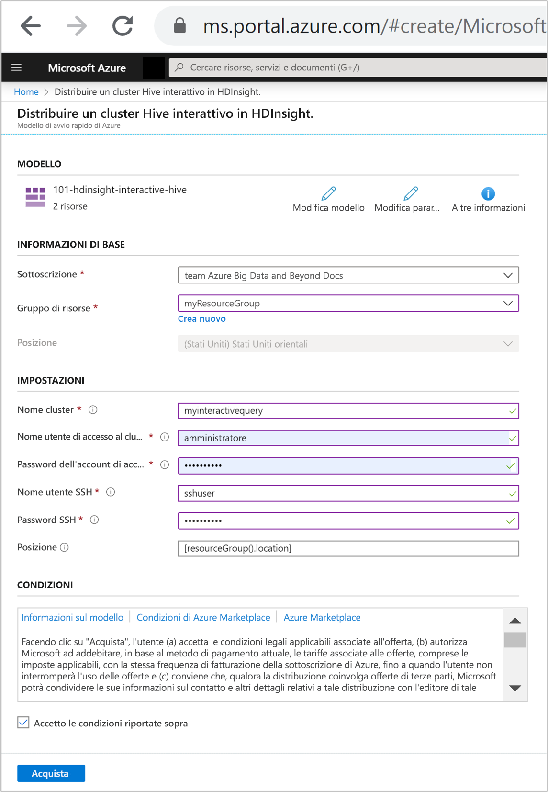
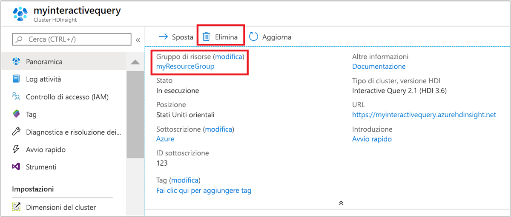

# Avvio rapido: Creare un cluster Interactive Query in Azure HDInsight con un modello di Resource Manager

Questa guida di avvio rapido illustra come usare un modello di Azure Resource Manager per creare un cluster [Interactive Query](./apache-interactive-query-get-started.md) in Azure HDInsight. Interactive Query (chiamato anche Apache Hive LLAP o [Low Latency Analytical Processing](https://cwiki.apache.org/confluence/display/Hive/LLAP)) è un [tipo di cluster](../hdinsight-hadoop-provision-linux-clusters.md#cluster-type) di Azure HDInsight.

[!INCLUDE [About Azure Resource Manager](../../../includes/resource-manager-quickstart-introduction.md)]

Se l'ambiente soddisfa i prerequisiti e si ha familiarità con l'uso dei modelli di Resource Manager, selezionare il pulsante **Distribuisci in Azure**. Il modello verrà aperto nel portale di Azure.

## Prerequisiti

Se non si ha una sottoscrizione di Azure, creare un [account gratuito](https://azure.microsoft.com/free/?WT.mc_id=A261C142F) prima di iniziare.

## Rivedere il modello

Il modello usato in questo avvio rapido proviene dai [modelli di avvio rapido di Azure](https://azure.microsoft.com/resources/templates/101-hdinsight-interactive-hive/).

:::code language="json" source="~/quickstart-templates/101-hdinsight-interactive-hive/azuredeploy.json":::

Nel modello sono definite due risorse di Azure:

* [Microsoft.Storage/storageAccounts](/azure/templates/microsoft.storage/storageaccounts) per creare un account di archiviazione di Azure.
* [Microsoft.HDInsight/cluster](/azure/templates/microsoft.hdinsight/clusters): creare un cluster HDInsight.

### Distribuire il modello

1. Selezionare il pulsante **Distribuisci in Azure** sotto per accedere ad Azure e aprire il modello di Resource Manager.

    

1. Immettere o selezionare i valori seguenti:

    |Proprietà |Descrizione |
    |---|---|
    |Subscription|Nell'elenco a discesa selezionare la sottoscrizione di Azure che viene usata per il cluster.|
    |Resource group|Nell'elenco a discesa selezionare il gruppo di risorse esistente oppure selezionare **Crea nuovo**.|
    |Location|Come valore verrà inserita automaticamente la località usata per il gruppo di risorse.|
    |Cluster Name|Immettere un nome univoco globale. Per questo modello usare solo lettere minuscole e numeri.|
    |Nome utente dell'account di accesso del cluster|Specificare il nome utente. Il valore predefinito è **admin**.|
    |Password di accesso al cluster|Specificare una password. La password deve avere una lunghezza minima di 10 caratteri e contenere almeno una cifra, una lettera maiuscola, una lettera minuscola e un carattere non alfanumerico, ad eccezione di ' " `. |
    |Nome utente SSH|Specificare il nome utente. Il valore predefinito è sshuser.|
    |Password SSH|Specificare la password.|

    

1. Leggere quanto riportato in **CONDIZIONI**. Selezionare quindi **Accetto le condizioni riportate sopra** e infine **Acquista**. Si riceverà una notifica che informa che la distribuzione è in corso. La creazione di un cluster richiede circa 20 minuti.

## Esaminare le risorse distribuite

Al termine della creazione del cluster, si riceverà una notifica con il messaggio **La distribuzione è riuscita** e un collegamento **Vai alla risorsa**. Nella pagina del gruppo di risorse saranno presenti il nuovo cluster HDInsight e l'account di archiviazione predefinito associato. Ogni cluster ha una dipendenza da un [account di archiviazione di Azure](../hdinsight-hadoop-use-blob-storage.md) o un [account Azure Data Lake Storage](../hdinsight-hadoop-use-data-lake-store.md). Viene indicato come account di archiviazione predefinito. Il cluster HDInsight e il relativo account di archiviazione predefinito devono avere un percorso condiviso nella stessa area di Azure. L'eliminazione dei cluster non comporta l'eliminazione dell'account di archiviazione.

## Pulire le risorse

Al termine dell'argomento di avvio rapido, può essere opportuno eliminare il cluster. Con HDInsight, i dati vengono archiviati in Archiviazione di Azure ed è possibile eliminare tranquillamente un cluster quando non è in uso. Vengono addebitati i costi anche per i cluster HDInsight che non sono in uso. Poiché i costi per il cluster sono decisamente superiori a quelli per l'archiviazione, eliminare i cluster quando non vengono usati è una scelta economicamente conveniente.

Nel portale di Azure passare al cluster e selezionare **Elimina**.

È anche possibile selezionare il nome del gruppo di risorse per aprire la pagina del gruppo di risorse e quindi selezionare **Elimina gruppo di risorse**. Eliminando il gruppo di risorse, si elimina sia il cluster HDInsight che l'account di archiviazione predefinito.

## Passaggi successivi

In questa guida di avvio rapido è stato creato un cluster Interactive Query in HDInsight usando un modello di Resource Manager. L'articolo successivo illustra come usare Apache Zeppelin per eseguire query Apache Hive.

> [!div class="nextstepaction"]
> [Eseguire query Apache Hive in Azure HDInsight con Apache Zeppelin](./hdinsight-connect-hive-zeppelin.md)
