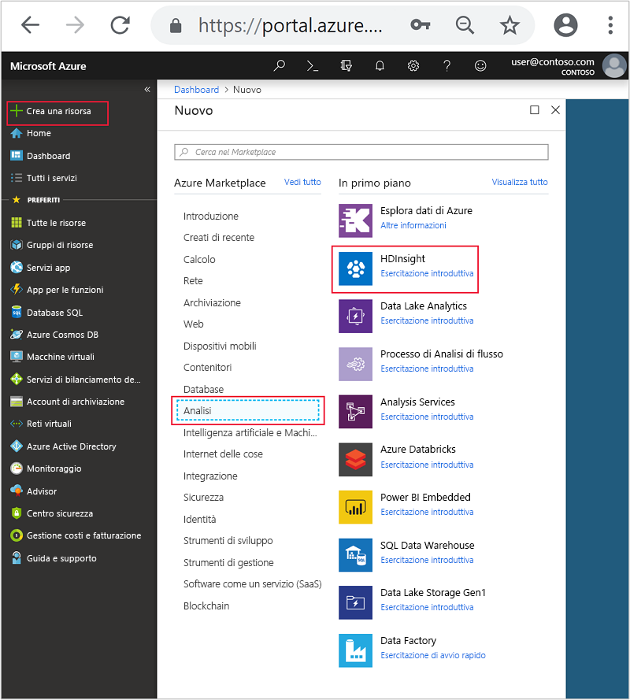
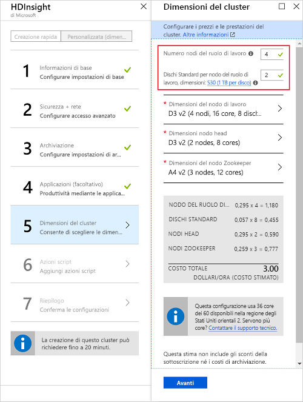

# <a name="start-with-apache-kafka-preview-on-hdinsight"></a>Iniziare a usare Apache Kafka (anteprima) in HDInsight

Questo articolo illustra come creare e usare un cluster [Apache Kafka](https://kafka.apache.org) in Azure HDInsight. Kafka è una piattaforma di streaming distribuita open source disponibile con HDInsight. Viene spesso usata come broker di messaggi perché mette a disposizione funzionalità simili a una coda messaggi di pubblicazione/sottoscrizione.

> [!NOTE]
> Con HDInsight sono attualmente disponibili due versioni di Kafka: 0.9.0 (HDInsight 3.4) e 0.10.0 (HDInsight 3.5 e 3.6). Le procedure in questo documento presuppongono che si usi Kafka in HDInsight 3.6.

[!INCLUDE [delete-cluster-warning](../../../includes/hdinsight-delete-cluster-warning.md)]

## <a name="create-a-kafka-cluster"></a>Creare un cluster Kafka

Per creare un cluster Kafka in HDInsight seguire questa procedura:

1. Nel [portale di Azure](https://portal.azure.com) fare clic su **+ Nuovo**, **Intelligence e analisi** e quindi selezionare **HDInsight**.
   
    

2. In **Informazioni di base** immettere le informazioni seguenti.

    * **Nome del cluster**: nome del cluster HDInsight.
    * **Sottoscrizione**: selezionare la sottoscrizione da usare.
    * **Nome utente dell'account di accesso del cluster** e **Password dell'account di accesso del cluster**: account di accesso usato per il cluster su HTTPS. Queste credenziali vengono usate per accedere a servizi quali l'interfaccia utente Web di Ambari o l'API REST.
    * **Secure Shell (SSH) username** (Nome utente SSH): account di accesso usato per il cluster su SSH. Per impostazione predefinita, la password corrisponde alla password di accesso al cluster.
    * **Gruppo di risorse**: il gruppo di risorse nel quale viene creato il cluster.
    * **Posizione**: area di Azure in cui creare il cluster.

        > [!IMPORTANT]
        > Per una disponibilità elevata dei dati, è consigliabile selezionare una posizione (area) contenente __tre domini di errore__. Per altre informazioni, vedere la sezione [Disponibilità elevata dei dati](#data-high-availability).
   
 

3. Selezionare **Tipo di cluster** e quindi impostare i valori seguenti in **Configurazione cluster**.
   
    * **Tipo di cluster**: Kafka

    * **Versione**: Kafka 0.10.0 (HDI 3.6)

    * **Livello cluster**: Standard
     
 Usare infine il pulsante **Seleziona** per salvare le impostazioni.
     
 

4. Dopo avere selezionato il tipo di cluster, usare il pulsante __Seleziona__ per impostare il tipo di cluster. Usare quindi il pulsante __Avanti__ per completare la configurazione di base.

5. In **Archiviazione** selezionare o creare un account di archiviazione. Per la procedura illustrata in questo documento, negli altri campi mantenere i valori predefiniti. Usare il pulsante __Avanti__ per salvare la configurazione della risorsa di archiviazione.

    

6. In __Applicazioni (facoltativo)__ selezionare __Avanti__ per continuare. Non sono richieste applicazioni per questo esempio.

7. In __Dimensioni del cluster__ selezionare __Avanti__ per continuare.

    > [!WARNING]
    > Per garantire la disponibilità di Kafka in HDInsight, il cluster deve contenere almeno tre nodi del ruolo di lavoro. Per altre informazioni, vedere la sezione [Disponibilità elevata dei dati](#data-high-availability).

    

    > [!IMPORTANT]
    > La voce relativa ai **dischi per nodo di lavoro** controlla la scalabilità di Kafka in HDInsight. Kafka in HDInsight usa il disco locale delle macchine virtuali nel cluster. Dal momento che in Kafka i processi I/O sono intensivi, viene usato il servizio [Azure Managed Disks](../../virtual-machines/windows/managed-disks-overview.md) per assicurare una velocità effettiva elevata e fornire maggiore spazio di archiviazione per ogni nodo. Il tipo di disco gestito può essere __Standard__ (HDD) o __Premium__ (SSD). I dischi Premium sono usati con le macchine virtuali serie DS e GS. Tutti gli altri tipi di macchine virtuali usano dischi Standard.

8. In __Impostazioni avanzate__ selezionare __Avanti__ per continuare.

9. Nel **riepilogo** esaminare la configurazione del cluster. Usare i collegamenti __Modifica__ per cambiare eventuali impostazioni non corrette. Usare infine il pulsante __Crea__ per creare il cluster.
   
    
   
    > [!NOTE]
    > La creazione del cluster può richiedere fino a 20 minuti.

## <a name="connect-to-the-cluster"></a>Connettersi al cluster

> [!IMPORTANT]
> Per eseguire questa procedura è necessario usare un client SSH. Per altre informazioni, vedere il documento [Connettersi a HDInsight (Hadoop) con SSH](../hdinsight-hadoop-linux-use-ssh-unix.md).

Dal client usare SSH per connettersi al cluster:

```ssh SSHUSER@CLUSTERNAME-ssh.azurehdinsight.net```

Sostituire **SSHUSER** con il nome utente SSH specificato durante la creazione del cluster. Sostituire **CLUSTERNAME** con il nome del cluster.

Quando richiesto, immettere la password usata per l'account SSH.

Per altre informazioni, vedere [Usare SSH con HDInsight](../hdinsight-hadoop-linux-use-ssh-unix.md).

## <a id="getkafkainfo"></a>Ottenere le informazioni sugli host Zookeeper e broker

Quando si usa Kafka è necessario conoscere due valori di host, ovvero *Zookeeper* e *broker*. Questi host vengono usati con l'API Kafka e molte delle utilità offerte con Kafka.

Seguire questa procedura per creare le variabili di ambiente che contengono le informazioni sugli host. Queste variabili di ambiente vengono usate nei passaggi di questo documento.

1. Da una connessione SSH al cluster usare questo comando per installare l'utilità `jq`. Questa utilità consente di analizzare documenti JSON e risulta utile nel recupero delle informazioni sugli host broker:
   
    ```bash
    sudo apt -y install jq
    ```

2. Per impostare le variabili di ambiente con le informazioni recuperate da Ambari, usare i comandi seguenti:

    ```bash
    CLUSTERNAME='your cluster name'
    PASSWORD='your cluster password'
    export KAFKAZKHOSTS=`curl -sS -u admin:$PASSWORD -G https://$CLUSTERNAME.azurehdinsight.net/api/v1/clusters/$CLUSTERNAME/services/ZOOKEEPER/components/ZOOKEEPER_SERVER | jq -r '["\(.host_components[].HostRoles.host_name):2181"] | join(",")' | cut -d',' -f1,2`

    export KAFKABROKERS=`curl -sS -u admin:$PASSWORD -G https://$CLUSTERNAME.azurehdinsight.net/api/v1/clusters/$CLUSTERNAME/services/KAFKA/components/KAFKA_BROKER | jq -r '["\(.host_components[].HostRoles.host_name):9092"] | join(",")' | cut -d',' -f1,2`

    echo '$KAFKAZKHOSTS='$KAFKAZKHOSTS
    echo '$KAFKABROKERS='$KAFKABROKERS
    ```

    > [!IMPORTANT]
    > Impostare `CLUSTERNAME=` sul nome del cluster Kafka. Impostare `PASSWORD=` sulla password (admin) di accesso usata durante la creazione del cluster.

    Il testo seguente è un esempio del contenuto di `$KAFKAZKHOSTS`:
   
    `zk0-kafka.eahjefxxp1netdbyklgqj5y1ud.ex.internal.cloudapp.net:2181,zk2-kafka.eahjefxxp1netdbyklgqj5y1ud.ex.internal.cloudapp.net:2181`
   
    Il testo seguente è un esempio del contenuto di `$KAFKABROKERS`:
   
    `wn1-kafka.eahjefxxp1netdbyklgqj5y1ud.cx.internal.cloudapp.net:9092,wn0-kafka.eahjefxxp1netdbyklgqj5y1ud.cx.internal.cloudapp.net:9092`

    > [!NOTE]
    > Il comando `cut` viene usato per ridurre l'elenco degli host a due voci. Non è necessario specificare l'elenco completo degli host durante la creazione di un consumer o un producer Kafka.
   
    > [!WARNING]
    > Le informazioni restituite da questa sessione non sono sempre precise. Se si ridimensiona il cluster, verranno aggiunti o rimossi broker. Se si verifica un errore e viene sostituito un nodo, il nome host per il nodo può cambiare.
    >
    > È necessario recuperare le informazioni sugli host Zookeeper e broker poco prima di usarle, per assicurare che siano valide.

## <a name="create-a-topic"></a>Creare un argomento

Kafka archivia i flussi di dati in categorie denominate *argomenti*. Da una connessione SSH a un nodo head del cluster, usare uno script fornito con Kafka per creare un argomento:

```bash
/usr/hdp/current/kafka-broker/bin/kafka-topics.sh --create --replication-factor 3 --partitions 8 --topic test --zookeeper $KAFKAZKHOSTS
```

Questo comando si connette a Zookeeper usando le informazioni sull'host archiviate in `$KAFKAZKHOSTS` e quindi crea un argomento Kafka denominato **test**. Per verificare che l'argomento sia stato creato è possibile usare lo script seguente per elencare gli argomenti:

```bash
/usr/hdp/current/kafka-broker/bin/kafka-topics.sh --list --zookeeper $KAFKAZKHOSTS
```

L'output di questo comando elenca gli argomenti Kafka, incluso l'argomento **test**.

## <a name="produce-and-consume-records"></a>Produrre e utilizzare record

Kafka archivia i *record* negli argomenti. I record vengono prodotti da *producer* e usati da *consumer*. I producer recuperano i record da *broker* di Kafka. Ogni nodo del ruolo di lavoro nel cluster HDInsight è un broker Kafka.

Seguire questa procedura per archiviare i record nell'argomento test creato in precedenza e quindi leggerli usando un consumer:

1. Dalla sessione SSH, usare uno script fornito con Kafka per scrivere record nell'argomento:
   
    ```bash
    /usr/hdp/current/kafka-broker/bin/kafka-console-producer.sh --broker-list $KAFKABROKERS --topic test
    ```
   
    Non si torna al prompt dopo questo comando. Digitare invece alcuni messaggi di testo e quindi usare **Ctrl + C** per arrestare l'invio all'argomento. Ogni riga viene inviata come record distinto.

2. Usare uno script fornito con Kafka per leggere record dall'argomento:
   
    ```bash
    /usr/hdp/current/kafka-broker/bin/kafka-console-consumer.sh --bootstrap-server $KAFKABROKERS --topic test --from-beginning
    ```
   
    Questo comando recupera i record dall'argomento e li visualizza. L'uso di `--from-beginning` indica al consumer di partire dall'inizio del flusso, quindi verranno recuperati tutti i record.

3. Usare __Ctrl + C__ per arrestare il consumer.

## <a name="producer-and-consumer-api"></a>API per producer e consumer

È anche possibile produrre e usare record a livello di codice con le [API Kafka](http://kafka.apache.org/documentation#api). Per creare un consumer o un producer Java, usare la procedura seguente nell'ambiente di sviluppo.

> [!IMPORTANT]
> Nell'ambiente di sviluppo devono essere installati i componenti seguenti:
>
> * [Java JDK 8](http://www.oracle.com/technetwork/java/javase/downloads/index.html) o equivalente, ad esempio OpenJDK.
>
> * [Apache Maven](http://maven.apache.org/)
>
> * Client SSH e comando `scp`. Per altre informazioni, vedere il documento [Connettersi a HDInsight (Hadoop) con SSH](../hdinsight-hadoop-linux-use-ssh-unix.md).

1. Scaricare gli esempi da [https://github.com/Azure-Samples/hdinsight-kafka-java-get-started](https://github.com/Azure-Samples/hdinsight-kafka-java-get-started). Per l'esempio producer/consumer usare il progetto disponibile nella directory `Producer-Consumer`. Questo esempio contiene le classi seguenti:
   
    * **Run**: avvia il consumer o il producer.

    * **Producer**: archivia 1.000.000 di record nell'argomento.

    * **Consumer**: legge i record dall'argomento.

2. Per creare un pacchetto JAR, passare alla directory `Producer-Consumer` e usare il comando seguente:

    ```
    mvn clean package
    ```

    Questo comando crea una directory denominata `target`, che contiene un file denominato `kafka-producer-consumer-1.0-SNAPSHOT.jar`.

3. Usare i comandi seguenti per copiare il file `kafka-producer-consumer-1.0-SNAPSHOT.jar` nel cluster HDInsight:
   
    ```bash
    scp ./target/kafka-producer-consumer-1.0-SNAPSHOT.jar SSHUSER@CLUSTERNAME-ssh.azurehdinsight.net:kafka-producer-consumer.jar
    ```
   
    Sostituire **SSHUSER** con l'utente SSH del cluster e **CLUSTERNAME** con il nome del cluster. Quando richiesto, immettere la password per l'utente SSH.

4. Dopo che il comando `scp` ha terminato di copiare il file, connettersi al cluster usando SSH. Usare il comando seguente per scrivere i record nell'argomento di test:

    ```bash
    java -jar kafka-producer-consumer.jar producer $KAFKABROKERS
    ```

5. Quando il processo è terminato, usare il comando seguente per leggere dall'argomento:
   
    ```bash
    java -jar kafka-producer-consumer.jar consumer $KAFKABROKERS
    ```
   
    Verranno visualizzati i record letti e il numero di record. È possibile che vengano archiviati più di 1.000.000 record perché nel passaggio precedente sono stati inviati diversi record all'argomento tramite uno script.

6. Usare __Ctrl + C__ per uscire dal consumer.

### <a name="multiple-consumers"></a>Consumer multipli

I consumer Kafka usano un gruppo di consumer durante la lettura dei record. L'uso dello stesso gruppo con più consumer consente di ottenere operazioni di lettura con bilanciamento del carico da un argomento. Ogni consumer nel gruppo riceve una parte dei record. Per verificare il funzionamento del processo, seguire questa procedura:

1. Aprire una nuova sessione SSH per il cluster, in modo da averne due. In ogni sessione usare il comando seguente per avviare un consumer con lo stesso ID gruppo:
   
    ```bash
    java -jar kafka-producer-consumer.jar consumer $KAFKABROKERS mygroup
    ```

    Questo comando avvia un consumer con l'ID gruppo `mygroup`.

    > [!NOTE]
    > Usare i comandi descritti nella sezione [Ottenere le informazioni sugli host Zookeeper e broker](#getkafkainfo) per impostare `$KAFKABROKERS` per questa sessione SSH.

2. Si noti che ogni sessione indica il conteggio dei record ricevuti dall'argomento. Il totale di entrambe le sessioni deve corrispondere a quello ricevuto in precedenza da un solo consumer.

Il consumo da parte dei client dello stesso gruppo viene gestito tramite le partizioni dell'argomento. Per l'argomento `test` creato in precedenza sono presenti otto partizioni. Se si aprono otto sessioni SSH e si avvia un consumer in tutte le sessioni, ogni consumer legge i record da una singola partizione dell'argomento.

> [!IMPORTANT]
> Un gruppo di consumer non può contenere un numero di istanze di consumer maggiore del numero di partizioni. In questo esempio, un gruppo di consumer può contenere fino a otto consumer perché è questo il numero di partizioni nell'argomento. In alternativa è possibile avere più gruppi di consumer, ognuno con al massimo otto consumer.

I record vengono archiviati in Kafka nell'ordine in cui vengono ricevuti in una partizione. Per ottenere il recapito dei record nell'ordine *all'interno di una partizione*, creare un gruppo di consumer con un numero di istanze corrispondente al numero di partizioni. Per ottenere il recapito dei record nell'ordine *all'interno dell'argomento*, creare un gruppo di consumer con una sola istanza.

## <a name="streaming-api"></a>API di streaming

L'API di streaming è stata aggiunta a Kafka nella versione 0.10.0; le versioni precedenti si basano su Apache Spark o Storm per l'elaborazione dei flussi.

1. Se non è già stato fatto, scaricare gli esempi da [https://github.com/Azure-Samples/hdinsight-kafka-java-get-started](https://github.com/Azure-Samples/hdinsight-kafka-java-get-started) nell'ambiente di sviluppo. Per l'esempio di streaming usare il progetto disponibile nella directory `streaming`.
   
    Questo progetto contiene una sola classe, `Stream`, che legge i record dall'argomento `test` creato in precedenza. Conta le parole lette ed emette ogni parola e il conteggio in un argomento denominato `wordcounts`. L'argomento `wordcounts` viene creato in un passaggio successivo di questa sezione.

2. Dalla riga di comando nell'ambiente di sviluppo, passare le directory alla posizione della directory `Streaming` e quindi usare il comando seguente per creare un pacchetto JAR:

    ```bash
    mvn clean package
    ```

    Questo comando crea una directory denominata `target`, che contiene un file denominato `kafka-streaming-1.0-SNAPSHOT.jar`.

3. Usare i comandi seguenti per copiare il file `kafka-streaming-1.0-SNAPSHOT.jar` nel cluster HDInsight:
   
    ```bash
    scp ./target/kafka-streaming-1.0-SNAPSHOT.jar SSHUSER@CLUSTERNAME-ssh.azurehdinsight.net:kafka-streaming.jar
    ```
   
    Sostituire **SSHUSER** con l'utente SSH del cluster e **CLUSTERNAME** con il nome del cluster. Quando richiesto, immettere la password per l'utente SSH.

4. Quando il comando `scp` avrà terminato di copiare il file, connettersi al cluster tramite SSH e quindi usare il comando seguente per creare l'argomento `wordcounts`:

    ```bash
    /usr/hdp/current/kafka-broker/bin/kafka-topics.sh --create --replication-factor 3 --partitions 8 --topic wordcounts --zookeeper $KAFKAZKHOSTS
    ```

5. Successivamente, avviare il processo di flusso usando il comando seguente:
   
    ```bash
    java -jar kafka-streaming.jar $KAFKABROKERS $KAFKAZKHOSTS 2>/dev/null &
    ```
   
    Questo comando avvia il processo di streaming in background.

6. Usare il comando seguente per inviare messaggi all'argomento `test`. I messaggi vengono elaborati dall'esempio di streaming:
   
    ```bash
    java -jar kafka-producer-consumer.jar producer $KAFKABROKERS &>/dev/null &
    ```

7. Usare il comando seguente per visualizzare l'output scritto nell'argomento `wordcounts` dal processo di flusso:
   
    ```bash
    /usr/hdp/current/kafka-broker/bin/kafka-console-consumer.sh --bootstrap-server $KAFKABROKERS --topic wordcounts --from-beginning --formatter kafka.tools.DefaultMessageFormatter --property print.key=true --property key.deserializer=org.apache.kafka.common.serialization.StringDeserializer --property value.deserializer=org.apache.kafka.common.serialization.LongDeserializer
    ```
   
    > [!NOTE]
    > Per visualizzare i dati, è necessario indicare al consumer di stampare la chiave e il deserializzatore da usare per la chiave e il valore. Il nome della chiave corrisponde alla parola e il valore della chiave contiene il conteggio.
   
    L'output è simile al testo seguente:
   
        dwarfs  13635
        ago     13664
        snow    13636
        dwarfs  13636
        ago     13665
        a       13803
        ago     13666
        a       13804
        ago     13667
        ago     13668
        jumped  13640
        jumped  13641
        a       13805
        snow    13637
   
    > [!NOTE]
    > Il conteggio viene incrementato ogni volta che viene rilevata una parola.

7. Usare __Ctrl + C__ per uscire dal consumer, quindi usare il comando `fg` per riportare in primo piano l'attività di streaming in background. Usare __Ctrl + C__ anche per uscire dall'attività.

## <a name="data-high-availability"></a>Disponibilità elevata dei dati

Ogni area (posizione) di Azure fornisce _domini di errore_. Un dominio di errore è un raggruppamento logico dell'hardware sottostante in un data center di Azure. Ogni dominio di errore condivide una fonte di alimentazione e un commutatore di rete comuni. Le macchine virtuali e i dischi gestiti che implementano i nodi in un cluster HDInsight sono distribuiti tra i domini di errore. Questa architettura limita il potenziale impatto dei guasti dell'hardware fisico.

Per informazioni sul numero di domini di errore in un'area, vedere il documento [Disponibilità delle macchine virtuali Linux](../../virtual-machines/windows/manage-availability.md#use-managed-disks-for-vms-in-an-availability-set).

> [!IMPORTANT]
> È consigliabile usare un'area di Azure contenente tre domini di errore e un fattore di replica di 3.

Se si deve usare un'area che contiene solo due domini di errore, usare un fattore di replica di 4 per distribuire uniformemente le repliche tra i due domini di errore.

### <a name="kafka-and-fault-domains"></a>Kafka e domini di errore

Kafka non rileva i domini di errore. Quando si creano le repliche di partizione per gli argomenti, è possibile che le repliche non vengano distribuite in modo corretto per la disponibilità elevata. Per garantire la disponibilità elevata, usare lo [strumento per il ribilanciamento delle partizioni Kafka](https://github.com/hdinsight/hdinsight-kafka-tools). Questo strumento deve essere eseguito da una sessione SSH al nodo head del cluster Kafka.

Per garantire la massima disponibilità dei dati Kafka, è consigliabile ribilanciare le repliche di partizione per l'argomento nei momenti seguenti:

* Quando viene creato un nuovo argomento o una nuova partizione

* Quando si aumentano le prestazioni di un cluster

## <a name="delete-the-cluster"></a>Eliminazione del cluster

[!INCLUDE [delete-cluster-warning](../../../includes/hdinsight-delete-cluster-warning.md)]

## <a name="troubleshoot"></a>Risoluzione dei problemi

Se si verificano problemi di creazione dei cluster HDInsight, vedere i [requisiti dei controlli di accesso](../hdinsight-administer-use-portal-linux.md#create-clusters).

## <a name="next-steps"></a>Passaggi successivi

In questo documento sono state illustrate le nozioni di base per l'uso di Apache Kafka in HDInsight. Per altre informazioni sull'uso di Kafka, vedere:

* [Analizzare i log di Kafka](apache-kafka-log-analytics-operations-management.md)
* [Replicare i dati tra cluster Kafka](apache-kafka-mirroring.md)
* [Usare lo streaming Apache Spark (DStream) con Kafka in HDInsight](../hdinsight-apache-spark-with-kafka.md)
* [Usare lo streaming strutturato Apache Spark con Kafka in HDInsight](../hdinsight-apache-kafka-spark-structured-streaming.md)
* [Usare Apache Storm (anteprima) con Kafka in HDInsight](../hdinsight-apache-storm-with-kafka.md)
* [Connect to Kafka through an Azure Virtual Network](apache-kafka-connect-vpn-gateway.md) (Connettersi a Kafka tramite una rete virtuale di Azure)
