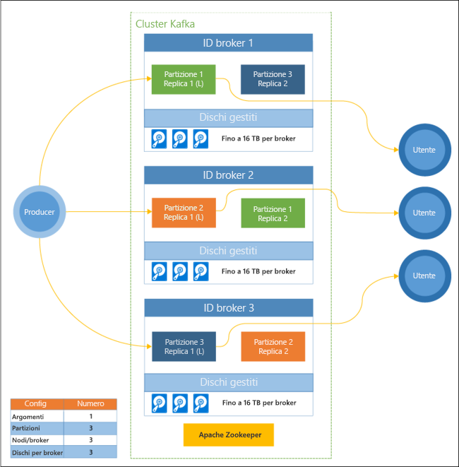

# Introduzione ad Apache Kafka in HDInsight

[Apache Kafka](https://kafka.apache.org) è una piattaforma di streaming open source distribuita che può essere usata per compilare applicazioni e pipeline di dati in streaming in tempo reale. Kafka offre anche una funzionalità di broker di messaggi simile a una coda di messaggi, dove è possibile pubblicare e sottoscrivere flussi dei dati denominati. Kafka in HDInsight fornisce un servizio gestito, a scalabilità e disponibilità elevate nel cloud di Microsoft Azure.

## Perché usare Kafka in HDInsight?

Kafka in HDInsight offre le funzionalità seguenti:

* __Contratto di servizio con tempo di attività del 99% per Kafka__: per altre informazioni, vedere il documento contenente le [informazioni sul contratto di servizio per HDInsight](https://azure.microsoft.com/support/legal/sla/hdinsight/v1_0/).

* __Tolleranza di errore e riconoscimento del rack__: Kafka è stato progettato con una vista unidimensionale di un rack che funziona perfettamente in alcuni ambienti. In ambienti come Azure, tuttavia, un rack viene separato in due dimensioni: i domini di aggiornamento e i domini di errore. Microsoft offre strumenti che garantiscono il ribilanciamento delle partizioni e delle repliche Kafka tra domini di aggiornamento e domini di errore. 

    Per altre informazioni, vedere l'articolo relativo alla [disponibilità elevata con Kafka in HDInsight](apache-kafka-high-availability.md).

* **Integrazione con Azure Managed Disks**: il servizio Managed Disks offre scalabilità e velocità effettiva maggiori per i dischi usati da Kafka in HDInsight, fino a 16 TB per nodo del cluster.

    Per informazioni sulla configurazione di dischi gestiti con Kafka in HDInsight, vedere [Configurare l'archiviazione e la scalabilità per Apache Kafka in HDInsight](apache-kafka-scalability.md).

    Per altre informazioni sui dischi gestiti, vedere [Panoramica di Azure Managed Disks](../../virtual-machines/windows/managed-disks-overview.md).

* **Avviso, monitoraggio e manutenzione predittiva**: per monitorare Kafka in HDInsight è possibile usare Azure Log Analytics. Log Analytics presenta informazioni a livello di macchina virtuale come le metriche relative a dischi e schede di interfaccia di rete e le metriche JMX di Kafka.

    Per altre informazioni, vedere [Analizzare i log per Kafka in HDInsight](apache-kafka-log-analytics-operations-management.md).

* **Replica dei dati Kafka**: Kafka offre l'utilità MirrorMaker, che replica i dati tra cluster Kafka.

    Per informazioni sull'uso di MirrorMaker, vedere l'articolo su come [replicare gli argomenti Kafka con Kafka in HDInsight](apache-kafka-mirroring.md).

* **Ridimensionamento del cluster**: HDInsight consente di modificare il numero dei nodi di lavoro, che ospitano il broker Kafka, dopo la creazione del cluster. È possibile aumentare le prestazioni di un cluster con l'aumento dei carichi di lavoro oppure ridurle per ridurre i costi. Il ridimensionamento può essere eseguito con il portale di Azure, Azure PowerShell e altre interfacce di gestione di Azure. Per Kafka, è consigliabile ribilanciare le repliche delle partizioni dopo le operazioni di ridimensionamento. Il ribilanciamento delle partizioni consente a Kafka di sfruttare il nuovo numero di nodi di lavoro.

    Per altre informazioni, vedere l'articolo relativo alla [disponibilità elevata con Kafka in HDInsight](apache-kafka-high-availability.md).

* **Modello di messaggistica per la pubblicazione/sottoscrizione**: Kafka offre un'API Producer per la pubblicazione di record in un argomento Kafka. L'API Consumer viene usata quando si sottoscrive un argomento.

    Per altre informazioni, vedere [Iniziare a usare Kafka in HDInsight](apache-kafka-get-started.md).

* **Elaborazione dei flussi**: Kafka viene spesso usato con Apache Storm o Spark per l'elaborazione dei flussi in tempo reale. In Kafka 0.10.0.0 (HDInsight versione 3.5 e 3.6) è stata introdotta un'API di streaming che consente di compilare soluzioni di streaming senza ricorrere a Storm o Spark.

    Per altre informazioni, vedere [Iniziare a usare Kafka in HDInsight](apache-kafka-get-started.md).

* **Scalabilità orizzontale**: le partizioni Kafka trasmettono nei nodi del cluster HDInsight. È possibile associare processi consumer a singole partizioni per garantire il bilanciamento del carico durante l'utilizzo dei record.

    Per altre informazioni, vedere [Iniziare a usare Kafka in HDInsight](apache-kafka-get-started.md).

* **Recapito in ordine**: all'interno di ogni partizione, i record vengono archiviati nel flusso nell'ordine in cui sono stati ricevuti. Associando un processo consumer per partizione, è possibile garantire che i record vengano elaborati in ordine.

    Per altre informazioni, vedere [Iniziare a usare Kafka in HDInsight](apache-kafka-get-started.md).

## Casi d'uso

* **Messaggistica**: poiché supporta il modello di messaggio per la pubblicazione/sottoscrizione, Kafka viene usato spesso come broker di messaggi.

* **Rilevamento delle attività**: poiché Kafka offre la registrazione ordinata dei record, può essere usato per tenere traccia delle attività e per ricrearle. Ad esempio, le azioni dell'utente in un sito Web o in un'applicazione.

* **Aggregazione**: usando l'elaborazione dei flussi, è possibile aggregare informazioni da flussi diversi per combinare e centralizzare le informazioni in dati operativi.

* **Trasformazione**: usando l'elaborazione dei flussi, è possibile combinare e arricchire dati da più argomenti di input in uno o più argomenti di output.

## Architecture

Questo diagramma mostra una configurazione tipica di Kafka che usa gruppi di consumer, partizionamento e replica per offrire la lettura parallela degli eventi con tolleranza di errore. Apache ZooKeeper è pensato per transazioni simultanee, resilienti e a bassa latenza, perché gestisce lo stato del cluster Kafka. Kafka archivia i record in *argomenti*. I record vengono prodotti da *producer* e usati da *consumer*. I producer recuperano i record da *broker* di Kafka. Ogni nodo del ruolo di lavoro nel cluster HDInsight è un broker Kafka. Viene creata una partizione per ogni consumer, per consentire l'elaborazione parallela dei dati di streaming. Viene usata la replica per distribuire le partizioni tra i nodi e garantire protezione in caso di interruzioni dei nodi (broker). Una partizione indicata da *(L)* rappresenta l'elemento leader per la partizione specifica. Il traffico dei producer viene indirizzato al leader di ogni nodo, usando lo stato gestito da ZooKeeper.

Ogni broker Kafka usa Azure Managed Disks. Il numero di dischi è definito dall'utente e può fornire fino a 16 TB di spazio di archiviazione per broker.

> [!IMPORTANT]
> Kafka non è a conoscenza dell'hardware sottostante (rack) nel data center di Azure. Per garantire che le partizioni siano bilanciate correttamente nell'hardware sottostante, vedere il documento su come [configurare la disponibilità elevata dei dati (Kafka)](apache-kafka-high-availability.md).

## Passaggi successivi

Usare i collegamenti seguenti per informazioni su come usare Apache Kafka in HDInsight:

* [Get started with Kafka on HDInsight](apache-kafka-get-started.md) (Introduzione a Kafka in HDInsight)

* [Usare MirrorMaker per creare una replica di Kafka in HDInsight](apache-kafka-mirroring.md)

* [Usare Apache Storm (anteprima) con Kafka in HDInsight](../hdinsight-apache-storm-with-kafka.md)

* [Use Apache Spark with Kafka on HDInsight](../hdinsight-apache-spark-with-kafka.md) (Usare Apache Spark con Kafka in HDInsight)

* [Connect to Kafka through an Azure Virtual Network](apache-kafka-connect-vpn-gateway.md) (Connettersi a Kafka tramite una rete virtuale di Azure)