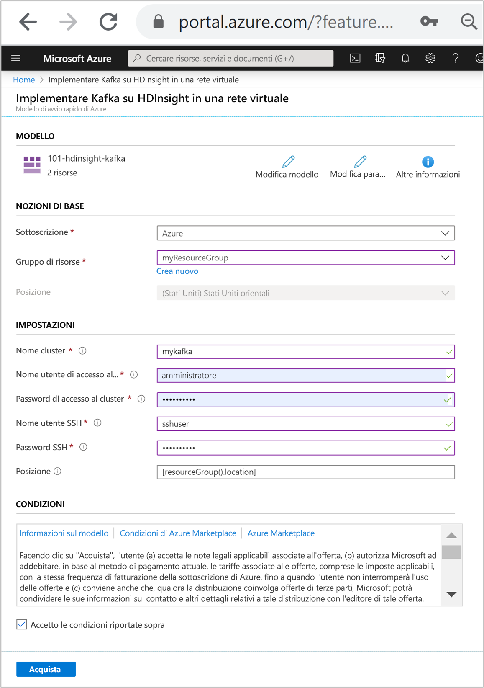
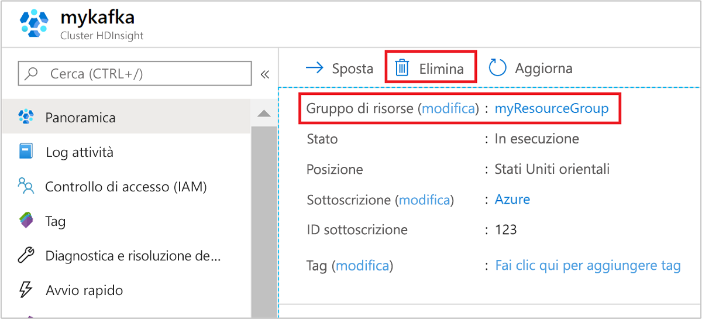

# <a name="quickstart-create-apache-kafka-cluster-in-azure-hdinsight-using-arm-template"></a>Avvio rapido: Creare un cluster Apache Kafka in Azure HDInsight usando un modello di Resource Manager

Questa guida di avvio rapido illustra come usare un modello di Azure Resource Manager per creare un cluster [Apache Kafka](./apache-kafka-introduction.md) in Azure HDInsight. Kafka è una piattaforma di streaming open source distribuita. Viene spesso usata come broker di messaggi perché offre funzionalità simili a una coda messaggi di pubblicazione/sottoscrizione.

[!INCLUDE [About Azure Resource Manager](../../../includes/resource-manager-quickstart-introduction.md)]

Possono accedere all'API Kafka solo risorse interne alla stessa rete virtuale. In questa guida di avvio rapido si accede al cluster direttamente usando SSH. Per connettere altri servizi, reti o macchine virtuali a Kafka, è necessario prima di tutto creare una rete virtuale e quindi creare le risorse all'interno della rete. Per altre informazioni, vedere il documento [Connettersi ad Apache Kafka da una rete locale](apache-kafka-connect-vpn-gateway.md).

Se l'ambiente soddisfa i prerequisiti e si ha familiarità con l'uso dei modelli di Resource Manager, selezionare il pulsante **Distribuisci in Azure**. Il modello verrà aperto nel portale di Azure.

[](https://portal.azure.com/#create/Microsoft.Template/uri/https%3A%2F%2Fraw.githubusercontent.com%2FAzure%2Fazure-quickstart-templates%2Fmaster%2F101-hdinsight-kafka%2Fazuredeploy.json)

## <a name="prerequisites"></a>Prerequisiti

Se non si ha una sottoscrizione di Azure, creare un [account gratuito](https://azure.microsoft.com/free/?WT.mc_id=A261C142F) prima di iniziare.

## <a name="review-the-template"></a>Rivedere il modello

Il modello usato in questo avvio rapido proviene dai [modelli di avvio rapido di Azure](https://azure.microsoft.com/resources/templates/101-hdinsight-kafka/).

:::code language="json" source="~/quickstart-templates/101-hdinsight-kafka/azuredeploy.json":::

Nel modello sono definite due risorse di Azure:

* [Microsoft.Storage/storageAccounts](/azure/templates/microsoft.storage/storageaccounts) per creare un account di archiviazione di Azure.
* [Microsoft.HDInsight/cluster](/azure/templates/microsoft.hdinsight/clusters): creare un cluster HDInsight.

## <a name="deploy-the-template"></a>Distribuire il modello

1. Selezionare il pulsante **Distribuisci in Azure** sotto per accedere ad Azure e aprire il modello di Resource Manager.

   [](https://portal.azure.com/#create/Microsoft.Template/uri/https%3A%2F%2Fraw.githubusercontent.com%2FAzure%2Fazure-quickstart-templates%2Fmaster%2F101-hdinsight-kafka%2Fazuredeploy.json)

1. Immettere o selezionare i valori seguenti:

    |Proprietà |Descrizione |
    |---|---|
    |Subscription|Nell'elenco a discesa selezionare la sottoscrizione di Azure che viene usata per il cluster.|
    |Resource group|Nell'elenco a discesa selezionare il gruppo di risorse esistente oppure selezionare **Crea nuovo**.|
    |Location|Come valore verrà inserita automaticamente la località usata per il gruppo di risorse.|
    |Cluster Name|Immettere un nome univoco globale. Per questo modello usare solo lettere minuscole e numeri.|
    |Nome utente dell'account di accesso del cluster|Specificare il nome utente. Il valore predefinito è **admin**.|
    |Password di accesso al cluster|Specificare una password. La password deve avere una lunghezza minima di 10 caratteri e contenere almeno una cifra, una lettera maiuscola, una lettera minuscola e un carattere non alfanumerico, ad eccezione di ' " `. |
    |Nome utente SSH|Specificare il nome utente. Il valore predefinito è **sshuser**.|
    |Password SSH|Specificare la password.|

    

1. Leggere quanto riportato in **CONDIZIONI**. Selezionare quindi **Accetto le condizioni riportate sopra** e infine **Acquista**. Si riceverà una notifica che informa che la distribuzione è in corso. La creazione di un cluster richiede circa 20 minuti.

## <a name="review-deployed-resources"></a>Esaminare le risorse distribuite

Al termine della creazione del cluster, si riceverà una notifica con il messaggio **La distribuzione è riuscita** e un collegamento **Vai alla risorsa**. Nella pagina del gruppo di risorse saranno presenti il nuovo cluster HDInsight e l'account di archiviazione predefinito associato. Ogni cluster ha una dipendenza da un [account di archiviazione di Azure](../hdinsight-hadoop-use-blob-storage.md) o un [account Azure Data Lake Storage](../hdinsight-hadoop-use-data-lake-store.md). Viene indicato come account di archiviazione predefinito. Il cluster HDInsight e il relativo account di archiviazione predefinito devono avere un percorso condiviso nella stessa area di Azure. L'eliminazione dei cluster non comporta l'eliminazione dell'account di archiviazione.

## <a name="get-the-apache-zookeeper-and-broker-host-information"></a>Ottenere le informazioni sugli host Apache Zookeeper e broker

Quando si usa Kafka, è necessario conoscere gli host *Apache Zookeeper* e *broker*. Questi host vengono usati con l'API Kafka e molte delle utilità offerte con Kafka.

In questa sezione si ottengono le informazioni sull'host dall'API REST Ambari nel cluster.

1. Usare il [comando ssh](../hdinsight-hadoop-linux-use-ssh-unix.md) per connettersi al cluster. Modificare il comando seguente sostituendo CLUSTERNAME con il nome del cluster in uso e quindi immettere il comando:

    ```cmd
    ssh sshuser@CLUSTERNAME-ssh.azurehdinsight.net
    ```

1. Dalla connessione SSH usare il comando seguente per installare l'utilità `jq`. Questa utilità consente di analizzare i documenti JSON ed è utile nel recupero delle informazioni sull'host:

    ```bash
    sudo apt -y install jq
    ```

1. Per impostare una variabile di ambiente sul nome del cluster, usare il comando seguente:

    ```bash
    read -p "Enter the Kafka on HDInsight cluster name: " CLUSTERNAME
    ```

    Al prompt immettere il nome del cluster Kafka.

1. Per impostare una variabile di ambiente con le informazioni degli host Zookeeper, usare il comando seguente. Il comando recupera tutti gli host Zookeeper, quindi restituisce solo le prime due voci. per mantenere un certo livello di ridondanza nel caso in cui un host fosse irraggiungibile.

    ```bash
    export KAFKAZKHOSTS=`curl -sS -u admin -G https://$CLUSTERNAME.azurehdinsight.net/api/v1/clusters/$CLUSTERNAME/services/ZOOKEEPER/components/ZOOKEEPER_SERVER | jq -r '["\(.host_components[].HostRoles.host_name):2181"] | join(",")' | cut -d',' -f1,2`
    ```

    Al prompt immettere la password dell'account di accesso al cluster (non l'account SSH).

1. Usare il comando seguente per verificare che la variabile di ambiente sia impostata correttamente:

    ```bash
     echo '$KAFKAZKHOSTS='$KAFKAZKHOSTS
    ```

    Questo comando restituisce informazioni simili al testo seguente:

    `zk0-kafka.eahjefxxp1netdbyklgqj5y1ud.ex.internal.cloudapp.net:2181,zk2-kafka.eahjefxxp1netdbyklgqj5y1ud.ex.internal.cloudapp.net:2181`

1. Per impostare una variabile di ambiente con le informazioni degli host broker, usare il comando seguente:

    ```bash
    export KAFKABROKERS=`curl -sS -u admin -G https://$CLUSTERNAME.azurehdinsight.net/api/v1/clusters/$CLUSTERNAME/services/KAFKA/components/KAFKA_BROKER | jq -r '["\(.host_components[].HostRoles.host_name):9092"] | join(",")' | cut -d',' -f1,2`
    ```

    Al prompt immettere la password dell'account di accesso al cluster (non l'account SSH).

1. Usare il comando seguente per verificare che la variabile di ambiente sia impostata correttamente:

    ```bash
    echo '$KAFKABROKERS='$KAFKABROKERS
    ```

    Questo comando restituisce informazioni simili al testo seguente:

    `wn1-kafka.eahjefxxp1netdbyklgqj5y1ud.cx.internal.cloudapp.net:9092,wn0-kafka.eahjefxxp1netdbyklgqj5y1ud.cx.internal.cloudapp.net:9092`

## <a name="manage-apache-kafka-topics"></a>Gestire gli argomenti di Apache Kafka

Kafka archivia i flussi di dati in *argomenti*. Per gestire gli argomenti è possibile usare l'utilità `kafka-topics.sh`.

* **Per creare un argomento** usare il comando seguente nella connessione SSH:

    ```bash
    /usr/hdp/current/kafka-broker/bin/kafka-topics.sh --create --replication-factor 3 --partitions 8 --topic test --zookeeper $KAFKAZKHOSTS
    ```

    Questo comando si connette a Zookeeper usando le informazioni sull'host archiviate in `$KAFKAZKHOSTS` e quindi crea un argomento Kafka denominato **test**.

    * I dati archiviati in questo argomento vengono divisi in otto partizioni.

    * Ogni partizione è replicata in tre nodi di ruolo di lavoro nel cluster.

        Se il cluster è stato creato in un'area di Azure con tre domini di errore, usare il fattore di replica 3. In caso contrario usare il fattore di replica 4.
        
        Nelle aree con tre domini di errore, il fattore di replica 3 consente di distribuire le repliche tra i domini di errore. Nelle aree con due domini di errore, il fattore di replica 4 distribuisce le repliche uniformemente tra i domini.
        
        Per informazioni sul numero di domini di errore in un'area, vedere il documento [Disponibilità delle macchine virtuali Linux](../../virtual-machines/windows/manage-availability.md#use-managed-disks-for-vms-in-an-availability-set).

        Kafka non rileva i domini di errore di Azure. Quando si creano le repliche di partizione per gli argomenti, è possibile che le repliche non vengano distribuite in modo corretto per la disponibilità elevata.

        Per garantire la disponibilità elevata, usare lo [strumento per il ribilanciamento delle partizioni Apache Kafka](https://github.com/hdinsight/hdinsight-kafka-tools). Questo strumento deve essere eseguito da una sessione SSH al nodo head del cluster Kafka.

        Per garantire la massima disponibilità dei dati Kafka, è consigliabile ribilanciare le repliche di partizione per l'argomento nelle situazioni seguenti:

        * Quando si crea un nuovo argomento o una nuova partizione

        * Quando si aumentano le prestazioni di un cluster

* **Per elencare gli argomenti** usare il comando seguente:

    ```bash
    /usr/hdp/current/kafka-broker/bin/kafka-topics.sh --list --zookeeper $KAFKAZKHOSTS
    ```

    Questo comando elenca gli argomenti disponibili nel cluster Kafka.

* **Per eliminare un argomento** usare il comando seguente:

    ```bash
    /usr/hdp/current/kafka-broker/bin/kafka-topics.sh --delete --topic topicname --zookeeper $KAFKAZKHOSTS
    ```

    Questo comando elimina l'argomento denominato `topicname`.

    > [!WARNING]  
    > Se si elimina l'argomento `test` creato in precedenza, è necessario crearlo di nuovo. Questo argomento si userà in passaggi indicati più avanti in questo documento.

Per altre informazioni sui comandi disponibili con l'utilità `kafka-topics.sh`, usare il comando seguente:

```bash
/usr/hdp/current/kafka-broker/bin/kafka-topics.sh
```

## <a name="produce-and-consume-records"></a>Produrre e utilizzare record

Kafka archivia i *record* negli argomenti. I record vengono prodotti da *producer* e usati da *consumer*. I producer e i consumer comunicano con il servizio *broker Kafka*. Ogni nodo del ruolo di lavoro nel cluster HDInsight è un host del broker Kafka.

Seguire questa procedura per archiviare i record nell'argomento test creato in precedenza e quindi leggerli usando un consumer:

1. Per scrivere i record nell'argomento usare l'utilità `kafka-console-producer.sh` dalla connessione SSH:

    ```bash
    /usr/hdp/current/kafka-broker/bin/kafka-console-producer.sh --broker-list $KAFKABROKERS --topic test
    ```

    Dopo questo comando viene visualizzata una riga vuota.

1. Digitare un messaggio di testo nella riga vuota e premere INVIO. Digitare invece alcuni messaggi in questo modo e quindi usare **Ctrl + C** per tornare al prompt normale. Ogni riga viene inviata come record distinto all'argomento Kafka.

1. Per scrivere i record dall'argomento usare l'utilità `kafka-console-consumer.sh` dalla connessione SSH:

    ```bash
    /usr/hdp/current/kafka-broker/bin/kafka-console-consumer.sh --bootstrap-server $KAFKABROKERS --topic test --from-beginning
    ```

    Questo comando recupera i record dall'argomento e li visualizza. L'uso di `--from-beginning` indica al consumer di partire dall'inizio del flusso, quindi verranno recuperati tutti i record.

    Se si usa una versione meno recente di Kafka, sostituire `--bootstrap-server $KAFKABROKERS` con `--zookeeper $KAFKAZKHOSTS`.

1. Usare __Ctrl + C__ per arrestare il consumer.

È possibile creare producer e consumer anche a livello di codice. Per un esempio dell'uso di questa API, vedere il documento relativo alle [API Producer e Consumer Apache Kafka con HDInsight](apache-kafka-producer-consumer-api.md).

## <a name="clean-up-resources"></a>Pulire le risorse

Al termine dell'argomento di avvio rapido, può essere opportuno eliminare il cluster. Con HDInsight, i dati vengono archiviati in Archiviazione di Azure ed è possibile eliminare tranquillamente un cluster quando non è in uso. Vengono addebitati i costi anche per i cluster HDInsight che non sono in uso. Poiché i costi per il cluster sono decisamente superiori a quelli per l'archiviazione, eliminare i cluster quando non vengono usati è una scelta economicamente conveniente.

Nel portale di Azure passare al cluster e selezionare **Elimina**.



È anche possibile selezionare il nome del gruppo di risorse per aprire la pagina del gruppo di risorse e quindi selezionare **Elimina gruppo di risorse**. Eliminando il gruppo di risorse, si elimina sia il cluster HDInsight che l'account di archiviazione predefinito.

## <a name="next-steps"></a>Passaggi successivi

In questa guida di avvio rapido è stato creato un cluster Apache Kafka in HDInsight tramite un modello di Resource Manager. L'articolo successivo illustra come creare un'applicazione che usa l'API Apache Kafka Streams ed eseguirla con Kafka in HDInsight.

> [!div class="nextstepaction"]
> [Usare l'API Apache Kafka Streams in Azure HDInsight](./apache-kafka-streams-api.md)
