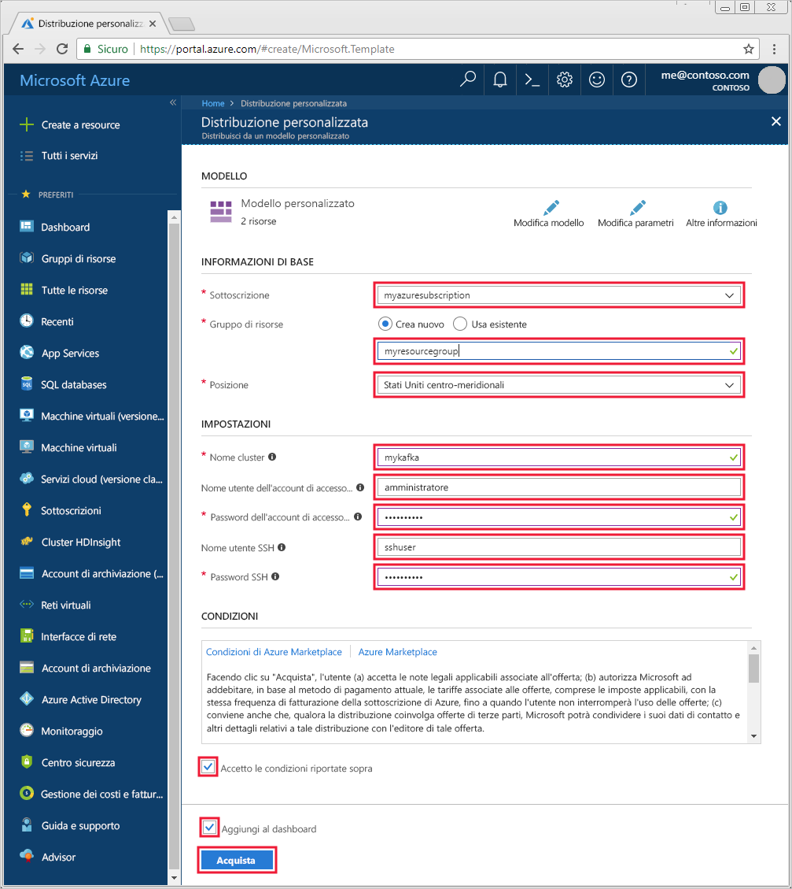

# <a name="quickstart-create-an-apache-kafka-on-hdinsight-cluster"></a>Guida introduttiva: Creare un cluster Apache Kafka in HDInsight

[Apache Kafka](https://kafka.apache.org/) è una piattaforma di streaming open source distribuita. Viene spesso usata come broker di messaggi perché offre funzionalità simili a una coda messaggi di pubblicazione/sottoscrizione. 

Questa guida di avvio rapido illustra come creare un cluster [Apache Kafka](https://kafka.apache.org) in Azure HDInsight tramite il portale di Azure. Illustra anche come usare le utilità incluse per inviare e ricevere messaggi tramite Kafka.

[!INCLUDE [delete-cluster-warning](../../../includes/hdinsight-delete-cluster-warning.md)]

> [!IMPORTANT]
> Possono accedere all'API Kafka solo risorse interne alla stessa rete virtuale. In questa guida di avvio rapido si accede al cluster direttamente usando SSH. Per connettere altri servizi, reti o macchine virtuali a Kafka, è necessario prima di tutto creare una rete virtuale e quindi creare le risorse all'interno della rete.
>
> Per altre informazioni, vedere il documento [Connettersi ad Apache Kafka da una rete locale](apache-kafka-connect-vpn-gateway.md).

## <a name="prerequisites"></a>Prerequisiti

* Una sottoscrizione di Azure. Se non si ha una sottoscrizione di Azure, creare un [account gratuito](https://azure.microsoft.com/free/?WT.mc_id=A261C142F) prima di iniziare.

* Un client SSH. La procedura in questo documento usa SSH per la connessione al cluster.

    Il comando `ssh` è disponibile per impostazione predefinita nei sistemi Linux, Unix e macOS. In Windows 10 usare uno dei metodi seguenti per installare il comando `ssh`:

    * Usare [Azure Cloud Shell](https://docs.microsoft.com/azure/cloud-shell/quickstart). Cloud Shell include il comando `ssh` e può essere configurata per l'utilizzo di Bash o di PowerShell come ambiente shell.

    * [Installare il sottosistema Windows per Linux](https://docs.microsoft.com/windows/wsl/install-win10). Le distribuzioni Linux disponibili nel Microsoft Store includono il comando `ssh`.

    > [!IMPORTANT]
    > La procedura descritta in questo documento presuppone che si usi uno dei client SSH sopra menzionati. Se si usa un client SSH diverso e si riscontrano problemi, consultare la documentazione del client SSH.
    >
    > Per altre informazioni, vedere il documento [Connettersi a HDInsight (Hadoop) con SSH](../hdinsight-hadoop-linux-use-ssh-unix.md).

## <a name="create-an-apache-kafka-cluster"></a>Creare un cluster Apache Kafka

1. Fare clic sull'immagine seguente per aprire il modello nel portale di Azure.

    <a href="https://portal.azure.com/#create/Microsoft.Template/uri/https%3A%2F%2Fraw.githubusercontent.com%2FAzure-Samples%2Fhdinsight-kafka-java-get-started%2Fmaster%2Fazuredeploy.json" target="_blank"></a>

2. Per creare il cluster Kafka, usare i valori seguenti:

    | Proprietà | Valore |
    | --- | --- |
    | Sottoscrizione | La sottoscrizione di Azure. |
    | Gruppo di risorse | Il gruppo di risorse nel quale viene creato il cluster. |
    | Località | L'area di Azure in cui viene creato il cluster. |
    | Cluster Name | Nome del cluster Kafka. |
    | Nome utente dell'account di accesso del cluster | Il nome dell'account utilizzato per accedere ai servizi basati su HTTPs ospitati nel cluster. |
    | Password di accesso al cluster | La password per il nome utente di accesso. |
    | Nome utente SSH | Il nome utente SSH. Questo account può accedere al cluster tramite SSH. |
    | Password SSH | Password per l'utente SSH. |

    

3. Selezionare **Accetto le condizioni riportate sopra**, selezionare **Aggiungi al dashboard** e quindi fare clic su **Acquista**.

> [!NOTE]
> La creazione del cluster può richiedere fino a 20 minuti.

## <a name="connect-to-the-cluster"></a>Connettersi al cluster

1. Per connettersi al nodo head primario del cluster Kafka, usare il comando seguente. Sostituire `sshuser` con il nome utente SSH. Sostituire `mykafka` con il nome del cluster Kafka

    ```bash
    ssh sshuser@mykafka-ssh.azurehdinsight.net
    ```

2. Alla prima connessione al cluster, è possibile che il client SSH mostri un avviso relativo all'impossibilità di confermare l'autenticità dell'host. Al prompt digitare __yes__e quindi premere __INVIO__ per aggiungere l'host all'elenco dei server attendibili del client SSH.

3. Quando richiesto, immettere la password per l'utente SSH.

Dopo avere eseguito la connessione, vengono visualizzate informazioni simili al testo seguente:

```text
Authorized uses only. All activity may be monitored and reported.
Welcome to Ubuntu 16.04.4 LTS (GNU/Linux 4.13.0-1011-azure x86_64)

 * Documentation:  https://help.ubuntu.com
 * Management:     https://landscape.canonical.com
 * Support:        https://ubuntu.com/advantage

  Get cloud support with Ubuntu Advantage Cloud Guest:
    http://www.ubuntu.com/business/services/cloud

83 packages can be updated.
37 updates are security updates.


Welcome to Kafka on HDInsight.

Last login: Thu Mar 29 13:25:27 2018 from 108.252.109.241
ssuhuser@hn0-mykafk:~$
```

## <a id="getkafkainfo"></a>Ottenere le informazioni sugli host Apache Zookeeper e broker

Quando si usa Kafka, è necessario conoscere gli host *Apache Zookeeper* e *broker*. Questi host vengono usati con l'API Kafka e molte delle utilità offerte con Kafka.

In questa sezione si ottengono le informazioni sull'host dall'API REST Ambari nel cluster.

1. Da una connessione SSH al cluster, usare il comando seguente per installare l'utilità `jq`. Questa utilità consente di analizzare i documenti JSON ed è utile nel recupero delle informazioni sull'host:
   
    ```bash
    sudo apt -y install jq
    ```

2. Per impostare una variabile di ambiente sul nome del cluster, usare il comando seguente:

    ```bash
    read -p "Enter the Kafka on HDInsight cluster name: " CLUSTERNAME
    ```

    Al prompt immettere il nome del cluster Kafka.

3. Per impostare una variabile di ambiente con le informazioni degli host Zookeeper, usare il comando seguente:

    ```bash
    export KAFKAZKHOSTS=`curl -sS -u admin -G https://$CLUSTERNAME.azurehdinsight.net/api/v1/clusters/$CLUSTERNAME/services/ZOOKEEPER/components/ZOOKEEPER_SERVER | jq -r '["\(.host_components[].HostRoles.host_name):2181"] | join(",")' | cut -d',' -f1,2`
    ```

    Al prompt immettere la password dell'account di accesso al cluster (non l'account SSH).

    > [!NOTE]
    > Questo comando recupera tutti gli host Zookeeper, quindi restituisce solo le prime due voci, per mantenere un certo livello di ridondanza nel caso in cui un host fosse irraggiungibile.

4. Usare il comando seguente per verificare che la variabile di ambiente sia impostata correttamente:

    ```bash
     echo '$KAFKAZKHOSTS='$KAFKAZKHOSTS
    ```

    Questo comando restituisce informazioni simili al testo seguente:

    `zk0-kafka.eahjefxxp1netdbyklgqj5y1ud.ex.internal.cloudapp.net:2181,zk2-kafka.eahjefxxp1netdbyklgqj5y1ud.ex.internal.cloudapp.net:2181`

5. Per impostare una variabile di ambiente con le informazioni degli host broker, usare il comando seguente:

    ```bash
    export KAFKABROKERS=`curl -sS -u admin -G https://$CLUSTERNAME.azurehdinsight.net/api/v1/clusters/$CLUSTERNAME/services/KAFKA/components/KAFKA_BROKER | jq -r '["\(.host_components[].HostRoles.host_name):9092"] | join(",")' | cut -d',' -f1,2`
    ```

    Al prompt immettere la password dell'account di accesso al cluster (non l'account SSH).

6. Usare il comando seguente per verificare che la variabile di ambiente sia impostata correttamente:

    ```bash   
    echo '$KAFKABROKERS='$KAFKABROKERS
    ```

    Questo comando restituisce informazioni simili al testo seguente:
   
    `wn1-kafka.eahjefxxp1netdbyklgqj5y1ud.cx.internal.cloudapp.net:9092,wn0-kafka.eahjefxxp1netdbyklgqj5y1ud.cx.internal.cloudapp.net:9092`

## <a name="manage-apache-kafka-topics"></a>Gestire gli argomenti di Apache Kafka

Kafka archivia i flussi di dati in *argomenti*. Per gestire gli argomenti è possibile usare l'utilità `kafka-topics.sh`.

* **Per creare un argomento** usare il comando seguente nella connessione SSH:

    ```bash
    /usr/hdp/current/kafka-broker/bin/kafka-topics.sh --create --replication-factor 3 --partitions 8 --topic test --zookeeper $KAFKAZKHOSTS
    ```

    Questo comando si connette a Zookeeper usando le informazioni sull'host archiviate in `$KAFKAZKHOSTS` e quindi crea un argomento Kafka denominato **test**. 

    * I dati archiviati in questo argomento vengono divisi in otto partizioni.

    * Ogni partizione è replicata in tre nodi di ruolo di lavoro nel cluster.

        > [!IMPORTANT]
        > Se il cluster è stato creato in un'area di Azure con tre domini di errore, usare il fattore di replica 3. In caso contrario usare il fattore di replica 4.
        
        Nelle aree con tre domini di errore, il fattore di replica 3 consente di distribuire le repliche tra i domini di errore. Nelle aree con due domini di errore, il fattore di replica 4 distribuisce le repliche uniformemente tra i domini.
        
        Per informazioni sul numero di domini di errore in un'area, vedere il documento [Disponibilità delle macchine virtuali Linux](../../virtual-machines/windows/manage-availability.md#use-managed-disks-for-vms-in-an-availability-set).

        > [!IMPORTANT] 
        > Kafka non rileva i domini di errore di Azure. Quando si creano le repliche di partizione per gli argomenti, è possibile che le repliche non vengano distribuite in modo corretto per la disponibilità elevata.

        Per garantire la disponibilità elevata, usare lo [strumento per il ribilanciamento delle partizioni Apache Kafka](https://github.com/hdinsight/hdinsight-kafka-tools). Questo strumento deve essere eseguito da una sessione SSH al nodo head del cluster Kafka.

        Per garantire la massima disponibilità dei dati Kafka, è consigliabile ribilanciare le repliche di partizione per l'argomento nelle situazioni seguenti:

        * Quando si crea un nuovo argomento o una nuova partizione

        * Quando si aumentano le prestazioni di un cluster

* **Per elencare gli argomenti** usare il comando seguente:

    ```bash
    /usr/hdp/current/kafka-broker/bin/kafka-topics.sh --list --zookeeper $KAFKAZKHOSTS
    ```

    Questo comando elenca gli argomenti disponibili nel cluster Kafka.

* **Per eliminare un argomento** usare il comando seguente:

    ```bash
    /usr/hdp/current/kafka-broker/bin/kafka-topics.sh --delete --topic topicname --zookeeper $KAFKAZKHOSTS
    ```

    Questo comando elimina l'argomento denominato `topicname`.

    > [!WARNING]
    > Se si elimina l'argomento `test` creato in precedenza, è necessario crearlo di nuovo. Questo argomento si userà in passaggi indicati più avanti in questo documento.

Per altre informazioni sui comandi disponibili con l'utilità `kafka-topics.sh`, usare il comando seguente:

```bash
/usr/hdp/current/kafka-broker/bin/kafka-topics.sh
```

## <a name="produce-and-consume-records"></a>Produrre e utilizzare record

Kafka archivia i *record* negli argomenti. I record vengono prodotti da *producer* e usati da *consumer*. I producer e i consumer comunicano con il servizio *broker Kafka*. Ogni nodo del ruolo di lavoro nel cluster HDInsight è un host del broker Kafka.

Seguire questa procedura per archiviare i record nell'argomento test creato in precedenza e quindi leggerli usando un consumer:

1. Per scrivere i record nell'argomento usare l'utilità `kafka-console-producer.sh` dalla connessione SSH:
   
    ```bash
    /usr/hdp/current/kafka-broker/bin/kafka-console-producer.sh --broker-list $KAFKABROKERS --topic test
    ```
   
    Dopo questo comando viene visualizzata una riga vuota.

2. Digitare un messaggio di testo nella riga vuota e premere INVIO. Digitare invece alcuni messaggi in questo modo e quindi usare **Ctrl + C** per tornare al prompt normale. Ogni riga viene inviata come record distinto all'argomento Kafka.

3. Per scrivere i record dall'argomento usare l'utilità `kafka-console-consumer.sh` dalla connessione SSH:
   
    ```bash
    /usr/hdp/current/kafka-broker/bin/kafka-console-consumer.sh --bootstrap-server $KAFKABROKERS --topic test --from-beginning
    ```
   
    Questo comando recupera i record dall'argomento e li visualizza. L'uso di `--from-beginning` indica al consumer di partire dall'inizio del flusso, quindi verranno recuperati tutti i record.

    > [!NOTE]
    > Se si usa una versione meno recente di Kafka, sostituire `--bootstrap-server $KAFKABROKERS` con `--zookeeper $KAFKAZKHOSTS`.

4. Usare __Ctrl + C__ per arrestare il consumer.

È possibile creare producer e consumer anche a livello di codice. Per un esempio dell'uso di questa API, vedere il documento relativo alle [API Producer e Consumer Apache Kafka con HDInsight](apache-kafka-producer-consumer-api.md).

## <a name="troubleshoot"></a>Risolvere problemi

Se si verificano problemi di creazione dei cluster HDInsight, vedere i [requisiti dei controlli di accesso](../hdinsight-administer-use-portal-linux.md#create-clusters).

## <a name="clean-up-resources"></a>Pulire le risorse

Per pulire le risorse create in questa guida di avvio rapido, eliminare il gruppo di risorse. Se si elimina il gruppo di risorse, vengono eliminati anche il cluster HDInsight associato e tutte le altre risorse correlate al gruppo di risorse.

Per rimuovere il gruppo di risorse usando il portale di Azure:

1. Nel portale di Azure espandere il menu a sinistra per aprire il menu dei servizi e quindi scegliere __Gruppi di risorse__ per visualizzare l'elenco dei gruppi di risorse.
2. Individuare il gruppo di risorse da eliminare e quindi fare clic con il pulsante destro del mouse su __Altro__ (...) a destra dell'elenco.
3. Scegliere __Elimina gruppo di risorse__ e quindi confermare.

> [!WARNING]
> La fatturazione del cluster HDInsight inizia dopo la creazione del cluster e si interrompe solo quando questo viene eliminato. La fatturazione avviene con tariffa oraria, perciò si deve sempre eliminare il cluster in uso quando non lo si usa più.
> 
> Se si elimina un cluster Kafka su HDInsight vengono eliminati anche eventuali dati archiviati in Kafka.

## <a name="next-steps"></a>Passaggi successivi

> [!div class="nextstepaction"]
> [Usare Apache Spark con Apache Kafka](../hdinsight-apache-kafka-spark-structured-streaming.md)

