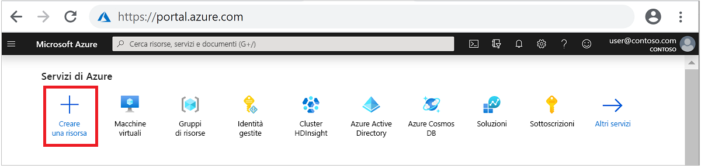
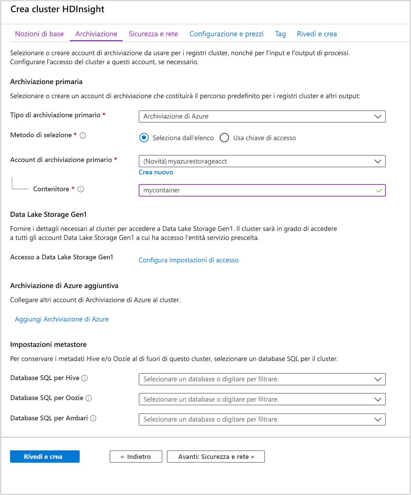
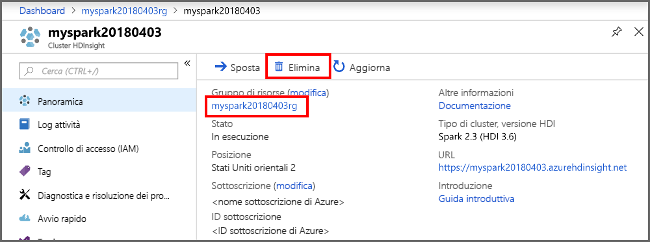

# <a name="quickstart-create-apache-spark-cluster-in-azure-hdinsight-using-azure-portal"></a>Guida introduttiva: Creare cluster Apache Spark in Azure HDInsight usando il portale di Azure

In questa guida di avvio rapido si usa il portale di Azure per creare un cluster Apache Spark in Azure HDInsight. Creare quindi un notebook Jupyter e usarlo per eseguire query Spark SQL su tabelle Apache Hive. Azure HDInsight è un servizio di analisi open source, gestito e ad ampio spettro per le aziende. Il framework Apache Spark per HDInsight consente di velocizzare cluster computing e analisi dei dati grazie all'elaborazione in memoria. Il notebook Jupyter consente di interagire con i dati, combinare codice e testo Markdown ed eseguire visualizzazioni semplici.

Per una spiegazione approfondita delle configurazioni disponibili, vedere [Configurare i cluster in HDInsight](../hdinsight-hadoop-provision-linux-clusters.md). Per altre informazioni sull'uso del portale per la creazione di cluster, vedere [Creare cluster nel portale](../hdinsight-hadoop-create-linux-clusters-portal.md).

Se si usano più cluster, sarà necessario creare una rete virtuale e, se si usa un cluster Spark, è anche consigliabile usare Hive Warehouse Connector. Per altre informazioni, vedere [Pianificare una rete virtuale per Azure HDInsight](../hdinsight-plan-virtual-network-deployment.md) e [Integrare Apache Spark e Apache Hive con Hive Warehouse Connector](../interactive-query/apache-hive-warehouse-connector.md).

> [!IMPORTANT]  
> La fatturazione dei cluster HDInsight viene calcolata al minuto, indipendentemente dal fatto che siano in uso o meno. Assicurarsi di eliminare il cluster dopo aver finito di usarlo. Per altre informazioni, vedere la sezione [Pulire le risorse](#clean-up-resources) di questo articolo.

## <a name="prerequisites"></a>Prerequisiti

Un account Azure con una sottoscrizione attiva. [Creare un account gratuitamente](https://azure.microsoft.com/free/?ref=microsoft.com&utm_source=microsoft.com&utm_medium=docs&utm_campaign=visualstudio).

## <a name="create-an-apache-spark-cluster-in-hdinsight"></a>Creare un cluster Apache Spark in HDInsight

Usare il portale di Azure per creare un cluster HDInsight che usa BLOB del servizio di archiviazione di Azure come risorsa di archiviazione del cluster. Per altre informazioni sull'uso di Data Lake Storage Gen2, vedi [Avvio rapido: Impostazione dei cluster in HDInsight](../../storage/data-lake-storage/quickstart-create-connect-hdi-cluster.md)

1. Accedere al [portale di Azure](https://portal.azure.com/).

1. Nel menu in alto selezionare **+ Crea una risorsa**.

    

1. Selezionare **Analytics** > **Azure HDInsight** per passare alla pagina **Crea cluster HDInsight**.

1. Nella scheda **Nozioni di base** specificare le informazioni seguenti:

    |Proprietà  |Descrizione  |
    |---------|---------|
    |Subscription  | Nell'elenco a discesa selezionare la sottoscrizione di Azure che viene usata per il cluster. |
    |Resource group | Nell'elenco a discesa selezionare il gruppo di risorse esistente oppure selezionare **Crea nuovo**.|
    |Nome cluster | Immettere un nome univoco globale.|
    |Region   | Nell'elenco a discesa selezionare un'area in cui viene creato il cluster. |
    |Tipo di cluster| Scegliere Selezionare il tipo di cluster per aprire un elenco. Nell'elenco selezionare **Spark**.|
    |Versione del cluster|Questo campo viene popolato automaticamente con la versione predefinita dopo che è stato selezionato il tipo di cluster.|
    |Nome utente dell'account di accesso del cluster| Immettere il nome utente dell'account di accesso del cluster.  Il nome predefinito è **admin**. Si userà questo account per accedere al notebook di Jupyter più avanti nella guida introduttiva. |
    |Password di accesso al cluster| Immettere la password di accesso del cluster. |
    |Nome utente Secure Shell (SSH)| Immettere il nome utente SSH. Il nome utente SSH usato per questa guida introduttiva è **sshuser**. Per impostazione predefinita, questo account condivide la stessa password dell'account *Nome utente dell'account di accesso del cluster*. |

    

    Selezionare **Avanti: Archiviazione >>** per passare alla pagina **Archiviazione**.

1. In **Archiviazione** specificare i valori seguenti:

    |Proprietà  |Descrizione  |
    |---------|---------|
    |Tipo di archiviazione primario|Usare il valore predefinito **Archiviazione di Azure**.|
    |Metodo di selezione|Usare il valore predefinito **Selezionare dall'elenco**.|
    |Account di archiviazione primario|Usare il valore inserito automaticamente.|
    |Contenitore|Usare il valore inserito automaticamente.|

    

    Selezionare **Rivedi e crea** per continuare.

1. In **Rivedi e crea** selezionare **Crea**. La creazione del cluster richiede circa 20 minuti. Prima di procedere con la sessione successiva, è necessario creare il cluster.

Se si verifica un problema durante la creazione di cluster HDInsight, è possibile che non si abbiano le autorizzazioni necessarie per eseguire questa operazione. Per altre informazioni, vedere [Requisiti di controllo di accesso](../hdinsight-hadoop-customize-cluster-linux.md#access-control).

## <a name="create-a-jupyter-notebook"></a>Creare un notebook Jupyter

Jupyter Notebook è un ambiente notebook interattivo che supporta diversi linguaggi di programmazione. Il notebook consente di interagire con i dati, combinare codice e testo Markdown ed eseguire visualizzazioni semplici.

1. In un Web browser passare a `https://CLUSTERNAME.azurehdinsight.net/jupyter` dove `CLUSTERNAME` è il nome del cluster. Se richiesto, immettere le credenziali di accesso del cluster.

1. Per creare un notebook selezionare **Nuovo** > **PySpark**.

   

   Un nuovo notebook verrà creato e aperto con il nome Untitled (Untitled.pynb).

## <a name="run-apache-spark-sql-statements"></a>Eseguire le istruzioni Apache Spark SQL

SQL (Structured Query Language) è il linguaggio più diffuso e più usato per l'esecuzione di query e la definizione dei dati. Spark SQL funziona come estensione di Apache Spark per l'elaborazione dei dati strutturati, usando la nota sintassi SQL.

1. Verificare che il kernel sia pronto. Il kernel è pronto quando accanto al relativo nome nel notebook viene visualizzato un cerchio vuoto. Un cerchio pieno indica che il kernel è occupato.

    

    Quando si avvia il notebook per la prima volta, il kernel esegue alcune attività in background. Attendere che il kernel sia pronto.

1. Incollare il codice seguente in una cella vuota e quindi premere **MAIUSC + INVIO** per eseguire il codice. Il comando elenca le tabelle Hive sul cluster:

    ```PySpark
    %%sql
    SHOW TABLES
    ```

    Quando si usa un notebook Jupyter con il cluster HDInsight, si ottiene un elemento `sqlContext` predefinito che può essere usato per eseguire query Hive con Spark SQL. `%%sql` indica a Jupyter Notebook di usare l'elemento `sqlContext` predefinito per eseguire la query Hive. La query recupera le prime 10 righe di una tabella Hive (**hivesampletable**) disponibile per impostazione predefinita in tutti i cluster HDInsight. Per ottenere i risultati sono necessari circa 30 secondi. L'output è simile al seguente:

    

    Ogni volta che si esegue una query in Jupyter, il titolo della finestra del Web browser visualizza lo stato **(Occupato)** accanto al titolo del notebook. È anche visibile un cerchio pieno accanto al testo **PySpark** nell'angolo in alto a destra.

1. Eseguire un'altra query per visualizzare i dati in `hivesampletable`.

    ```PySpark
    %%sql
    SELECT * FROM hivesampletable LIMIT 10
    ```

    La schermata si aggiornerà per visualizzare l'output della query.

    

1. Nel menu **File** del notebook fare clic su **Close and Halt** (Chiudi e interrompi). Quando il notebook viene arrestato, le risorse del cluster vengono rilasciate.

## <a name="clean-up-resources"></a>Pulire le risorse

HDInsight salva i dati in Archiviazione di Azure o in Azure Data Lake Storage in modo che sia possibile eliminare senza problemi un cluster quando non viene usato. Vengono addebitati i costi anche per i cluster HDInsight che non sono in uso. Poiché i costi per il cluster sono decisamente superiori a quelli per l'archiviazione, eliminare i cluster quando non vengono usati è una scelta economicamente conveniente. Se si prevede di svolgere subito l'esercitazione elencata nei [passaggi successivi](#next-steps), si può mantenere il cluster.

Tornare al portale di Azure e selezionare **Elimina**.



È anche possibile selezionare il nome del gruppo di risorse per aprire la pagina del gruppo di risorse e quindi selezionare **Elimina gruppo di risorse**. Eliminando il gruppo di risorse, si elimina sia il cluster HDInsight che l'account di archiviazione predefinito.

## <a name="next-steps"></a>Passaggi successivi

In questa guida di avvio rapido si è appreso come creare un cluster Apache Spark in HDInsight ed eseguire una query Spark SQL di base. Passare all'esercitazione successiva per imparare come usare un cluster HDInsight per eseguire query interattive su dati di esempio.

> [!div class="nextstepaction"]
> [Eseguire query interattive su Apache Spark](./apache-spark-load-data-run-query.md)
