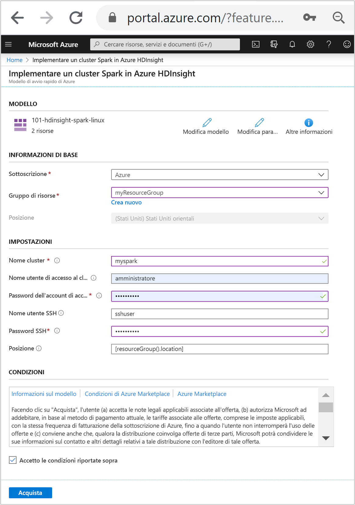

# <a name="quickstart-create-apache-spark-cluster-in-azure-hdinsight-using-resource-manager-template"></a>Guida di avvio rapido: Creare cluster Apache Spark in Azure HDInsight con un modello di Resource Manager

In questa guida di avvio rapido si usa un modello di Azure Resource Manager per creare un cluster [Apache Spark](./apache-spark-overview.md) in Azure HDInsight. Creare quindi un notebook Jupyter e usarlo per eseguire query Spark SQL su tabelle Apache Hive. Azure HDInsight è un servizio di analisi open source, gestito e ad ampio spettro per le aziende. Il framework Apache Spark per HDInsight consente di velocizzare cluster computing e analisi dei dati grazie all'elaborazione in memoria. Il notebook Jupyter consente di interagire con i dati, combinare codice e testo Markdown ed eseguire visualizzazioni semplici.

[!INCLUDE [About Azure Resource Manager](../../../includes/resource-manager-quickstart-introduction.md)]

Se non si ha una sottoscrizione di Azure, creare un [account gratuito](https://azure.microsoft.com/free/?WT.mc_id=A261C142F) prima di iniziare.

## <a name="create-an-apache-spark-cluster"></a>Creare un cluster Apache Spark

### <a name="review-the-template"></a>Rivedere il modello

Il modello usato in questo avvio rapido proviene dai [modelli di avvio rapido di Azure](https://github.com/Azure/azure-quickstart-templates/tree/master/101-hdinsight-spark-linux).

:::code language="json" source="~/quickstart-templates/101-hdinsight-spark-linux/azuredeploy.json" range="1-143":::

Nel modello sono definite due risorse di Azure:

* [Microsoft.Storage/storageAccounts](https://docs.microsoft.com/azure/templates/microsoft.storage/storageaccounts) per creare un account di archiviazione di Azure.
* [Microsoft.HDInsight/cluster](https://docs.microsoft.com/azure/templates/microsoft.hdinsight/clusters) per creare un cluster HDInsight.

### <a name="deploy-the-template"></a>Distribuire il modello

1. Selezionare il pulsante **Distribuisci in Azure** seguente per accedere ad Azure e aprire il modello di Resource Manager.

    [](https://portal.azure.com/#create/Microsoft.Template/uri/https%3A%2F%2Fraw.githubusercontent.com%2FAzure%2Fazure-quickstart-templates%2Fmaster%2F101-hdinsight-spark-linux%2Fazuredeploy.json)

1. Immettere o selezionare i valori seguenti:

    |Proprietà |Descrizione |
    |---|---|
    |Subscription|Nell'elenco a discesa selezionare la sottoscrizione di Azure che viene usata per il cluster.|
    |Resource group|Nell'elenco a discesa selezionare il gruppo di risorse esistente oppure selezionare **Crea nuovo**.|
    |Location|Come valore verrà inserita automaticamente la località usata per il gruppo di risorse.|
    |Cluster Name|Immettere un nome univoco globale. Per questo modello usare solo lettere minuscole e numeri.|
    |Nome utente dell'account di accesso del cluster|Specificare il nome utente. Il valore predefinito è **admin**.|
    |Password di accesso al cluster|Specificare una password. La password deve avere una lunghezza minima di 10 caratteri e contenere almeno una cifra, una lettera maiuscola, una lettera minuscola e un carattere non alfanumerico, ad eccezione di ' " `. |
    |Nome utente SSH|Specificare il nome utente. Il valore predefinito è **sshuser**.|
    |Password SSH|Specificare la password.|

    

1. Leggere quanto riportato in **CONDIZIONI**. Selezionare quindi **Accetto le condizioni riportate sopra** e infine **Acquista**. Si riceverà una notifica che informa che la distribuzione è in corso. La creazione di un cluster richiede circa 20 minuti.

Se si verifica un problema durante la creazione di cluster HDInsight, è possibile che non si abbiano le autorizzazioni necessarie per eseguire questa operazione. Per altre informazioni, vedere [Requisiti di controllo di accesso](../hdinsight-hadoop-customize-cluster-linux.md#access-control).

## <a name="review-deployed-resources"></a>Esaminare le risorse distribuite

Al termine della creazione del cluster, si riceverà una notifica con il messaggio **La distribuzione è riuscita** e un collegamento **Vai alla risorsa**. Nella pagina del gruppo di risorse saranno presenti il nuovo cluster HDInsight e l'archivio predefinito associato al cluster. Ogni cluster ha una dipendenza da un [account di archiviazione di Azure](../hdinsight-hadoop-use-blob-storage.md) o un [account Azure Data Lake Storage](../hdinsight-hadoop-use-data-lake-store.md). Viene indicato come account di archiviazione predefinito. Il cluster HDInsight e il relativo account di archiviazione predefinito devono avere un percorso condiviso nella stessa area di Azure. L'eliminazione dei cluster non comporta l'eliminazione dell'account di archiviazione.

## <a name="create-a-jupyter-notebook"></a>Creare un notebook Jupyter

[Jupyter Notebook](https://jupyter.org/) è un ambiente notebook interattivo che supporta diversi linguaggi di programmazione. Il notebook consente di interagire con i dati, combinare codice e testo Markdown ed eseguire visualizzazioni semplici.

1. Aprire il [portale di Azure](https://portal.azure.com).

2. Selezionare **cluster HDInsight** e quindi selezionare il cluster creato.

    

3. Nella sezione **Dashboard cluster** del portale selezionare **Jupyter Notebook**. Se richiesto, immettere le credenziali di accesso del cluster.

   

4. Per creare un notebook selezionare **Nuovo** > **PySpark**.

   

   Un nuovo notebook verrà creato e aperto con il nome Untitled (Untitled.pynb).

## <a name="run-apache-spark-sql-statements"></a>Eseguire le istruzioni Apache Spark SQL

SQL (Structured Query Language) è il linguaggio più diffuso e più usato per l'esecuzione di query e la trasformazione dei dati. Spark SQL funziona come estensione di Apache Spark per l'elaborazione dei dati strutturati, usando la nota sintassi SQL.

1. Verificare che il kernel sia pronto. Il kernel è pronto quando accanto al relativo nome nel notebook viene visualizzato un cerchio vuoto. Un cerchio pieno indica che il kernel è occupato.

    

    Quando si avvia il notebook per la prima volta, il kernel esegue alcune attività in background. Attendere che il kernel sia pronto.

1. Incollare il codice seguente in una cella vuota e quindi premere **MAIUSC + INVIO** per eseguire il codice. Il comando elenca le tabelle Hive sul cluster:

    ```sql
    %%sql
    SHOW TABLES
    ```

    Quando si usa un notebook Jupyter con il cluster HDInsight, si ottiene una sessione `spark` predefinita che può essere usata per eseguire query Hive con Spark SQL. `%%sql` indica a Jupyter Notebook di usare la sessione `spark` predefinita per eseguire la query Hive. La query recupera le prime 10 righe di una tabella Hive (**hivesampletable**) disponibile per impostazione predefinita in tutti i cluster HDInsight. La prima volta che si invia che la query, Jupyter creerà un'applicazione Spark per il notebook. Questa operazione viene completata in 30 secondi circa. Quando l'applicazione Spark è pronta, la query viene eseguita in un secondo e genera i risultati. L'output è simile al seguente:

    

    Ogni volta che si esegue una query in Jupyter, il titolo della finestra del Web browser visualizza lo stato **(Occupato)** accanto al titolo del notebook. È anche visibile un cerchio pieno accanto al testo **PySpark** nell'angolo in alto a destra.

1. Eseguire un'altra query per visualizzare i dati in `hivesampletable`.

    ```sql
    %%sql
    SELECT * FROM hivesampletable LIMIT 10
    ```

    La schermata si aggiornerà per visualizzare l'output della query.

    

1. Nel menu **File** del notebook fare clic su **Close and Halt** (Chiudi e interrompi). Quando il notebook viene arrestato, le risorse del cluster vengono rilasciate, inclusa l'applicazione Spark.

## <a name="clean-up-resources"></a>Pulire le risorse

Al termine dell'argomento di avvio rapido, può essere opportuno eliminare il cluster. Con HDInsight, i dati vengono archiviati in Archiviazione di Azure ed è possibile eliminare tranquillamente un cluster quando non è in uso. Vengono addebitati i costi anche per i cluster HDInsight che non sono in uso. Poiché i costi per il cluster sono decisamente superiori a quelli per l'archiviazione, eliminare i cluster quando non vengono usati è una scelta economicamente conveniente.

Nel portale di Azure passare al cluster e selezionare **Elimina**.


È anche possibile selezionare il nome del gruppo di risorse per aprire la pagina del gruppo di risorse e quindi selezionare **Elimina gruppo di risorse**. Eliminando il gruppo di risorse, si elimina sia il cluster HDInsight che l'account di archiviazione predefinito.

## <a name="next-steps"></a>Passaggi successivi

In questa guida di avvio rapido si è appreso come creare un cluster Apache Spark in HDInsight ed eseguire una query Spark SQL di base. Passare all'esercitazione successiva per imparare come usare un cluster HDInsight per eseguire query interattive su dati di esempio.

> [!div class="nextstepaction"]
> [Eseguire query interattive su Apache Spark](./apache-spark-load-data-run-query.md)
