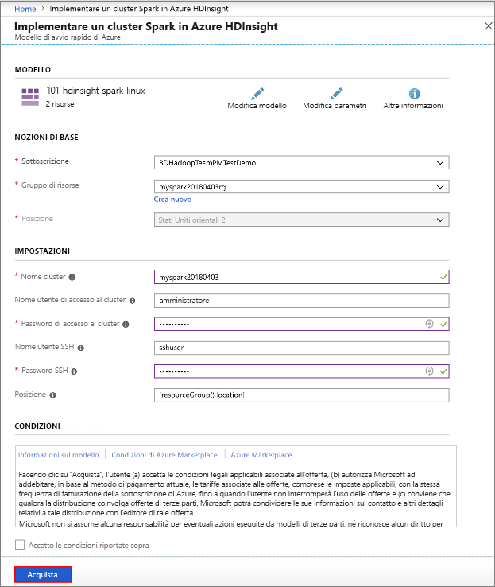
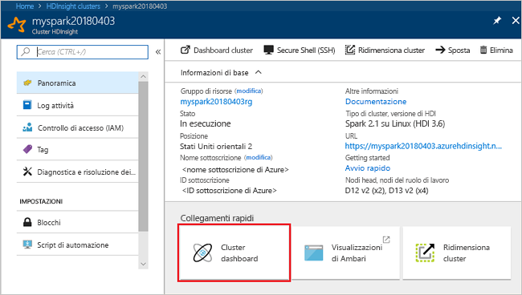

# <a name="create-an-apache-spark-cluster-in-azure-hdinsight"></a>Creare un cluster Apache Spark in Azure HDInsight

Informazioni su come creare un cluster Apache Spark in Azure HDInsight ed eseguire query Spark SQL sulle tabelle Hive. Per informazioni su Spark in HDInsight, vedere [Panoramica: Apache Spark in Azure HDInsight](apache-spark-overview.md).

## <a name="prerequisites"></a>prerequisiti

* **Una sottoscrizione di Azure**. Prima di iniziare questa esercitazione, è necessario disporre di un abbonamento ad Azure. Vedere [Crea subito il tuo account Azure gratuito](https://azure.microsoft.com/free).

## <a name="create-hdinsight-spark-cluster"></a>Creare un cluster HDInsight Spark

Creare un cluster HDInsight Spark usando un [modello di Azure Resource Manager](../hdinsight-hadoop-create-linux-clusters-arm-templates.md). Il modello è disponibile in [GitHub](https://azure.microsoft.com/resources/templates/101-hdinsight-spark-linux/). Per altri metodi di creazione dei cluster, vedere [Creare cluster HDInsight](../hdinsight-hadoop-provision-linux-clusters.md).

1. Fare clic sull'immagine seguente per aprire il modello nel portale di Azure.         

    <a href="https://portal.azure.com/#create/Microsoft.Template/uri/https%3A%2F%2Fraw.githubusercontent.com%2FAzure%2Fazure-quickstart-templates%2Fmaster%2F101-hdinsight-spark-linux%2Fazuredeploy.json" target="_blank"></a>

2. Immettere i valori seguenti:

    

    * **Sottoscrizione**: selezionare la sottoscrizione di Azure usata per creare il cluster.
    * **Gruppo di risorse**: creare un gruppo di risorse o selezionarne uno esistente. Il gruppo di risorse viene usato per gestire le risorse di Azure per i progetti.
    * **Posizione**: selezionare una posizione per il gruppo di risorse. Il modello usa questa posizione per la creazione del cluster e per l'archiviazione del cluster predefinita.
    * **Nome cluster**: immettere un nome per il cluster HDInsight che si vuole creare.
    * **Nome utente e password di accesso del cluster**: il nome dell'account di accesso predefinito è admin. Scegliere una password per l'accesso al cluster.
    * **Nome utente e password SSH**. Scegliere una password per l'utente SSH.

3. Selezionare **Accetto le condizioni riportate sopra**, selezionare **Aggiungi al dashboard** e quindi fare clic su **Acquista**. Verrà visualizzato un nuovo riquadro denominato **Distribuzione dell'entità Distribuzione modello in corso**. La creazione del cluster richiede circa 20 minuti.

Se si verifica un problema con la creazione di cluster HDInsight, è possibile che non si abbiano le autorizzazioni necessarie per questa operazione. Per altre informazioni, vedere [Requisiti di controllo di accesso](../hdinsight-administer-use-portal-linux.md#create-clusters).

> [!NOTE]
> Questo articolo crea un cluster Spark che usa [BLOB del servizio di archiviazione di Azure come risorsa di archiviazione del cluster](../hdinsight-hadoop-use-blob-storage.md). È anche possibile creare un cluster Spark che usa [Azure Data Lake Store](../hdinsight-hadoop-use-data-lake-store.md) come risorsa di archiviazione predefinita. Per istruzioni, vedere [Creare un cluster HDInsight con Archivio Data Lake](../../data-lake-store/data-lake-store-hdinsight-hadoop-use-portal.md).
>
>

## <a name="create-a-jupyter-notebook"></a>Creare un notebook Jupyter

[Jupyter Notebook](http://jupyter.org) è un ambiente notebook interattivo che supporta diversi linguaggi di programmazione che consentono di interagire con i dati, combinare il codice con il testo di markdown ed eseguire visualizzazioni semplici. Spark in HDInsight include anche [Zeppelin Notebook](apache-spark-zeppelin-notebook.md). Per questa esercitazione viene usato Jupyter Notebook.

**Per creare un oggetto Jupyter Notebook**

1. Aprire il [portale di Azure](https://portal.azure.com/).

2. Aprire il cluster Spark creato. Per istruzioni, vedere [Elencare e visualizzare i cluster](../hdinsight-administer-use-portal-linux.md#list-and-show-clusters).

3. Nel portale fare clic su **Dashboard cluster** e quindi su **Notebook di Jupyter**. Se richiesto, immettere le credenziali per il cluster.

   

   > [!NOTE]
   > È anche possibile accedere a Jupyter Notebook per il cluster aprendo l'URL seguente nel browser. Sostituire **CLUSTERNAME** con il nome del cluster:
   >
   > `https://CLUSTERNAME.azurehdinsight.net/jupyter`
   >
   >
3. Fare clic su **Nuovo** e quindi su **PySpark** per creare un notebook. Gli oggetti Jupyter Notebook nei cluster HDInsight supportano tre kernel: **PySpark**, **PySpark3** e **Spark**. In questa esercitazione viene usato il kernel **PySpark**. Per altre informazioni sui kernel e i vantaggi offerti dall'uso di **PySpark**, vedere [Usare i kernel per Jupyter Notebook con cluster Apache Spark in HDInsight](apache-spark-jupyter-notebook-kernels.md).

   

   Un nuovo notebook verrà creato e aperto con il nome Untitled (Untitled.pynb).

4. Fare clic sul nome del notebook nella parte superiore e, se si vuole, immettere un nome descrittivo.

    

## <a name="run-spark-sql-statements-on-a-hive-table"></a>Eseguire istruzioni Spark SQL su una tabella Hive

SQL (Structured Query Language) è il linguaggio più diffuso e più usato per l'esecuzione di query e la definizione dei dati. Spark SQL funziona come estensione di Apache Spark per l'elaborazione dei dati strutturati, usando la nota sintassi SQL.

Spark SQL supporta sia SQL che HiveQL come linguaggi di query. Le sue funzionalità includono il binding in Python, Scala e Java. Con esso è possibile eseguire query su dati archiviati in numerose posizioni, come database esterni, file di dati strutturati (ad esempio JSON) e tabelle Hive.

Per un esempio di lettura dei dati da un file CSV invece che da una tabella Hive, vedere [Eseguire query interattive in un cluster HDInsight Spark](apache-spark-load-data-run-query.md).

**Per eseguire Spark SQL**

1. Quando si avvia il notebook per la prima volta, il kernel esegue alcune attività in background. Attendere che il kernel sia pronto. Il kernel è pronto quando accanto al relativo nome nel notebook viene visualizzato un cerchio vuoto. Un cerchio pieno indica che il kernel è occupato.

    

2. Quando il kernel è pronto, incollare il codice seguente in una cella vuota e quindi premere **MAIUSC+INVIO** per eseguire il codice. Il comando elenca le tabelle Hive sul cluster:

    ```PySpark
    %%sql
    SHOW TABLES
    ```
    Quando si usa un oggetto Jupyter Notebook con il cluster HDInsight Spark, si ottiene un elemento `sqlContext` predefinito che può essere usato per eseguire query Hive con Spark SQL. `%%sql` indica a Jupyter Notebook di usare l'elemento `sqlContext` predefinito per eseguire la query Hive. La query recupera le prime 10 righe di una tabella Hive (**hivesampletable**) disponibile per impostazione predefinita in tutti i cluster HDInsight. Per ottenere i risultati sono necessari circa 30 secondi. L'output è simile al seguente: 

    

    Per altre informazioni sul magic `%%sql` e sui contesti predefiniti, vedere i [kernel Jupyter disponibili per un cluster HDInsight](apache-spark-jupyter-notebook-kernels.md).

    Ogni volta che si esegue una query in Jupyter, il titolo della finestra del Web browser visualizza lo stato **(Occupato)** accanto al titolo del notebook. È anche visibile un cerchio pieno accanto al testo **PySpark** nell'angolo in alto a destra.
    
2. Eseguire un'altra query per visualizzare i dati in `hivesampletable`.

    ```PySpark
    %%sql
    SELECT * FROM hivesampletable LIMIT 10
    ```
    
    La schermata si aggiornerà per visualizzare l'output della query.

    

2. Dal menu **File** del notebook fare clic su **Close and Halt** (Chiudi e interrompi). Quando il notebook viene arrestato, le risorse del cluster vengono rilasciate.

3. Se si intende completare i passaggi successivi in un secondo momento, assicurarsi di eliminare il cluster HDInsight creato in questo articolo. 

[!INCLUDE [delete-cluster-warning](../../../includes/hdinsight-delete-cluster-warning.md)]

## <a name="next-steps"></a>Passaggi successivi 

In questo articolo si è appreso come creare un cluster HDInsight Spark ed eseguire una query Spark SQL di base. Passare all'articolo successivo per informazioni su come usare un cluster HDInsight Spark per eseguire query interattive su dati di esempio.

> [!div class="nextstepaction"]
>[Eseguire query interattive in un cluster di Azure HDInsight Spark](apache-spark-load-data-run-query.md)


