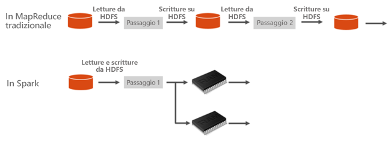
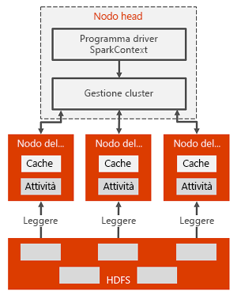

# Informazioni su Apache Spark in Azure HDInsight

Apache Spark è un framework di elaborazione parallela che supporta l'elaborazione in memoria per migliorare le prestazioni di applicazioni analitiche di Big Data. Apache Spark in Azure HDInsight è l'implementazione Microsoft di Apache Spark nel cloud. HDInsight rende più semplice creare e configurare un cluster Spark in Azure. I cluster Spark in HDInsight sono compatibili con Archiviazione di Azure e con Azure Data Lake Storage. Pertanto, è possibile usare i cluster Spark HDInsight per elaborare i dati archiviati in Azure. Per i componenti e per le informazioni sulle versioni, vedere [Componenti e versioni Apache Hadoop in Azure HDInsight](../hdinsight-component-versioning.md).

## Che cos'è Apache Spark?

Spark fornisce le primitive per il cluster computing in memoria. Un processo Spark può caricare i dati e memorizzarli nella cache in memoria ed eseguire query su di essi ripetutamente. L'elaborazione in memoria è molto più veloce rispetto alle applicazioni basate su disco, ad esempio Hadoop, che condivide dati tramite HDFS (Hadoop Distributed File System). Spark si integra anche nel linguaggio di programmazione Scala per consentire di modificare set di dati distribuiti come raccolte locali. Non è necessario strutturare tutti gli elementi come operazioni di mapping e riduzione.

I cluster Spark in HDInsight offrono un servizio Spark completamente gestito. I vantaggi della creazione di un cluster Spark in HDInsight sono elencati qui.

| Funzionalità | Descrizione |
| --- | --- |
| Facilità di creazione |È possibile creare un nuovo cluster Spark in HDInsight in pochi minuti usando il portale di Azure, Azure PowerShell o HDInsight .NET SDK. Vedere [Introduzione ai cluster Apache Spark in HDInsight](apache-spark-jupyter-spark-sql-use-portal.md). |
| Semplicità d'uso |Il cluster Spark in HDInsight include notebook di Jupyter e Apache Zeppelin. È possibile usare questi notebook per la visualizzazione e l'elaborazione interattiva di dati. Vedere [Usare i notebook di Apache Zeppelin con Apache Spark](apache-spark-zeppelin-notebook.md) e [Caricare i dati ed eseguire query in un cluster Apache Spark](apache-spark-load-data-run-query.md).|
| API REST |I cluster Spark in HDInsight includono [Apache Livy](https://github.com/cloudera/hue/tree/master/apps/spark/java#welcome-to-livy-the-rest-spark-server), un server dei processi Spark basato sull'API REST per l'invi e il monitoraggio remoto dei processi. Vedere [Usare l'API REST di Apache Spark per inviare i processi remoti a un cluster HDInsight Spark](apache-spark-livy-rest-interface.md).|
| Supporto per Azure Data Lake Storage | I cluster Spark in HDInsight possono usare Azure Data Lake Storage come risorsa di archiviazione primaria o come spazio di archiviazione aggiuntivo. Per altre informazioni su Data Lake Storage, vedere [Panoramica di Azure Data Lake Storage](../../data-lake-store/data-lake-store-overview.md). |
| Integrazione con servizi di Azure |Il cluster Spark in HDInsight viene fornito con un connettore per Hub eventi di Azure. È possibile compilare applicazioni di streaming tramite Hub eventi. È incluso Apache Kafka, che è già disponibile come parte di Spark. |
| Supporto per ML Server | Il supporto per ML Server in HDInsight viene garantito con il tipo di cluster **ML Services**. È possibile impostare un cluster ML Services per eseguire calcoli R distribuiti con la velocità garantita da un cluster Spark. Per altre informazioni, vedere [Informazioni su ML Services in Azure HDInsight](../r-server/r-server-overview.md). |
| Integrazione con IDE di terze parti | HDInsight fornisce numerosi plugin IDE utili per creare e inviare applicazioni a un cluster HDInsight Spark. Per altre informazioni, vedere [Usare Azure Toolkit for IntelliJ IDEA](apache-spark-intellij-tool-plugin.md), [Usare Spark & Hive Tools per VS Code](../hdinsight-for-vscode.md) e [Usare Azure Toolkit for Eclipse](apache-spark-eclipse-tool-plugin.md).|
| Query simultanee |I cluster Spark in HDInsight supportano le query simultanee. Questa funzionalità consente a più query da un utente o da vari utenti e applicazioni di condividere le stesse risorse di cluster. |
| La memorizzazione nella cache nelle unità SSD |È possibile scegliere di memorizzare i dati in memoria o nelle SSD associate ai nodi del cluster. La memorizzazione nella cache in memoria offre le migliori prestazioni di query, ma può essere dispendiosa. La memorizzazione nella cache in unità SSD fornisce un'ottima opzione per migliorare le prestazioni delle query senza la necessità di creare un cluster con le dimensioni necessarie a contenere l'intero set di dati in memoria. Vedere [Migliorare le prestazioni dei carichi di lavoro di Apache Spark usando Cache IO Azure HDInsight](apache-spark-improve-performance-iocache.md). |
| Integrazione con strumenti di Business Intelligence |I cluster Spark in HDInsight offrono connettori per strumenti di Business Intelligence, come Power BI per l'analisi dei dati. |
| Librerie Anaconda precaricate |I cluster Spark in HDInsight sono dotati di librerie Anaconda preinstallate. [Anaconda](https://docs.continuum.io/anaconda/) offre quasi 200 librerie per il Machine Learning, l'analisi dei dati, la visualizzazione e così via. |
| Adattabilità | HDInsight consente di modificare il numero di nodi del cluster in modo dinamico con la funzionalità di scalabilità automatica. Vedere [Ridimensionare automaticamente i cluster Azure HDInsight](../hdinsight-autoscale-clusters.md). È anche possibile eliminare i cluster Spark senza alcuna perdita di dati perché tutti i dati sono archiviati in Archiviazione di Azure o Data Lake Storage. |
| Contratto di servizio |I cluster Spark in HDInsight includono il supporto continuo 24 ore su 24, 7 giorni su 7 e un Contratto di servizio che garantisce tempi di attività pari al 99,9%. |

I cluster Apache Spark in HDInsight includono i componenti seguenti che sono disponibili nei cluster per impostazione predefinita.

* [Spark Core](https://spark.apache.org/docs/latest/). Viene fornito con Spark Core, Spark SQL, streaming API Spark, GraphX e MLlib Spark.
* [Anaconda](https://docs.continuum.io/anaconda/)
* [Apache Livy](https://github.com/cloudera/hue/tree/master/apps/spark/java#welcome-to-livy-the-rest-spark-server)
* [Jupyter Notebook](https://jupyter.org)
* [Notebook di Apache Zeppelin](http://zeppelin-project.org/)

HDInsight Spark include un [driver ODBC](https://go.microsoft.com/fwlink/?LinkId=616229) per la connettività di strumenti di business intelligence come Microsoft Power BI.

## Architettura del cluster Spark

È facile comprendere i componenti di Spark se si comprende come Spark viene eseguito nei cluster HDInsight.

Le applicazioni Spark vengono eseguite come set indipendenti di processi in un cluster, coordinati dall'oggetto SparkContext nel programma principale (denominato programma driver).

SparkContext può connettersi a diversi tipi di gestori di cluster, che forniscono risorse alle applicazioni. Questi gestori di cluster includono Apache Mesos, [Apache Hadoop YARN](https://hadoop.apache.org/docs/current/hadoop-yarn/hadoop-yarn-site/YARN.html) o Spark Cluster Manager. Spark in HDInsight viene eseguito usando lo strumento di gestione cluster YARN. Una volta connesso, Spark acquisisce gli executor nei nodi di lavoro nel cluster, che sono i processi che eseguono calcoli e archiviano i dati per l'applicazione. Successivamente, invia il codice dell'applicazione (definito dai file JAR o Python passati a SparkContext) agli executor. Infine, SparkContext invia le attività agli executor per l'esecuzione.

SparkContext esegue la funzione principale dell'utente e le diverse operazioni parallele nei nodi di lavoro. In seguito, SparkContext raccoglie i risultati delle operazioni. I nodi di lavoro leggono e scrivono i dati da e in Hadoop Distributed File System. I nodi di lavoro memorizzano nella cache i dati trasformati in memoria come oggetti RDD (Resilient Distributed Dataset).

SparkContext si connette al master Spark ed è responsabile della conversione di un'applicazione in un grafo aciclico diretto (DAG) di singole attività. Le attività vengono eseguite all'interno di un processo executor nei nodi di lavoro. Ogni applicazione ottiene i propri processi executor, che rimangono attivi per la durata dell'intera applicazione ed eseguono attività in più thread.

## Casi d'uso di Spark in HDInsight

I cluster Spark in HDInsight consentono gli scenari principali seguenti:

### Analisi dei dati interattivi e Business Intelligence

Apache Spark in HDInsight archivia i dati nell'Archiviazione di Azure o in Azure Data Lake Storage. Gli esperti aziendali e i decision maker possono analizzare e creare report su tali dati, oltra a usare Microsoft Power BI per creare report interattivi dai dati analizzati. Gli analisti possono iniziare a usare dati non strutturati/parzialmente strutturati in una risorsa di archiviazione cluster, definire uno schema per i dati usando notebook e quindi creare modelli di dati usando Microsoft Power BI. I cluster Spark in HDInsight supportano anche diversi strumenti di business intelligence di terze parti, ad esempio Tableau, che semplificano le attività di analisti dei dati, esperti aziendali e decision maker.

* [Esercitazione: Visualizzare i dati di Spark usando Power BI](apache-spark-use-bi-tools.md)

### Machine Learning in Spark

Apache Spark include [MLlib](https://spark.apache.org/mllib/), una libreria di Machine Learning basata su Spark che è possibile usare da un cluster Spark in HDInsight. Il cluster Spark in HDInsight include inoltre Anaconda, una distribuzione di Python con diversi tipi di pacchetti per Machine Learning. Aggiungendo il supporto incorporato per notebook Jupyter e Zeppelin si otterrà un ambiente per la creazione di applicazioni di Machine Learning.

* [Esercitazione: Prevedere la temperatura dell'edificio con dati HVAC](apache-spark-ipython-notebook-machine-learning.md)  
* [Esercitazione: Prevedere i risultati di un controllo alimentare](apache-spark-machine-learning-mllib-ipython.md)

### Analisi dei dati in tempo reale e streaming in Spark

I cluster Spark in HDInsight offrono un supporto completo per la creazione di soluzioni di analisi in tempo reale. Spark include già i connettori per l'inserimento di dati da molte origini, come Kafka, Flume, Twitter, ZeroMQ o socket TCP. Spark in HDInsight aggiunge il supporto di qualità superiore per l'inserimento di dati da Hub eventi di Azure. Hub eventi è il servizio di accodamento più usato in Azure. La disponibilità del supporto completo per Hub eventi rende i cluster Spark in HDInsight la piattaforma ideale per la compilazione della pipeline di analisi in tempo reale.

* [Panoramica di Apache Spark Streaming](apache-spark-streaming-overview.md)
* [Panoramica di Apache Spark Structured Streaming](apache-spark-structured-streaming-overview.md)

## Dove iniziare?

Per altre informazioni su Apache Spark in HDInsight, è possibile usare gli articoli seguenti:

* [Avvio rapido: Creare un cluster di Apache Spark in HDInsight ed eseguire query interattive usando Jupyter](./apache-spark-jupyter-spark-sql-use-portal.md)
* [Esercitazione: Eseguire un processo Apache Spark usando Jupyter](./apache-spark-load-data-run-query.md)
* [Esercitazione: Analizzare i dati usando gli strumenti di business intelligence](./apache-spark-use-bi-tools.md)
* [Esercitazione: Machine Learning con Apache Spark](./apache-spark-ipython-notebook-machine-learning.md)
* [Esercitazione: Creare un'applicazione di Scala Maven usando IntelliJ](./apache-spark-create-standalone-application.md)

## Passaggi successivi

In questa panoramica si ottiene una conoscenza di base di Apache Spark in Azure HDInsight. Informazioni su come creare un cluster Spark in HDInsight ed eseguire alcune query SQL Spark:

* [Creare un cluster Apache Spark in HDInsight](./apache-spark-jupyter-spark-sql-use-portal.md)
