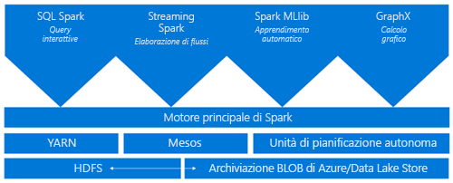
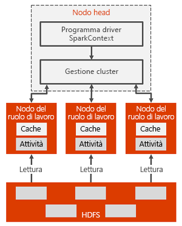

# Introduzione a Spark in HDInsight

Questo articolo fornisce un'introduzione a Spark in HDInsight. <a href="http://spark.apache.org/" target="_blank">Apache Spark</a> è un framework open source di elaborazione parallela che supporta l'elaborazione in memoria per migliorare le prestazioni di applicazioni analitiche di Big Data. Un cluster Spark in HDInsight è compatibile sia con Archiviazione di Azure (WASB) che con Azure Data Lake Store. I dati esistenti archiviati in Azure possono quindi essere facilmente elaborati tramite un cluster Spark.

[!INCLUDE [hdinsight-price-change](../../../includes/hdinsight-enhancements.md)]

Quando si crea un cluster Spark in HDInsight, si creano risorse di calcolo di Azure con Spark installato e configurato. Per creare un cluster Spark in HDInsight sono sufficienti circa 10 minuti. I dati da elaborare vengono archiviati in Archiviazione di Azure o Azure Data Lake Store. Vedere [Usare l'Archiviazione di Azure con HDInsight](../hdinsight-hadoop-use-blob-storage.md).

## Confronto tra Spark e il framework MapReduce tradizionale

Che cosa rende Spark veloce? In che modo l'architettura di Apache Spark è diversa dal framework MapReduce tradizionale e riesce a offrire prestazioni migliori per la condivisione dei dati?

Spark fornisce le primitive per il cluster computing in memoria. Un processo Spark può caricare i dati e memorizzarli nella cache in memoria, oltre che eseguire query su di essi ripetutamente, in modo molto più rapido rispetto ai sistemi basati su disco. Spark si integra anche nel linguaggio di programmazione Scala per consentire di modificare set di dati distribuiti come raccolte locali. Non è necessario strutturare tutti gli elementi come operazioni di mapping e riduzione.

In Spark la condivisione dei dati tra le operazioni risulta più veloce perché i dati sono in memoria. Hadoop condivide invece i dati tramite HDFS, che richiede tempi di elaborazione più lunghi.

## Informazioni su Apache Spark in Azure HDInsight
I cluster Spark in HDInsight offrono un servizio Spark completamente gestito. I vantaggi della creazione di un cluster Spark in HDInsight sono elencati qui.

| Funzionalità | DESCRIZIONE |
| --- | --- |
| Facilità di creazione dei cluster Spark |È possibile creare un nuovo cluster Spark in HDInsight in pochi minuti usando il portale di Azure, Azure PowerShell o HDInsight .NET SDK. Vedere [Introduzione ai cluster Spark in HDInsight](apache-spark-jupyter-spark-sql.md) |
| Semplicità d'uso |Il cluster Spark in HDInsight include notebook di Jupyter e Zeppelin. È possibile usare questi notebook per la visualizzazione e l'elaborazione interattiva di dati.|
| API REST |I cluster Spark in HDInsight includono [Livy](https://github.com/cloudera/hue/tree/master/apps/spark/java#welcome-to-livy-the-rest-spark-server), un server dei processi Spark basato sull'API REST per l'invi e il monitoraggio remoto dei processi. |
| Supporto per Archivio Azure Data Lake | È possibile configurare un cluster Spark in HDInsight per l'uso di Azure Data Lake Store come spazio di archiviazione aggiuntivo o come risorsa di archiviazione primaria (solo con cluster HDInsight 3.5). Per altre informazioni su Archivio Data Lake, vedere [Panoramica di Archivio Azure Data Lake](../../data-lake-store/data-lake-store-overview.md). |
| Integrazione con servizi di Azure |Il cluster Spark in HDInsight viene fornito con un connettore per Hub eventi di Azure. Gli utenti possono creare applicazioni di streaming mediante Hub eventi, oltre a [Kafka](http://kafka.apache.org/)che è già disponibile come parte di Spark. |
| Supporto per R Server | È possibile impostare R Server in un cluster HDInsight Spark per eseguire calcoli R distribuiti con la velocità garantita da un cluster Spark. Per altre informazioni, vedere [Introduzione all'uso di R Server in HDInsight](../r-server/r-server-get-started.md). |
| Integrazione con IDE di terze parti | HDInsight fornisce i plug-in per gli IDE, ad esempio IntelliJ IDEA ed Eclipse, che possono essere usati per creare e inviare applicazioni in un cluster Spark in HDInsight. Per altre informazioni, vedere [Usare Azure Toolkit for IntelliJ IDEA](apache-spark-intellij-tool-plugin.md) e [Usare Azure Toolkit for Eclipse](apache-spark-eclipse-tool-plugin.md).|
| Query simultanee |I cluster Spark in HDInsight supportano le query simultanee. In questo modo più query da un utente o più query da vari utenti e applicazioni possono condividere le stesse risorse di cluster. |
| La memorizzazione nella cache nelle unità SSD |È possibile scegliere di memorizzare i dati in memoria o nelle SSD associate ai nodi del cluster. La memorizzazione nella cache in memoria offre le migliori prestazioni di query ma può essere costosa; la memorizzazione nella cache in SSDs fornisce un'ottima opzione per migliorare le prestazioni delle query senza la necessità di creare un cluster di dimensioni necessario ad adattare l'intero set di dati in memoria. |
| Integrazione con strumenti di Business Intelligence |I cluster Spark in HDInsight offrono connettori per strumenti di Business Intelligence, come [Power BI](http://www.powerbi.com/) e [Tableau](http://www.tableau.com/products/desktop), per l'analisi dei dati. |
| Librerie Anaconda precaricate |I cluster Spark in HDInsight sono dotati di librerie Anaconda preinstallate [Anaconda](http://docs.continuum.io/anaconda/) offre quasi 200 librerie per Machine Learning, l'analisi dei dati, la visualizzazione e così via. |
| Scalabilità |Anche se è possibile specificare il numero di nodi del cluster durante la fase di creazione, in seguito può essere necessario aumentare o ridurre il cluster sulla base del carico di lavoro. Tutti i cluster HDInsight consentono di modificare il numero di nodi del cluster. È anche possibile eliminare i cluster Spark senza alcuna perdita di dati perché tutti i dati sono archiviati in Archiviazione di Azure o Data Lake Store. |
| Supporto 24/7 |I cluster Spark in HDInsight includono il supporto continuo a livello aziendale e un Contratto di servizio che garantisce tempi di attività pari al 99,9%. |

## Architettura del cluster Spark

Ecco l'architettura di un cluster Spark e il relativo funzionamento:

Il nodo head include il master Spark che gestisce il numero di applicazioni. Le app sono mappate al driver Spark. Ogni app è gestita dal master Spark in vari modi. È possibile distribuire Spark su Mesos, YARN o lo strumento di gestione cluster Spark, che alloca le risorse dei nodi di lavoro a un'applicazione. Spark in HDInsight viene eseguito usando lo strumento di gestione cluster YARN. Le risorse del cluster vengono gestite dal master Spark in HDInsight. Ciò significa che il master Spark sa quali risorse, ad esempio la memoria, sono occupate o disponibili sul nodo di lavoro.

Il driver esegue la funzione principale dell'utente e le diverse operazioni parallele nei nodi di lavoro. In seguito, il driver raccoglie i risultati delle operazioni. I nodi di lavoro leggono e scrivono i dati da e in Hadoop Distributed File System (HDFS). I nodi di lavoro memorizzano nella cache i dati trasformati in memoria come oggetti RDD (Resilient Distributed Dataset).

Una volta creata l'app nel master Spark, le risorse vengono allocate alle app dal master Spark, creando un'esecuzione chiamata driver Spark. Il driver Spark crea anche l'oggetto SparkContext e inizia a creare gli oggetti RDD. I metadati degli oggetti RDD vengono archiviati nel driver Spark.

Il driver Spark si connette al master Spark ed è responsabile della conversione di un'applicazione in un grafo orientato (DAG) di singole attività che vengono eseguite all'interno di un processo executor nei nodi di lavoro. Ogni applicazione ottiene i propri processi executor, che rimangono attivi per la durata dell'intera applicazione ed eseguono attività in più thread.

## Quali sono i casi d'uso per Spark in HDInsight?
I cluster Spark in HDInsight consentono gli scenari principali seguenti:

### Analisi dei dati interattivi e Business Intelligence
[Esaminare un'esercitazione](apache-spark-use-bi-tools.md)

Apache Spark in HDInsight archivia i dati nell'Archiviazione di Azure o in Azure Data Lake Store. Gli esperti aziendali e i responsabili decisionali possono analizzare e generare rapporti su dati e usare Microsoft Power BI per creare rapporti dai dati analizzati. Gli analisti possono iniziare a usare dati non strutturati/parzialmente strutturati in una risorsa di archiviazione cluster, definire uno schema per i dati usando notebook e quindi creare modelli di dati usando Microsoft Power BI. I cluster Spark in HDInsight supportano anche alcuni strumenti di BI di terze parti, come Tableau, e sono quindi una piattaforma ideale per gli analisti di dati, gli esperti aziendali e i decision maker strategici.

### Machine Learning in Spark
[Vedere l'esercitazione: Prevedere la temperatura dell'edificio con dati HVAC](apache-spark-ipython-notebook-machine-learning.md)

[Esaminare un'esercitazione: stima dei risultati di ispezione del cibo](apache-spark-machine-learning-mllib-ipython.md)

Apache Spark include [MLlib](http://spark.apache.org/mllib/), una libreria di Machine Learning basata su Spark, che è possibile usare da un cluster Spark in HDInsight. Il cluster Spark in HDInsight include inoltre Anaconda, una distribuzione di Python con un'ampia gamma di pacchetti per l'apprendimento automatico. Aggiungendo il supporto incorporato per notebook Jupyter e Zeppelin si otterrà un ambiente di qualità elevata per la creazione di applicazioni di Machine Learning.

### Analisi dei dati in tempo reale e streaming in Spark

I cluster Spark in HDInsight offrono un supporto completo per la creazione di soluzioni di analisi in tempo reale. Mentre Spark ha già connettori per acquisire i dati da molte origini, quali socket Kafka, Flume, Twitter, ZeroMQ o TCP, Spark in HDInsight aggiunge un eccellente supporto per l'inserimento di dati da Hub eventi di Azure. Hub eventi è il servizio di accodamento più usato in Azure. La disponibilità di un supporto per Hub eventi rende i cluster Spark in HDInsight la piattaforma ideale per la compilazione della pipeline di analisi in tempo reale.

## Quali componenti sono inclusi come parte di un cluster di Spark?
I cluster Spark in HDInsight includono i componenti seguenti che sono disponibili nei cluster per impostazione predefinita.

* [Spark Core](https://spark.apache.org/docs/1.5.1/). Viene fornito con Spark Core, Spark SQL, streaming API Spark, GraphX e MLlib Spark.
* [Anaconda](http://docs.continuum.io/anaconda/)
* [Livy](https://github.com/cloudera/hue/tree/master/apps/spark/java#welcome-to-livy-the-rest-spark-server)
* [Jupyter Notebook](https://jupyter.org)
* [Notebook Zeppelin](http://zeppelin-project.org/)

I cluster Spark in HDInsight forniscono inoltre un [driver ODBC](http://go.microsoft.com/fwlink/?LinkId=616229) per la connettività ai cluster Spark in HDInsight da strumenti di Business Intelligence, quali Microsoft Power BI e Tableau.

## Dove iniziare?
Iniziare con la creazione di un cluster Spark in HDInsight. Vedere [Guida introduttiva: creare un cluster di Spark in HDInsight ed eseguire query interattive usando Jupyter](apache-spark-jupyter-spark-sql.md). 

## Passaggi successivi
### Scenari
* [Spark con Business Intelligence: eseguire l'analisi interattiva dei dati con strumenti di Business Intelligence mediante Spark in HDInsight](apache-spark-use-bi-tools.md)
* [Spark con Machine Learning: utilizzare Spark in HDInsight per l'analisi della temperatura di compilazione utilizzando dati HVAC](apache-spark-ipython-notebook-machine-learning.md)
* [Spark con Machine Learning: utilizzare Spark in HDInsight per stimare i risultati dell'ispezione cibo](apache-spark-machine-learning-mllib-ipython.md)
* [Analisi dei log del sito Web con Spark in HDInsight](apache-spark-custom-library-website-log-analysis.md)

### Creare ed eseguire applicazioni
* [Creare un'applicazione autonoma con Scala](apache-spark-create-standalone-application.md)
* [Eseguire processi in modalità remota in un cluster Spark usando Livy](apache-spark-livy-rest-interface.md)

### Strumenti ed estensioni
* [Usare il plug-in degli strumenti HDInsight per IntelliJ IDEA per creare e inviare applicazioni Spark in Scala](apache-spark-intellij-tool-plugin.md)
* [Use HDInsight Tools Plugin for IntelliJ IDEA to debug Spark applications remotely (Usare il plug-in Strumenti HDInsight per IntelliJ IDEA per eseguire il debug di applicazioni Spark in remoto)](apache-spark-intellij-tool-plugin-debug-jobs-remotely.md)
* [Usare i notebook di Zeppelin con un cluster Spark in HDInsight](apache-spark-zeppelin-notebook.md)
* [Kernel disponibili per notebook di Jupyter nel cluster Spark per HDInsight](apache-spark-jupyter-notebook-kernels.md)
* [Usare pacchetti esterni con i notebook Jupyter](apache-spark-jupyter-notebook-use-external-packages.md)
* [Installare Jupyter Notebook nel computer e connetterlo a un cluster HDInsight Spark](apache-spark-jupyter-notebook-install-locally.md)

### Gestire risorse
* [Gestire le risorse del cluster Apache Spark in Azure HDInsight](apache-spark-resource-manager.md)
* [Tenere traccia ed eseguire il debug di processi in esecuzione nel cluster Apache Spark in Azure HDInsight](apache-spark-job-debugging.md)
* [Problemi noti di Apache Spark in Azure HDInsight](apache-spark-known-issues.md).
